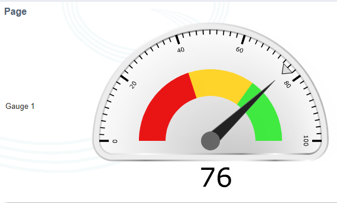

# 创建图表{#creating-a-chart}

数据库中的数据也可以在图表中收集和显示。 Adobe Campaign提供一组图形表示。 其配置详见下文。

通过右键单击菜单或工具栏将图表直接插入报表页面。

## 创建步骤 {#creation-steps}

要在报表中创建图表，请应用以下步骤：

1. 编辑要在其中显示图表的页面，然后在工具栏中选择图表类型。

   

1. 输入名称和标题。 如有必要，您可以使用下拉列表更改标题的位置。

   

1. 单击&#x200B;**[!UICONTROL Data]**&#x200B;选项卡以定义要计算的数据源和系列。

   要在图表中显示的统计信息可以基于查询或上下文数据计算，即由当前页面的集客过渡提供的数据（有关更多信息，请参阅[使用上下文数据](../../reporting/using/using-the-context.md#using-context-data)）。

   * 单击&#x200B;**[!UICONTROL Filter data...]**&#x200B;链接，为数据库中的数据定义筛选条件。

      

   * 要使用上下文数据，请选择此选项并单击&#x200B;**[!UICONTROL Advanced settings...]**&#x200B;链接。 然后，选择统计信息将涉及的数据。

      

      然后，您将能够访问上下文数据以定义要在图表中显示的值：

      

## 图表类型和变体 {#chart-types-and-variants}

Adobe Campaign提供各种类型的图形表示形式。 下文详述了这些规则。

将图表类型插入到页面中时，将选择该图表类型。

也可以通过图表中&#x200B;**[!UICONTROL General]**&#x200B;选项卡的&#x200B;**[!UICONTROL Chart type]**&#x200B;部分更改。

变体取决于所选的图表类型。 它们通过&#x200B;**[!UICONTROL Variants...]**&#x200B;链接进行选择。

### 划分：饼图 {#breakdown--pie-charts}

此类型的图形表示允许您显示测量元素的概述。

饼图仅允许您分析一个变量。

**[!UICONTROL Variants]**&#x200B;链接允许您个性化图表的整体呈现。

饼图允许您在相应的字段中输入内半径的值。

例如：

0.00跟踪整个圆。

0.40跟踪半径为40%的圆。

1.00仅跟踪圆圈外部。

### 进化：曲线和区域 {#evolution--curves-and-areas}

此类型的图形表示可让您及时了解一个或多个测量的演变。

### 比较：直方图 {#comparison--histograms}

直方图允许您比较一个或多个变量的值。

对于这些类型的图表，**[!UICONTROL Variants]**&#x200B;窗口中提供了以下选项：

选中&#x200B;**[!UICONTROL Display caption]**&#x200B;选项以显示图表标题并选择其位置：

在适当时，您可以将值堆叠在一起。

如有必要，您可以反转值显示序列。 要执行此操作，请选择&#x200B;**[!UICONTROL Reverse stacking]**&#x200B;选项。

### 转化：漏斗 {#conversion--funnel}

此类型的图表允许您跟踪测量元素的对话率。

### 进度：仪表 {#progress--gauge}

此类型的图表允许您显示与定义目标相比的值的进度。 在以下示例中，黑色拨号显示成功发送(76)的投放数量，超出100次投放的目标。 量规分为三个与特定状态对应的范围。

在配置图表时可定义这些元素。

* **[!UICONTROL Value]**&#x200B;字段在图表中由黑色拨号表示。 它表示要计算其进度的元素。 要表示的值必须已保存以供使用。
* **[!UICONTROL Goal]**&#x200B;字段表示要实现的最大值。
* 使用&#x200B;**[!UICONTROL Other mark]**&#x200B;字段，可向图表添加第二个指示器。
* 利用&#x200B;**[!UICONTROL Display range]**&#x200B;字段，可指定计算报表的值。
* **[!UICONTROL Value ranges]**&#x200B;字段允许您将状态（无、错误、可接受、良好）归因到一组值，以更好地说明进度。

在&#x200B;**[!UICONTROL Display settings]**&#x200B;部分中，使用&#x200B;**[!UICONTROL Change appearance...]**&#x200B;可配置图表的显示方式。

**[!UICONTROL Display the value below the gauge]**&#x200B;选项允许您在图表下方显示值进度。

**[!UICONTROL Aperture ratio]**&#x200B;字段必须介于0和1之间，它允许您以更完整或更少的圆编辑报表的孔径。 在以上示例中，值0.50对应一个半圆。

**[!UICONTROL Width]**&#x200B;字段允许您编辑图表大小。

## 与图表交互 {#interaction-with-the-chart}

您可以定义用户单击图表时的操作。 打开&#x200B;**[!UICONTROL Interaction events]**&#x200B;窗口，然后选择要执行的操作。

[此部分](../../web/using/static-elements-in-a-web-form.md#inserting-html-content)中详细描述了可能的交互类型及其配置。

## 计算统计信息 {#calculating-statistics}

通过图表可显示有关收集数据的统计信息。

这些统计信息通过&#x200B;**[!UICONTROL Data]**&#x200B;选项卡的&#x200B;**[!UICONTROL Series parameters]**&#x200B;部分定义。

要创建新统计信息，请单击&#x200B;**[!UICONTROL Add]**&#x200B;图标并配置相应的窗口。 可用的计算类型详见下文。

如需详细信息，请参阅[此部分](../../reporting/using/using-the-descriptive-analysis-wizard.md#statistics-calculation)。
