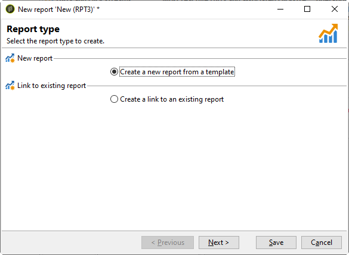

# 创建新报告{#creating-a-new-report}

要创建报表，请应用以下步骤：

1. 打开Adobe Campaign资源管理器，从&#x200B;**[!UICONTROL Administration > Configuration]**&#x200B;节点中，选择&#x200B;**[!UICONTROL Reports]**&#x200B;文件夹。
1. 单击报告列表上方的&#x200B;**[!UICONTROL New]**&#x200B;按钮。
1. 选择 **[!UICONTROL Create a new report from a template]** 并单击 **[!UICONTROL Next]**。

   

1. 在下拉列表中选择报表模板。

   * **[!UICONTROL Extended report]**&#x200B;允许您创建使用图表配置的报表。
   * **[!UICONTROL Qualitative distribution]**&#x200B;报告允许您根据所有类型的数据(公司名、电子邮件域等)创建统计信息。
   * 通过&#x200B;**[!UICONTROL Quantitative distribution]**&#x200B;报表，可以创建可衡量或计数的数据(发票额、收件人年龄等)的统计信息。

   有关这些报告模板的详细信息，请参阅[本节](../../reporting/using/about-descriptive-analysis.md)。

1. 在相应的字段中输入报表名称及其说明。 指定将应用报表的&#x200B;**[!UICONTROL schema]**。

   

1. 保存此报表。

## 对图表{#modelizing-the-chart}建模

保存报表后，应显示此信息。 您现在可以构建报表图表。

构建报告的图表由一系列活动组成。

活动使用箭头表示的过渡链接起来。

要构建报表，请根据报表的性质和上下文，确定有用元素并将其逻辑序列建模。

1. 使用&#x200B;**[!UICONTROL Start]**&#x200B;活动实现要执行的构建报告的第一个过程。 每个报表只能使用其中一个活动。

   如果图表包含循环，则此参数为必选参数。

1. 添加一个或多个&#x200B;**[!UICONTROL Query]**&#x200B;活动以收集对构建报表有用的数据。 可以直接通过查询库模式上的列表或通过导入的或现有多维数据集来收集数据。

   有关详细信息，请参阅[收集数据以分析](../../reporting/using/collecting-data-to-analyze.md)。

   此数据将根据页面配置显示（或不显示）在报表中。

1. 放置一个或多个&#x200B;**[!UICONTROL Page]**&#x200B;活动以定义所收集数据的图形表示。 您可以插入表、图表、输入字段，并设置一个或多个页面或页面元素显示条件。 所显示的内容可完全配置。

   有关详细信息，请参阅[静态元素](#static-elements)。

1. 使用&#x200B;**[!UICONTROL Test]**&#x200B;活动定义显示或访问数据的条件。

   有关详细信息，请参阅[Conditioning page display](../../reporting/using/defining-a-conditional-content.md#conditioning-page-display)。

1. 如有必要，可通过&#x200B;**[!UICONTROL Script]**&#x200B;活动添加个性化脚本，例如，计算报表名称，以过滤特定上下文中结果的显示，等等。

   有关详细信息，请参阅[脚本活动](../../reporting/using/advanced-functionalities.md#script-activity)。

1. 最后，为了更轻松地阅读复杂报表，可插入一个或多个&#x200B;**[!UICONTROL Jump]**&#x200B;类型活动。 这样，您就可以从一个活动转到另一个过渡，而不会在报表上实现该。 **[!UICONTROL Jump]**&#x200B;活动还可用于显示其他报表。

   有关详细信息，请参阅[跳转活动](../../reporting/using/advanced-functionalities.md#jump-activity)。

不能同时执行多个分支。 这意味着这样构建的报表将不起作用：

但是，您可以放置多个分支。 将只执行其中一项：

## 创建页面{#creating-a-page}

内容是通过放在图表中的活动配置的。 有关详细信息，请参阅[对图表](#modelizing-the-chart)建模。

要配置活动，请多次单击其图标。

显示的内容在&#x200B;**Page**&#x200B;类型活动中定义。

报表可以包含一个或多个页面。 页面是通过专用编辑器创建的，通过该编辑器可以在树结构中插入输入字段、选择字段、静态元素、图表或表。 容器可帮助您定义布局。 有关详细信息，请参阅[元素布局](../../reporting/using/element-layout.md)。

要向页面添加组件，请使用工具栏左上角部分的图标。

您还可以右键单击要添加组件的节点，并从列表中选择它。

>[!CAUTION]
>
>如果报表注定以Excel格式导出，建议不要使用复杂的HTML格式。 有关详细信息，请参阅[导出报表](../../reporting/using/actions-on-reports.md#exporting-a-report)。

**[!UICONTROL Page]**&#x200B;可以包含以下元素：

* 条形、饼形、曲线类型&#x200B;**[!UICONTROL charts]**&#x200B;等。
* 透视；列表组或划分&#x200B;**[!UICONTROL tables]**。
* 文本或数字类型&#x200B;**[!UICONTROL Input controls]**。
* 下拉列表、复选框、单选按钮、多选、日期或矩阵类型&#x200B;**[!UICONTROL Selection controls]**。
* 链接编辑器、常量、文件夹选择类型&#x200B;**[!UICONTROL Advanced controls]**。
* 值、链接、HTML、图像等。 **[!UICONTROL Static elements]**
* **[!UICONTROL Containers]** 让您能够控制组件布局。

页面及其组件的配置模式详见[本节](../../web/using/about-web-forms.md)。

工具栏允许您添加或删除控件，并在报表页面中组织其序列。

### 静态元素{#static-elements}

静态元素使您能够在报表中显示用户不会与之交互的信息，如图形元素或脚本。 有关详细信息，请参阅[本节](../../web/using/static-elements-in-a-web-form.md#inserting-html-content)。

### 筛选报表{#filtering-information-in-a-report}中的信息

通过输入和选择控件，您可以过滤报告中显示的信息。 有关实现此类过滤的详细信息，请参阅查询](../../reporting/using/collecting-data-to-analyze.md#filtering-options-in-the-queries)中的[过滤选项。

要了解有关创建和配置输入字段和选择字段的详细信息，请参阅[本节](../../web/using/about-web-forms.md)。

您可以将一个或多个输入控件集成到报表中。 此类型的控件允许您根据输入的值过滤显示的信息。

您还可以将一个或多个选择控件集成到您的报表中。 此类型的控件允许您根据选定的值过滤报告中包含的信息，例如：

* 通过单选按钮或复选框：

   

* 通过下拉列表:

   

* 通过日历：

   

最后，您可以将一个或多个高级控件集成到报表中。 此类型的控件允许您插入链接、常量或选择文件夹。

在此，您可以过滤报告中的数据，以仅显示树中某个文件夹中包含的信息：

