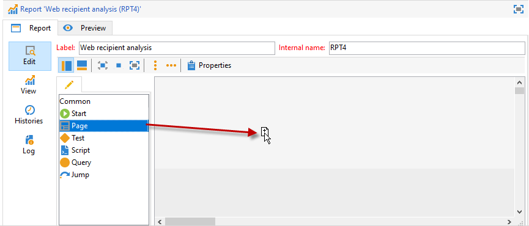

# 创建新报告{#creating-a-new-report}

要创建报告，请应用以下步骤：

1. 打开Adobe Campaign资源管理器，然后从节 **[!UICONTROL Administration > Configuration]** 点中选择文件 **[!UICONTROL Reports]** 夹。
1. 单击报 **[!UICONTROL New]** 告列表上方的按钮。
1. 选择 **[!UICONTROL Create a new report from a template]** 并单击 **[!UICONTROL Next]**。

   

1. 在下拉列表中选择报表模板。

   * 您 **[!UICONTROL Extended report]** 可以创建使用图表配置的报表。
   * 报告 **[!UICONTROL Qualitative distribution]** 允许您根据所有类型的数据（公司名称、电子邮件域等）创建统计信息。
   * 通过 **[!UICONTROL Quantitative distribution]** 此报告，您可以创建可测量或计数的数据（发票额、收件人年龄等）的统计信息。
   有关这些报告模板的详细信息，请参阅 [此部分](../../reporting/using/about-descriptive-analysis.md)。

1. 在相应的字段中输入报表名称及其说明。 指定 **[!UICONTROL schema]** 将在其上应用报表。

   

1. 保存此报告。

## 对图表建模 {#modelizing-the-chart}

保存报告后，应显示此信息。 您现在可以构建报表图表。

构建报告的图表由一系列活动组成。

活动使用箭头表示的过渡链接起来。

要构建报表，请根据报表的性质和上下文，确定有用元素并将其逻辑序列建模。

1. 使用“开始”活动来实现要构建报告的第一个过程。 每个报告只能使用其中一个活动。

   如果图表包含循环，则此选项是必选项。

1. 添加一个或多个“查询”活动以收集对构建报表有用的数据。 可以直接通过数据库架构上的查询或通过导入的列表或现有多维数据集收集数据。

   有关此问题的详细信息，请参 [阅收集数据以进行分析](../../reporting/using/collecting-data-to-analyze.md)。

   此数据将根据页面配置显示（或不显示）在报告中。

1. 放置一个或多个“页面”活动以定义所收集数据的图形表示形式。 可以插入表、图表、输入字段，并设置一个或多个页面或页面元素显示的条件。 显示的内容可完全配置。

   For more on this, refer to [Static elements](#static-elements).

1. 使用“测试”活动定义显示或访问数据的条件。

   For more on this, refer to [Conditioning page display](../../reporting/using/defining-a-conditional-content.md#conditioning-page-display).

1. 如有必要，通过“脚本”活动添加个性化脚本，例如计算报告名称，过滤特定上下文中结果的显示，等等。

   For more on this, refer to [Script activity](../../reporting/using/advanced-functionalities.md#script-activity).

1. 最后，您可以插入一个或多个“跳转”类型活动，以便更轻松地阅读复杂报告。 这样，您就可以从一个活动转到另一个活动，而无需在报表上实现过渡。 “跳转”还可用于显示其他报表。

   For more on this, refer to [Jump activity](../../reporting/using/advanced-functionalities.md#jump-activity).

不能同时执行多个分支。 这意味着这样构建的报表将不起作用：

但是，您可以放置多个分支。 其中只有一项将被执行：

## 创建页面 {#creating-a-page}

内容通过放入图表中的活动进行配置。 有关此功能的详细信息，请参 [阅对图表建模](#modelizing-the-chart)。

要配置活动，请双击其图标。

显示的内容在页面类型活 **动中** 定义。

报表可以包含一个或多个页面。 页面是通过专用编辑器创建的，它允许您在树结构中插入输入字段、选择字段、静态元素、图表或表。 容器可帮助您定义布局。 For more on this, refer to [Element layout](../../reporting/using/element-layout.md).

要向页面添加组件，请使用工具栏左上角部分的图标。

您还可以右键单击要添加组件的节点，并从列表中选择它。

>[!CAUTION]
>
>如果报表的目的地是以Excel格式导出，则建议不要使用复杂的HTML格式。 有关详细信息，请参阅导 [出报告](../../reporting/using/actions-on-reports.md#exporting-a-report)。

A可 **[!UICONTROL Page]** 以包括以下元素：

* 条形、饼图、曲线 **[!UICONTROL charts]**&#x200B;类型等。
* 枢纽；列出组或细分 **[!UICONTROL tables]**。
* 文本或数字类型 **[!UICONTROL Input controls]**。
* 下拉列表、复选框、单选按钮、多选、日期或矩阵类型 **[!UICONTROL Selection controls]**。
* 链接编辑器、常数、文件夹选择类 **[!UICONTROL Advanced controls]**&#x200B;型。
* 值、链接、HTML、图像等 **[!UICONTROL Static elements]**.
* **[!UICONTROL Containers]** 使您能够控制组件布局。

本节详细介绍了页面及其组件的配 [置模式](../../web/using/about-web-forms.md)。

通过工具栏，您可以添加或删除控件，并在报告页面中组织其顺序。

### 静态元素 {#static-elements}

静态元素允许您在报告中显示用户不会与之交互的信息，如图形元素或脚本。 Refer to [this section](../../web/using/static-elements-in-a-web-form.md#inserting-html-content) for more information.

### 筛选报告中的信息 {#filtering-information-in-a-report}

通过输入和选择控件，您可以过滤报告中显示的信息。 有关实现此类过滤的详细信息，请参阅查 [询中的过滤选项](../../reporting/using/collecting-data-to-analyze.md#filtering-options-in-the-queries)。

要了解有关创建和配置输入字段和选择字段的更多信息，请参 [阅此部分](../../web/using/about-web-forms.md)。

您可以将一个或多个输入控件集成到报表中。 此类控件允许您根据输入的值过滤显示的信息。

您还可以将一个或多个选择控件集成到报表中。 此类型的控件允许您根据选定的值过滤报告中包含的信息，例如：

* 通过单选按钮或复选框：

   

* 通过下拉列表：

   

* 通过日历：

   

最后，您可以将一个或多个高级控件集成到报表中。 此类控件允许您插入链接、常数或选择文件夹。

在此，您可以过滤报告中的数据，以仅显示树中某个文件夹中包含的信息：

