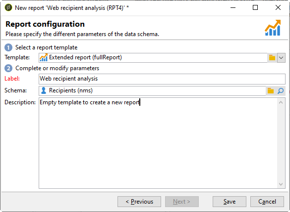
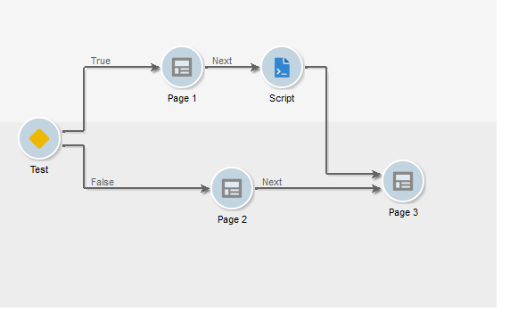
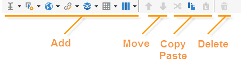
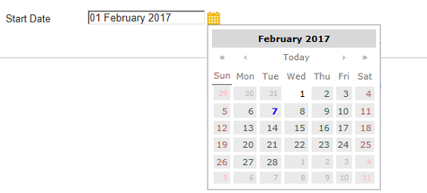

# 创建新报告{#creating-a-new-report}

要创建报告，请应用以下步骤：

1. 打开Adobe Campaign Explorer，然后从 **[!UICONTROL Administration > Configuration]** 节点，然后选择 **[!UICONTROL Reports]** 文件夹。
1. 单击 **[!UICONTROL New]** 按钮进行编辑。
1. 选择 **[!UICONTROL Create a new report from a template]** 并单击 **[!UICONTROL Next]**。

   

1. 在下拉列表中选择报表模板。

   * 此 **[!UICONTROL Extended report]** 允许您创建使用图表配置的报告。
   * 此 **[!UICONTROL Qualitative distribution]** 报表允许您根据所有类型的数据（公司名称、电子邮件域等）创建统计数据。
   * 此 **[!UICONTROL Quantitative distribution]** 通过报告，您可以创建可测量或计数的数据（发票金额、收件人年龄等）的统计数据。

   有关这些报告模板的更多信息，请参阅 [本节](../../reporting/using/about-descriptive-analysis.md).

1. 在相应的字段中输入报表名称及其说明。 指定 **[!UICONTROL schema]** 报表将应用的对象。

   

1. 保存此报告。

## 为图表建模 {#modelizing-the-chart}

保存报告后，应会显示此内容。 您现在可以构建报告的图表。

构建报告的图表由一系列活动组成。

活动使用过渡（用箭头表示）进行链接。

要构建报告，根据其性质和上下文，您需要确定有用的元素并将其逻辑序列模式化。

1. 使用 **[!UICONTROL Start]** 实现构建报告所执行的第一个过程的活动。 您只能为每个报表使用其中一个活动。

   如果图表包含循环，则此为必填字段。

1. 添加一个或多个 **[!UICONTROL Query]** 收集对构建报告有用的数据的活动。 可以通过查询数据库模式直接收集数据，也可以通过导入的列表或现有多维数据集收集数据。

   有关更多信息，请参阅 [收集数据进行分析](../../reporting/using/collecting-data-to-analyze.md).

   此数据是否显示在报表中，取决于页面配置。

1. 放置一个或多个 **[!UICONTROL Page]** 活动，用于定义所收集数据的图形表示形式。 可以插入表、图表、输入字段，并设置显示一个或多个页面或页面元素的条件。 显示的内容是完全可配置的。

   有关更多信息，请参阅 [静态元素](#static-elements).

1. 使用 **[!UICONTROL Test]** 活动，定义显示或访问数据的条件。

   有关更多信息，请参阅 [调整页面显示](../../reporting/using/defining-a-conditional-content.md#conditioning-page-display).

1. 如有必要，请通过 **[!UICONTROL Script]** 活动，例如，计算报表名称、筛选特定上下文中的结果显示等。

   有关更多信息，请参阅 [脚本活动](../../reporting/using/advanced-functionalities.md#script-activity).

1. 最后，为了更便于阅读复杂报表，您可以插入一个或多个 **[!UICONTROL Jump]** 键入活动。 这样，您就可以从一个活动转到另一个活动，而无需在报表上实现过渡。 此 **[!UICONTROL Jump]** 活动也可用于显示其他报表。

   有关更多信息，请参阅 [跳转活动](../../reporting/using/advanced-functionalities.md#jump-activity).

不能同时执行多个分支。 这意味着类似这样的报表将不起作用：

但是，您可以放置多个分支。 将只执行其中一个：

## 创建页面 {#creating-a-page}

内容可通过置于图表中的活动进行配置。 有关更多信息，请参阅 [模型化图表](#modelizing-the-chart).

要配置活动，请双击其图标。

显示的内容定义于 **页面** 键入活动。

报表可以包含一个或多个页面。 页面通过专用编辑器创建，该编辑器允许您在树结构中插入输入字段、选择字段、静态元素、图表或表。 容器可帮助您定义布局。 有关更多信息，请参阅 [元素布局](../../reporting/using/element-layout.md).

要向页面中添加组件，请使用工具栏左上角部分的图标。

您还可以右键单击要添加组件的节点，然后从列表中选择该节点。

>[!CAUTION]
>
>如果报表要以Excel格式导出，我们建议不要使用复杂的HTML格式。 有关更多信息，请参阅 [导出报告](../../reporting/using/actions-on-reports.md#exporting-a-report).

A **[!UICONTROL Page]** 可以包括以下元素：

* 条形图、饼图、曲线类型 **[!UICONTROL charts]**&#x200B;等。
* 透视；包含组或划分的列表 **[!UICONTROL tables]**.
* 文本或数字类型 **[!UICONTROL Input controls]**.
* 下拉列表、复选框、单选按钮、多项选择、日期或矩阵类型 **[!UICONTROL Selection controls]**.
* 链接编辑器、常量、文件夹选择类型 **[!UICONTROL Advanced controls]**.
* 值、链接、HTML、图像等。 **[!UICONTROL Static elements]**.
* **[!UICONTROL Containers]** 使您能够控制组件布局。

有关页面及其组件的配置模式的详细信息，请参见 [本节](../../web/using/about-web-forms.md).

利用工具栏，可添加或删除控件并组织它们在报表页面中的顺序。

### 静态元素 {#static-elements}

您可以使用静态元素在报表中显示用户不会与之交互的信息，例如图形元素或脚本。 请参阅 [本节](../../web/using/static-elements-in-a-web-form.md#inserting-html-content) 了解更多信息。

### 筛选报告中的信息 {#filtering-information-in-a-report}

通过输入和选择控件，可筛选报告中显示的信息。 有关实施此类筛选的更多信息，请参阅 [筛选查询中的选项](../../reporting/using/collecting-data-to-analyze.md#filtering-options-in-the-queries).

要了解有关创建和配置输入字段和选择字段的更多信息，请参阅 [本节](../../web/using/about-web-forms.md).

您可以将一个或多个输入控件集成到报表中。 通过此类控件，可根据输入的值筛选显示的信息。

您还可以将一个或多个选择控件集成到报表中。 通过此类控件，可根据选定的值筛选报表中包含的信息，例如：

* 通过单选按钮或复选框：

   

* 通过下拉列表：

   

* 通过日历：

   

最后，您可以将一个或多个高级控件集成到报表中。 通过这种类型的控制，可以插入链接、常量或选择文件夹。

在此，您可以筛选报告中的数据以仅显示树的一个文件夹中包含的信息：

