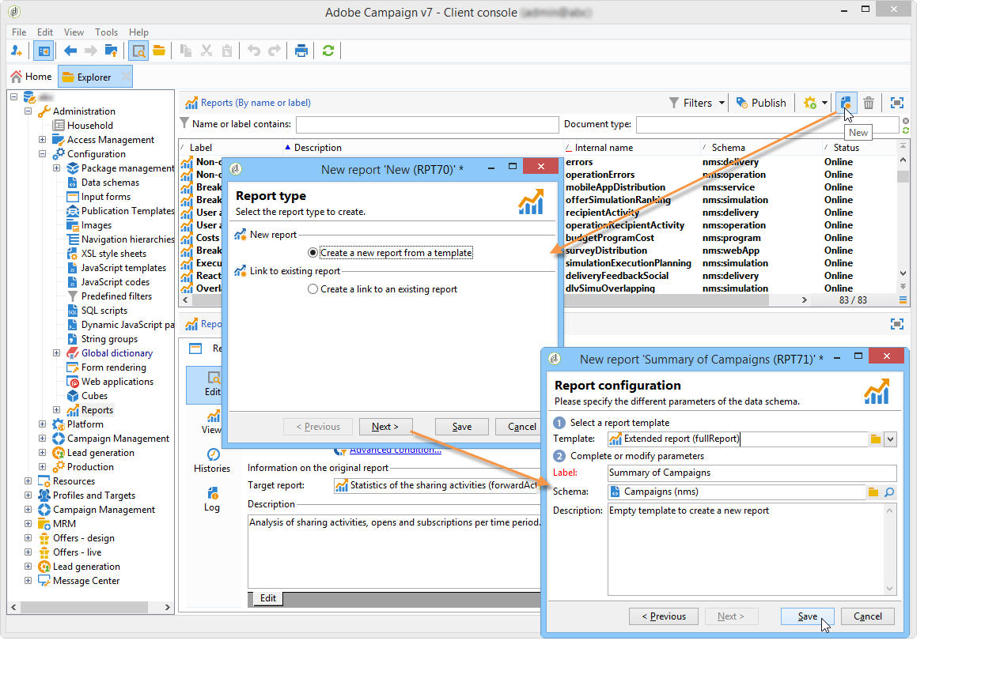
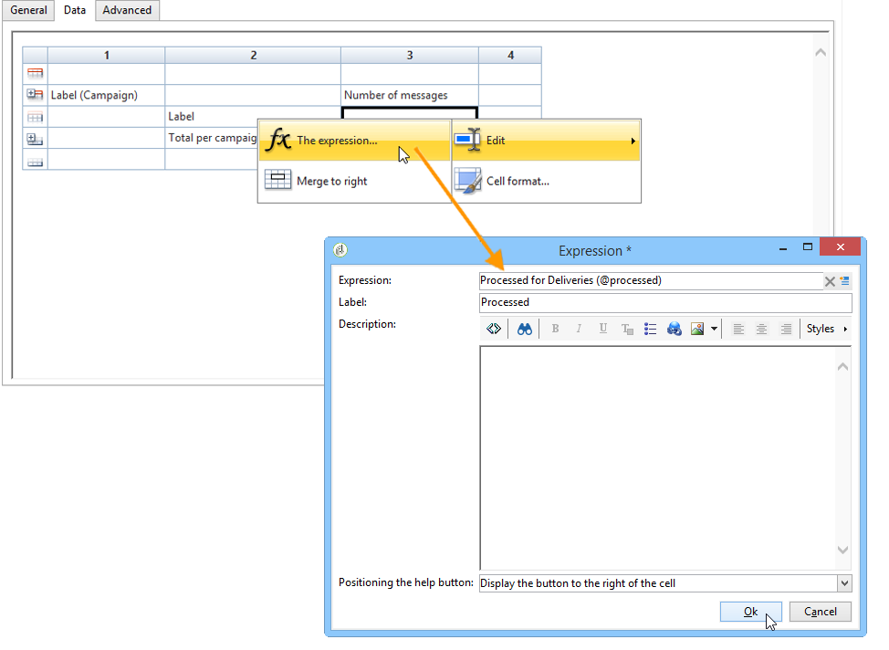
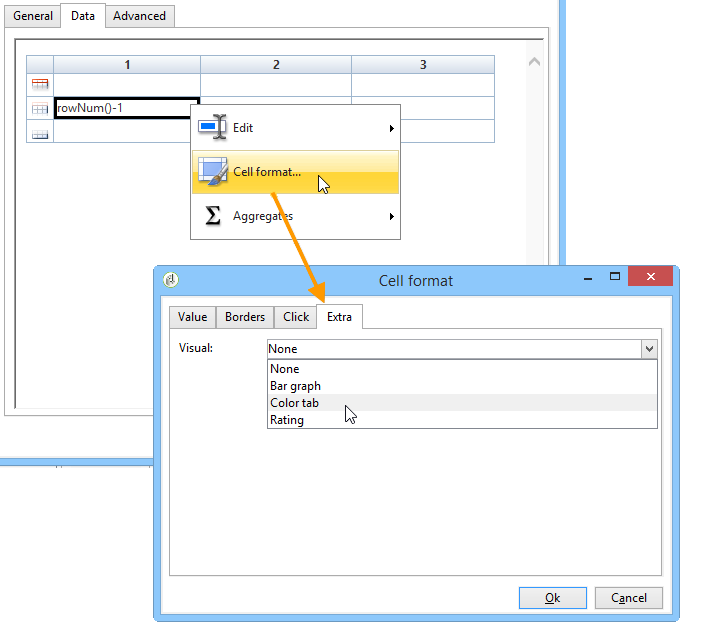
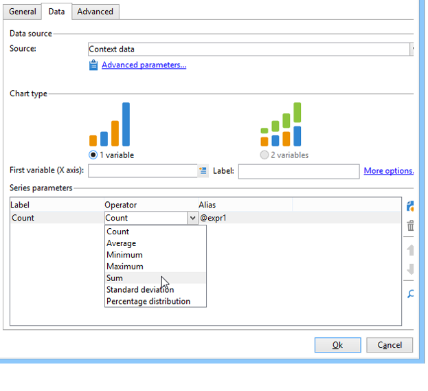
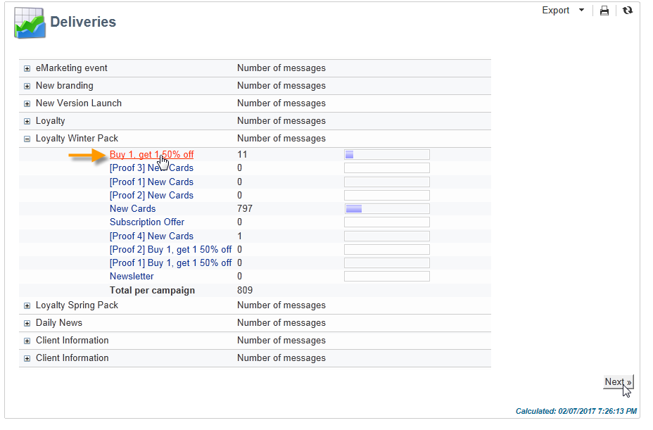

# 创建表{#creating-a-table}


可以向报表中添加表以显示数据。 这可以是基于多维数据集测量创建的透视表、具有组的列表或包含值划分的表。


## 创建包含组的列表 {#creating-a-list-with-group}

**[!UICONTROL List with group]**&#x200B;类型表允许您对表中的数据进行分组并生成有关该表的统计信息。 例如，您可以创建数据的总计和小计。 每个组都有自己的页眉、详细信息和页脚行。

>[!CAUTION]
>
>包含该表的&#x200B;**[!UICONTROL Page]**&#x200B;活动前面必须有&#x200B;**[!UICONTROL Query]**&#x200B;或&#x200B;**[!UICONTROL Script]**&#x200B;活动，才能收集要在报告中分析的数据。 有关这些活动的详细信息，请参阅[收集数据以分析](../../reporting/using/collecting-data-to-analyze.md)和[编写活动脚本](../../reporting/using/advanced-functionalities.md#script-activity)。

### 操作原则 {#operating-principle}

您可能需要同时分析多个数据类别。 通过包含组的列表，您可以组合数据并在同一表中创建有关不同数据组的统计信息。 要实现此目的，可在表中创建组。

在以下示例中，组显示了数据库中的所有营销活动、投放，以及每个投放和每个营销活动发送的消息数。

它可让您列出营销活动(**[!UICONTROL Label (Campaign)]**，链接到此营销活动的投放列表(**[!UICONTROL Label]**)，并让您在为每个营销活动添加每个投放(**[!UICONTROL Sum(@processed)]**)之前，计算每个投放发送的消息数(**[!UICONTROL Processed)]**)。


### 实施步骤 {#implementation-steps}

此处提供了完整的实施示例：[用例：创建包含组列表](#use-case--create-a-report-with-a-group-list)的报告。

请注意以下步骤以创建“List with group”类型表：

1. 转到报告图表并放置&#x200B;**[!UICONTROL Query]**&#x200B;活动。 请参阅[收集数据以进行分析](../../reporting/using/collecting-data-to-analyze.md)。
1. 填写源表并选择统计信息将关注的表的字段。
1. 将&#x200B;**[!UICONTROL Page]**&#x200B;活动放入图表中。 有关详细信息，请参阅[静态元素](../../reporting/using/creating-a-new-report.md#static-elements)。
1. 在页面中插入&#x200B;**[!UICONTROL List with group]**&#x200B;类型表。
1. 指定数据路径，或指定在查询中选择作为数据源的表。

   如果以后要恢复源表中的字段并将它们插入到表的单元格中，则必须执行此步骤。

1. 创建表及其内容。
1. 在&#x200B;**[!UICONTROL Preview]**&#x200B;选项卡中显示最终报告。 然后，您可以发布报表，并在必要时将其导出为其他格式。 有关详细信息，请参阅[导出报告](../../reporting/using/actions-on-reports.md#exporting-a-report)。

### 添加行和列 {#adding-lines-and-columns}

默认情况下，**[!UICONTROL List with group]**&#x200B;类型表包括页眉、详细信息行和页脚行。

组本身包括页眉、详细信息和页脚行。

* **标题行**：此行允许您为表的列提供一个标题。

  

* **详细信息行**：此行包含统计值。

  

* **页脚行**：此行允许您显示总值。

  

可以根据需要添加行和列。

组可以放置在表的任何行上，并包含其自身的页眉、详细信息和页脚行。


**行和列**：若要添加或删除行或列，请转到现有的行或列并使用右键单击菜单。


所添加直线的性质取决于光标的位置。 例如，要添加标题行，请将游标放在标题上，然后单击&#x200B;**[!UICONTROL Add > A line above/below]**。


列的宽度可以通过&#x200B;**[!UICONTROL Column format]**&#x200B;项进行修改。

**组**：要添加组，请转到一行并在下拉菜单中选择匹配项。


### 定义单元格内容 {#defining-cell-content}

要编辑表的单元格并定义其内容和格式，请转到该单元格并使用右键单击菜单。

使用&#x200B;**[!UICONTROL Expression]**&#x200B;菜单项选择要显示的值。


* 要将要分析的值直接插入表中，请从可用字段中选择它们。

  可用字段列表与报告结构图表中表之前的查询内容一致。

  

* 输入单元格的标签，例如标题。

  要执行此操作，请使用与将字段插入数据库的过程相同的过程，但不要选择表达式。 在&#x200B;**[!UICONTROL Label]**&#x200B;字段中输入标签。 它将按原样显示。

* 计算聚合（平均值、总和等） 并显示在单元格中。

  为此，请使用&#x200B;**[!UICONTROL Aggregates]**&#x200B;菜单项并选择所需的营销活动。

  

### 定义单元格格式 {#defining-cell-format}


要定义单元格格式，可使用&#x200B;**[!UICONTROL Cell format...]**&#x200B;菜单访问选定单元格可用的所有格式选项。

利用这些选项，可个性化报表的最终呈现，并使其更容易阅读信息。

将数据导出到Excel时使用&#x200B;**[!UICONTROL Carriage return]**&#x200B;字段：选择&#x200B;**[!UICONTROL Yes]**&#x200B;值以强制回车。 导出时将保留此值。 有关详细信息，请参阅[导出报告](../../reporting/using/actions-on-reports.md#exporting-a-report)。

**[!UICONTROL Cell format]**&#x200B;窗口允许您访问以下选项卡：

* **[!UICONTROL Value]**&#x200B;选项卡
* **[!UICONTROL Borders]**&#x200B;选项卡
* **[!UICONTROL Click]**&#x200B;选项卡
* **[!UICONTROL Extra]**&#x200B;选项卡

**[!UICONTROL Value]**&#x200B;选项卡允许您更改字体和各种值属性，或根据它们的性质定义格式。


格式更改了数据显示：例如，**[!UICONTROL Number]**、**[!UICONTROL Monetary]**&#x200B;和&#x200B;**[!UICONTROL Percentage]**&#x200B;格式允许您对齐右侧的数字并显示小数点。

如何配置货币格式的示例：您可以指定值的表示货币，选择是否分隔千位，并以红色显示负值。 货币符号的位置取决于其配置文件中定义的运算符的语言。


日期的配置示例：您可以选择是否显示时间。


**边框**&#x200B;选项卡允许您向表中的行和列添加边框。 将大型报表导出到Excel中时，向单元格添加边框可能会导致性能问题。


如有必要，您可以在表模板(**[!UICONTROL Administration > Configuration > Form rendering]**)中定义边框。

在这种情况下，您将具有以下语法：

在Web选项卡中：

```
 .tabular td {
 border: solid 1px #000000;
 }
```

在Excel选项卡中：

```
 <style name="odd" fillColor="#fdfdfd">
  <border>
   <borderTop value="solid 0.05pt #000000" />
   <borderBottom value="solid 0.05pt #000000" />
   <borderLeft value="solid 0.05pt #000000" />
   <borderRight value="solid 0.05pt #000000" />
  </border>
 </style> 
 
 <style name="even" fillColor="#f7f8fa">
  <border>
   <borderTop value="solid 0.05pt #000000" />
   <borderBottom value="solid 0.05pt #000000" />
   <borderLeft value="solid 0.05pt #000000" />
   <borderRight value="solid 0.05pt #000000" />
  </border>
 </style> 
```

**[!UICONTROL Click]**&#x200B;选项卡允许您在用户单击单元格或表的内容时定义操作。

在下面的示例中，单击单元格中的值可显示报表的第二页：它包含有关单元格中投放的信息。


通过&#x200B;**额外**&#x200B;选项卡，您可以将可视化图表链接到数据，例如彩色标记或值栏。 当表在图表中显示为图例时，将使用彩色标记。 有关更多信息，请参阅实施示例：[步骤5 — 创建第二页](#step-5---create-the-second-page)


## 用例：创建包含组列表的报告 {#use-case--create-a-report-with-a-group-list}

在本例中，我们将创建一个两页报告：第一页将包含列表和每个活动的投放总数，以及发送的消息数。 投放名称将是可单击的链接，允许您进入报表的第二页，以使用表格和图表查看所选投放的按电子邮件域划分的投放。 在第二页上，该表将用作图表的图例。


### 第1步 — 创建报表 {#step-1---create-a-report}

创建与营销活动架构&#x200B;**[!UICONTROL Campaigns (nms)]**&#x200B;相关的新报告。



单击&#x200B;**[!UICONTROL Save]**&#x200B;以创建报告。

转到图表并添加用于设计报表内容的第一个组件：第一个查询和第一个页面。


### 步骤2 — 创建第一个查询 {#step-2---create-the-first-query}

第一个查询允许您收集链接到每个活动的投放。 目标是显示有关链接到每个营销活动的Adobe Campaign数据库的各种投放情况的报告。

双击第一个查询进行编辑，然后应用以下步骤对其进行配置：

1. 首先更改应用查询源的架构：选择&#x200B;**[!UICONTROL Deliveries (nms)]**&#x200B;架构。
1. 单击&#x200B;**[!UICONTROL Edit query]**&#x200B;链接并显示高级字段。

   

1. 选择以下字段：

   * 投放标签，
   * 传递的主键，
   * 营销活动标签，
   * 已处理投放的指示器，
   * Campaign链接的外键，
   * 错误率指示器。

   

   将别名链接到每个字段：建议这样做，以方便从要添加到报表第一页的表中选择数据。

   在本例中，我们将使用以下别名：

   * 标签： **@label**
   * 主键： **@deliveryId**
   * 标签（营销活动）： **@label1**
   * 已处理： **@processed**
   * &#39;营销活动&#39; （&#39;id&#39;字段）链接的外键： **@operationId**
   * 错误率： **@errorRatio**

1. 单击&#x200B;**[!UICONTROL Next]**&#x200B;按钮两次以进入&#x200B;**[!UICONTROL Data filtering]**&#x200B;步骤。

   添加筛选条件以仅收集链接到营销活动的投放。

   此过滤器的语法如下：“‘营销活动’链接的外键大于0”。

   

1. 单击&#x200B;**[!UICONTROL Finish]**&#x200B;保存这些条件，然后单击&#x200B;**[!UICONTROL Ok]**&#x200B;关闭查询编辑器。

### 步骤3：创建第一页 {#step-3--create-the-first-page}

在此步骤中，我们将配置报表的第一页。 要对其进行配置，请应用以下步骤：

1. 打开&#x200B;**[!UICONTROL Page]**&#x200B;活动并输入其标题，在本例中为&#x200B;**投放**。

   

1. 通过工具栏插入包含组的列表并输入其标签，例如：每个营销活动的投放列表。

   

1. 单击&#x200B;**[!UICONTROL Table data XPath...]**&#x200B;链接并选择传递链接，即`[query/delivery]`。

   

1. 单击&#x200B;**[!UICONTROL Data]**&#x200B;选项卡并更改表的布局：在右侧添加三列。

   

1. 添加组。

   

   通过此组，可将营销活动和与其关联的投放分组。

1. 在组窗口中，引用&#39;Campaign&#39;链接&#x200B;**的**&#x200B;外键并关闭窗口。

   

1. 编辑组标题的第一个单元格，并将营销活动的&#x200B;**[!UICONTROL Label]**&#x200B;字段作为表达式插入。

   

1. 编辑详细信息行的第二个单元格并选择投放&#x200B;**[!UICONTROL Label]**。

   

1. 编辑此单元格的格式并打开&#x200B;**[!UICONTROL Click]**&#x200B;选项卡。 配置适当的选项，以便当用户单击投放名称时，该投放将在同一窗口中打开。

   

   为此，请选择一个&#x200B;**[!UICONTROL Next page]**&#x200B;类型操作并选择&#x200B;**[!UICONTROL In the same window]**&#x200B;作为打开选项。

   

1. 在窗口的下半部分，单击&#x200B;**[!UICONTROL Add]**&#x200B;并指定与投放主键的别名匹配的&#x200B;**`/vars/selectedDelivery`**&#x200B;路径和&#x200B;**[!UICONTROL @deliveryId]**&#x200B;表达式，如之前创建的查询中所定义。 通过此公式，可访问选定的投放。

   

1. 编辑组的页脚行的第二个单元格并输入&#x200B;**[!UICONTROL Total per campaign]**&#x200B;作为标签。

   

1. 编辑组标题行的第三个单元格并输入&#x200B;**[!UICONTROL Number of messages sent]**&#x200B;作为标签。

   

   此信息与列标题一致。

1. 编辑详细信息行的第三个单元格，并选择已处理的消息指示器作为表达式。

   

1. 编辑组页脚行的第三个单元格，选择已处理的投放指示器并对其应用&#x200B;**[!UICONTROL Sum]**&#x200B;聚合。

   

1. 编辑详细信息行的第四个单元格，并选择&#x200B;**错误投放错误率**&#x200B;作为表达式。

   

1. 选择此单元格以显示表示投放错误率的值栏。

   为此，请访问单元格格式，然后转到&#x200B;**[!UICONTROL More]**&#x200B;选项卡。 在下拉列表中选择&#x200B;**[!UICONTROL Value bar]**&#x200B;条目，然后选择&#x200B;**[!UICONTROL Hide the cell value]**&#x200B;选项。

   

   您现在可以查看报表的呈现。 单击&#x200B;**[!UICONTROL Preview]**&#x200B;选项卡并选择&#x200B;**[!UICONTROL Global]**&#x200B;选项：这将显示Adobe Campaign数据库中链接到营销活动的所有投放的列表。

   

   我们建议使用&#x200B;**[!UICONTROL Preview]**&#x200B;选项卡以确保正确选择和配置表中的数据。 完成此操作后，您可以继续设置表格的格式。

1. 将&#x200B;**[!UICONTROL Bold]**&#x200B;样式应用于显示每个营销活动总计和已处理消息总数的单元格。

   

1. 单击组标题行（显示促销活动名称的单元格）的第一个单元格，然后选择&#x200B;**[!UICONTROL Edit > Merge to right]**。

   

   合并组标题行的前两个单元格将重新对齐营销活动标题和链接到它的投放列表。

   

   >[!CAUTION]
   >
   >由于合并不可逆，因此我们建议在合并单元格之前等待报告构建。

### 步骤4 — 创建第二个查询 {#step-4---create-the-second-query}

我们希望添加第二个查询和第二个页面，以在报告用户单击某个投放时显示该投放的详细信息。 添加查询之前，请编辑已创建的页面并启用传出过渡，以便将其链接到查询。

1. 在&#x200B;**[!UICONTROL Page]**&#x200B;活动后添加新查询并编辑其架构：选择&#x200B;**[!UICONTROL Recipient delivery logs]**&#x200B;架构。

   

1. 编辑查询并定义输出列。 要显示每个电子邮件域的投放数量，您需要：

   * 计算主键的总和以计算投放日志的数量：

     

   * 收集此字段的收件人电子邮件域和组信息：为此，请在域名列中选择&#x200B;**[!UICONTROL Group]**&#x200B;选项。

   

   将以下别名链接到字段：

   * count（主键）： **@count**
   * 电子邮件域（收件人）： **@domain**

     

1. 单击&#x200B;**[!UICONTROL Next]**&#x200B;按钮两次：这会将您转到&#x200B;**[!UICONTROL Data filtering]**&#x200B;步骤。

   添加筛选条件以仅收集链接到选定投放的信息。

   语法如下：“投放”链接的外键等于设置`$([vars/selectedDelivery])`的值

   

1. 关闭查询配置窗口，并在第二个查询之后向图表添加页面。

### 步骤5 — 创建第二个页面 {#step-5---create-the-second-page}

1. 编辑页面并输入其标签： **电子邮件域**。
1. 取消选中&#x200B;**[!UICONTROL Enable output transitions]**&#x200B;选项：这是报告的最后一页，不会后跟其他活动。

   

1. 使用右键单击菜单添加带有组的新列表，并将其命名为&#x200B;**每个收件人的电子邮件域**。
1. 单击&#x200B;**[!UICONTROL Table data XPath...]**&#x200B;并选择&#x200B;**[!UICONTROL Recipient delivery logs]**&#x200B;链接。

   

1. 在&#x200B;**[!UICONTROL Data]**&#x200B;选项卡中，按如下方式调整表：

   * 在右侧添加两列。
   * 在详细信息行的第一个单元格中，添加&#x200B;**[!UICONTROL rowNum()-1]**&#x200B;表达式以计算行数。 然后更改单元格的格式：在&#x200B;**[!UICONTROL Extra]**&#x200B;选项卡中，选择&#x200B;**[!UICONTROL Color tab]**&#x200B;并单击&#x200B;**[!UICONTROL Ok]**。

     

     通过此配置，您可以将表用作图表的标题。

   * 在详细信息行的第二个单元格中，添加&#x200B;**[!UICONTROL Email domain(Recipient)]**&#x200B;表达式。
   * 在详细信息行的第三个单元格中，添加&#x200B;**[!UICONTROL count(primary key)]**&#x200B;表达式。

   

1. 使用右键单击菜单将饼图添加到页面中，并为其分配&#x200B;**电子邮件域**&#x200B;标签。 有关详细信息，请参阅[图表类型和变体](../../reporting/using/creating-a-chart.md#chart-types-and-variants)。
1. 单击&#x200B;**[!UICONTROL Variants]**&#x200B;链接并取消选择&#x200B;**[!UICONTROL Display label]**&#x200B;和&#x200B;**[!UICONTROL Display caption]**&#x200B;选项。
1. 检查是否未配置值排序。 如需详细信息，请参阅[此小节](../../reporting/using/processing-a-report.md#configuring-the-layout-of-a-descriptive-analysis-report)。

   

1. 在&#x200B;**[!UICONTROL Data]**&#x200B;选项卡中，更改数据源：从下拉列表中选择&#x200B;**[!UICONTROL Context data]**。

   

1. 然后单击&#x200B;**[!UICONTROL Advanced settings]**&#x200B;并选择指向收件人投放日志的链接。

   

1. 在&#x200B;**[!UICONTROL Chart type]**&#x200B;部分中，选择&#x200B;**[!UICONTROL Email domain]**&#x200B;变量。
1. 然后添加要执行的计算：选择总和作为运算符。

   

1. 单击&#x200B;**[!UICONTROL Detail]**&#x200B;按钮以选择计数将关注的字段，然后关闭配置窗口。

   

1. 保存报表。

   您的页面现已配置完成。

### 第6步 — 查看报表 {#step-6---viewing-the-report}

要查看此配置的结果，请单击&#x200B;**[!UICONTROL Preview]**&#x200B;选项卡并选择&#x200B;**[!UICONTROL Global]**&#x200B;选项。

报表的第一页详细介绍了数据库中包含的所有投放的列表。



如果单击其中一个投放的链接，则会显示一个图表，其中显示此投放的电子邮件域划分。 您现在位于报表的第二页，可以通过单击相应的按钮返回上一页。


## 创建划分或透视表 {#creating-a-breakdown-or-pivot-table}

通过此类表，可显示根据数据库中的数据计算的统计信息。

这些类型报告的配置类似于描述性分析助理使用的报告。 有关详细信息，请参见[此页面](../../reporting/using/using-the-descriptive-analysis-wizard.md#configuring-the-quantitative-distribution-template)。

有关创建数据透视表的详细信息，请参阅[此节](../../reporting/using/ac-cubes.md)。
