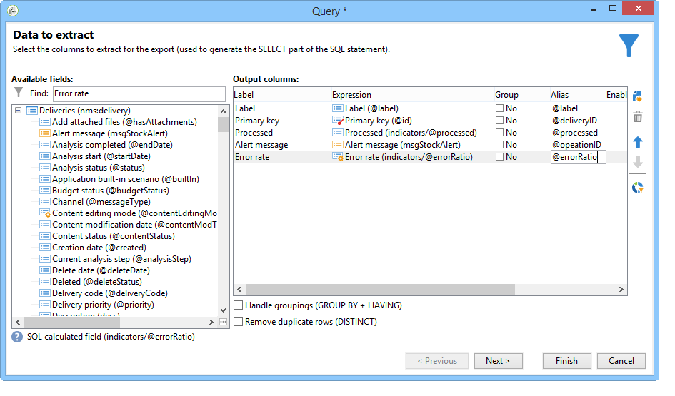
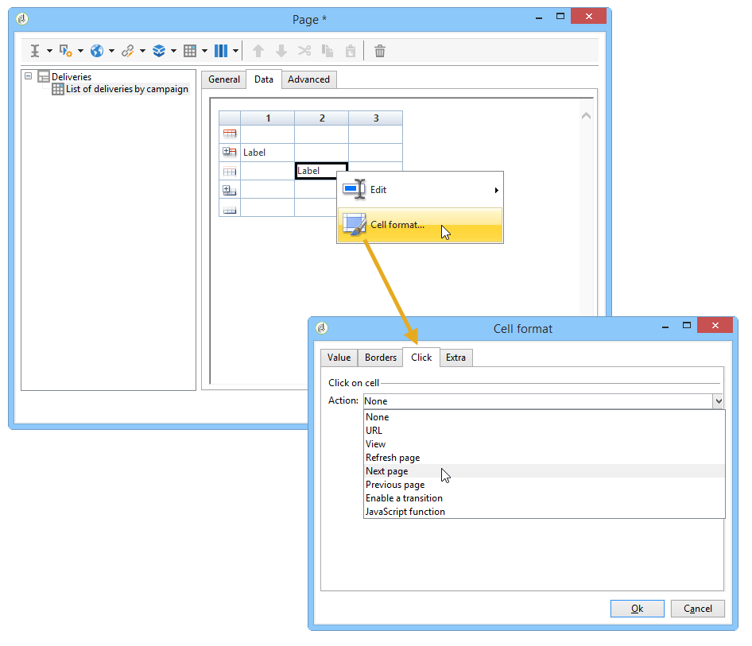
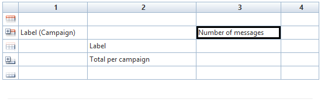
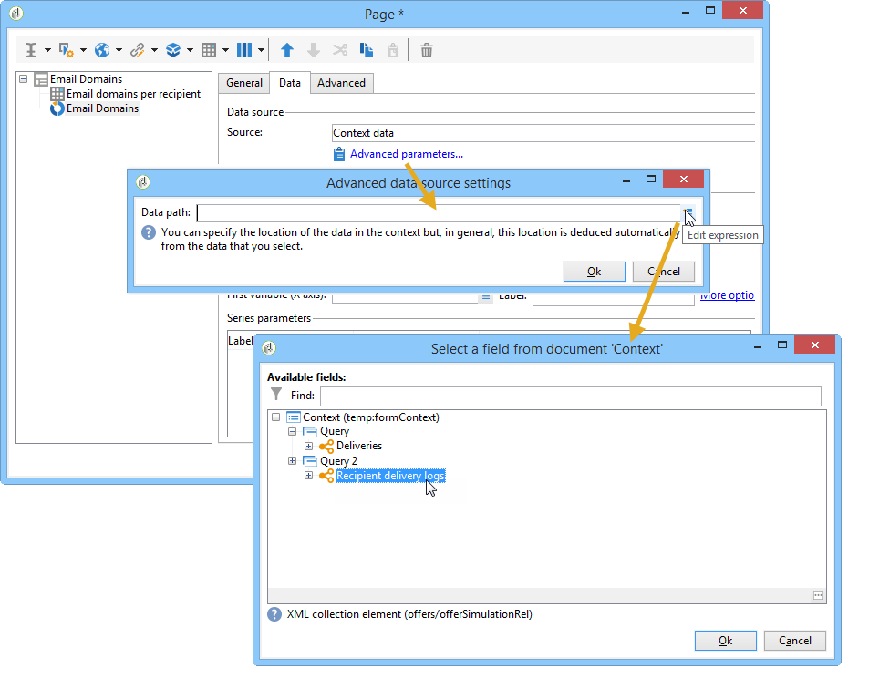

# 创建表{#creating-a-table}

您可以向报告中添加表以显示数据。 这可以是基于立方测量创建的透视表、具有组的列表或包含值细分的表。


## 创建组列表 {#creating-a-list-with-group}

通过 **[!UICONTROL List with group]** 类型表，您可以对表中的数据进行分组，并生成有关该表的统计信息。 例如，您可以为数据创建总计和子总计。 每个组都有其自己的页眉、详细信息和页脚行。

>[!CAUTION]
>
>包含 **[!UICONTROL Page]** 表的活动前必须有一个或活 **[!UICONTROL Query]** 动 **[!UICONTROL Script]** ，以收集要在报告中分析的数据。 有关这些活动的详细信息，请参 [阅收集数据以分析](../../reporting/using/collecting-data-to-analyze.md)[和脚本活动](../../reporting/using/advanced-functionalities.md#script-activity)。

### 工作原理 {#operating-principle}

您可能需要同时分析多个数据类别。 通过具有组的列表，您可以合并数据并在同一表中创建有关不同组数据的统计信息。 为此，您可以在表中创建组。

在以下示例中，组显示数据库中的所有营销活动、分发以及每个分发和每个营销活动发送的消息数。

它允许您列出与营销活动链接的营销活动(**[!UICONTROL Label (Campaign)]**、分发列表(**[!UICONTROL Label]** ))，并允许您计算每个分发发送的消息数(**[!UICONTROL Processed)]****[!UICONTROL Sum(@processed)]** ，在为每个营销活动添加消息之前)。


### 实施步骤 {#implementation-steps}

下面提供了完整的实施示例：用 [例：创建包含用户组列表的报告](#use-case--create-a-report-with-a-group-list)。

请注意以下步骤以创建“带组列表”类型表：

1. 转到报表图表并放置活 **[!UICONTROL Query]** 动。 请参阅收 [集数据以进行分析](../../reporting/using/collecting-data-to-analyze.md)。
1. 填写源表，并选择统计数据所关注的表的字段。
1. 将活 **[!UICONTROL Page]** 动放入图表中。 For more on this, refer to [Static elements](../../reporting/using/creating-a-new-report.md#static-elements).
1. 在页面中 **[!UICONTROL List with group]** 插入一个类型表。
1. 指定数据路径，或在查询中选择作为数据源的表。

   如果要稍后恢复源表中的字段并将其插入表的单元格，则此步骤是必需的。

1. 创建表及其内容。
1. 在选项卡中显示已完成的 **[!UICONTROL Preview]** 报告。 然后，您可以发布报告并在必要时将其导出为不同的格式。 有关详细信息，请参阅导 [出报告](../../reporting/using/actions-on-reports.md#exporting-a-report)。

### 添加行和列 {#adding-lines-and-columns}

默认情况下，类 **[!UICONTROL List with group]** 型表包括标题、详细信息行和页脚行。

组本身包括页眉、详细信息和页脚行。

* **标题行**:此行允许您为表的列提供标题。

   

* **详细信息行**:此行包含统计值。

   

* **页脚行**:此行可显示总值。

   

可以添加行和列以满足您的需求。

该组可放置在表的任何行上，并包括其自己的页眉、详细信息和页脚行。


**行和列**:要添加或删除行或列，请转到现有行或列，然后使用右键单击菜单。


您添加的行的性质取决于光标的位置。 例如，要添加标题行，请将光标放在标题上，然后单击 **[!UICONTROL Add > A line above/below]**。


列的宽度可以通过项目进行修 **[!UICONTROL Column format]** 改。

**组**:要添加组，请转到一行，然后在下拉菜单中选择匹配项。


### 定义单元格内容 {#defining-cell-content}

要编辑表的单元格并定义其内容和格式，请转到该单元格，然后使用右键单击菜单。

使用菜 **[!UICONTROL Expression]** 单条目选择要显示的值。


* 要将要直接分析的值插入表中，请在可用字段中选择这些值。

   可用字段的列表与报表构造图表中表之前的查询内容一致。

   

* 输入单元格的标签，例如，标题标签。

   为此，请使用与将字段插入数据库相同的过程，但不要选择表达式。 在字段中输入标 **[!UICONTROL Label]** 签。 它将按原样显示。

* 计算汇总（平均值、总和等）并在单元格中显示。

   为此，请使用菜单 **[!UICONTROL Aggregates]** 条目并选择所需的营销活动。

   

### 定义单元格格式 {#defining-cell-format}


要定义单元格格式，菜单 **[!UICONTROL Cell format...]** 允许您访问选定单元格的所有可用格式选项。

这些选项使您能够个性化报表的最终渲染并更轻松地阅读信息。

将数据 **[!UICONTROL Carriage return]** 导出到Excel时，请使用该字段：选择 **[!UICONTROL Yes]** 值以强制回车。 导出时将保留此值。 有关详细信息，请参阅导 [出报告](../../reporting/using/actions-on-reports.md#exporting-a-report)。

通过 **[!UICONTROL Cell format]** 该窗口可访问以下选项卡：

* 选项 **[!UICONTROL Value]** 卡
* 选项 **[!UICONTROL Borders]** 卡
* 选项 **[!UICONTROL Click]** 卡
* 选项 **[!UICONTROL Extra]** 卡

通过 **[!UICONTROL Value]** 该选项卡，您可以更改字体和各种值属性，或根据其性质定义格式。


格式更改了数据显示：例如，和 **[!UICONTROL Number]**&#x200B;格式 **[!UICONTROL Monetary]** 允 **[!UICONTROL Percentage]** 许您对齐右侧的数字并显示小数点。

如何配置货币格式的示例：您可以指定表示值的货币，选择是否分隔千位，以红色显示负值。 货币符号的位置取决于在其配置文件中定义的运算符的语言。


日期配置示例：您可以选择是否显示时间。


通过 **边框** 选项卡，可向表中的行和列添加边框。 将大型报表导出到Excel时，向单元格添加边框可能会导致性能问题。


如有必要，您可以在表模板(**[!UICONTROL Administration > Configuration > Form rendering]** )中定义边框。

在这种情况下，您将使用以下语法：

在“Web”选项卡中：

```
 .tabular td {
 border: solid 1px #000000;
 }
```

在Excel选项卡中：

```
 <style name="odd" fillColor="#fdfdfd">
  <border>
   <borderTop value="solid 0.05pt #000000" />
   <borderBottom value="solid 0.05pt #000000" />
   <borderLeft value="solid 0.05pt #000000" />
   <borderRight value="solid 0.05pt #000000" />
  </border>
 </style> 
 
 <style name="even" fillColor="#f7f8fa">
  <border>
   <borderTop value="solid 0.05pt #000000" />
   <borderBottom value="solid 0.05pt #000000" />
   <borderLeft value="solid 0.05pt #000000" />
   <borderRight value="solid 0.05pt #000000" />
  </border>
 </style> 
```

在选 **[!UICONTROL Click]** 项卡中，用户单击单元格或表格内容时，您可以定义一个操作。

在以下示例中，单击单元格中的值可显示报表的第二页：它将包含单元格中传送的相关信息。


通过 **Extra** （额外）选项卡，您可以将可视内容链接到数据，如彩色标记或值栏。 当表在图表中显示为图例时，将使用彩色标记。 有关此功能的详细信息，请参阅实施示例：第5 [步——创建第二页](#step-5---create-the-second-page)


## 用例：创建包含用户组列表的报告 {#use-case--create-a-report-with-a-group-list}

在此示例中，我们将创建一个两页报表：第一页将包含列表和每个营销活动的总提交次数以及发送的消息数。 传送名称将是可单击的链接，您可以转到报告的第二页，查看选定传送的每个电子邮件域的传送细目（带有表格和图表）。 在第二页上，表格将用作图表的图例。


### 第1步——创建报告 {#step-1---create-a-report}

创建与营销活动架构相关的新报告 **[!UICONTROL Campaigns (nms)]**。


单击 **[!UICONTROL Save]** 以创建报告。

转到图表并添加用于设计报表内容的第一个组件：第一查询和第一页。


### 第2步——创建第一个查询 {#step-2---create-the-first-query}

通过第一个查询，您可以收集链接到每个营销活动的分发。 其目标是显示关于链接到每个营销活动的Adobe Campaign数据库的各种分发的报告。

双击第一个查询以对其进行编辑，然后应用以下步骤对其进行配置：

1. 首先，更改应用查询源的架构：选择架 **[!UICONTROL Deliveries (nms)]** 构。
1. 单击链 **[!UICONTROL Edit query]** 接并显示高级字段。

   

1. 选择以下字段：

   * 配送标签，
   * 交付的主要关键，
   * 营销活动标签，
   * 已处理交货的指标，
   * 营销活动链接的外键，
   * 错误率指示符。
   

   将别名链接到每个字段：建议这样做以便于从将添加到报告第一页的表中选择数据。

   在本例中，我们将使用以下别名：

   * 标签： **@label**
   * 主要密钥： **@deliveryId**
   * 标签（营销活动）: **@label1**
   * 已处理： **@已处理**
   * “营销活动”（“id”字段）链接的外键： **@operationId**
   * 错误率： **@errorRatio**


1. 单击 **[!UICONTROL Next]** 按钮两次以转到该步 **[!UICONTROL Data filtering]** 骤。

   添加筛选条件以仅收集链接到营销活动的分发。

   此过滤器的语法如下：“‘营销活动’链接的外键大于0”。

   

1. 单 **[!UICONTROL Finish]** 击以保存这些条件，然后单击 **[!UICONTROL Ok]** 以关闭查询编辑器。

### 第3步：创建第一页 {#step-3--create-the-first-page}

在此步骤中，我们将配置报表的第一页。 要配置它，请应用以下步骤：

1. 打开活 **[!UICONTROL Page]** 动并输入其标题，例如，在 **这种情况下** ，提交。

   

1. 通过工具栏插入包含组的列表并输入其标签，例如：每个营销活动的分发列表。

   

1. 单击链 **[!UICONTROL Table data XPath...]** 接并选择分发链接，即 `[query/delivery]`.

   

1. 单击选 **[!UICONTROL Data]** 项卡并更改表的布局：在右侧添加三列。

   

1. 添加用户组。

   

   此组允许您对营销活动以及与其关联的投放进行分组。

1. 在组窗口中，引用“ **营销活动”链接的外键** ，并关闭窗口。

   

1. 编辑组标题的第一个单元格，并将营销 **[!UICONTROL Label]** 活动的字段作为表达式插入。

   

1. 编辑详细信息行的第二个单元格并选择交货 **[!UICONTROL Label]**。

   

1. 编辑此单元格的格式并打开选 **[!UICONTROL Click]** 项卡。 配置适当的选项，以便当用户单击分发的名称时，该分发在同一窗口中打开。

   

   为此，请选择类型操 **[!UICONTROL Next page]** 作，然后选择 **[!UICONTROL In the same window]** 作为打开选项。

   

1. 在窗口的下半部分，单 **[!UICONTROL Add]** 击并指定路径和 **`/vars/selectedDelivery`****[!UICONTROL @deliveryId]** 与传递的主键别名匹配的表达式，如之前创建的查询中所定义。 通过此公式，您可以访问选定的分发。

   

1. 编辑组页脚行的第二个单元格并输入 **[!UICONTROL Total per campaign]** 为标签。

   

1. 编辑组标题行的第三个单元格，然后输 **[!UICONTROL Number of messages sent]** 入为标签。

   

   此信息与列标题一致。

1. 编辑详细信息行的第三个单元格，并选择已处理的消息指示符作为表达式。

   

1. 编辑组页脚行的第三个单元格，选择已处理的交付指示符并将聚合应 **[!UICONTROL Sum]** 用到该组。

   

1. 编辑详细信息行的第四个单元格，并选择错误 **传送错误率** ，作为表达式。

   

1. 选择此单元格可显示表示传送错误率的值栏。

   为此，请访问单元格格式，然后转到选项 **[!UICONTROL More]** 卡。 在下拉 **[!UICONTROL Value bar]** 列表中选择该条目，然后选择该 **[!UICONTROL Hide the cell value]** 选项。

   

   您现在可以查看报告的呈现。 单击选 **[!UICONTROL Preview]** 项卡并选择 **[!UICONTROL Global]** 选项：这将显示与营销活动链接的Adobe Campaign数据库中所有分发的列表。

   

   我们建议使用 **[!UICONTROL Preview]** 选项卡来确保正确选择和配置表中的数据。 完成此操作后，您可以继续设置表格格式。

1. 将样式应 **[!UICONTROL Bold]** 用到显示每个营销活动的总数和已处理消息总数的单元格。

   

1. 单击组标题行（显示系列活动名称的单元格）的第1个单元格，然后选择 **[!UICONTROL Edit > Merge to right]**。

   

   合并组标题行的前两个单元格将重新对齐营销活动标题和链接到该标题行的交货列表。

   

   >[!CAUTION]
   >
   >我们建议在合并单元格之前先等到您的报告构建完成，因为合并是不可逆的。

### 第4步——创建第二个查询 {#step-4---create-the-second-query}

我们要添加第二个查询和第二个页面，以在报表用户单击时显示分发的详细信息。 在添加查询之前，请编辑已创建的页面并启用传出过渡，以便将其链接到查询。

1. 在活动后添加新查询并 **[!UICONTROL Page]** 编辑其架构：选择架 **[!UICONTROL Recipient delivery logs]** 构。

   

1. 编辑查询并定义输出列。 要显示每个电子邮件域的发送次数，您需要：

   * 计算主键的总和以计算交付日志的数量：

      

   * 收集收件人电子邮件域和此字段的组信息：要执行此操作，请在 **[!UICONTROL Group]** 域名列中选择选项。
   

   将以下别名链接到字段：

   * count(primary key): **@count**
   * 电子邮件域（收件人）: **@domain**

      


1. 单击按 **[!UICONTROL Next]** 钮两次：这会带你走到这 **[!UICONTROL Data filtering]** 一步。

   添加过滤条件以仅收集链接到所选分发的信息。

   语法如下：“交付”链接的外键等于设置的值 `$([vars/selectedDelivery])`

   

1. 关闭查询配置窗口，并在第二个查询之后向图表添加一个页面。

### 第5步——创建第二页 {#step-5---create-the-second-page}

1. 编辑页面并输入其标签：电子 **邮件域**。
1. 取消选中 **[!UICONTROL Enable output transitions]** 选项：这是报表的最后一页，后面不会有其他活动。

   

1. 使用右键单击菜单向用户组添加新列表，并将其命名为每个收件人 **的电子邮件域**。
1. 单击该 **[!UICONTROL Table data XPath...]** 链接并选 **[!UICONTROL Recipient delivery logs]** 择链接。

   

1. 在选项卡 **[!UICONTROL Data]** 中，按如下方式调整表格：

   * 在右侧添加两列。
   * 在详细信息行的第一个单元格中，添加 **[!UICONTROL rowNum()-1]** 表达式以计算行数。 然后更改单元格的格式：在选项卡 **[!UICONTROL Extra]** 中，选择并 **[!UICONTROL Color tab]** 单击 **[!UICONTROL Ok]**。

      

      此配置允许您使用表作为图表的题注。

   * 在详细信息行的第二个单元格中，添加表 **[!UICONTROL Email domain(Recipient)]** 达式。
   * 在详细信息行的第三个单元格中，添加表 **[!UICONTROL count(primary key)]** 达式。
   

1. 使用右键单击菜单将饼图添加到页面，并为其分配“电 **子邮件域** ”标签。 有关详细信息，请参阅 [图表类型和变体](../../reporting/using/creating-a-chart.md#chart-types-and-variants)。
1. 单击链 **[!UICONTROL Variants]** 接并取消选择 **[!UICONTROL Display label]** 和选 **[!UICONTROL Display caption]** 项。
1. 检查是否未配置任何值排序。 如需详细信息，请参阅[此部分](../../reporting/using/processing-a-report.md#configuring-the-layout-of-a-descriptive-analysis-report)。

   

1. 在选项卡 **[!UICONTROL Data]** 中，更改数据源：从 **[!UICONTROL Context data]** 下拉列表中选择。

   

1. 然后，单 **[!UICONTROL Advanced settings]** 击并选择指向收件人交付日志的链接。

   

1. 在部 **[!UICONTROL Chart type]** 分中，选择变 **[!UICONTROL Email domain]** 量。
1. 然后，添加要执行的计算：选择和作为运算符。

   

1. 单击 **[!UICONTROL Detail]** 按钮以选择计数将关注的字段，然后关闭配置窗口。

   

1. 保存报告。

   您的页面现已配置。

### 第6步——查看报告 {#step-6---viewing-the-report}

要查看此配置的结果，请单击该选 **[!UICONTROL Preview]** 项卡并选择该 **[!UICONTROL Global]** 选项。

报告的第一页详细列出了数据库中包含的所有提交内容。


如果单击其中一个分发的链接，则会显示图表，其中显示了此分发的电子邮件域的细目。 您现在位于报表的第二页，可以通过单击相应按钮返回到上一页。


## 创建细分表或透视表 {#creating-a-breakdown-or-pivot-table}

此类型的表允许您显示对数据库中数据计算的统计信息。

这些类型的报表的配置与用于描述性分析向导的报表的配置类似。 有关详细信息，请参见[此页面](../../reporting/using/using-the-descriptive-analysis-wizard.md#configuring-the-quantitative-distribution-template)。

有关创建透视表的详细信息，请参阅 [此部分](../../reporting/using/using-cubes-to-explore-data.md)。
