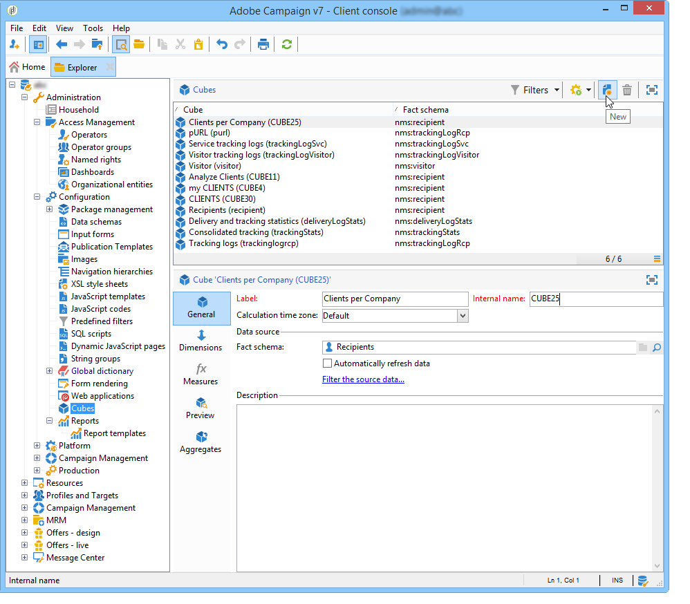
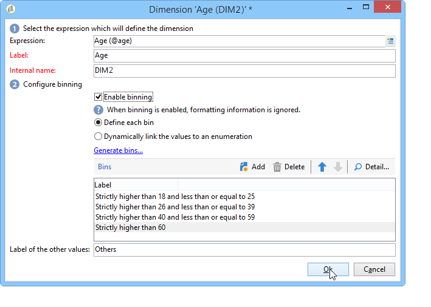

# 创建指标{#creating-indicators}

要使立方正常工作，需要标识相关的维和度量并在立方中创建它们。

要创建立方，请应用以下步骤：

1. 选择工作表。 请参阅 [选择工作表](#selecting-the-work-table).
1. 定义维度。 请参阅 [定义维度](#defining-dimensions).
1. 定义度量。 请参阅 [构建指标](#building-indicators).
1. 创建聚合（可选）。 请参阅 [计算和使用聚合](../../reporting/using/concepts-and-methodology.md#calculating-and-using-aggregates).

此示例说明如何在报告中快速创建简单多维数据集以导出其度量。

实施步骤详见下文。 本章其他部分提供了详尽的选项和描述。

## 选择工作表 {#selecting-the-work-table}

要创建立方，请单击 **[!UICONTROL New]** 按钮。

选择事实架构，即包含要探索的元素的架构。 在本例中，我们将选择 **收件人** 表格。

单击 **[!UICONTROL Save]** 创建多维数据集：多维数据集将显示在多维数据集列表中，然后可以使用相应的选项卡对其进行配置。

单击 **[!UICONTROL Filter the source data...]** 用于将此多维数据集的计算应用于数据库中的数据选择的链接。

## 定义维度 {#defining-dimensions}

Dimension与根据多维数据集相关事实架构为每个多维数据集定义的分析轴一致。 这些是在分析中探索的维度，如时间（年、月、日期……）、产品或合同的分类（家庭、参考资料等）、人口区段（按城市、年龄组、地位等）。

这些分析轴定义于 **[!UICONTROL Dimension]** 立方的选项卡。

单击 **[!UICONTROL Add]** 按钮以创建新维度，然后在 **[!UICONTROL Expression field]**，单击 **[!UICONTROL Edit expression]** 图标以选择包含相关数据的字段。

* 从选择收件人开始 **年龄**. 对于此字段，您可以定义对年龄进行分组，并使信息阅读更加容易。 当存在多个单独值的可能性时，我们建议使用量化。

  要执行此操作，请查看 **[!UICONTROL Enable binning]** 选项。 有关量化模式的详情，请参见 [数据量化](../../reporting/using/concepts-and-methodology.md#data-binning).

  

* 添加 **日期** 类型维度。 此处，我们要显示收件人用户档案创建日期

  为此，请单击 **[!UICONTROL Add]** 并选择 **[!UICONTROL Creation date]** 收件人表中的字段。

  

  可以选择日期显示模式。 要执行此操作，请选择要使用的层次和要生成的级别：

  

  在我们的示例中，我们只希望显示年、月和日，因为无法同时使用周和半年/月：这些级别不兼容。

* 创建另一个维度以分析相对于收件人城市的数据

  要执行此操作，请添加新维度并在 **[!UICONTROL Location]** 收件人模式的节点。

  

  您可以启用量化以使信息读取更轻松并将值链接到明细列表。

  

  从下拉列表中选择明细列表

  

  将仅显示枚举中的值。 其他组将按照 **[!UICONTROL Label of the other values]** 字段。

  有关详细信息，请参见 [动态管理回收站](../../reporting/using/concepts-and-methodology.md#dynamically-managing-bins).

## 构建指标 {#building-indicators}

定义维度后，您需要为要在单元格中显示的值指定计算模式。 要实现此目的，请在 **[!UICONTROL Measures]** 选项卡：创建要显示在报表中的列数（这些列将使用立方）的度量。

要执行此操作，请应用以下步骤：

1. 单击 **[!UICONTROL Add]** 按钮。
1. 选择要应用的度量类型和公式。 这里，我们要统计一下女性在受助者中的数量。

   我们的衡量标准基于事实架构，并使用 **[!UICONTROL Count]** 运算符。

   

   此 **[!UICONTROL Filter the measure data...]** 链接仅允许您选择女性。 有关定义测量和可用选项的更多信息，请参阅 [定义测量](../../reporting/using/concepts-and-methodology.md#defining-measures).

   

1. 输入度量的标签并保存。

   

1. 保存多维数据集。

## 基于多维数据集创建报告 {#creating-a-report-based-on-a-cube}

配置多维数据集后，可将其用作创建新报告的模板。

操作步骤：

1. 单击 **[!UICONTROL Create]** 的按钮 **[!UICONTROL Reports]** 选项卡并选择您刚刚创建的多维数据集。

   

1. 单击 **[!UICONTROL Create]** 按钮确认：这会将您转到报告配置和查看页面。

   默认情况下，前两个可用尺寸以行和列提供，但表中不显示任何值。 要生成表，请单击主图标：

   

1. 可以切换尺寸的轴、删除它们、添加新测量等。 有关可能的操作的详情，请参见 [此页面](../../reporting/using/using-cubes-to-explore-data.md).

   要实现此目的，请使用相应的图标。

   
