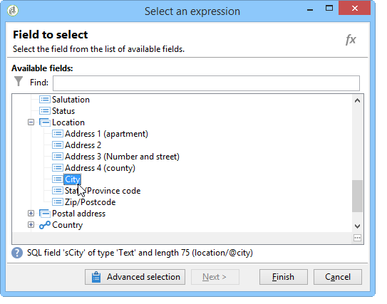
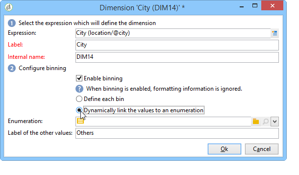

# 创建指标{#creating-indicators}

要使多维数据集正常工作，您需要确定相关的维度和度量并在多维数据集中创建它们。

要创建多维数据集，请应用以下步骤：

1. 选择工作表。 请参阅[选择工作表](#selecting-the-work-table)。
1. 定义维。 请参阅[定义维](#defining-dimensions)。
1. 定义度量。 请参阅[建筑指示灯](#building-indicators)。
1. 创建聚合（可选）。 请参阅[计算和使用聚合](../../reporting/using/concepts-and-methodology.md#calculating-and-using-aggregates)。

此示例说明如何快速在报表中创建一个简单多维数据集以导出其度量。

实施步骤详述如下。 本章的其他部分提供详尽的选项和说明。

## 选择工作表{#selecting-the-work-table}

要创建多维数据集，请单击多维数据集列表上方的&#x200B;**[!UICONTROL New]**&#x200B;按钮。

选择事实模式，即包含要浏览的元素的模式。 在此示例中，我们将选择&#x200B;**收件人**&#x200B;表。

单击&#x200B;**[!UICONTROL Save]**&#x200B;以创建多维数据集:它将显示在多维数据集的列表上，然后可以使用相应的选项卡进行配置。

单击&#x200B;**[!UICONTROL Filter the source data...]**&#x200B;链接，将此多维数据集的计算应用到数据库中的选定数据。

## 定义维{#defining-dimensions}

Dimension与根据每个多维数据集的相关数值模式为其定义的分析轴一致。 这些是分析中探索的维度，如时间（年、月、日……）、产品或合同的分类（家庭、参考等）、人口细分（按城市、年龄组、状态等）。

这些分析轴在多维数据集的&#x200B;**[!UICONTROL Dimension]**&#x200B;选项卡中定义。

单击&#x200B;**[!UICONTROL Add]**&#x200B;按钮以创建新维度，然后在&#x200B;**[!UICONTROL Expression field]**&#x200B;中，单击&#x200B;**[!UICONTROL Edit expression]**&#x200B;图标以选择包含相关数据的字段。

* 开始，选择收件人&#x200B;**Age**。 对于此字段，您可以定义绑定以分组页面，并使信息阅读更简单。 我们建议在可能有多个单独值时使用绑定。

   要执行此操作，请选中&#x200B;**[!UICONTROL Enable binning]**&#x200B;选项。 绑定模式在[数据绑定](../../reporting/using/concepts-and-methodology.md#data-binning)中有详细说明。

   

* 添加&#x200B;**Date**&#x200B;类型维度。 此处，我们要显示收件人用户档案创建日期

   要执行此操作，请单击&#x200B;**[!UICONTROL Add]**&#x200B;并选择收件人表中的&#x200B;**[!UICONTROL Creation date]**&#x200B;字段。

   

   可以选择日期显示模式。 为此，请选择要使用的层次结构和要生成的级别：

   

   在我们的示例中，我们只希望显示年、月和日，因为无法同时使用周和月/月：这些级别不兼容。

* 创建另一个维度以分析相对于收件人城市的数据

   要执行此操作，请添加新维，并在收件人模式的&#x200B;**[!UICONTROL Location]**&#x200B;节点中选择城市。

   

   您可以启用绑定，以便更轻松地读取信息并将值链接到明细列表。

   

   从下拉明细列表中选择列表

   

   将仅显示明细列表中的值。 其他组将分组在&#x200B;**[!UICONTROL Label of the other values]**&#x200B;字段中定义的标签下。

   有关详细信息，请参阅[动态管理素材箱](../../reporting/using/concepts-and-methodology.md#dynamically-managing-bins)。

## 建筑指示器{#building-indicators}

定义尺寸后，您需要为要在单元格中显示的值指定计算模式。 为此，请在&#x200B;**[!UICONTROL Measures]**&#x200B;选项卡中创建匹配指示符：创建将使用该多维数据集的报表中显示的列数量。

为此，请应用以下步骤：

1. 单击 **[!UICONTROL Add]** 按钮。
1. 选择要应用的度量类型和公式。 这里我们想统计收件人中的女性人数。

   我们的度量基于事实模式，并使用&#x200B;**[!UICONTROL Count]**&#x200B;运算符。

   

   **[!UICONTROL Filter the measure data...]**&#x200B;链接仅允许您选择女性。 有关定义度量和可用选项的详细信息，请参阅[定义度量](../../reporting/using/concepts-and-methodology.md#defining-measures)。

   

1. 输入度量的标签并保存它。

   

1. 保存多维数据集。

## 根据多维数据集{#creating-a-report-based-on-a-cube}创建报告

配置多维数据集后，它可用作创建新报表的模板。

操作步骤：

1. 单击&#x200B;**[!UICONTROL Reports]**&#x200B;选项卡的&#x200B;**[!UICONTROL Create]**&#x200B;按钮，然后选择您刚刚创建的多维数据集。

   

1. 单击&#x200B;**[!UICONTROL Create]**&#x200B;按钮进行确认：此操作将带您进入报表配置和查看页面。

   默认情况下，前两个可用尺寸以行和列提供，但表中不显示任何值。 要生成表，请单击主图标：

   

1. 可以切换尺寸轴、删除它们、添加新测量等。 可能的操作详见：[使用多维数据集浏览数据](../../reporting/using/using-cubes-to-explore-data.md)。

   为此，请使用相应的图标。

   

