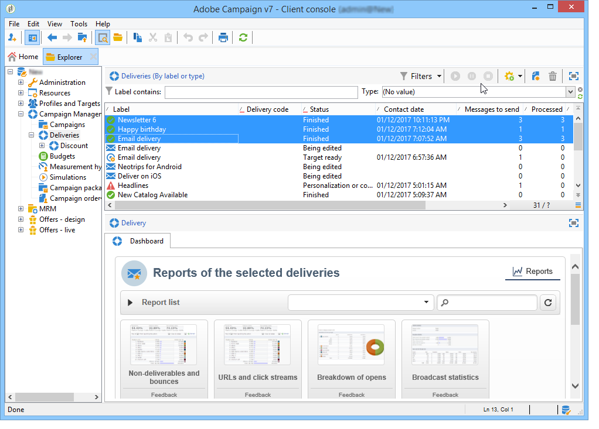

# 累积报告 {#cumulative-reports}

您可以显示投放的累积报告。 要实现此目的，请选择要比较的投放，以获取这些投放的报告列表。

要从列表中选择不相邻的投放，请在进行选择时按住CTRL键。

要选择保存在其他文件夹中的投放，请单击&#x200B;**[!UICONTROL Display sub-levels]**（可通过工具栏访问）。 然后，它们将显示在同一列表中。

