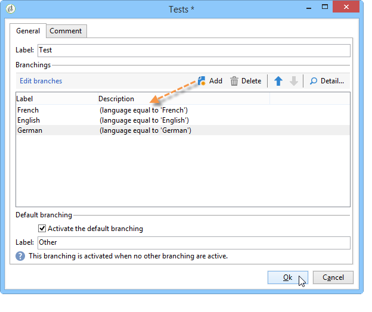

# 定义条件性内容{#defining-a-conditional-content}

您可以对特定报表项目或页面的显示进行条件设置。

要使特定项目成为条件项目，请调整其可见性设置。 有关更多信息，请参阅[Conditioning item display](#conditioning-item-display)。

要视条件显示一个或多个页面，请使用&#x200B;**[!UICONTROL Test]**&#x200B;类型活动。 有关更多信息，请参阅[Conditioning page display](#conditioning-page-display)。

## 调节项显示器 {#conditioning-item-display}

要以条件方式显示部分报表，您需要定义其可见性条件：如果不满足这些条件，则不会显示项目。

可见性条件可能取决于运算符状态，取决于在报表页面中选择或输入的项目。

[此部分](../../web/using/form-rendering.md#defining-fields-conditional-display)中提供了页面上项目的条件显示示例。

在以下示例中，显示条件取决于语言：

## 调整页面显示 {#conditioning-page-display}

在报表图表中，**[!UICONTROL Test]**&#x200B;活动允许您根据一个或多个条件更改页面顺序。

本活动基于以下工作原则：

1. 将&#x200B;**[!UICONTROL Test]**&#x200B;放置在图表中并对其进行编辑。
1. 单击&#x200B;**[!UICONTROL Add]**&#x200B;按钮以创建各种可能的情况。

   

   对于每个情况，都会向&#x200B;**[!UICONTROL Test]**&#x200B;活动添加一个输出过渡。

   

1. 选择&#x200B;**[!UICONTROL Enable default transition]**&#x200B;以添加过渡（如果其中一个配置的条件不满足）。

   如需详细信息，请参阅[此部分](../../web/using/defining-web-forms-page-sequencing.md#conditional-page-display)。

**[!UICONTROL Test]**&#x200B;活动可置于图表的开头，以根据上下文或运算符配置文件等条件来设置显示。
