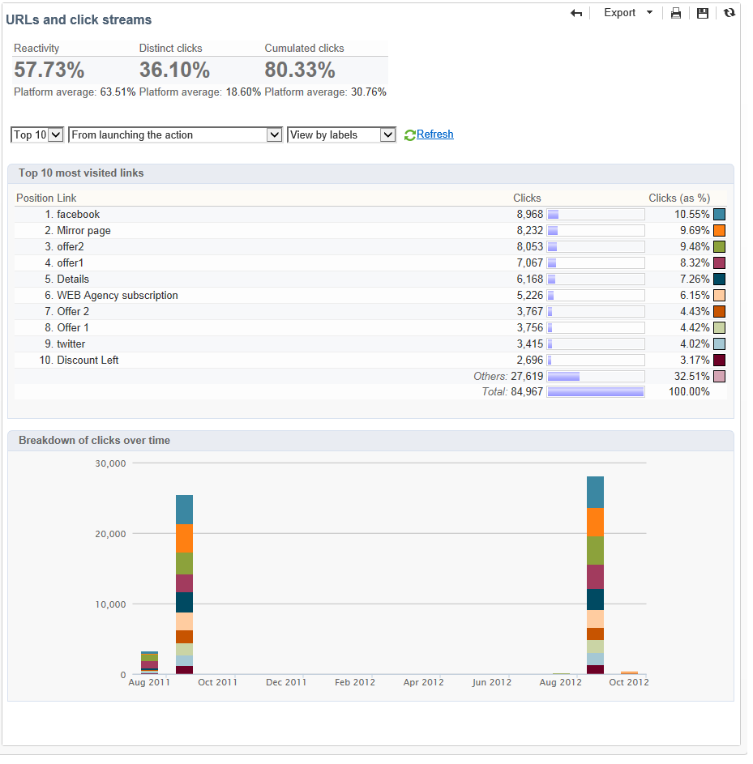

# 投放报告 {#delivery-reports}

您可以通过从投放概述访问的各种报表跟踪投放的执行。 要显示报表，请应用以下过程：

1. 转到&#x200B;**[!UICONTROL Campaigns]**&#x200B;选项卡并单击&#x200B;**[!UICONTROL Delivery]**&#x200B;链接以显示投放列表。
1. 单击要显示的投放的名称以显示其详细信息。

   

1. 选择&#x200B;**[!UICONTROL Summary]**&#x200B;选项卡并单击&#x200B;**[!UICONTROL Reports]**&#x200B;链接以访问特定于投放的报告。

   

   默认情况下，可使用以下报告：

   * **[!UICONTROL Delivery throughput]** :请参阅 [投放吞吐量](../../reporting/using/global-reports.md#delivery-throughput)。
   * **[!UICONTROL Sharing to social networks]** :请参阅 [共享到社交网络](../../reporting/using/global-reports.md#sharing-to-social-networks)。
   * **[!UICONTROL Statistics on sharing activities]** :请参阅 [共享活动统计](../../reporting/using/global-reports.md#statistics-on-sharing-activities)。
   * **[!UICONTROL Hot clicks]** :请参阅“ [热点单击](#hot-clicks)”。
   * **[!UICONTROL Tracking statistics]** :请参阅跟 [踪统计信息](#tracking-statistics)
   * **[!UICONTROL URLs and click streams]** :请参阅 [URL并单击流](#urls-and-click-streams)。
   * **[!UICONTROL Tracking indicators]** :请参阅 [跟踪指示器](#tracking-indicators)。
   * **[!UICONTROL Non-deliverables and bounces]** :请参阅 [非可交付项和弹回](../../reporting/using/global-reports.md#non-deliverables-and-bounces)。
   * **[!UICONTROL User activities]** :请参阅 [用户活动](../../reporting/using/global-reports.md#user-activities)。
   * **[!UICONTROL Delivery summary]** :请参阅 [投放摘要](#delivery-summary)。
   * **[!UICONTROL Subscription tracking]** :请参阅 [订阅跟踪](../../reporting/using/global-reports.md#subscription-tracking)。
   * **[!UICONTROL Delivery statistics]** :请参阅 [投放统计](../../reporting/using/global-reports.md#delivery-statistics)。
   * **[!UICONTROL Breakdown of opens]** :请参阅打 [开的划分](../../reporting/using/global-reports.md#breakdown-of-opens)。

## 跟踪指标 {#tracking-indicators}

此报告综合了在收到收件人时跟踪投放行为的关键指标。 它提供对投放和接收统计、打开和点击率、生成点击流、Web跟踪以及向社交网络共享活动的访问。

>[!NOTE]
>
>由于链接到文本格式电子邮件的错误边距，根据消息打开次数计算的值始终是估计值。 **[!UICONTROL Distinct opens/Sum of opens for the population reached]**&#x200B;指示符将此误差范围考虑在内。 有关跟踪打开的详细信息，请参阅[跟踪打开](../../reporting/using/indicator-calculation.md#tracking-opens-)。

**[!UICONTROL 1. Delivery statistics]**

* **[!UICONTROL Messages to deliver]** :在投放分析后要传递的消息总数。
* **[!UICONTROL Success]** :已成功处理的邮件数。

**[!UICONTROL 2. Reception statistics]**

>[!NOTE]
>
>相关百分比根据成功转发的消息数计算。

* **[!UICONTROL Distinct opens for the population reached]** :至少一次打开消息的目标收件人的数目的估计。单击退订链接和镜像页面时会考虑在内。
* **[!UICONTROL Sum of opens for the population reached]** :目标收件人的打开总数估计。
* **[!UICONTROL Clicks on opt-out link]** :单击退订链接的次数。
* **[!UICONTROL Clicks on the mirror page link]** :点击指向镜像页面的链接的次数。为了考虑到这一点，必须在投放向导（跟踪的URL）中将链接定义为。 请参阅此[页](../../delivery/using/about-delivery-monitoring.md)。
* **[!UICONTROL Estimation of forwards]** :目标收件人转发的电子邮件数的估计。此值的计算方法是减去单击电子邮件的不同收件人的数量。

   >[!NOTE]
   >
   >有关不同人员与目标收件人之间差异的详细信息，请参阅[目标人员/收件人](../../reporting/using/indicator-calculation.md#targeted-persons---recipients)。

**[!UICONTROL 3. Open and click-through rate]**

此值表显示每个Internet域的投放、打开、点击和原始反应性的划分。 使用以下指示符：

* **[!UICONTROL Sent]** :此域上发送的消息总数。
* **[!UICONTROL Complaints]** :此域中报告为不需要的消息数。该速率是根据在此域上发送的消息总数计算的。
* **[!UICONTROL Opens]** :此域至少打开一次消息的不同目标收件人数。该速率是根据在此域上发送的消息总数计算的。
* **[!UICONTROL Clicks]** :在同一收件人中至少单击一次的不同目标投放的数量。该速率是根据在此域上发送的消息总数计算的
* **[!UICONTROL Raw reactivity]** :在收件人中至少单击一次的收件人数与打开投放至少一次的投放数的百分比。

>[!NOTE]
>
>此报表中显示的域名在多维数据集级别使用的分项列表中定义。 要更改、添加或删除默认域，请编辑&#x200B;**[!UICONTROL Domains]**&#x200B;逐项列表并修改值和别名。 如需详细信息，请参阅[此部分](../../platform/using/managing-enumerations.md)。**[!UICONTROL Others]**&#x200B;类别包含不属于分项列表任何值的域名。

**[!UICONTROL 4. Generated click streams]**

>[!NOTE]
>
>相关百分比根据成功转发的消息数计算。

* **[!UICONTROL Distinct clicks for the population reached]** :在投放中点击至少一次的不同人数。
* **[!UICONTROL Cumulated clicks]** :目标收件人(不包括退订链接和镜像页面)的总点击量。
* **[!UICONTROL Recipient clicks]** :在同一收件人中至少单击一次的不同目标投放的数量。
* **[!UICONTROL Estimated recipient reactivity]** :在投放中点击至少一次的收件人数与至少打开一次投放的估计收件人数之比。单击选择退出链接和镜像页面链接时不会被考虑在内。

**[!UICONTROL 5. Web tracking]**

* **[!UICONTROL Visited pages]** :接收消息后访问的网页数。
* **[!UICONTROL Transactions]** :消息接收后的购买数。
* **[!UICONTROL Total amount]** :消息接收后的购买总量。
* **[!UICONTROL Average transaction amount]** :不同投放收件人的平均购买。
* **[!UICONTROL Articles]** :投放收件人购买的文章数。
* **[!UICONTROL Average count of articles per transaction]** :不同收件人每次购买的平均项目数。
* **[!UICONTROL Average amount per message]** :每条消息生成的平均购买量。

   >[!NOTE]
   >
   >为了使访问的页面、事务、金额或文章都得到考虑，必须在匹配的网页中插入Web跟踪标记。 Web跟踪配置显示在[此部分](../../configuration/using/about-web-tracking.md)中。

**[!UICONTROL 6. Sharing activities to email and social networks]**

此部分显示每个社交网络上共享的消息数。 有关详细信息，请参阅[共享到社交网络](../../reporting/using/global-reports.md#sharing-to-social-networks)。

## URL 和点击流 {#urls-and-click-streams}

此报表显示在投放后访问的页面的列表。

您可以通过选择：要显示的得分图表、时间筛选器（自启动操作以来，在启动后的前6小时，等等） 以及数据显示模式(按标签、按URL、按类别)。 单击 **[!UICONTROL Refresh]** 以确认您的选择。

报表的上半部分显示以下费率：

* **[!UICONTROL Reactivity]** :在投放中点击目标收件人的数目与已打开投放的目标收件人的估计数目的比率。单击退出链接和镜像页面均不会被考虑在内。

   >[!NOTE]
   >
   >有关跟踪打开的详细信息，请参阅[跟踪打开](../../reporting/using/indicator-calculation.md#tracking-opens-)。

* **[!UICONTROL Distinct clicks]** :在投放中点击至少一次(不包括退订链接和镜像页面)的不同人数。显示的速率是根据成功传递的消息数量计算的。
* **[!UICONTROL Cumulated clicks]** :目标收件人(不包括退订链接和镜像页面)的总点击量。根据成功转发的消息数计算显示的速率。

**[!UICONTROL Platform average]** :每个速率（反应性、独特点击和累积点击）下显示的此平均速率是为过去六个月发送的投放计算的。仅考虑具有相同类型和相同渠道的投放。 验证被排除。

中心表提供以下信息：

* **[!UICONTROL Clicks]** :每个链接的累积点击次数。
* **[!UICONTROL Clicks (in %)]** :每个链接的点击次数与累计点击总数的关系划分。

**[!UICONTROL Breakdown of clicks in time]**

此图表显示了每天累计点击量的细分。

## 投放摘要 {#delivery-summary}

此报告提供有关该投放的所有主要信息。

**[!UICONTROL Target population]**

本节有两个指标：

* **[!UICONTROL Initial population]** :投放所针对的收件人总数。
* **[!UICONTROL Messages rejected by the rule]** :应用分析时在类型规则期间忽略的地址数：地址丢失、隔离、阻止列表等。有关类型规则的详细信息，请参阅此[页面](../../delivery/using/steps-validating-the-delivery.md#validation-process-with-typologies)。

**[!UICONTROL Causes of exclusion]**

中间图显示在分析期间拒绝的消息规则的划分。

**[!UICONTROL Delivery statistics]**

本节包括以下指示：

* **[!UICONTROL Messages to be delivered]** :在投放分析后要传递的消息总数。
* **[!UICONTROL Success]** :已成功处理的邮件数。关联速率是要传递的消息数的比率。
* **[!UICONTROL Errors]** :在投放和自动回弹处理期间累积的错误总数。关联速率是要传递的消息数的比率。
* **[!UICONTROL New quarantines]** :失败投放后隔离的地址数(用户未知，无效域)。关联速率是要传递的消息数的比率。

## 热门点击 {#hot-clicks}

此报表显示每个链接上具有点击链接百分比的消息内容（HTML和/或文本）。 个性化块退订链接、镜像页面链接和优惠链接在累计的总点击量中会被考虑在内，但不会显示在报表中。

>[!NOTE]
>
>如果投放包含优惠（交互），则报表上方的部分会显示一个框，显示优惠的点击百分比。

## 跟踪统计数据{#tracking-statistics}

此报表提供打开、点击和事务的统计信息。

它可让您跟踪投放的营销影响。 您可以通过更改时间刻度(1小时、3小时或24小时视图等)来配置值的显示方式。 单击 **[!UICONTROL Refresh]** 以确认您的选择。

此报表提供值表和帕累托图，其中显示投放达到最高效率所需的时间。 使用以下指示符：

* **[!UICONTROL Opens]** :达到已打开邮件总数百分比所需时间的估计。不会考虑文本格式的电子邮件。 有关跟踪打开的详细信息，请参阅[跟踪打开](../../reporting/using/indicator-calculation.md#tracking-opens-)。
* **[!UICONTROL Clicks]** :估计达到记录的点击总数百分比所需的时间。单击退出链接时，不会考虑镜像页面。
* **[!UICONTROL Transactions]** :在消息接收后达到事务处理总数的百分比所需的时间。要考虑事务，必须将事务类型Web跟踪标记插入到匹配的网页中。 Web跟踪配置显示在[此部分](../../configuration/using/about-web-tracking.md)中。
