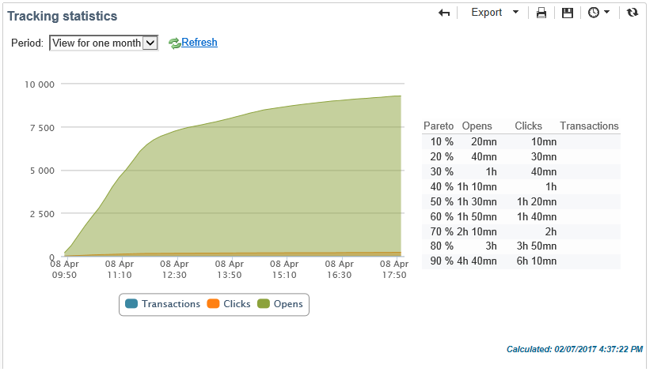

# 投放报告 {#delivery-reports}

您可以通过从投放概述访问的各种报表来跟踪投放的执行情况。 要显示报表，请应用以下过程：

1. 转到 **[!UICONTROL Campaigns]** ，然后单击 **[!UICONTROL Delivery]** 链接以显示投放列表。
1. 单击要显示的投放名称以显示其详细信息。

   

1. 选择 **[!UICONTROL Summary]** ，然后单击 **[!UICONTROL Reports]** 链接以访问特定于投放的报表。

   

   默认情况下，可使用以下报表：

   * **[!UICONTROL Delivery throughput]** :请参阅 [投放吞吐量](../../reporting/using/global-reports.md#delivery-throughput).
   * **[!UICONTROL Sharing to social networks]** :请参阅 [共享到社交网络](../../reporting/using/global-reports.md#sharing-to-social-networks).
   * **[!UICONTROL Statistics on sharing activities]** :请参阅 [关于共享活动的统计资料](../../reporting/using/global-reports.md#statistics-on-sharing-activities).
   * **[!UICONTROL Hot clicks]** :请参阅 [热点点击](#hot-clicks).
   * **[!UICONTROL Tracking statistics]** :请参阅 [跟踪统计信息](#tracking-statistics)
   * **[!UICONTROL URLs and click streams]** :请参阅 [URL和点击流](#urls-and-click-streams).
   * **[!UICONTROL Tracking indicators]** :请参阅 [跟踪指标](#tracking-indicators).
   * **[!UICONTROL Non-deliverables and bounces]** :请参阅 [无法交付项和退回](../../reporting/using/global-reports.md#non-deliverables-and-bounces).
   * **[!UICONTROL User activities]** :请参阅 [用户活动](../../reporting/using/global-reports.md#user-activities).
   * **[!UICONTROL Delivery summary]** :请参阅 [投放摘要](#delivery-summary).
   * **[!UICONTROL Subscription tracking]** :请参阅 [订阅跟踪](../../reporting/using/global-reports.md#subscription-tracking).
   * **[!UICONTROL Delivery statistics]** :请参阅 [投放统计](../../reporting/using/global-reports.md#delivery-statistics).
   * **[!UICONTROL Breakdown of opens]** :请参阅 [打开次数的划分](../../reporting/using/global-reports.md#breakdown-of-opens).

## 跟踪指标 {#tracking-indicators}

此报表整合了用于跟踪收件人在收到投放时的行为的关键指标。 它提供了对投放和接收统计数据、打开率和点进率、生成的点击流、Web 跟踪以及与社交网络共享的活动的访问权限。

>[!NOTE]
>
>根据消息打开次数计算的值始终是预估值，因为链接到文本格式电子邮件的误差范围。 的 **[!UICONTROL Distinct opens/Sum of opens for the population reached]** 指标考虑此误差范围。 有关跟踪打开的更多信息，请参阅 [跟踪打开次数](../../reporting/using/indicator-calculation.md#tracking-opens-).

**[!UICONTROL 1. Delivery statistics]**

* **[!UICONTROL Messages to deliver]** :投放分析后要投放的邮件总数。
* **[!UICONTROL Success]** : 成功处理的消息数.

**[!UICONTROL 2. Reception statistics]**

>[!NOTE]
>
>相关百分比是根据成功转发的消息数量计算的。

* **[!UICONTROL Distinct opens for the population reached]** :至少一次打开消息的目标收件人数目的估计。 由于必须打开电子邮件才能单击链接，因此会考虑对跟踪URL的点击。
* **[!UICONTROL Sum of opens for the population reached]** :目标收件人的打开总数估计。
* **[!UICONTROL Clicks on opt-out link]** :退订链接的点击次数。
* **[!UICONTROL Clicks on the mirror page link]** :点击指向镜像页面的链接的次数。 要考虑这一点，必须在投放向导（跟踪的URL）中将链接定义为相同的链接。 请参阅 [页面](../../delivery/using/about-delivery-monitoring.md).
* **[!UICONTROL Estimation of forwards]** :目标收件人转发的电子邮件数量的估计。 此值的计算方式是减去在电子邮件中点击的不同人员数量和不同收件人的数量。

   >[!NOTE]
   >
   >有关不同人员和目标收件人之间差异的更多信息，请参阅 [目标人员/收件人](../../reporting/using/indicator-calculation.md#targeted-persons---recipients).

**[!UICONTROL 3. Open and click-through rate]**

此值表显示每个Internet域的投放、打开、点击和原始反应性的细分。 使用以下指标：

* **[!UICONTROL Sent]** :在此域上发送的消息总数。
* **[!UICONTROL Complaints]** :收件人报告为不希望的此域的消息数。 速率是根据在此域上发送的消息总数计算的。
* **[!UICONTROL Opens]** :此域中至少打开过一次消息的不同目标收件人的数量。 速率是根据在此域上发送的消息总数计算的。
* **[!UICONTROL Clicks]** :在同一投放中至少点击一次的不同目标收件人的数量。 速率根据在此域上发送的消息总数计算
* **[!UICONTROL Raw reactivity]** :点击了投放至少一次的收件人数量与打开了投放至少一次的收件人数量的百分比。

>[!NOTE]
>
>此报表中显示的域名在多维数据集级别使用的明细列表中定义。 要更改、添加或删除默认域，请编辑 **[!UICONTROL Domains]** 列出列表并修改值和别名。 如需详细信息，请参阅[此部分](../../platform/using/managing-enumerations.md)。的 **[!UICONTROL Others]** 类别包括不属于项目列表任何值的域名。

**[!UICONTROL 4. Generated click streams]**

>[!NOTE]
>
>相关百分比是根据成功转发的消息数量计算的。

* **[!UICONTROL Distinct clicks for the population reached]** :在投放中至少点击一次的独特访客数。
* **[!UICONTROL Cumulated clicks]** :目标收件人的总点击次数，不包括退订链接和镜像页面。
* **[!UICONTROL Recipient clicks]** :在同一投放中至少点击一次的不同目标收件人的数量。
* **[!UICONTROL Estimated recipient reactivity]** :在投放中点击了至少一次的收件人数目与至少打开一次投放的预计收件人数目的比率。 选择禁用和镜像页面链接的点击次数未被考虑在内。

**[!UICONTROL 5. Web tracking]**

* **[!UICONTROL Visited pages]** :收到消息后访问的网页数。
* **[!UICONTROL Transactions]** :收到消息后的购买次数。
* **[!UICONTROL Total amount]** :收到消息后的购买总量。
* **[!UICONTROL Average transaction amount]** :不同投放收件人的平均购买次数。
* **[!UICONTROL Articles]** :投放收件人购买的文章数。
* **[!UICONTROL Average count of articles per transaction]** :不同收件人每次购买的平均项目数。
* **[!UICONTROL Average amount per message]** :每条消息的平均购买量。

   >[!NOTE]
   >
   >要考虑访问的页面、交易、金额或文章，必须在匹配的网页中插入Web跟踪标记。 Web跟踪配置在 [此部分](../../configuration/using/about-web-tracking.md).

**[!UICONTROL 6. Sharing activities to email and social networks]**

此部分显示每个社交网络上共享的消息数。 有关更多信息，请参阅 [共享到社交网络](../../reporting/using/global-reports.md#sharing-to-social-networks).

## URL 和点击流 {#urls-and-click-streams}

此报表显示投放后访问的页面列表。

您可以通过选择以下内容来配置此报表的内容：要显示的得分图表、时间过滤器（自操作启动以来、启动后的前6小时，等等） 以及数据显示模式（按标签、按URL、按类别）。 单击 **[!UICONTROL Refresh]** 以确认您的选择。

以下比率显示在报表的上部：

* **[!UICONTROL Reactivity]** :点击投放的目标收件人数量与已打开投放的目标收件人预计数量之比。 选择退出链接和镜像页面上的单击次数未被考虑在内。

   >[!NOTE]
   >
   >有关跟踪打开的更多信息，请参阅 [跟踪打开次数](../../reporting/using/indicator-calculation.md#tracking-opens-).

* **[!UICONTROL Distinct clicks]** :在投放中至少单击过一次（不包括退订链接和镜像页面）的不同用户数。 显示的速率是根据成功投放的消息数量计算的。
* **[!UICONTROL Cumulated clicks]** :目标收件人的总点击次数（不包括退订链接和镜像页面）。 显示的速率是根据成功转发的消息数量计算的。

**[!UICONTROL Platform average]** :对于在前六个月内发送的投放，将计算显示在每个比率（反应性、不同点击和累积点击）下的平均比率。 只考虑具有相同分类和同一渠道上的投放。 排除校样。

中心表提供了以下信息：

* **[!UICONTROL Clicks]** :每个链接的累计点击数。
* **[!UICONTROL Clicks (in %)]** :每个链接的点击次数的细分，与累积的点击总数相关。

**[!UICONTROL Breakdown of clicks in time]**

此图表显示每日累计点击量的细分。

## 投放摘要 {#delivery-summary}

此报表提供了有关投放的所有主要信息。

**[!UICONTROL Target population]**

本节包含两个指标：

* **[!UICONTROL Initial population]** :投放所定向的收件人总数。
* **[!UICONTROL Messages rejected by the rule]** :应用分类规则时，分析期间忽略的地址数：地址丢失、已隔离、阻止列表已挂起等。 有关分类规则的更多信息，请参阅 [页面](../../delivery/using/steps-validating-the-delivery.md#validation-process-with-typologies).

**[!UICONTROL Causes of exclusion]**

中图显示了在分析期间被拒绝消息的每个规则的划分。

**[!UICONTROL Delivery statistics]**

本节包括以下指标：

* **[!UICONTROL Messages to be delivered]** :投放分析后要投放的邮件总数。
* **[!UICONTROL Success]** :成功处理的消息数。 关联率是要投放消息数量的比率。
* **[!UICONTROL Errors]** :在投放和自动回弹处理过程中累积的错误总数。 关联率是要投放消息数量的比率。
* **[!UICONTROL New quarantines]** :投放失败后隔离的地址数（用户未知，域无效）。 关联率是要投放消息数量的比率。

## 热门点击 {#hot-clicks}

此报告显示邮件内容（HTML 和/或文本）以及每个链接的点击百分比。个性化块退订链接、镜像页面链接和优惠链接将计入总累计点击次数，但不会显示在报告中。

>[!NOTE]
>
>如果您的投放包含选件（交互），则报表上方会显示一个框，显示选件的点击百分比。

## 跟踪统计信息 {#tracking-statistics}

此报表提供有关打开数、点击数和交易的统计资料。

它允许您跟踪投放的营销影响。 您可以通过更改时间刻度（1小时、3小时或24小时视图等）来配置值的显示方式。 单击 **[!UICONTROL Refresh]** 以确认您的选择。

此报表提供了值表和帕累托图，其中显示了达到最高效率所需的交付时间。 使用以下指标：

* **[!UICONTROL Opens]** :达到消息总打开数的百分比所需时间的估计。 未考虑文本格式的电子邮件。 有关跟踪打开的更多信息，请参阅 [跟踪打开次数](../../reporting/using/indicator-calculation.md#tracking-opens-).
* **[!UICONTROL Clicks]** :达到记录的点击总数百分比所需时间的估计。 选择退出链接和镜像页面的单击次数未被考虑在内。
* **[!UICONTROL Transactions]** :在收到消息后，达到交易总数百分比所需的时间。 为了考虑交易，必须在匹配的网页中插入交易类型Web跟踪标记。 Web跟踪配置在 [此部分](../../configuration/using/about-web-tracking.md).
