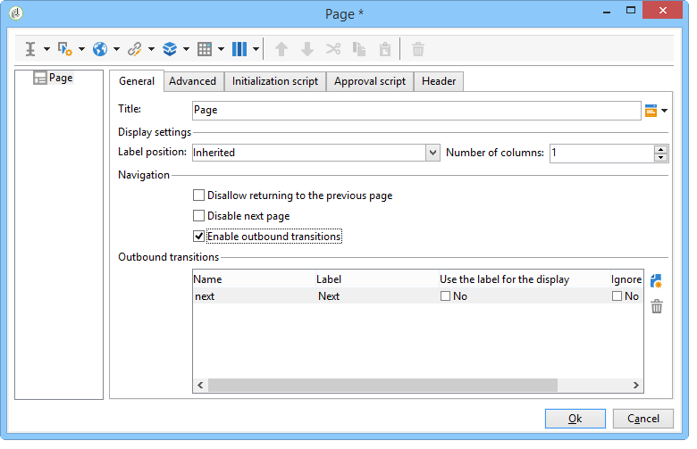

# 元素布局{#element-layout}

除了各种详细的图表之外 [此处](../../reporting/using/creating-a-chart.md#chart-types-and-variants)，您可以调整显示并将元素添加到报表页面。

您可以使用容器：利用这些容器可以链接页面的多个元素，并在列和/或单元格中配置其布局。 中详细介绍了如何使用 [本节](../../web/using/defining-web-forms-layout.md#creating-containers).

您可以在树的根目录下配置报告布局，并重载每个容器。 页面按列排序。 容器还会按列排序。 只有静态项和图形项会被分类为单元格。

## 定义每个页面的选项 {#defining-the-options-for-each-page}

您可以在报告的每个页面上使用选项。

此 **[!UICONTROL General]** 选项卡允许您更改页面标题，配置图例位置并在报表页面之间浏览。

此 **[!UICONTROL Title]** 利用字段，可将报告页面标题中的标签个性化。 窗口的标题可以通过以下方式配置 **[!UICONTROL Properties]** 窗口。 有关详细信息，请参见 [添加页眉和页脚](#adding-a-header-and-a-footer).

此 **[!UICONTROL Display settings]** 选项允许您选择控制标题在报告页面中的位置，并定义页面上的列数。 有关页面布局的更多信息，请参阅 **物料布局** 部分 [本节](../../web/using/defining-web-forms-layout.md#positioning-the-fields-on-the-page).

选择中的各种选项 **[!UICONTROL Browse]** 部分来授权从一个报表页面浏览到另一个报表页面。 如果 **[!UICONTROL Disable next page]** 或 **[!UICONTROL Disable previous page]** 选项，则 **[!UICONTROL Next]** 和 **[!UICONTROL Previous]** 按钮从报表页面中消失。

## 添加页眉和页脚 {#adding-a-header-and-a-footer}

您还可以通过报表属性窗口定义布局元素，例如：窗口的标题、页眉和页脚的HTML内容。

要访问属性窗口，请单击 **[!UICONTROL Properties]** 按钮进行编辑。

此 **[!UICONTROL Page]** 选项卡使您可以个性化显示。

在此选项卡中配置的内容将显示在所有报表页面上。

此 **[!UICONTROL Texts]** 通过子选项卡可定义可变内容：如果设计报告以多种语言使用，则在翻译周期中会考虑该内容。

这允许您创建文本片段列表并将它们链接到标识符：

然后，将这些标识符插入到报表的HTML内容中：

在显示报告时，它们将自动替换为相应的内容。

与HTML文本类似，该操作模式使您能够集中报告中使用的文本并管理其翻译。 在此选项卡中创建的文本由Adobe Campaign集成翻译工具自动收集。
