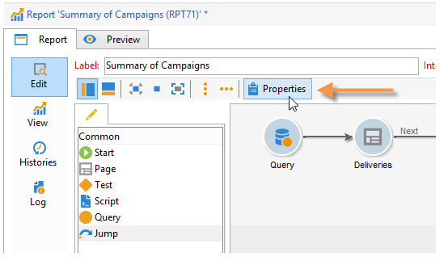
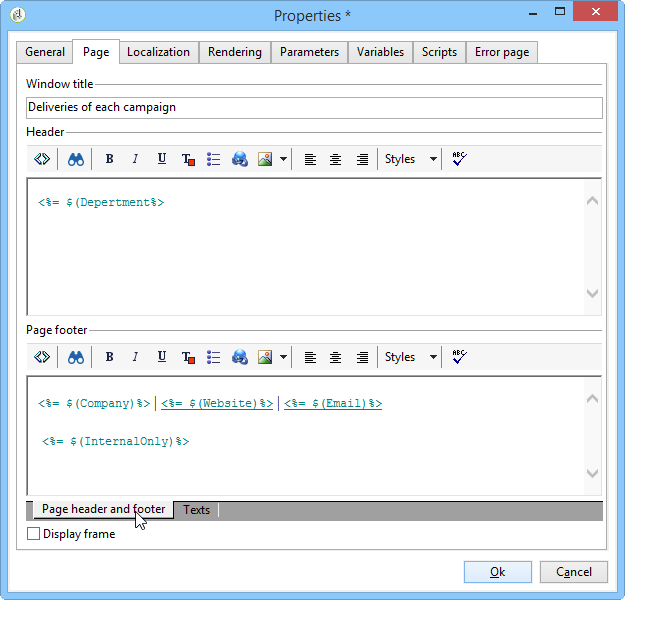

# 元素布局{#element-layout}

除了详细介绍[此处](../../reporting/using/creating-a-chart.md#chart-types-and-variants)的各种图表之外，您还可以调整显示并将元素添加到报告页面。

您可以使用容器：利用这些容器可以链接页面的多个元素，并在列和/或单元格中配置其布局。 [本节](../../web/using/defining-web-forms-layout.md#creating-containers)中详细介绍了如何使用。

您可以在树的根目录下配置报告布局，并重载每个容器。 页面按列排序。 容器还会按列排序。 只有静态项和图形项会被分类为单元格。

## 定义每个页面的选项 {#defining-the-options-for-each-page}

您可以在报告的每个页面上使用选项。

**[!UICONTROL General]**&#x200B;选项卡允许您更改页面标题，配置图例位置并在报表页面之间浏览。

利用&#x200B;**[!UICONTROL Title]**&#x200B;字段，可将报告页面标题中的标签个性化。 可以通过报告的&#x200B;**[!UICONTROL Properties]**&#x200B;窗口配置窗口的标题。 有关详情，请参阅[添加页眉和页脚](#adding-a-header-and-a-footer)。

通过&#x200B;**[!UICONTROL Display settings]**&#x200B;选项，可选择报告页面中控制标题的位置，并定义页面上的列数。 有关页面布局的详细信息，请参阅[此部分](../../web/using/defining-web-forms-layout.md#positioning-the-fields-on-the-page)的&#x200B;**项布局**&#x200B;部分。

选择&#x200B;**[!UICONTROL Browse]**&#x200B;部分中的各种选项以授权从一个报表页面浏览到另一个报表页面。 如果选择了&#x200B;**[!UICONTROL Disable next page]**&#x200B;或&#x200B;**[!UICONTROL Disable previous page]**&#x200B;选项，**[!UICONTROL Next]**&#x200B;和&#x200B;**[!UICONTROL Previous]**&#x200B;按钮从报表页面中消失。

## 添加页眉和页脚 {#adding-a-header-and-a-footer}

您还可以通过报表属性窗口定义布局元素，例如：窗口的标题、页眉和页脚的HTML内容。

要访问属性窗口，请单击报表的&#x200B;**[!UICONTROL Properties]**&#x200B;按钮。

**[!UICONTROL Page]**&#x200B;选项卡允许您个性化显示内容。

在此选项卡中配置的内容将显示在所有报表页面上。

使用&#x200B;**[!UICONTROL Texts]**&#x200B;子选项卡可定义变量内容：如果设计为以多种语言使用报告，则在翻译周期将考虑该子选项卡。

这允许您创建文本片段列表并将它们链接到标识符：

然后，将这些标识符插入到报表的HTML内容中：

在显示报告时，它们将自动替换为相应的内容。

与HTML文本类似，该操作模式使您能够集中报告中使用的文本并管理其翻译。 在此选项卡中创建的文本由Adobe Campaign集成翻译工具自动收集。
