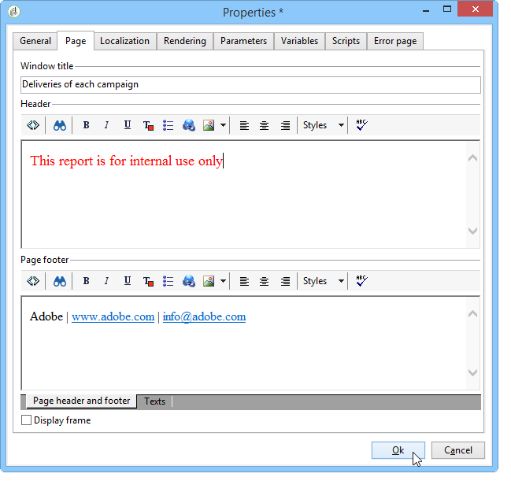

# 元素布局{#element-layout}

除了下面详述的各种图表外：[图表类型和变体](../../reporting/using/creating-a-chart.md#chart-types-and-variants)，您可以调整显示并向报表页面添加元素。

您可以使用容器:这些组件允许您链接页面的多个元素，并在列和／或单元格中配置其布局。 如何使用它们在[本节](../../web/using/defining-web-forms-layout.md#creating-containers)中有详细说明。

您可以在树的根位置配置报表布局，并为每个容器使其过载。 页面按列排序。 容器也按列排序。 只有静态和图形项被分类为单元格。

## 定义每页{#defining-the-options-for-each-page}的选项

您可以使用报表每个页面上的选项。

使用&#x200B;**[!UICONTROL General]**&#x200B;选项卡可更改页面标题，以及配置图例位置和在报表页面之间浏览。

通过&#x200B;**[!UICONTROL Title]**&#x200B;字段，您可以个性化报表页面标题中的标签。 窗口的标题可以通过报告的&#x200B;**[!UICONTROL Properties]**&#x200B;窗口进行配置。 有关详细信息，请参阅[添加页眉和页脚](#adding-a-header-and-a-footer)。

**[!UICONTROL Display settings]**&#x200B;选项允许您选择报表页面中控件标题的位置，并定义页面上的列数。 有关页面布局的详细信息，请参阅[此部分](../../web/using/defining-web-forms-layout.md#positioning-the-fields-on-the-page)的&#x200B;**项目布局**&#x200B;部分。

在&#x200B;**[!UICONTROL Browse]**&#x200B;部分选择各种选项，以授权从一个报表页面浏览到另一个报表页面。 如果选择&#x200B;**[!UICONTROL Disable next page]**&#x200B;或&#x200B;**[!UICONTROL Disable previous page]**&#x200B;选项，则&#x200B;**[!UICONTROL Next]**&#x200B;和&#x200B;**[!UICONTROL Previous]**&#x200B;按钮将从报告页面中消失。

## 添加页眉和页脚{#adding-a-header-and-a-footer}

在报表属性窗口中，您还可以定义布局元素，例如：窗口的标题、页眉和页脚的HTML内容。

要访问属性窗口，请单击报告的&#x200B;**[!UICONTROL Properties]**&#x200B;按钮。

使用&#x200B;**[!UICONTROL Page]**&#x200B;选项卡，您可以个性化显示屏。

此选项卡中配置的内容将显示在所有报告页面上。

**[!UICONTROL Texts]**&#x200B;子选项卡允许您定义变量内容：如果报告设计为用于多种语言，则在翻译周期中将考虑这一因素。

这允许您创建文本片段列表并将它们链接到标识符：

然后，将这些标识符插入报告的HTML内容：

在显示报告时，系统会自动将其替换为相应的内容。

与HTML文本一样，此操作模式使您能够集中报告中使用的文本并管理其翻译。 在此选项卡中创建的文本由Adobe Campaign集成翻译工具自动收集。
