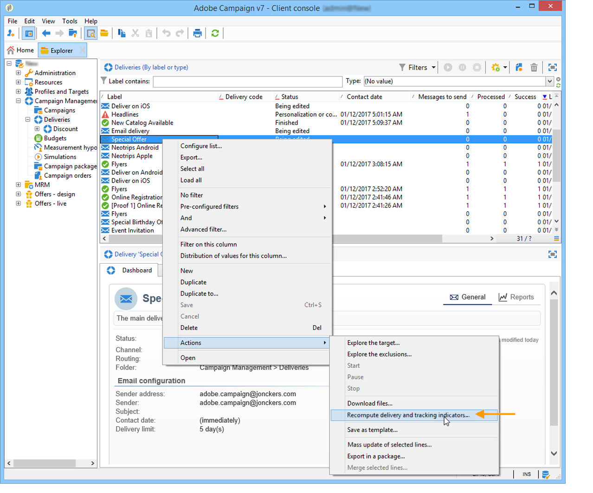

# 指标计算 {#indicator-calculation}

## 用户活动 {#user-activities-1}

<table> 
 <thead> 
  <tr> 
   <th> <strong>标签</strong>   </th> 
   <th> <strong>字段名称</strong>   </th> 
   <th> <strong>指示器说明</strong>   </th> 
   <th> <strong>指示器计算公式</strong>   </th> 
  </tr> 
 </thead> 
 <tbody> 
  <tr> 
   <td> 打开  </td> 
   <td> @opens  </td> 
   <td> URL主键等于1时所有@totalClicks的总和。  </td> 
   <td> sum(Iif([@url-id]=1, @totalClicks, 0))  </td> 
  </tr> 
  <tr> 
   <td> 点击  </td> 
   <td> @clicks  </td> 
   <td> URL类型等于“电子邮件单击”的所有@totalClicks的总和。  </td> 
   <td> sum(Iif([url/@type]=1, @totalClicks, 0))  </td> 
  </tr> 
  <tr> 
   <td> 交易  </td> 
   <td> @交易记录  </td> 
   <td> URL类型等于“事务”的所有@totalClicks的总和。  </td> 
   <td> sum(Iif([url/@type]=5, @totalClicks, 0))  </td> 
  </tr> 
 </tbody> 
</table>

此报告基于表 **[!UICONTROL Consolidated tracking]** (nms:trackingStats)。 此聚合表用于显示报表时的性能原因( **[!UICONTROL Recipient tracking logs]** nms:trackingLogRcp)，不实时计算。 在检索跟踪日志数分钟后生成表。 如果指标是最新的，则结果将与跟踪指标报告的指标 **相同** 。 @totalclicks指示符表示在5分钟的时间段内的点击总数。

## 无法投放项和退回 {#non-deliverables-and-bounces-1}

**按错误类型细分**

此报告基于表 **[!UICONTROL Delivery and tracking statistics]** (nms:deliveryLogStats)。

<table> 
 <thead> 
  <tr> 
   <th> <strong>标签</strong>   </th> 
   <th> <strong>字段名称</strong>   </th> 
   <th> <strong>指示器说明</strong>   </th> 
   <th> <strong>指示器计算公式</strong>   </th> 
  </tr> 
 </thead> 
 <tbody> 
  <tr> 
   <td> 已处理邮件总数  </td> 
   <td> @totalProcessed  </td> 
   <td> 状态等于“就绪”、“已发送”或“失败”的消息总和。  </td> 
   <td> @prepared + @error + @success  </td> 
  </tr> 
  <tr> 
   <td> 用户未知  </td> 
   <td> @unknownUser  </td> 
   <td> 状态等于“失败”且原因等于“用户未知”的所有消息计数。   </td> 
   <td> Count（@status=2和msg/@failureReason=1）  </td> 
  </tr> 
  <tr> 
   <td> 不可到达   </td> 
   <td> @不可到达  </td> 
   <td> 状态等于“失败”且原因等于“不可到达”的所有邮件计数。   </td> 
   <td> Count（@status=2和msg/@failureReason=3）  </td> 
  </tr> 
  <tr> 
   <td> 被拒绝  </td> 
   <td> @拒绝  </td> 
   <td> 状态等于“失败”且原因等于“被拒绝”的所有邮件计数。   </td> 
   <td> Count（@status=2和msg/@failureReason=20）  </td> 
  </tr> 
  <tr> 
   <td> 无效域  </td> 
   <td> @invalidDomain  </td> 
   <td> 状态等于“失败”且原因等于“无效域”的所有消息计数。   </td> 
   <td> Count（@status=2和msg/@failureReason=2）  </td> 
  </tr> 
  <tr> 
   <td> 帐户已禁用  </td> 
   <td> @disabled  </td> 
   <td> 状态等于“失败”且原因等于“帐户已禁用”的所有邮件计数。  </td> 
   <td> Count（@status=2和msg/@failureReason=4）  </td> 
  </tr> 
  <tr> 
   <td> 收件箱已满  </td> 
   <td> @mailBoxFull  </td> 
   <td> 状态等于“失败”且原因等于“收件箱已满”的所有邮件计数。   </td> 
   <td> Count（@status=2和msg/@failureReason=5）  </td> 
  </tr> 
  <tr> 
   <td> 错误  </td> 
   <td> @value  </td> 
   <td> 此类错误的失败消息数。  </td> 
   <td> Count（@status=2和msg/@failureReason="错误类型的值"）  </td> 
  </tr> 
  <tr> 
   <td> 贡献  </td> 
   <td> -  </td> 
   <td> 与错误消息总数相比，此类型的错误百分比。  </td> 
   <td> percent(@value,@totalErrors)  </td> 
  </tr> 
  <tr> 
   <td> 细分  </td> 
   <td> -  </td> 
   <td> 与已处理邮件总数相比，此类型的错误百分比。  </td> 
   <td> percent(@value,@totalProcessed)  </td> 
  </tr> 
 </tbody> 
</table>

**按域细分**

报告的第二部分按Internet域（而非错误类型）详细列出故障消息的细分。 在这种情况下，链 **接到** “错误”指示符(@value)的公式为： Count（@status=2和@domain=&quot;域名的值&quot;），即此域状态为失败的所有消息的计数。

## 浏览器 {#browsers-1}

此报告基于表 **[!UICONTROL Internet Browser Statistics]** (nms:userAgentsStats)。

**全局统计**

<table> 
 <thead> 
  <tr> 
   <th> <strong>标签</strong>   </th> 
   <th> <strong>字段名称</strong>   </th> 
   <th> <strong>指示器说明</strong>   </th> 
   <th> <strong>指示器计算公式</strong>   </th> 
  </tr> 
 </thead> 
 <tbody> 
  <tr> 
   <td> 访客  </td> 
   <td> @totalVisitors  </td> 
   <td> 此浏览器中至少单击一次收件人的目标投放总数。  </td> 
   <td> Sum(@访客)  </td> 
  </tr> 
  <tr> 
   <td> 页面视图  </td> 
   <td> @totalPages  </td> 
   <td> 所有投放使用此浏览器点击投放链接的总次数。  </td> 
   <td> Sum(@pages)   </td> 
  </tr> 
  <tr> 
   <td> 使用率  </td> 
   <td> -  </td> 
   <td> 此浏览器的访客与总访客的百分比。  </td> 
   <td> percent(@totalVisitors, sum(@totalVisitors))   </td> 
  </tr> 
 </tbody> 
</table>

**每个浏览器的统计信息**

<table> 
 <thead> 
  <tr> 
   <th> <strong>标签</strong>   </th> 
   <th> <strong>字段名称</strong>   </th> 
   <th> <strong>指示器说明</strong>   </th> 
   <th> <strong>指示器计算公式</strong>   </th> 
  </tr> 
 </thead> 
 <tbody> 
  <tr> 
   <td> 使用率  </td> 
   <td> @访客  </td> 
   <td> 使用此浏览器的每日访客数与当天访问次数最多的访客数的百分比。  </td> 
   <td> percent(sum(@访客),max(@visitorsOfTheDay))  </td> 
  </tr> 
  <tr> 
   <td> 全局比率  </td> 
   <td> -  </td> 
   <td> 此版本的访客与使用所有浏览器的访客总数的百分比。  </td> 
   <td> 百分比(@totalVisitors, @globalVisitors)  </td> 
  </tr> 
  <tr> 
   <td> 相对权重  </td> 
   <td> -  </td> 
   <td> 此版本的访客与使用此浏览器的访客总数的百分比。  </td> 
   <td> percent(@totalVisitors, sum(@totalVisitors))   </td> 
  </tr> 
 </tbody> 
</table>

## 共享到社交网络 {#sharing-to-social-networks-1}

此报告基于 **[!UICONTROL Delivery]** (nms:投放) **[!UICONTROL Consolidated tracking]** 、(nms:trackingStats) **[!UICONTROL Web tracking]** 和(nms:webTrackingLog)表。

<table> 
 <thead> 
  <tr> 
   <th> <strong>标签</strong>   </th> 
   <th> <strong>字段名称</strong>   </th> 
   <th> <strong>指示器说明</strong>   </th> 
   <th> <strong>指示器计算公式</strong>   </th> 
  </tr> 
 </thead> 
 <tbody> 
  <tr> 
   <td> 要传送的消息数  </td> 
   <td> @totalTarget  </td> 
   <td> 在投放分析中处理的邮件总数。  </td> 
   <td> sum([properties/@totalTarget])  </td> 
  </tr> 
  <tr> 
   <td> 成功投放数  </td> 
   <td> @success  </td> 
   <td> 成功处理的邮件数   </td> 
   <td> sum([indicators/@success])  </td> 
  </tr> 
  <tr> 
   <td> 电子邮件  </td> 
   <td> @email  </td> 
   <td> URL类别等于“email”的所有@totalClicks的总和。  </td> 
   <td> Sum(iIf([url/@类别]='email',@totalClicks,0))  </td> 
  </tr> 
  <tr> 
   <td> Facebook  </td> 
   <td> @facebook  </td> 
   <td> URL类别等于“facebook”的所有@totalClicks的总和。  </td> 
   <td> Sum(iIf([url/@类别]='facebook',@totalClicks,0))  </td> 
  </tr> 
  <tr> 
   <td> Twitter  </td> 
   <td> @twitter  </td> 
   <td> URL类别等于“twitter”的所有@totalClicks的总和。  </td> 
   <td> Sum(iIf([url/@类别]='twitter',@totalClicks,0))  </td> 
  </tr> 
  <tr> 
   <td> 美味  </td> 
   <td> @devicious  </td> 
   <td> URL类别等于“可口”的所有@totalClicks的总和。  </td> 
   <td> Sum(iIf([url/@类别]='delicious',@totalClicks,0))  </td> 
  </tr> 
  <tr> 
   <td> Digg  </td> 
   <td> @digg  </td> 
   <td> URL类别等于“digg”的所有@totalClicks的总和。  </td> 
   <td> Sum(iIf([url/@类别]='digg',@totalClicks,0))  </td> 
  </tr> 
  <tr> 
   <td> Google  </td> 
   <td> @google  </td> 
   <td> URL类别等于“google”的所有@totalClicks的总和。  </td> 
   <td> Sum(iIf([url/@类别]='google',@totalClicks,0))  </td> 
  </tr> 
  <tr> 
   <td> 林克丁  </td> 
   <td> @linkedin  </td> 
   <td> URL类别等于“linkedin”的所有@totalClicks的总和。  </td> 
   <td> Sum(iIf([url/@类别]='linkedin',@totalClicks,0))  </td> 
  </tr> 
 </tbody> 
</table>

**股份**

<table> 
 <thead> 
  <tr> 
   <th> <strong>标签</strong>   </th> 
   <th> <strong>字段名称</strong>   </th> 
   <th> <strong>指示器说明</strong>   </th> 
   <th> <strong>指示器计算公式</strong>   </th> 
  </tr> 
 </thead> 
 <tbody> 
  <tr> 
   <td> 股份数  </td> 
   <td> @forward  </td> 
   <td> 此社交网络上共享的消息总数。  </td> 
   <td> Sum(iIf([url/@类别]="社交网络类型的值",@totalClicks,0))  </td> 
  </tr> 
  <tr> 
   <td> 细分  </td> 
   <td> @百分比  </td> 
   <td> 此社交网络上的股份数与总股份数的百分比。  </td> 
   <td> 百分比(@forward, sum(@forward))  </td> 
  </tr> 
  <tr> 
   <td> 共享率  </td> 
   <td> @rate  </td> 
   <td> 与要传送的消息数相比，此网络上的共享数。  </td> 
   <td> @forward / @totalTarget  </td> 
  </tr> 
 </tbody> 
</table>

**打开**

<table> 
 <thead> 
  <tr> 
   <th> <strong>标签</strong>   </th> 
   <th> <strong>字段名称</strong>   </th> 
   <th> <strong>指示器说明</strong>   </th> 
   <th> <strong>指示器计算公式</strong>   </th> 
  </tr> 
 </thead> 
 <tbody> 
  <tr> 
   <td> 打开次数   </td> 
   <td> @open  </td> 
   <td> Web跟踪表中的跟踪行总数。  </td> 
   <td> Count  </td> 
  </tr> 
  <tr> 
   <td> 细分  </td> 
   <td> @percentOpen  </td> 
   <td> 此社交网络上的打开次数与打开总数的百分比。  </td> 
   <td> percent(@open, sum(@open))  </td> 
  </tr> 
  <tr> 
   <td> 打开率  </td> 
   <td> @rateOpen  </td> 
   <td> 此社交网络上的打开次数与要发送的消息总数相比。  </td> 
   <td> @open / @totalTarget  </td> 
  </tr> 
 </tbody> 
</table>

## 共享活动统计 {#statistics-on-sharing-activities-1}

此报告基于 **[!UICONTROL Delivery]** (nms:投放) **[!UICONTROL Consolidated tracking]** 、(nms:trackingStats) **[!UICONTROL Web tracking]** 和(nms:webTrackingLog)表。

<table> 
 <thead> 
  <tr> 
   <th> <strong>标签</strong>   </th> 
   <th> <strong>字段名称</strong>   </th> 
   <th> <strong>指示器说明</strong>   </th> 
   <th> <strong>指示器计算公式</strong>   </th> 
  </tr> 
 </thead> 
 <tbody> 
  <tr> 
   <td> 新联系人  </td> 
   <td> @newContacts  </td> 
   <td> 链接到访客的收件人数。  </td> 
   <td> 公式： count(@id)过滤  器： @收件人id != 0  </td> 
  </tr> 
  <tr> 
   <td> 打开  </td> 
   <td> @已打开  </td> 
   <td> URL类型等于“Open”的所有@id的计数。  </td> 
   <td> count(Iif([url/@type] = 2, @id, 0))  </td> 
  </tr> 
  <tr> 
   <td> 股份  </td> 
   <td> @shared  </td> 
   <td> URL类别包含在“email”、“facebook”、“twitter”、“dicious”、“digg”、“google”、“linkedin'  Count of all @totalClicks中，URL类别等于“email”、“facebook”、“twitter”、“dicious”、“digg”或“linkedin”。  </td> 
   <td> count(Iif([url/@类别] IN(email', 'facebook', 'twitter', 'delicious', 'digg', 'google', 'linkedin'), @totalClicks, 0))  </td> 
  </tr> 
 </tbody> 
</table>

## 操作系统 {#operating-systems-1}

此报告基于表 **[!UICONTROL Internet Browser Statistics]** (nms:userAgentsStats)。

**全局统计**

<table> 
 <thead> 
  <tr> 
   <th> <strong>标签</strong>   </th> 
   <th> <strong>字段名称</strong>   </th> 
   <th> <strong>指示器说明</strong>   </th> 
   <th> <strong>指示器计算公式</strong>   </th> 
  </tr> 
 </thead> 
 <tbody> 
  <tr> 
   <td> 访客  </td> 
   <td> @totalVisitors / @days  </td> 
   <td> 操作系统点击收件人至少一次时目标投放的日平均数。  </td> 
   <td> Sum(@访客)  </td> 
  </tr> 
  <tr> 
   <td> 已查看的页面  </td> 
   <td> @totalPages / @days  </td> 
   <td> 每个操作系统对所有投放的投放链接的每日平均点击次数。  </td> 
   <td> Sum(@pages)  </td> 
  </tr> 
  <tr> 
   <td> 使用率  </td> 
   <td> -  </td> 
   <td> 每个操作系统的访客细分与访客总数的比较。  </td> 
   <td> percent(@totalVisitors, sum(@totalVisitors))  </td> 
  </tr> 
 </tbody> 
</table>

**每个操作系统的统计信息**

<table> 
 <thead> 
  <tr> 
   <th> <strong>标签</strong>   </th> 
   <th> <strong>字段名称</strong>   </th> 
   <th> <strong>指示器说明</strong>   </th> 
   <th> <strong>指示器计算公式</strong>   </th> 
  </tr> 
 </thead> 
 <tbody> 
  <tr> 
   <td> 使用率  </td> 
   <td> @访客  </td> 
   <td> 此操作系统每天的访客数与当天访问次数最多的访客数的百分比。  </td> 
   <td> percent(sum(@访客), max(@visitorsOfTheDay))  </td> 
  </tr> 
  <tr> 
   <td> 全局比率  </td> 
   <td> -  </td> 
   <td> 每个版本的访客与所有操作系统上的访客总数的百分比。  </td> 
   <td> 百分比(@totalVisitors, @globalVisitors)  </td> 
  </tr> 
  <tr> 
   <td> 相对速率  </td> 
   <td> -  </td> 
   <td> 每个版本的访客与使用此操作系统的访客总数的百分比。  </td> 
   <td> percent(@totalVisitors, sum(@totalVisitors))  </td> 
  </tr> 
 </tbody> 
</table>

## 订阅跟踪 {#subscription-tracking-1}

此报告基于 **[!UICONTROL Services]** 表(nms:service)。

<table> 
 <thead> 
  <tr> 
   <th> <strong>标签</strong>   </th> 
   <th> <strong>字段名称</strong>   </th> 
   <th> <strong>指示器说明</strong>   </th> 
   <th> <strong>指示器计算公式</strong>   </th> 
  </tr> 
 </thead> 
 <tbody> 
  <tr> 
   <td> 已注册  </td> 
   <td> @_subscriber  </td> 
   <td> 前一天的注册人数。  </td> 
   <td> sum(Iif(@created &lt; addDays(getDate(),(-1)),1,0))  </td> 
  </tr> 
  <tr> 
   <td> 订阅  </td> 
   <td> @_订阅  </td> 
   <td> 前一天的订阅计数(@action = 1)。  </td> 
   <td> sum(Iif(@action = 1 and @date &gt; addDays(getDate(),(-1)),1,0))  </td> 
  </tr> 
  <tr> 
   <td> 取消订阅  </td> 
   <td> @_退订  </td> 
   <td> 前一天的退订计数（操作= 0）。  </td> 
   <td> sum(Iif(@action = 0和@date &gt; addDays(getDate(),(-1)),1,0))  </td> 
  </tr> 
  <tr> 
   <td> 进化  </td> 
   <td> -  </td> 
   <td> 订阅数减去退订数。 该速率是相对于用户总数计算的。  </td> 
   <td> If(number(@_订阅)&gt; number(@_退订), '+', ")+format(@_订阅- @_退订, 'number', '###0')+ Iif(@_subscriber&gt;0,'(' + format(100*percent(@_订阅- @_退订, @_subscriber), '#,#.00')+ '%)',")  </td> 
  </tr> 
  <tr> 
   <td> 忠诚度  </td> 
   <td> -  </td> 
   <td> 相关时段的订户忠诚度比率。  </td> 
   <td> 1-percent(@_退订,@_subscriber+@_subscription-@_退订)  </td> 
  </tr> 
 </tbody> 
</table>

## 跟踪指标 {#tracking-indicators-1}

此报告基于(nms: **[!UICONTROL Delivery and tracking statistics]** deliveryLogStats)和(nms: **[!UICONTROL Consolidated tracking]** trackingStats)表。

<table> 
 <thead> 
  <tr> 
   <th> <strong>标签</strong>   </th> 
   <th> <strong>字段名称</strong>   </th> 
   <th> <strong>指示器说明</strong>   </th> 
   <th> <strong>指示器计算公式</strong>   </th> 
  </tr> 
 </thead> 
 <tbody> 
  <tr> 
   <td> 要传送的消息  </td> 
   <td> @toDeliver  </td> 
   <td> 目标分析后broadLog的数量。  </td> 
   <td> sum([properties/@toDeliver])  </td> 
  </tr> 
  <tr> 
   <td> 成功  </td> 
   <td> @successWithoutSeeds  </td> 
   <td> “种子地址”字段等于“否”且状态等于“服务提供商已考虑”、“已发送”或“在移动设备上已接收”的邮件计数。  </td> 
   <td> sum([indicators/@success])  </td> 
  </tr> 
  <tr> 
   <td> 已到达的人口打开不同  </td> 
   <td> @estimatedRecipientOpen  </td> 
   <td> 根据HTML格式的电子邮件的不同打开次数推断所有电子邮件的不同打开次数。  </td> 
   <td> Iif(([@toDeliver] - [@text])= 0, 0, round(toDouble(@recipientOpen)* [@toDeliver] /([@toDeliver] - [@text]), 0))  </td> 
  </tr> 
  <tr> 
   <td> 到达人口的开放总数  </td> 
   <td> @estimatedTotalRecipientOpen  </td> 
   <td> 根据HTML格式的电子邮件的打开总数，推断所有电子邮件的打开总数。  </td> 
   <td> Iif(([@toDeliver] - [@text])= 0, 0, round(toDouble(@totalRecipientOpen)* [@toDeliver] /([@toDeliver] - [@text]), 0))  </td> 
  </tr> 
  <tr> 
   <td> 单击退订链接  </td> 
   <td> @optOut  </td> 
   <td> URL类别等于“退出”的所有@id的计数。  </td> 
   <td> count(Iif([url/@type]=3, @id, 0))  </td> 
  </tr> 
  <tr> 
   <td> 单击指向镜像页面的链接  </td> 
   <td> @mirrorPage  </td> 
   <td> URL类别等于“镜像页面”的所有@id的计数。  </td> 
   <td> count(Iif([url/@type]=6, @id, 0))  </td> 
  </tr> 
  <tr> 
   <td> 前向估计  </td> 
   <td> @forward  </td> 
   <td> 不同人数与点击电子邮件至少一次的不同收件人数之间的差异。  </td> 
   <td> @personClick - @recipientClick  </td> 
  </tr> 
  <tr> 
   <td> 发送  </td> 
   <td> @successWithoutSeeds  </td> 
   <td> “种子地址”字段等于“否”且状态等于“由收件人考虑”、“已发送”或“在移动设备上接收”的消息计数。  </td> 
   <td> sum([indicators/@success])  </td> 
  </tr> 
  <tr> 
   <td> 投诉  </td> 
   <td> @complaints  </td> 
   <td> 状态等于“失败”且原因等于“添加到块列表的地址”的邮件计数。  </td> 
   <td> Count（@status=2和msg/@failureReason=8）  </td> 
  </tr> 
  <tr> 
   <td> 打开  </td> 
   <td> @recipientOpen  </td> 
   <td> 所有跟踪日志中所有@broadLog-id的计数。  </td> 
   <td> Countdistinct([@broadLog-id])  </td> 
  </tr> 
  <tr> 
   <td> 点击  </td> 
   <td> @recipientClick  </td> 
   <td> URL类型等于“电子邮件单击”的@broadLog-id的独特计数。   </td> 
   <td> Countdistinct(Iif([url/@type]=1, @broadLog-id, 0))  </td> 
  </tr> 
  <tr> 
   <td> 原始反应性  </td> 
   <td> -  </td> 
   <td> 点击收件人至少一次的投放数与打开投放至少一次的收件人数的百分比。  </td> 
   <td> percent(@recipientClick,@recipientOpen)  </td> 
  </tr> 
  <tr> 
   <td> 对到达的人口的明显点击  </td> 
   <td> @personClick  </td> 
   <td> URL类别等于“电子邮件单击”的所有@source-id的计数。  </td> 
   <td> Countdistinct(Iif([url/@type]=1, @source-id, 0))  </td> 
  </tr> 
  <tr> 
   <td> 累积点击  </td> 
   <td> @totalRecipientClick  </td> 
   <td> URL类别等于“电子邮件单击”的所有@id的计数。  </td> 
   <td> count(Iif([url/@type]=1, @id, 0))  </td> 
  </tr> 
  <tr> 
   <td> 收件人点击  </td> 
   <td> @recipientClick  </td> 
   <td> URL类型等于“电子邮件单击”的@broadLog-id的独特计数。  </td> 
   <td> Countdistinct(Iif([url/@type]=1, @broadLog-id, 0))  </td> 
  </tr> 
  <tr> 
   <td> 估计反应性  </td> 
   <td> -  </td> 
   <td> 点击收件人至少一次的投放数与打开投放至少一次的收件人的估计数的比率。  </td> 
   <td> percent(@recipientClick, @estimatedRecipientOpen  </td> 
  </tr> 
  <tr> 
   <td> 访问过的页面  </td> 
   <td> @totalWebPage  </td> 
   <td> URL类型等于“Web”或“事务”的所有@id的计数。  </td> 
   <td> count(Iif（[url/@type]=4或[url/@type]=5, @id, 0）)  </td> 
  </tr> 
  <tr> 
   <td> 交易  </td> 
   <td> @transaction  </td> 
   <td> URL类型等于“事务”的所有@id的计数。  </td> 
   <td> count(Iif([url/@type]=5, @id, 0))  </td> 
  </tr> 
  <tr> 
   <td> 总额  </td> 
   <td> @amount  </td> 
   <td> URL类型等于“事务”的webTrackingLog/@amounts的总和。   </td> 
   <td> Sum(Iif([url/@type]=5, webTrackingLog/@amount, 0))  </td> 
  </tr> 
  <tr> 
   <td> 平均交易金额  </td> 
   <td> -  </td> 
   <td> 总金额与事务处理数之比。  </td> 
   <td> div(@amount, @transaction)  </td> 
  </tr> 
  <tr> 
   <td> 项目  </td> 
   <td> @article  </td> 
   <td> URL类型等于“事务”的webTrackingLog/@articles的总和。  </td> 
   <td> Sum(Iif([url/@type]=5, webTrackingLog/@article, 0))  </td> 
  </tr> 
  <tr> 
   <td> 每个事务处理的平均项目数  </td> 
   <td> -  </td> 
   <td> 项目数与事务处理数之比。  </td> 
   <td> div(@article, @transaction)  </td> 
  </tr> 
  <tr> 
   <td> 每条消息的平均金额  </td> 
   <td> -  </td> 
   <td> 总金额与要传送的消息数的比率。  </td> 
   <td> div(@amount, @toDeliver)  </td> 
  </tr> 
  <tr> 
   <td> 电子邮件  </td> 
   <td> @email  </td> 
   <td> 所有@totalClicks与等于“电子邮件”的URL类别的总和。  </td> 
   <td> Sum(iIf([url/@类别]='email',@totalClicks,0))  </td> 
  </tr> 
  <tr> 
   <td> Facebook  </td> 
   <td> @facebook  </td> 
   <td> 所有@totalClicks与等于“facebook”的URL类别的总和。  </td> 
   <td> Sum(iIf([url/@类别]='facebook',@totalClicks,0))  </td> 
  </tr> 
  <tr> 
   <td> Twitter  </td> 
   <td> @twitter  </td> 
   <td> 所有@totalClicks与等于“twitter”的URL类别的总和。  </td> 
   <td> Sum(iIf([url/@类别]='twitter',@totalClicks,0))  </td> 
  </tr> 
  <tr> 
   <td> 美味  </td> 
   <td> @devicious  </td> 
   <td> 所有@totalClicks与等于“可口”的URL类别的总和。  </td> 
   <td> Sum(iIf([url/@类别]='delicious',@totalClicks,0))  </td> 
  </tr> 
  <tr> 
   <td> Digg  </td> 
   <td> @digg  </td> 
   <td> 所有@totalClicks与等于“digg”的URL类别的总和。  </td> 
   <td> Sum(iIf([url/@类别]='digg',@totalClicks,0))  </td> 
  </tr> 
  <tr> 
   <td> Google  </td> 
   <td> @google  </td> 
   <td> 所有@totalClicks与等于“google”的URL类别的总和。  </td> 
   <td> Sum(iIf([url/@类别]='google',@totalClicks,0))  </td> 
  </tr> 
  <tr> 
   <td> 林克丁  </td> 
   <td> @linkedin  </td> 
   <td> 所有@totalClicks与等于“linkedin”的URL类别的总和。  </td> 
   <td> Sum(iIf([url/@类别]='linkedin',@totalClicks,0))  </td> 
  </tr> 
 </tbody> 
</table>

## URL 和点击流 {#urls-and-click-streams-1}

此报告基于表 **[!UICONTROL Delivery]** (nms:投放)。

<table> 
 <thead> 
  <tr> 
   <th> <strong>标签</strong>   </th> 
   <th> <strong>字段名称</strong>   </th> 
   <th> <strong>指示器说明</strong>   </th> 
   <th> <strong>指示器计算公式</strong>   </th> 
  </tr> 
 </thead> 
 <tbody> 
  <tr> 
   <td> 反应性  </td> 
   <td> @反应性  </td> 
   <td> 点击投放至少一次的目标收件人数与打开投放至少一次的估计目标收件人数之比。  </td> 
   <td> percent([indicators/@recipientClick], [indicators/@estimatedRecipientOpen])  </td> 
  </tr> 
  <tr> 
   <td> 不同点击  </td> 
   <td> @distinctClicks  </td> 
   <td> 在投放中至少点击一次的独特用户数与成功传递的消息数之比。  </td> 
   <td> percent([indicators/@personClick], [indicators/@success])  </td> 
  </tr> 
  <tr> 
   <td> 累积点击  </td> 
   <td> @totalClicks  </td> 
   <td> 目标收件人点击总次数与成功发送的消息数之比。  </td> 
   <td> percent([indicators/@totalRecipientClick], [indicators/@success])  </td> 
  </tr> 
  <tr> 
   <td> 点击  </td> 
   <td> @_click  </td> 
   <td> URL主键不同于1的所有@totalClicks计数  </td> 
   <td> count(Iif([@url-id] != 1, @totalClicks, 0))  </td> 
  </tr> 
  <tr> 
   <td> 点击量(%)  </td> 
   <td> -  </td> 
   <td> 点击次数与累计点击总数的百分比。  </td> 
   <td> percent(@_click, @_total)  </td> 
  </tr> 
 </tbody> 
</table>

## 投放摘要 {#delivery-summary-1}

此报告基于表 **[!UICONTROL Delivery]** (nms:投放)。

<table> 
 <thead> 
  <tr> 
   <th> <strong>标签</strong>   </th> 
   <th> <strong>字段名称</strong>   </th> 
   <th> <strong>指示器说明</strong>   </th> 
   <th> <strong>指示器计算公式</strong>   </th> 
  </tr> 
 </thead> 
 <tbody> 
  <tr> 
   <td> 初始人口  </td> 
   <td> @totalTarget  </td> 
   <td> 投放目标收件人总数。  </td> 
   <td> sum([properties/@totalTarget])  </td> 
  </tr> 
  <tr> 
   <td> 规则拒绝的邮件  </td> 
   <td> @拒绝  </td> 
   <td> 在分析期间忽略的地址数与类型规则一致： 未指定地址、已隔离、已添加到阻止列表等。  </td> 
   <td> sum([properties/@reject])  </td> 
  </tr> 
  <tr> 
   <td> 要传送的消息  </td> 
   <td> @toDeliver  </td> 
   <td> 投放分析后要传送的消息总数。  </td> 
   <td> sum([properties/@toDeliver])  </td> 
  </tr> 
  <tr> 
   <td> 成功  </td> 
   <td> @success  </td> 
   <td> 成功处理的邮件数。  </td> 
   <td> sum([indicators/@success])  </td> 
  </tr> 
  <tr> 
   <td> 错误  </td> 
   <td> @error  </td> 
   <td> 在投放和自动弹回处理期间累积的错误总数。  </td> 
   <td> sum([indicators/@error])  </td> 
  </tr> 
  <tr> 
   <td> 新隔离  </td> 
   <td> @newQuarantine  </td> 
   <td> 投放失败后隔离的地址数(用户未知，无效域)。  </td> 
   <td> sum([indicators/@newQuarantine])  </td> 
  </tr> 
 </tbody> 
</table>

## 热门点击 {#hot-clicks-1}

此报告基于投放(nms:投放)和 **[!UICONTROL Consolidated tracking]** (nms:trackingStats)表。

此报告显示每个链接上具有点击链接百分比的消息内容（HTML和／或文本）。 个性化块退订链接和镜像页面链接会计入累计的总点击次数，但不会显示在报告中。

## 跟踪统计信息 {#tracking-statistics-1}

此报告基于表 **[!UICONTROL Delivery]** (nms:投放)。

<table> 
 <thead> 
  <tr> 
   <th> <strong>标签</strong>   </th> 
   <th> <strong>字段名称</strong>   </th> 
   <th> <strong>指示器说明</strong>   </th> 
   <th> <strong>指示器计算公式</strong>   </th> 
  </tr> 
 </thead> 
 <tbody> 
  <tr> 
   <td> 交易  </td> 
   <td> @交易记录  </td> 
   <td> 所有@totalClicks与等于“事务”的URL类型的总和。  </td> 
   <td> sum(Iif([url/@type] = 5, @totalClicks, 0))  </td> 
  </tr> 
  <tr> 
   <td> 点击  </td> 
   <td> @clicks  </td> 
   <td> 所有@totalClicks与等于“电子邮件单击”的URL类型的总和。  </td> 
   <td> sum(Iif([url/@type] = 1, @totalClicks, 0))  </td> 
  </tr> 
  <tr> 
   <td> 打开  </td> 
   <td> @opens  </td> 
   <td> 所有@totalClicks与等于1的URL主键的总和。  </td> 
   <td> sum(Iif([@url-id] = 1, @totalClicks, 0))  </td> 
  </tr> 
 </tbody> 
</table>

## 投放统计 {#delivery-statistics-1}

此报告基于表 **[!UICONTROL Delivery and tracking statistics]** (nms:deliveryLogStats)。

<table> 
 <thead> 
  <tr> 
   <th> <strong>标签</strong>   </th> 
   <th> <strong>字段名称</strong>   </th> 
   <th> <strong>指示器说明</strong>   </th> 
   <th> <strong>指示器计算公式</strong>   </th> 
  </tr> 
 </thead> 
 <tbody> 
  <tr> 
   <td> 已处理电子邮件  </td> 
   <td> @已处理  </td> 
   <td> 状态为“就绪”、“已发送”或“失败”的邮件总数。  </td> 
   <td> @prepared + @error + @success  </td> 
  </tr> 
  <tr> 
   <td> 已交付  </td> 
   <td> @success  </td> 
   <td> 已成功处理的邮件数。  </td> 
   <td> 指示器/@success  </td> 
  </tr> 
  <tr> 
   <td> 硬弹回  </td> 
   <td> @hardBounce  </td> 
   <td> 状态为“失败”且原因为“用户未知”的邮件总数。  </td> 
   <td> @unknownUser  </td> 
  </tr> 
  <tr> 
   <td> 软弹回  </td> 
   <td> @softBounce  </td> 
   <td> 状态等于“失败”且原因等于“不可到达”、“收件箱已满”、“无效域”、“禁用帐户”、“未连接”或“已拒绝”的所有邮件总数  </td> 
   <td> @不可到达+ @mailBoxFull + @invalidDomain + @disabled + @notConnected + @resubed  </td> 
  </tr> 
  <tr> 
   <td> 打开  </td> 
   <td> @recipientOpen  </td> 
   <td> 跟踪日志中的@broadLog-id总数。  </td> 
   <td> Countdistinct([@broadLog-id])  </td> 
  </tr> 
  <tr> 
   <td> 点击  </td> 
   <td> @personClick  </td> 
   <td> URL类别等于“电子邮件单击”的@source-id总数。   </td> 
   <td> Countdistinct(Iif([url/@type]=1, @source-id, 0))   </td> 
  </tr> 
  <tr> 
   <td> 取消订阅  </td> 
   <td> @optOut  </td> 
   <td> URL类别等于“退出”的@id总数。  </td> 
   <td> count(Iif([url/@type]=3, @id, 0))  </td> 
  </tr> 
 </tbody> 
</table>

## 打开细分 {#breakdown-of-opens-1}

此报告基于 **投放** (nms: **投放)和** 跟踪日志(nms:trackingLogRcp)表。

<table> 
 <thead> 
  <tr> 
   <th> <strong>标签</strong>   </th> 
   <th> <strong>字段名称</strong>   </th> 
   <th> <strong>指示器说明</strong>   </th> 
   <th> <strong>指示器计算公式</strong>   </th> 
  </tr> 
 </thead> 
 <tbody> 
  <tr> 
   <td> 打开  </td> 
   <td> @totalRecipientOpen  </td> 
   <td> URL主键等于1的所有@id的总和（打开）。   </td> 
   <td> count(Iif([@url-id] = 1, @id, 0))  </td> 
  </tr> 
 </tbody> 
</table>

## 其他指标 {#other-indicators}

已 **发送** (@sent)指示符(通过 **** 投放(nms:投放)>指示器节点访问)与发送到服务提供商的SMS总数相对应。 此指示器仅用于SMS投放，不得用于其他类型的投放(请勿与@success **和@processed****指示符混淆** )。

## 指示器同步 {#indicator-synchronization}

如果您遇到某些指示器的取消同步或不一致情况，请在Adobe Campaign浏览器中选择相关投放，然后右键单击并选择 **[!UICONTROL Action>Recompute delivery and tracking indicators]**。 单 **[!UICONTROL Next]**&#x200B;击，然后单击 **[!UICONTROL Finish]**。

## 跟踪打开 {#tracking-opens-}

为了Adobe Campaign检测邮件打开，收件人必须下载电子邮件中的图像。 HTML和多部件／替代电子邮件包含0像素图像，使您能够检测已打开的消息。 由于文本格式的消息不包含任何图像，因此无法检测是否已打开它们。 根据消息打开次数计算的值始终是估计值，因为与图像显示链接的错误边距。

## 目标人员/收件人 {#targeted-persons---recipients}

在某些报告中，Adobe Campaign区分目标人和目标收件人。

目标收件人是投放发送给的所有收件人。

人数包括目标收件人以及转发邮件的所有人。 每次在新浏览器中出现打开或点击（消息尚未在其中打开）时，都会向统计信息中添加其他人。

例如，如果您在工作时收到电子邮件(由Adobe Campaign发送)并打开或单击它，您将被计为目标收件人(即收件人=1，人数=1)。 如果您将此电子邮件转发给两个朋友，目标收件人的数量仍等于1，而人员数量将等于3。 值3与新浏览器中每次打开／单击的时间一致。
