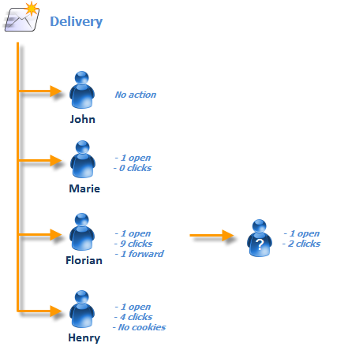

# 人员／人员和收件人 {#person-people-and-recipients}

此范例将帮助您了解Adobe Campaign中的人员／人员与收件人之间的区别。 我们将向几个人发送分发内容，以突出显示人员与收件人之间的差异，同时详细说明以下指标的计算方法：

* **[!UICONTROL Clicks]**
* **[!UICONTROL Distinct clicks for the population reached]**
* **[!UICONTROL Distinct opens for the population reached]**
* **[!UICONTROL Estimation of forwards]**
* **[!UICONTROL Raw reactivity]**

>[!NOTE]
>
>报告中使用这些指 **[!UICONTROL Tracking indicators]** 标。 For more on this, refer to [Tracking indicators](#tracking-indicators).

三个链接会添加到分发中。 它将发送给4个收件人：

* **[!UICONTROL John Davis]** :此收件人不打开电子邮件（因此不单击任何链接）。
* **[!UICONTROL Marie Stuart]** :打开电子邮件，但不单击任何链接。
* **[!UICONTROL Florian David]** :打开电子邮件并单击链接9次。 他还将电子邮件转发给打开电子邮件并点击两次的人。
* **[!UICONTROL Henry Macdonald]** :此收件人已将其Internet浏览器配置为拒绝Cookie。 他打开电子邮件并点击链接4次。

返回以下跟踪日志：

为了更清楚地了解如何计算人员和收件人，我们将分析每个个人资料的日志。

## 第1步：约翰 {#step-1--john}

**[!UICONTROL John Davis]** 不打开电子邮件（因此不单击任何链接）。

由于John既未打开也未点击电子邮件，因此他不会出现在日志中。

**中间计算：**

|  | 单击的收件人 | 点击了 | 打开的收件人 |
|---|---|---|---|
| 约翰 | - | - | - |
| 中间总数 | 0 | 0 | 0 |

## 第2步：玛丽 {#step-2--marie}

**[!UICONTROL Marie Stuart]** 打开电子邮件，但不单击任何链接。

Marie的打开状态显示在以下日志中：

打开的内容会分配给收件人：玛丽。 因此，Adobe Campaign会向计数中添加新收件人。

**中间计算：**

|  | 单击的收件人 | 点击了 | 打开的收件人 |
|---|---|---|---|
| 约翰 | - | - | - |
| 玛丽 | - | - | +1 |
| 中间总数 | 0 | 0 | 1 |

## 第3步：弗洛里安 {#step-3--florian}

**[!UICONTROL Florian David]** 打开电子邮件并单击链接9次。 他还将电子邮件转发给打开电子邮件并点击两次的人。

Florian的操作（一次打开，九次单击）显示在以下日志中：

**收件人**:打开和单击将分配给同一收件人(Florian)。 由于此收件人与上一个(Marie)收件人不同，因此Adobe Campaign会向计数中添加新收件人。

人员：由于此收件人的浏览器接受cookies，因此我们可以看到为所有单击日志分配了相同的标识符(UUID): **`fe37a503 [...]`**. Adobe Campaign会将这些点击正确标识为属于同一人。 新人员将添加到计数中。

**中间计算：**

|  | 单击的收件人 | 点击了 | 打开的收件人 |
|---|---|---|---|
| 约翰 | - | - | - |
| 玛丽 | - | - | +1 |
| 弗洛里安 | +1 | +1 | +1 |
| 中间总数 | 1 | 1 | 2 |

以下日志与Florian将电子邮件转发给的人所进行的打开和两次点击一致：

**收件人**:其打开和单击次数将分配给转发电子邮件的收件人(Florian)。 由于此收件人已计数，因此收件人计数保持不变。

**人员**:关于单击，我们可以看到为所有日志分配了相同的标识符(UUID): **`9ab648f9 [...]`**. 此标识符尚未计数。 因此，新人被添加到计数中。

**中间计算：**

|  | 单击的收件人 | 点击了 | 打开的收件人 |
|---|---|---|---|
| 约翰 | - | - | - |
| 玛丽 | - | - | +1 |
| 弗洛里安 | +1 | +1 | +1 |
| 未知人物 | - | +1 | - |
| 中间总数 | 1 | 2 | 2 |

## 第4步：亨利 {#step-4--henry}

**[!UICONTROL Henry Macdonald]** 已将其Internet浏览器配置为拒绝Cookie。 他打开电子邮件并点击链接4次。

Henry执行的打开和4次单击显示在以下日志中：

**收件人**:打开和单击被分配给同一收件人(Henry)。 由于此收件人尚未计数，Adobe Campaign会向该计数中添加收件人。

**人员**:由于Henry的浏览器不接受cookie，因此每次单击都会生成新标识符(UUID)。 4次点击中的每次都被解释为来自不同的人。 由于这些标识符尚未计数，因此它们被添加到计数中。

**中间计算：**

|  | 单击的收件人 | 点击了 | 打开的收件人 |
|---|---|---|---|
| 约翰 | - | - | - |
| 玛丽 | - | - | +1 |
| 弗洛里安 | +1 | +1 | +1 |
| 未知人物 | - | +1 | - |
| 亨利 | +1 | +4 | +1 |
| 中间总数 | 2 | 6 | 3 |

## 摘要 {#summary}

在交付级别，我们有以下结果：

* **[!UICONTROL Clicks]** （单击的收件人）:2
* **[!UICONTROL Distinct clicks for the population reached]** （被点击的人）:6
* **[!UICONTROL Distinct opens for the population reached]** （已打开的收件人）:3

正向反应性和正向反应性的估算如下：

* **[!UICONTROL Estimation of forwards]** = **B - A** （因此为6 - 2 = 4）
* **[!UICONTROL Raw reactivity]** = **A / C** （因此2 / 3 = 66,67%）

>[!NOTE]
>
>在以下公式中：
>
>* A表示指 **[!UICONTROL Clicks]** 示符（单击的收件人）。
>* B表示指 **[!UICONTROL Distinct clicks for the population reached]** 示符（单击的人员）。
>* C表示指 **[!UICONTROL Distinct opens for the population reached]** 示符（打开的收件人）。