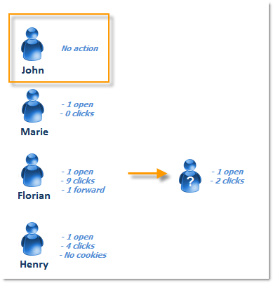
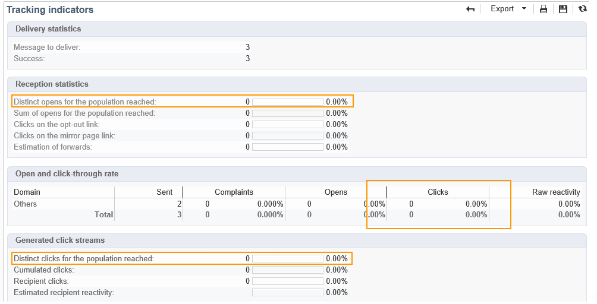
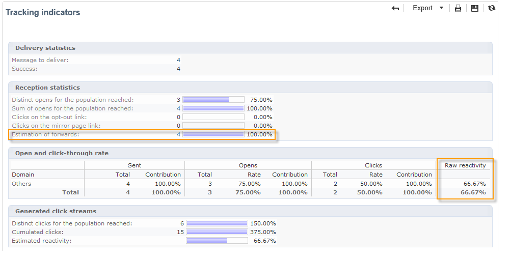

# 人员和收件人 {#person-people-and-recipients}

此示例将帮助您了解Adobe Campaign中人员与收件人之间的区别。 我们将向多个用户发送投放，以突出显示用户与收件人之间的差异，同时详细说明以下指标的计算方法：

* **[!UICONTROL Clicks]**
* **[!UICONTROL Distinct clicks for the population reached]**
* **[!UICONTROL Distinct opens for the population reached]**
* **[!UICONTROL Estimation of forwards]**
* **[!UICONTROL Raw reactivity]**

>[!NOTE]
>
>这些指标用于 **[!UICONTROL Tracking indicators]** 报告。 有关详细信息，请参见 [跟踪指标](../../reporting/using/delivery-reports.md#tracking-indicators).

三个链接将会添加到投放中。 它将发送给4个收件人：

* **[!UICONTROL John Davis]** ：此收件人未打开电子邮件（因此不会单击任何链接）。
* **[!UICONTROL Marie Stuart]** ：打开电子邮件，但不单击任何链接。
* **[!UICONTROL Florian David]** ：打开电子邮件并单击链接9次。 他还将电子邮件转发给打开并点击两次的人。
* **[!UICONTROL Henry Macdonald]** ：此收件人已将其Internet浏览器配置为拒绝Cookie。 他打开电子邮件并单击链接4次。

将返回以下跟踪日志：

为了更清楚地了解人员和收件人的计数方式，我们将分析每个用户档案的日志。

## 步骤1：John {#step-1--john}

**[!UICONTROL John Davis]** 不会打开电子邮件（因此不会单击任何链接）。

由于John既未打开也未单击电子邮件，因此未出现在日志中。

**中间计算：**

|   | 点击的收件人 | 点击的人员 | 已打开的收件人 |
|---|---|---|---|
| John | - | - | - |
| 中间总计 | 0 | 0 | 0 |

## 步骤2：玛丽 {#step-2--marie}

**[!UICONTROL Marie Stuart]** 打开电子邮件，但不单击任何链接。

Marie&#39;s open显示在以下日志中：

打开项分配给收件人：Marie。 因此，Adobe Campaign会向计数中添加一个新收件人。

**中间计算：**

|   | 点击的收件人 | 点击的人员 | 已打开的收件人 |
|---|---|---|---|
| John | - | - | - |
| 玛丽 | - | - | +1 |
| 中间总计 | 0 | 0 | 1 |

## 步骤3：弗洛里安 {#step-3--florian}

**[!UICONTROL Florian David]** 打开电子邮件并单击链接9次。 他还将电子邮件转发给打开并点击两次的人。

Florian的操作（一次打开和九次点击）显示在以下日志中：

**收件人**：打开和点击量分配给同一收件人(Florian)。 由于此收件人与之前的收件人(Marie)不同，因此Adobe Campaign会向此计数中添加一个新收件人。

人员：由于此收件人的浏览器接受Cookie，因此我们可以看到相同的标识符(UUID)被分配到所有点击日志： **`fe37a503 [...]`**. Adobe Campaign可正确地将这些点击识别为属于同一个人。 新人员将添加到该计数中。

**中间计算：**

|   | 点击的收件人 | 点击的人员 | 已打开的收件人 |
|---|---|---|---|
| John | - | - | - |
| 玛丽 | - | - | +1 |
| 弗洛里安 | +1 | +1 | +1 |
| 中间总计 | 1 | 1 | 2 |

以下日志与Florian转发电子邮件给的用户进行的打开和两次点击一致：

**收件人**：其打开次数和点击次数会分配给转发电子邮件的收件人(Florian)。 由于此收件人已被计数，因此收件人计数将保持不变。

**人员**：关于点击量，我们可以看到相同的标识符(UUID)被分配给所有日志： **`9ab648f9 [...]`**. 此标识符尚未被计数。 因此，将新人员添加到该计数中。

**中间计算：**

|   | 点击的收件人 | 点击的人员 | 已打开的收件人 |
|---|---|---|---|
| John | - | - | - |
| 玛丽 | - | - | +1 |
| 弗洛里安 | +1 | +1 | +1 |
| 未知人员 | - | +1 | - |
| 中间总计 | 1 | 2 | 2 |

## 步骤4：亨利 {#step-4--henry}

**[!UICONTROL Henry Macdonald]** 已将其互联网浏览器配置为拒绝Cookie。 他打开电子邮件并单击链接4次。

Henry执行的打开和4次点击显示在以下日志中：

**收件人**：打开和点击量会分配给同一收件人(Henry)。 由于此收件人尚未被计数，因此Adobe Campaign会向计数中添加一个收件人。

**人员**：由于Henry的浏览器不接受Cookie，因此每次点击都会生成一个新的标识符(UUID)。 这4次点击中的每一次都解释为来自不同人员。 由于这些标识符尚未被计数，因此将添加到计数中。

**中间计算：**

|   | 点击的收件人 | 点击的人员 | 已打开的收件人 |
|---|---|---|---|
| John | - | - | - |
| 玛丽 | - | - | +1 |
| 弗洛里安 | +1 | +1 | +1 |
| 未知人员 | - | +1 | - |
| 亨利 | +1 | +4 | +1 |
| 中间总计 | 2 | 6 | 3 |

## 摘要 {#summary}

在投放级别，我们有以下结果：

* **[!UICONTROL Clicks]** （点击的收件人）：2
* **[!UICONTROL Distinct clicks for the population reached]** （点击的人）：6
* **[!UICONTROL Distinct opens for the population reached]** （已打开的收件人）：3

转发的原始反应性和估计值计算如下：

* **[!UICONTROL Estimation of forwards]** = **B - A** （因此，6 - 2 = 4）
* **[!UICONTROL Raw reactivity]** = **A/C** （因此，2 / 3 = 66,67%）

>[!NOTE]
>
>在以下公式中：
>
>* 表示 **[!UICONTROL Clicks]** 标识符（点击的收件人）。
>* B代表 **[!UICONTROL Distinct clicks for the population reached]** 指示器（点击的人员）。
>* C表示 **[!UICONTROL Distinct opens for the population reached]** 指示器（已打开的收件人）。
