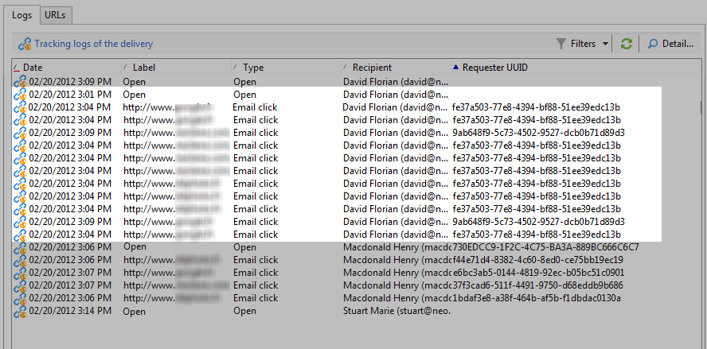

# 人员和收件人 {#person-people-and-recipients}

此示例将帮助您了解个人/人与收件人在Adobe Campaign中的区别。 我们将向多个人发送投放，以突出显示人与收件人之间的差异，同时详细说明以下指标的计算方法：

* **[!UICONTROL Clicks]**
* **[!UICONTROL Distinct clicks for the population reached]**
* **[!UICONTROL Distinct opens for the population reached]**
* **[!UICONTROL Estimation of forwards]**
* **[!UICONTROL Raw reactivity]**

>[!NOTE]
>
>这些指示器用于&#x200B;**[!UICONTROL Tracking indicators]**&#x200B;报告。 有关详细信息，请参阅[跟踪指示器](../../reporting/using/delivery-reports.md#tracking-indicators)。

三个链接会添加到投放。 它发送给4个收件人:

* **[!UICONTROL John Davis]** :此收件人不会打开电子邮件（因此不会单击任何链接）。
* **[!UICONTROL Marie Stuart]** :打开电子邮件，但不单击任何链接。
* **[!UICONTROL Florian David]** :打开电子邮件并单击链接9次。他还会将邮件转发给打开后点击两次的人。
* **[!UICONTROL Henry Macdonald]** :此收件人已配置其Internet浏览器以拒绝Cookie。他打开电子邮件并点击链接4次。

将返回以下跟踪日志:

为了更清楚地了解人和收件人的计数方式，我们将分析每个用户档案的日志。

## 第1步：John {#step-1--john}

**[!UICONTROL John Davis]** 不打开电子邮件（因此不单击任何链接）。

由于John既未打开也未点击电子邮件，因此他不会显示在日志中。

**中间计算：**

|  | 收件人 | 点击了 | 收件人 |
|---|---|---|---|
| 约翰 | - | - | - |
| 中级总数 | 0 | 0 | 0 |

## 第2步：玛丽{#step-2--marie}

**[!UICONTROL Marie Stuart]** 打开电子邮件，但不单击任何链接。

Marie的打开状态显示在以下日志中：

此打开被分配给收件人:玛丽。 Adobe Campaign因此向计数中添加新收件人。

**中间计算：**

|  | 收件人 | 点击了 | 收件人 |
|---|---|---|---|
| 约翰 | - | - | - |
| 玛丽 | - | - | +1 |
| 中级总数 | 0 | 0 | 1 |

## 第3步：弗洛里安{#step-3--florian}

**[!UICONTROL Florian David]** 打开电子邮件并单击链接9次。他还会将邮件转发给打开后点击两次的人。

Florian的操作（一次打开，9次单击）显示在以下日志中：

**收件人**:打开和单击将分配给同一收件人(Florian)。由于此收件人与上一个(Marie)不同，Adobe Campaign会向计数中添加新收件人。

人物：由于此收件人的浏览器接受Cookie，因此我们可以看到为所有单击日志分配了相同的标识符(UUID):**`fe37a503 [...]`**。 Adobe Campaign正确地将这些点击识别为属于同一人。 新人将添加到计数中。

**中间计算：**

|  | 收件人 | 点击了 | 收件人 |
|---|---|---|---|
| 约翰 | - | - | - |
| 玛丽 | - | - | +1 |
| 弗洛里安 | +1 | +1 | +1 |
| 中级总数 | 3 | 3 | 2 |

以下日志与Florian将电子邮件转发给的人所进行的打开和两次点击相吻合：

**收件人**:其打开和点击将分配给转发电子邮件的收件人(Florian)。由于此收件人已被计数，因此收件人计数保持不变。

**人**:关于单击，我们可以看到同一标识符(UUID)被分配给所有日志： **`9ab648f9 [...]`**.此标识符尚未计数。 因此，新人被添加到计数中。

**中间计算：**

|  | 收件人 | 点击了 | 收件人 |
|---|---|---|---|
| 约翰 | - | - | - |
| 玛丽 | - | - | +1 |
| 弗洛里安 | +1 | +1 | +1 |
| 未知人物 | - | +1 | - |
| 中级总数 | 1 | 2 | 2 |

## 第4步：亨利{#step-4--henry}

**[!UICONTROL Henry Macdonald]** 已将其Internet浏览器配置为拒绝Cookie。他打开电子邮件并点击链接4次。

Henry所执行的打开和4次单击显示在以下日志中：

**收件人**:打开和单击被分配到同一收件人(Henry)。由于此收件人尚未计数，Adobe Campaign会向计数中添加收件人。

**人**:由于Henry的浏览器不接受Cookie，因此每次单击都会生成新的标识符(UUID)。4次点击中的每一次都被解释为来自不同人。 由于这些标识符尚未计数，因此将添加到计数中。

**中间计算：**

|  | 收件人 | 点击了 | 收件人 |
|---|---|---|---|
| 约翰 | - | - | - |
| 玛丽 | - | - | +1 |
| 弗洛里安 | +1 | +1 | +1 |
| 未知人物 | - | +1 | - |
| 亨利 | +1 | +4 | +1 |
| 中级总数 | 2 | 6 | 3 |

## 摘要{#summary}

在投放层面，我们有以下成果：

* **[!UICONTROL Clicks]** (已点击的收件人):2
* **[!UICONTROL Distinct clicks for the population reached]** （点击者）：6
* **[!UICONTROL Distinct opens for the population reached]** (打开的收件人):3

计算结果如下：

* **[!UICONTROL Estimation of forwards]** =  **B - A** （因此6 - 2 = 4）
* **[!UICONTROL Raw reactivity]** =  **A / C** （因此2 / 3 = 66,67%）

>[!NOTE]
>
>在以下公式中：
>
>* A表示&#x200B;**[!UICONTROL Clicks]**&#x200B;指示符(单击的收件人)。
>* B表示&#x200B;**[!UICONTROL Distinct clicks for the population reached]**&#x200B;指示符（单击的人）。
>* C表示&#x200B;**[!UICONTROL Distinct opens for the population reached]**&#x200B;指示符(打开的收件人)。