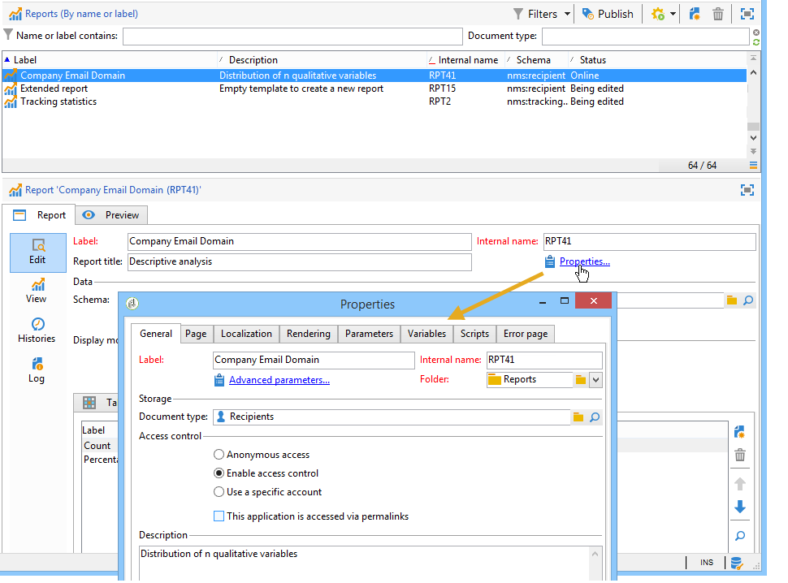
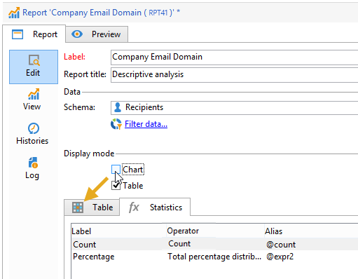
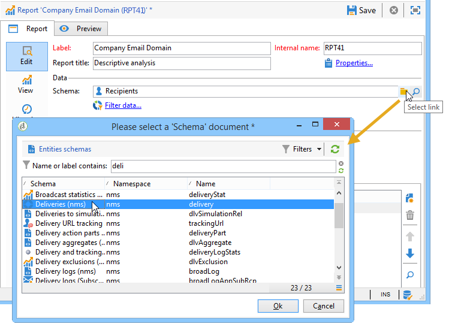
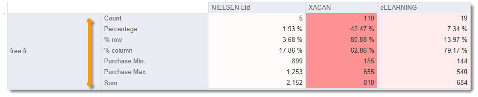
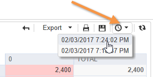

# 使用分析报表{#processing-a-report}

## 保存分析报表 {#saving-an-analysis-report}

如果您具有相应权限，则可以保存从模板创建的分析报表，或将其导出为Excel、OpenOffice或PDF格式。

要保存报表，请单击 **[!UICONTROL Save]** 给报表贴个标签。

选择 **[!UICONTROL Also save data]** 如果要创建报表的历史记录，并在保存时查看报表的值。 有关更多信息，请参阅 [存档分析报表](#archiving-analysis-reports).

的 **[!UICONTROL Share this report]** 选项允许其他运算符访问报表。

保存后，可以重新使用此报表生成其他分析报表：

要更改此报表，请编辑 **[!UICONTROL Administration > Configuration > Adobe Campaign tree reports]** “Adobe Campaign”树的节点（或操作员具有编辑权限的第一个“报表”类型文件夹）。 有关更多信息，请参阅 [配置描述性分析报表的布局](#configuring-the-layout-of-a-descriptive-analysis-report).

## 分析报告其他设置 {#analysis-report-additional-settings}

保存描述性分析报表后，您可以编辑其属性并访问其他选项。

这些选项与标准报表相同，详情请参阅 [本页](../../reporting/using/properties-of-the-report.md).

## 配置描述性分析报表的布局 {#configuring-the-layout-of-a-descriptive-analysis-report}

您可以在描述性分析的图表和表格中个性化数据的显示和布局。 所有选项均可通过Adobe Campaign树(位于 **[!UICONTROL Edit]** 选项卡。

### 分析报表显示模式 {#analysis-report-display-mode}

使用 **[!UICONTROL qualitative distribution]** 默认情况下会选择模板、表格和图表显示模式。 如果您只想要一种显示模式，请取消选中相应的框。 这意味着只有选定显示模式的选项卡可用。

要更改报表的架构，请单击 **[!UICONTROL Select the link]** 并从数据库中选择另一个表。

### 分析报表显示设置 {#analysis-report-display-settings}

可以隐藏或显示统计信息和子总计，并选择统计信息的方向。

在创建统计信息时，您可以对其标签进行个性化设置。

其名称将显示在报表中。

但是，如果取消选中标签和子总计显示选项，则它们将不会显示在报表中。 当您将鼠标悬停在表格的单元格上时，该名称将显示在工具提示中。

默认情况下，统计信息会联机显示。 要更改方向，请从下拉列表中选择相应的选项。

在以下示例中，统计信息显示在列中。

### 分析报表数据布局 {#analysis-report-data-layout}

您可以直接在描述性分析表中个性化数据布局。 为此，请右键单击要处理的变量。 从下拉菜单中选择可用的选项：

* **[!UICONTROL Pivot]** 更改变量的轴。
* **[!UICONTROL Up]** / **[!UICONTROL Down]** 换行变量。
* **[!UICONTROL Move to the right]** / **[!UICONTROL Move to the left]** 以交换列中的变量。
* **[!UICONTROL Turn]** 来反转变量轴。
* **[!UICONTROL Sort from A to Z]** 将变量值排序为低到高。
* **[!UICONTROL Sort from Z to A]** 将变量值排序为高到低。

   

要返回到初始显示，请刷新视图。

### 分析报表图表选项 {#analysis-report-chart-options}

可以将图表中数据的显示个性化。 为此，请单击 **[!UICONTROL Variables...]** 在图表类型选择阶段可用的链接。

可以使用以下选项：

* 利用窗口的上部，可修改图表显示区域。
* 默认情况下，标签会显示在图表中。 您可以通过取消选中 **[!UICONTROL Show values]** 选项。
* 的 **[!UICONTROL Accumulate values]** 选项可将值从一个系列添加到另一个系列。
* 您可以决定是否显示图表图例：要隐藏该选项，请取消选中相应的选项。 默认情况下，图例显示在右上角的图表外部。

   图例还可以显示在图表顶部，以节省显示空间。 要执行此操作，请选择选项 **[!UICONTROL Include in the chart]**

   在 **[!UICONTROL Caption position]** 下拉列表。

   

## 导出分析报表 {#exporting-an-analysis-report}

要从分析报表导出数据，请单击下拉列表，然后选择所需的输出格式。

有关详细信息，请参见[此页面](../../reporting/using/actions-on-reports.md)。

## 重复使用现有报告和分析 {#re-using-existing-reports-and-analyses}

您可以使用已存储在Adobe Campaign中的现有报表创建数据的描述性分析报表。 在保存分析或创建并配置报表以通过描述性分析向导访问时，可以使用此模式。

要了解如何保存描述性分析，请参阅 [保存分析报表](#saving-an-analysis-report).

要创建描述性分析报表，必须通过工作流过渡或 **[!UICONTROL Tools > Descriptive analysis]** 菜单。

1. 选择 **[!UICONTROL Existing analyses and reports]** 并单击 **[!UICONTROL Next]**。
1. 这可让您访问可用报表的列表。 选择要生成的报表。

   

## 存档分析报表 {#archiving-analysis-reports}

在基于现有分析创建描述性分析时，可以创建存档以存储数据和比较报表结果。

要创建历史记录，请应用以下步骤：

1. 打开现有分析或创建新的描述性分析向导。
1. 在报表显示页面中，单击按钮以在工具栏中创建历史记录，然后按如下所示进行确认：

   

1. 使用存档访问按钮可显示以前的分析。

   
