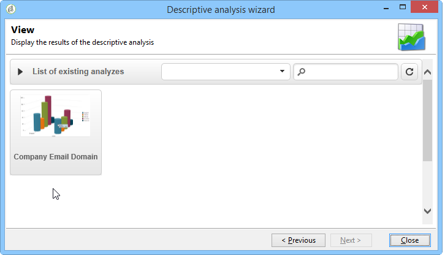

# 使用分析报告{#processing-a-report}

## 保存分析报告 {#saving-an-analysis-report}

如果您具有相应权限，则可以保存从模板创建的分析报告，或以Excel、PDF或OpenOffice格式导出该报告。

要保存报表，请单 **[!UICONTROL Save]** 击并为报表添加标签。

如 **[!UICONTROL Also save data]** 果要创建报表的历史记录，请选择并查看保存时报表的值。 有关此内容的详细信息，请参 [阅存档分析报告](#archiving-analysis-reports)。

该选 **[!UICONTROL Share this report]** 项允许其他运算符访问报告。

保存后，可以重新使用此报告生成其他分析报告：

要更改此报表，请编辑Adobe Campaign **[!UICONTROL Administration > Configuration > Adobe Campaign tree reports]** 树的节点（或操作员具有编辑权限的第一个“报表”类型文件夹）。 有关详细信息，请参 [阅配置描述性分析报表的布局](#configuring-the-layout-of-a-descriptive-analysis-report)。

## 分析报告其他设置 {#analysis-report-additional-settings}

保存描述性分析报告后，您可以编辑其属性并访问其他选项。

这些选项与标准报表相同，并在本页 [中详细介绍](../../reporting/using/properties-of-the-report.md)。

## 配置描述性分析报表的布局 {#configuring-the-layout-of-a-descriptive-analysis-report}

您可以在描述性分析的图表和表中个性化数据的显示和布局。 所有选项均通过Adobe Campaign树访问，该树位于 **[!UICONTROL Edit]** 每个报告的选项卡中。

### 分析报告显示模式 {#analysis-report-display-mode}

使用模板创建报告时， **[!UICONTROL qualitative distribution]** 默认情况下会选择表和图表显示模式。 如果只需要一种显示模式，请取消选中相应的框。 这意味着只有选中显示模式的选项卡才可用。

要更改报表的模式，请单击该， **[!UICONTROL Select the link]** 然后从数据库中选择另一个表。

### 分析报告显示设置 {#analysis-report-display-settings}

可以隐藏或显示统计信息和子合计，也可以选择统计信息的方向。

创建统计信息时，您可以个性化其标签。

其名称将显示在报告中。

但是，如果取消选中标签和子合计显示选项，则它们将不会显示在报告中。 当您将鼠标悬停在表的单元格上时，该名称将显示在工具提示中。

默认情况下，统计信息联机显示。 要更改方向，请从下拉列表中选择相应的选项。

在以下示例中，统计信息显示在列中。

### 分析报告数据布局 {#analysis-report-data-layout}

您可以直接在描述性分析表中个性化数据布局。 为此，请右键单击要处理的变量。 从下拉菜单中选择可用的选项：

* **[!UICONTROL Pivot]** 更改变量的轴。
* **[!UICONTROL Up]** / **[!UICONTROL Down]** 换行中的变量。
* **[!UICONTROL Move to the right]** / **[!UICONTROL Move to the left]** 以交换列中的变量。
* **[!UICONTROL Turn]** 来反转变量轴。
* **[!UICONTROL Sort from A to Z]** 将变量值排序为“低”到“高”。
* **[!UICONTROL Sort from Z to A]** 将变量值从高到低排序。

   

要返回到初始显示，请刷新视图。

### 分析报表图表选项 {#analysis-report-chart-options}

可以个性化图表中的数据显示。 为此，请单击在图 **[!UICONTROL Variables...]** 表类型选择阶段可用的链接。

可以使用以下选项：

* 窗口的上半部分允许您修改图表显示区域。
* 默认情况下，标签显示在图表中。 您可以通过取消选中选项来隐藏 **[!UICONTROL Show values]** 它们。
* 通过 **[!UICONTROL Accumulate values]** 此选项，您可以将一个系列的值累加到另一个系列。
* 您可以决定是否显示图表图例：要隐藏它，请取消选中相应的选项。 默认情况下，图例显示在图表外的右上角。

   图例还可显示在图表顶部，以节省显示空间。 To do this, select the option **[!UICONTROL Include in the chart]**

   在下拉列表中选择垂直和 **[!UICONTROL Caption position]** 水平对齐方式。

   

## 导出分析报告 {#exporting-an-analysis-report}

要从分析报告中导出数据，请单击下拉列表并选择所需的输出格式。

有关详细信息，请参见[此页面](../../reporting/using/actions-on-reports.md)。

## 重新使用现有报告和分析 {#re-using-existing-reports-and-analyses}

您可以使用已存储在Adobe Campaign中的现有报表创建描述性分析报告。 当分析已保存或已创建并配置为通过描述性分析向导访问报告时，可以使用此模式。

要了解如何保存描述性分析，请参阅 [保存分析报告](#saving-an-analysis-report)。

要创建描述性分析报告，必须通过工作流过渡或菜单执行描述性分析 **[!UICONTROL Tools > Descriptive analysis]** 向导。

1. 选择 **[!UICONTROL Existing analyses and reports]** 并单击 **[!UICONTROL Next]**。
1. 这样，您就可以访问可用报告的列表。 选择要生成的报表。

   

## 存档分析报告 {#archiving-analysis-reports}

根据现有分析创建描述性分析时，可以创建存档以存储数据并比较报告结果。

要创建历史记录，请应用以下步骤：

1. 打开现有分析或创建新的描述性分析向导。
1. 在报表显示页面中，单击按钮以在工具栏中创建历史记录，然后进行确认，如下所示：

   

1. 使用存档访问按钮可显示以前的分析。

   

