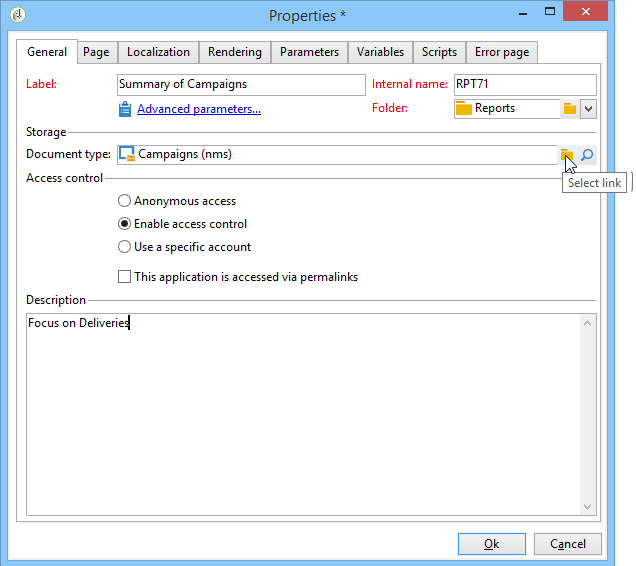

# 报告的属性{#properties-of-the-report}

您可以完全个性化并配置报表，以满足您的需求。 为此，请编辑其属性。 通过 **[!UICONTROL Properties]** 按钮。

常规属性描述如下。 在 **[!UICONTROL Parameters]**, **[!UICONTROL Variables]** 和 **[!UICONTROL Scripts]** 选项卡的描述 [在此部分中](../../reporting/using/advanced-functionalities.md).

## 常规属性 {#overall-properties}

在 **[!UICONTROL General]** 选项卡，您可以编辑下面列出的设置：

* 报表的标签和内部名称。 的 **[!UICONTROL Internal name]** 在报表最终URL中使用。 在创建报告后，不应更改该设置。

* 报表 **文件夹** 在报表创建期间被选中。 最佳做法是为自定义报表创建专用文件夹，以便它们不会与 [内置报告](../../reporting/using/about-campaign-built-in-reports.md).

* 的 **存储** ，在创建报告时将处于选中状态。 要更改报表的数据表，请单击 **[!UICONTROL Select link]** 图标 **[!UICONTROL Document type]** 字段。

   

* 的 **访问控制** 参数。 以下介绍了这些设置。

## 控制对报告的访问 {#report-accessibility}

可以在Adobe Campaign控制台中或通过Web浏览器访问报表。 在这种情况下，可能需要配置如下所示的报表访问控制。

可能的选项包括：

* **[!UICONTROL Anonymous access]**:此选项允许不受限制地访问报表。 但是，不可能操纵。

   “webapp”技术操作员的权限用于显示报表元素。 了解更多 [在此部分中](../../platform/using/access-management-operators.md).

* **[!UICONTROL Access control]**:此选项允许Adobe Campaign运算符在登录后访问它。
* **[!UICONTROL Specific account]**:利用此选项，可在 **[!UICONTROL Operator]** 字段。

## 管理报表本地化 {#managing-report-localization}

您可以配置希望将报表翻译成的语言。 为此，请单击 **[!UICONTROL Localization]** 选项卡。

编辑语言是您所用的语言。 添加语言时，子选项卡会显示在报表编辑页面中。

>[!NOTE]
>
>有关Campaign中网页本地化的更多信息，请参阅 [此部分](../../web/using/translating-a-web-form.md).

## 个性化HTML渲染 {#personalizing-html-rendering}

在 **[!UICONTROL Rendering]** 选项卡，则可以个性化页面的数据显示模式。 您可以选择：

* 报表中的导航类型：按钮或链接。
* 报表元素的标签的默认位置。 此位置可为每个元素进行重载。
* 用于生成报表页面的模板或主题。

## 个性化错误页面 {#personalizing-the-error-page}

的 **[!UICONTROL Error page]** 选项卡，用于配置在报表显示出错时显示的消息。

您可以定义文本并将其链接到特定标识符以管理报表本地化。 有关更多信息，请参阅 [添加页眉和页脚](../../reporting/using/element-layout.md#adding-a-header-and-a-footer).

