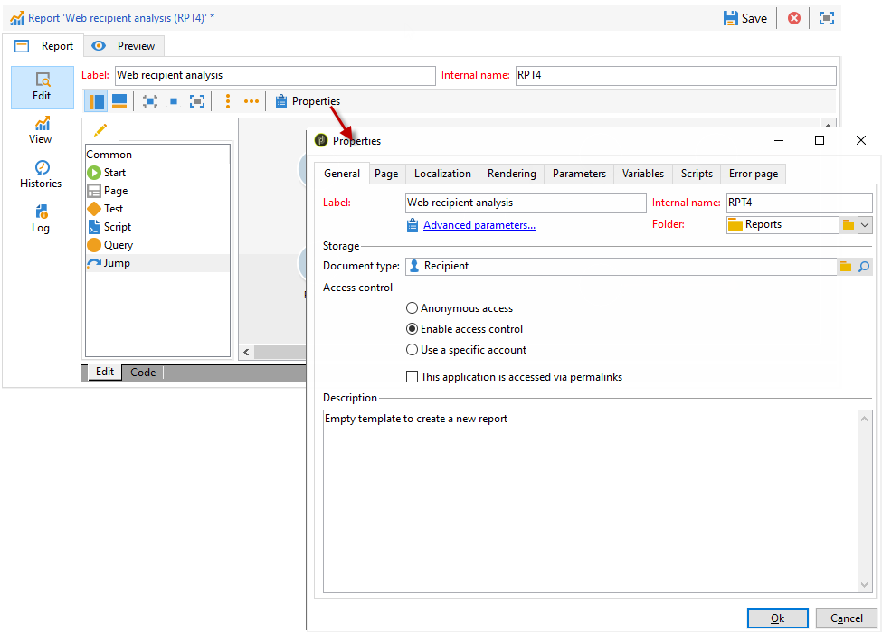

# 报告的属性{#properties-of-the-report}

## 概述 {#overview}

您可以完全个性化和配置报告，以满足您的需求。 为此，请编辑其属性。 报表属性通过活动序列图上方的属性按钮进行访问。

## 总体属性 {#overall-properties}

通 **[!UICONTROL General]** 过选项卡，您可以视图或更改报表所关注的标签和模式。 这些元素是在创建报表时输入的。

我们不建议更改 **[!UICONTROL Internal name]** :这在报表访问URL中使用。

报表模板在报表创建过程中处于选中状态，以后无法更改。

要更改报表所关注的表，请单 **[!UICONTROL Select link]** 击字段右侧的图 **[!UICONTROL Document type]** 标。 要视图选定表格中的可用字段，请单击 **[!UICONTROL Magnifier]** 图标。

## 报告辅助功能 {#report-accessibility}

报告可以在Adobe Campaign控制台之外访问，例如通过Web浏览器访问。 在这种情况下，可以需要配置报告访问控制，如下所示。

总体原则是：

* 该选 **[!UICONTROL Anonymous access]** 项允许不受限制地访问报表。 但是，不可能进行任何操纵。

   默认(“webapp”)报表运算符的权限用于显示报表元素。

* 该选 **[!UICONTROL Access control]** 项允许Adobe Campaign操作员在登录后访问它。
* 通过 **[!UICONTROL Specific account]** 此选项，您可以在字段中选择操作员的权限后执行报 **[!UICONTROL Operator]** 告。

本页详细介绍了Web [表单属性](../../web/using/about-web-forms.md)。

## 管理报告本地化 {#managing-report-localization}

您可以配置要将报表翻译为的语言。 为此，请单击选 **[!UICONTROL Localization]** 项卡。

编辑语言是您编写的语言。 添加语言时，报表编辑页面中将显示子选项卡。

>[!NOTE]
>
>有关此内容的详细信息，请参阅本部分的相 [应部分](../../web/using/translating-a-web-form.md)。

## 个性化HTML渲染 {#personalizing-html-rendering}

在选项卡 **[!UICONTROL Rendering]** 中，您可以个性化页面的数据显示模式。 您可以选择：

* 图表渲染引擎：Adobe Campaign优惠两种不同的模式来生成图表渲染。 默认情况下，渲染引擎为HTML 5。 如有必要，可以选择Flash渲染。
* 报告中的导航类型：按钮或链接。
* 报表元素标签的默认位置。 此位置可以为每个元素重载。
* 用于生成报表页面的模板或主题。

本页详细介绍了Web [表单属性](../../web/using/about-web-forms.md)。

## 定义其他设置 {#defining-additional-settings}

在选 **[!UICONTROL Parameters]** 项卡中，您可以为报表创建其他设置：这些设置将在调用期间传递到URL。

本页详细介绍了Web [表单属性](../../web/using/about-web-forms.md)。

>[!CAUTION]
>
>出于安全原因，必须谨慎使用这些参数。

要创建新设置，请执行以下操作：

1. 单击按 **[!UICONTROL Add]** 钮并输入设置的名称。

   

1. 如有必要，请指定设置是否为必需设置。
1. Select the type of setting you want to create: **[!UICONTROL Filter]** or **[!UICONTROL Variable]**.

   该 **[!UICONTROL Filter entities]** 选项允许您使用数据库的字段作为参数。

   

   数据直接在实体级别恢复： **ctx/收件人/@account**。

   通过 **[!UICONTROL Variable]** 此选项，可创建或选择一个变量，该变量将作为URL的参数进行传递，并可用于过滤器。

使 **[!UICONTROL Response HTTP headers]** 用iframe将报表页面包含在HTML页面中时，可防止点击劫持。 要避免点击劫持，您可以选择 **[!UICONTROL X-Frame-options header]** 行为：

* **[!UICONTROL None]**:报告没有 **[!UICONTROL X-Frame-options header]**。
* **[!UICONTROL Same as origin]**:默认情况下，为新报表和重新发布的报表设置。 主机名与报告的URL相同。
* **[!UICONTROL Deny]**:无法使用iframe将报告包含在HTML页面中。

## 添加变量 {#adding-variables}

该选 **[!UICONTROL Variables]** 项卡包含在报表中配置的变量列表。 这些变量会在报表的上下文中显示，并可用于计算。

单击按 **[!UICONTROL Add]** 钮以创建新变量。

要视图变量的定义，请选择该变量，然后单击 **[!UICONTROL Detail...]** 按钮。

## 引用脚本 {#referencing-scripts}

该 **[!UICONTROL Scripts]** 选项卡允许您引用将在调用报告页时在客户端和／或服务器端执行的JavaScript代码。

要在客户端正常执行，引用的脚本必须用JavaScript编写，并且需要与大多数浏览器兼容。 如需详细信息，请参阅[此部分](../../web/using/web-forms-answers.md)。

## 个性化错误页面 {#personalizing-the-error-page}

通过 **[!UICONTROL Error page]** 该选项卡，可以配置报告显示出错时将显示的消息。

您可以定义文本并将其链接到特定标识符以管理报告本地化。 有关此内容的详细信息， [请参阅添加页眉和页脚](../../reporting/using/element-layout.md#adding-a-header-and-a-footer)。

