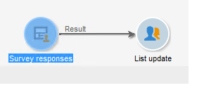
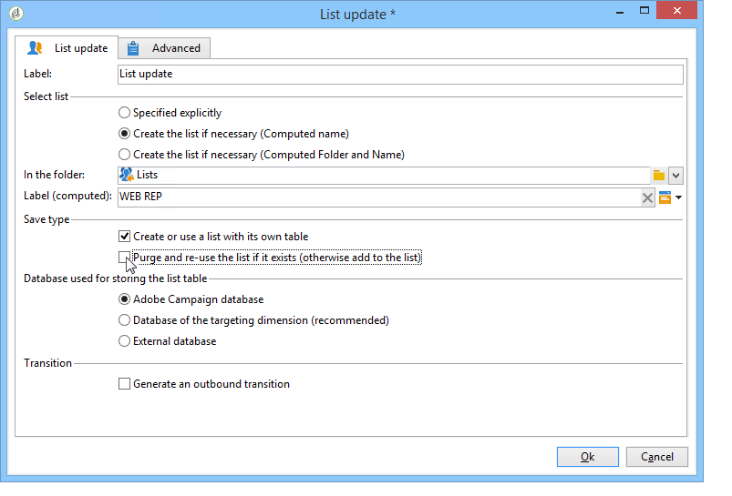

# 用例：显示在线调查的答案报告{#use-case-displaying-report-on-answers-to-an-online-survey}

可以使用专门的报告收集和分析Adobe Campaign调查的答案。

在以下示例中，我们希望收集在线调查的回答并将其显示在数据透视表中

应用以下步骤：

1. 创建工作流以恢复调查答案并将其存储在列表中。
1. 使用列表中的数据创建多维数据集。
1. 使用数据透视表创建报表并查看答案的细分。

在开始使用此用例之前，您需要有权访问调查以及可分析的一组答案。

>[!NOTE]
>
>只有在您获得 **调查管理器** 选项。 请核实您的许可协议。

## 步骤1 — 创建数据收集和存储工作流 {#step-1---creating-the-data-collection-and-storage-workflow}

要收集调查的答案，请应用以下步骤：

1. 创建工作流并放置 **[!UICONTROL Answers to a survey]** 活动。 有关使用此活动的更多信息，请参阅 [本节](../../surveys/using/publish--track-and-use-collected-data.md#using-the-collected-data).
1. 编辑活动并选择要分析其答案的调查。
1. 启用 **[!UICONTROL Select all the answer data]** 用于收集所有信息的选项。

   

1. 选择要提取的列（在本例中：选择：所有已存档字段）。 这些是包含答案的字段。

   

1. 配置应答收集框后，将 **[!UICONTROL List update]** 键入activity以保存数据。

   

   在此活动中，指定要更新的列表并取消选中 **[!UICONTROL Purge and re-use the list if it exists (otherwise add to the list)]** 选项：向现有表添加答案。 此选项将允许您引用多维数据集中的列表。 每次更新都不会重新生成链接到列表的架构，这保证了使用此列表的多维数据集的完整性。

   

1. 启动工作流以确认其配置。

   

   将创建指定的列表，该列表包含调查答案的架构。

1. 添加调度程序以自动每日收集答案并更新列表。

   此 **[!UICONTROL List update]** 和 **[!UICONTROL Scheduler]** 有关活动的详情，请参阅。

## 步骤2 — 创建多维数据集、其度量及其指示器 {#step-2---creating-the-cube--its-measures-and-its-indicators}

然后，可以创建立方并配置其度量：它们将用于创建将在报告中显示的指示器。 有关创建和配置多维数据集的更多信息，请参阅 [关于多维数据集](../../reporting/using/ac-cubes.md).

在本例中，多维数据集基于先前创建的工作流馈送的列表中的数据。

定义要在报告中显示的维度和度量。 在这里，我们要显示合同日期和被申请人的国家/地区。

此 **[!UICONTROL Preview]** 选项卡允许您控制报告的呈现。

## 第3步 — 创建报表并配置表中的数据布局 {#step-3---creating-the-report-and-configuring-the-data-layout-within-the-table}

然后，您可以基于此多维数据集创建报告，并处理数据和信息。

根据您的需求调整信息以显示。

