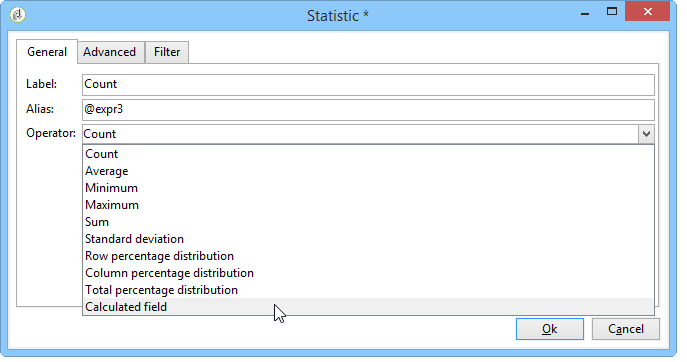

# 用例{#use-cases}

## 分析人口 {#analyzing-a-population}

以下示例使用描述性分析向导来浏览一组新闻稿所针对的人群。

实施步骤详见下文，而本章的其他部分提供了选项和说明的详尽列表。

### 确定要分析的人群 {#identifying-the-population-to-analyze}

在此示例中，我们希望了解Newsletters文件夹中包含的分发的目标 **数量** 。

为此，请选择相关的提交，然后右键单击并选择 **[!UICONTROL Action > Explore the target...]**。


### 选择分析类型 {#selecting-a-type-of-analysis}

在助手的第一步中，您可以选择要使用的描述性分析模板。 默认情况下，Adobe Campaign提供两个模板： **[!UICONTROL Qualitative distribution]** 和 **[!UICONTROL Quantitative distribution]**。 有关详细信息，请参阅配 [置定性分发模板一节](../../reporting/using/using-the-descriptive-analysis-wizard.md#configuring-the-qualitative-distribution-template) 。 “关于描述性分析”(About descriptive [analysis](../../reporting/using/about-descriptive-analysis.md) )部分中显示了各种渲染。

在此示例中，选择模 **[!UICONTROL Qualitative distribution]** 板，然后选择一个包含图表和表（数组）的显示屏。 为报告命名（“描述性分析”），然后单击 **[!UICONTROL Next]**。


### 选择要显示的变量 {#selecting-the-variables-to-display}

通过下一步，您可以选择要在表中显示的数据。

单击链 **[!UICONTROL Add...]** 接以选择包含要显示的数据的变量。 在此，我们希望在一行中显示送货收件人所在的城市：


这些列将显示每家公司的购买次数。 在此示例中，金额在 **Web购买字段中汇总** 。

在此，我们要定义结果绑定以阐明其显示。 为此，请选择绑定选 **[!UICONTROL Manual]** 项并设置要显示的区段的计算类：


然后，单 **[!UICONTROL Ok]** 击以批准配置。

定义线条和列后，可以使用工具栏更改、移动或删除它们。


### 定义显示格式 {#defining-the-display-format}

在向导的下一步中，您可以选择要生成的图表类型。

在这种情况下，请选择直方图。


不同图形的可能配置在“分析”报告图表选项 [部分中有详细说明](../../reporting/using/processing-a-report.md#analysis-report-chart-options) 。

### 配置统计以计算 {#configuring-the-statistic-to-calculate}

然后指定要应用于收集数据的计算。 默认情况下，描述性分析向导执行简单的值计数。

通过此窗口可定义要计算的统计信息列表。


要创建新统计信息，请单击该 **[!UICONTROL Add]** 按钮。 For more on this, refer to [Statistics calculation](../../reporting/using/using-the-descriptive-analysis-wizard.md#statistics-calculation).

### 查看和使用报告 {#viewing-and-using-the-report}

向导的最后一步显示表和图表。

您可以使用表上方的工具栏存储、导出或打印数据。 有关此问题的详细信息，请参 [阅处理报告](../../reporting/using/processing-a-report.md)。


## 定性数据分析 {#qualitative-data-analysis}

### 图表显示示例 {#example-of-a-chart-display}

**目标**:生成关于潜在客户或客户的位置的分析报告。

1. 打开描述性分析向导，然后仅选 **[!UICONTROL Chart]** 择。

   

   单击 **[!UICONTROL Next]** 以批准此步骤。

1. 然后，选 **[!UICONTROL 2 variables]** 择选项并指定接收 **[!UICONTROL First variable (abscissa)]** 者状态（潜在客户／客户）和第二个变量将引用国家／地区。
1. 选 **[!UICONTROL Cylinders]** 择类型。

   

1. 单击 **[!UICONTROL Next]** 并保留默认统 **[!UICONTROL Simple count]** 计。
1. 单击 **[!UICONTROL Next]** 以显示报告。

   

   将指针悬停在某个栏上，可查看该国家／地区的确切客户或潜在客户数。

1. 根据图例启用或禁用其中一个国家／地区的显示。

   

### 表显示示例 {#example-of-a-table-display}

**目标**:分析公司电子邮件域。

1. 打开描述性分析向导，并仅选择 **[!UICONTROL Array]** 显示模式。

   

   单击按 **[!UICONTROL Next]** 钮以批准此步骤。

1. 选择 **[!UICONTROL Company]** 变量作为列， **[!UICONTROL Email domain]** 选择变量作为行。
1. 保留统 **[!UICONTROL By rows]** 计信息方向选项：统计计算将显示在变量的右侧 **[!UICONTROL Email domain]** 。

   

   单击 **[!UICONTROL Next]** 以批准此步骤。

1. 然后输入要计算的统计信息：保留默认计数并创建新统计。 为此，请单击并 **[!UICONTROL Add]** 选择作 **[!UICONTROL Total percentage distribution]** 为运算符。

   

1. 输入统计信息的标签，以便在显示报告时不显示空白字段。

   

1. 单击 **[!UICONTROL Next]** 以显示报告。

   

1. 生成分析报告后，您可以调整显示以满足您的需求，而无需更改配置。 例如，您可以切换轴：右键单击域名，然后在快 **[!UICONTROL Turn]** 捷菜单中选择。

   

   下表显示了以下信息：

   

## 定量数据分析 {#quantitative-data-analysis}

**目标**:生成关于接收年龄的定量分析报告

1. 打开描述性分析向导， **[!UICONTROL Quantitative distribution]** 然后从下拉列表中选择。

   

   单击按 **[!UICONTROL Next]** 钮以批准此步骤。

1. 选择变 **[!UICONTROL Age]** 量并输入其标签。 指定它是否为整数，然后单击 **[!UICONTROL Next]**。

   

1. 删除 **[!UICONTROL Deciles]**&#x200B;和 **[!UICONTROL Distribution]** 统 **[!UICONTROL Sum]** 计：这里不需要它们。

   

1. 单击 **[!UICONTROL Next]** 以显示报告。

   

## 分析工作流中的过渡目标 {#analyzing-a-transition-target-in-a-workflow}

**目标**:生成有关定位工作流的人口的报告

1. 打开所需的定位工作流。
1. 右键单击指向收件人表的过渡。
1. 在下 **[!UICONTROL Analyze target]** 拉菜单中选择以打开描述性分析窗口。

   

1. 此时，您可以选择选项并使 **[!UICONTROL Existing analyses and reports]** 用先前创建的报表(请参阅 [Re-using existing reports and analyses](../../reporting/using/processing-a-report.md#re-using-existing-reports-and-analyses))，或创建新的描述性分析。 为此，请将选项保 **[!UICONTROL New descriptive analysis from a template]** 留为默认选中状态。

   其余配置与所有描述性分析的配置相同。

### 目标分析推荐 {#target-analyze-recommendations}

在工作流中分析人口要求人口在过渡中仍然存在。 如果启动了工作流，则可能会从过渡中清除有关人口的结果。 要运行分析，您可以：

* 将转换从其目标活动中分离出来，然后启动工作流以使其处于活动状态。 过渡开始闪现后，以通常的方式启动向导。

   

* 通过选择选项修改工作流的属 **[!UICONTROL Keep the result of interim populations between two executions]** 性。 这样，即使工作流已完成，您也可以启动对所选内容过渡的分析。

   

   如果从过渡中清除了人口，则会显示一条错误消息，要求您在启动描述性分析向导之前选择相关选项。

   

>[!CAUTION]
>
>该 **[!UICONTROL Keep the result of interim populations between two executions]** 选项只能用于开发阶段，但不能用于生产环境。\
>临时人口在达到保留期限后会自动清除。 此截止日期在工作流属性选项卡中 **[!UICONTROL Execution]** 指定。

## 分析收件人跟踪日志 {#analyzing-recipient-tracking-logs}

描述性分析向导可以生成有关其他工作表的报告。 这意味着您可以通过创建专用报告来分析交付日志。

在此示例中，我们要分析新闻稿收件人的反应性率。

为此，请应用以下步骤：

1. 通过菜单打开描述性分析向 **[!UICONTROL Tools > Descriptive analysis]** 导并更改默认工作表。 选择 **[!UICONTROL Recipient tracking log]** 并添加过滤器以排除校样并包含新闻稿。

   

   选择表格显示，然后单击 **[!UICONTROL Next]**。

1. 在下一个窗口中，指定分析涉及提交。

   

   此处，传送标签将显示在第一列中。

1. 删除默认计数并创建三个统计信息，以配置要显示在表中的统计信息。

   此处，对于每个Newsletter，表格将显示：打开次数、点击次数、反应性率（以百分比表示）。

1. 添加统计信息以计算点击次数：在选项卡中定义相关的筛 **[!UICONTROL Filter]** 选器。

   

1. 然后，单击该 **[!UICONTROL General]** 选项卡以重命名统计信息标签和别名：

   

1. 添加第二个统计信息以计算打开次数：

   

1. 然后，单击该 **[!UICONTROL General]** 选项卡以重命名统计信息标签及其别名：

   

1. 添加第三个统计量并选择操 **[!UICONTROL Calculated field]** 作符来测量反应性率。

   

   转到字段 **[!UICONTROL User function]** 并输入以下公式：

   ```
   @clic / @open * 100
   ```

   调整统计标签，如下所示：

   

   最后，指定是否以百分比形式显示值：要执行此操作，请取消选 **[!UICONTROL Default formatting]** 中选项卡中的选 **[!UICONTROL Advanced]** 项，然后选择 **[!UICONTROL Percentage]** 不带小数点的选项。

   

1. 单击 **[!UICONTROL Next]** 以显示报告。

   

## 分析交付排除日志 {#analyzing-delivery-exclusion-logs}

如果分析涉及交付，则可以分析被排除的人口。 为此，请选择要分析的提交，然后右键单击以访问菜 **[!UICONTROL Action > Explore exclusions]** 单。


此操作将带您进入描述性分析向导，分析将涉及收件人排除日志。

例如，您可以显示所有被排除地址的域，并按排除日期对它们进行排序。


这将生成以下类型的报告：


