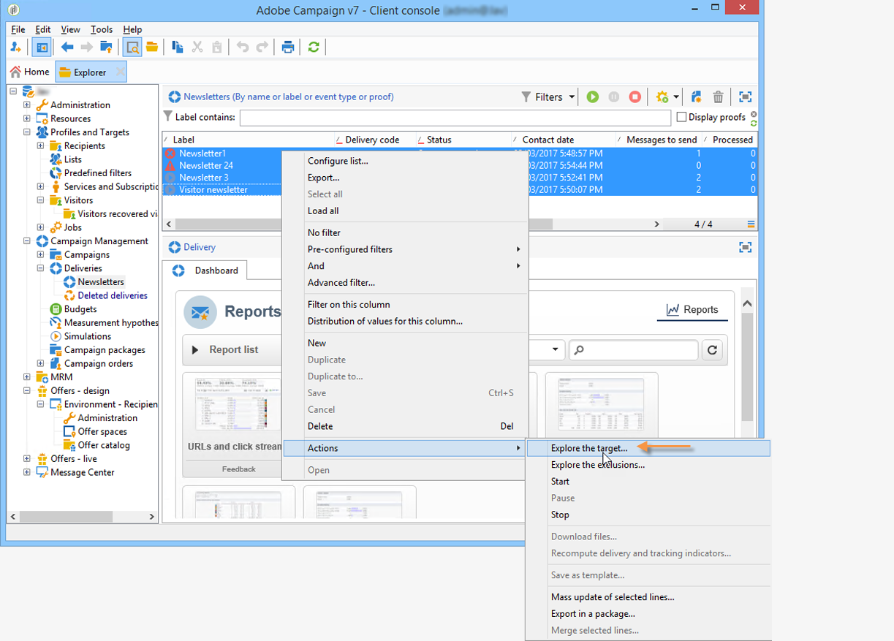
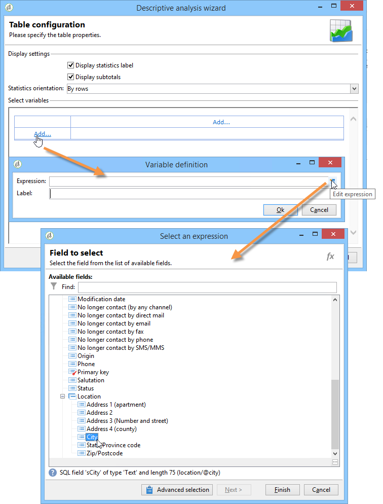
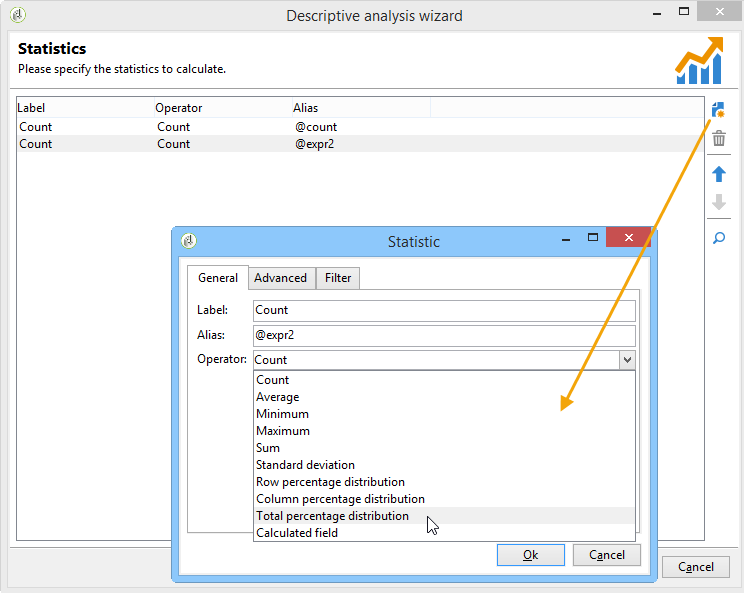
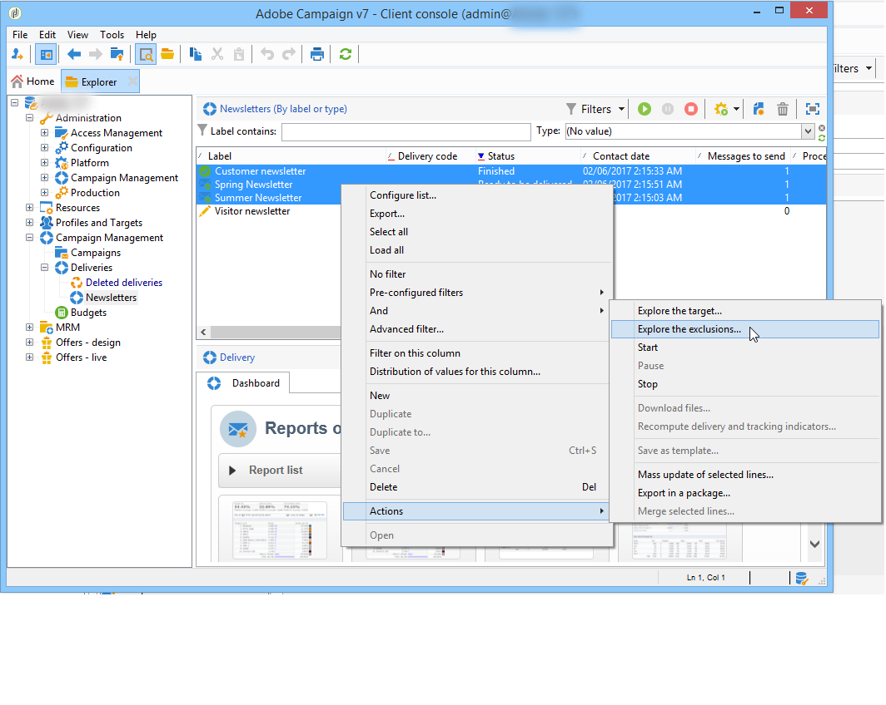

# 用例{#use-cases}

## 分析人口 {#analyzing-a-population}

以下示例使用描述性分析向导探索一组新闻稿所针对的群体。

实施步骤详见下文，而本章的其他部分提供选项和说明的详尽列表。

### 确定要分析的群体 {#identifying-the-population-to-analyze}

在此示例中，我们要了解Newsletters文件夹中包含的目标的 **投放** 。

为此，请选择相关投放，然后右键单击并选择 **[!UICONTROL Action > Explore the target...]**。



### 选择分析类型 {#selecting-a-type-of-analysis}

在助手的第一步中，您可以选择要使用的描述性分析模板。 默认情况下，Adobe Campaign优惠两个模板： **[!UICONTROL Qualitative distribution]** 和 **[!UICONTROL Quantitative distribution]**。 For more on this refer to the [Configuring the qualitative distribution template](../../reporting/using/using-the-descriptive-analysis-wizard.md#configuring-the-qualitative-distribution-template) section. “关于描述性分析”部分 [中显示各种呈现](../../reporting/using/about-descriptive-analysis.md) 。

在此示例中，选择 **[!UICONTROL Qualitative distribution]** 模板，然后选择带有图表和表（数组）的显示屏。 为报告命名(“描述性分析”)，然后单击 **[!UICONTROL Next]**。


### 选择要显示的变量 {#selecting-the-variables-to-display}

通过下一步，您可以选择要在表中显示的数据。

单击链 **[!UICONTROL Add...]** 接以选择包含要显示的数据的变量。 在这里，我们想在一条线上展示投放收件人的城市：



这些列将显示每个公司的购买数。 在此示例中，金额在Web购买字 **段中汇总** 。

在此，我们要定义结果绑定以阐明其显示。 为此，请选择绑定 **[!UICONTROL Manual]** 选项，并设置要显示的区段的计算类：


然后，单 **[!UICONTROL Ok]** 击以批准配置。

定义行和列后，您可以使用工具栏更改、移动或删除它们。


### 定义显示格式 {#defining-the-display-format}

在向导的下一步中，您可以选择要生成的图表类型。

在这种情况下，请选择直方图。


不同图形的可能配置在分析报告图表选 [项部分有详细介绍](../../reporting/using/processing-a-report.md#analysis-report-chart-options) 。

### 配置要计算的统计信息 {#configuring-the-statistic-to-calculate}

然后指定要应用于收集数据的计算。 默认情况下，描述性分析向导执行简单的值计数。

通过此窗口可以定义要计算的统计列表。


要创建新统计信息，请单击 **[!UICONTROL Add]** 按钮。 For more on this, refer to [Statistics calculation](../../reporting/using/using-the-descriptive-analysis-wizard.md#statistics-calculation).

### 查看和使用报表 {#viewing-and-using-the-report}

向导的最后一步显示表和图表。

您可以使用表上方的工具栏存储、导出或打印数据。 有关此问题的详细信息，请参 [阅处理报告](../../reporting/using/processing-a-report.md)。


## 定性数据分析 {#qualitative-data-analysis}

### 图表显示示例 {#example-of-a-chart-display}

**目标**:生成分析报告，了解潜在客户或客户的位置。

1. 打开描述性分析向导，然后仅 **[!UICONTROL Chart]** 选择。

   

   单击 **[!UICONTROL Next]** 以批准此步骤。

1. 然后选 **[!UICONTROL 2 variables]** 择选项并指 **[!UICONTROL First variable (abscissa)]** 定收件人状态(潜在客户/客户)，第二个变量将引用国家。
1. 选 **[!UICONTROL Cylinders]** 择类型。

   

1. 单击 **[!UICONTROL Next]** 并保留默认统 **[!UICONTROL Simple count]** 计信息。
1. 单 **[!UICONTROL Next]** 击以显示报告。

   

   将鼠标悬停在某个栏上，可查看此国家／地区的确切客户或潜在客户数。

1. 根据图例启用或禁用其中一个国家／地区的显示。

   

### 表显示示例 {#example-of-a-table-display}

**目标**:分析公司电子邮件域。

1. 打开描述性分析向导，并仅选 **[!UICONTROL Array]** 择显示模式。

   

   单击按 **[!UICONTROL Next]** 钮以批准此步骤。

1. 选择 **[!UICONTROL Company]** 变量作为列， **[!UICONTROL Email domain]** 选择变量作为行。
1. 保留统 **[!UICONTROL By rows]** 计方向选项：统计计算将显示在变量的右 **[!UICONTROL Email domain]** 侧。

   

   单击 **[!UICONTROL Next]** 以批准此步骤。

1. 然后输入要计算的统计信息：保留默认计数并创建新统计。 要执行此操作，请单 **[!UICONTROL Add]** 击并选 **[!UICONTROL Total percentage distribution]** 择作为运算符。

   

1. 输入统计信息的标签，以便在显示报告时不显示空白字段。

   

1. 单 **[!UICONTROL Next]** 击以显示报告。

   

1. 生成分析报告后，您可以调整显示以满足您的需求，而无需更改配置。 例如，您可以切换轴：右键单击域名，然后在快 **[!UICONTROL Turn]** 捷菜单上选择。

   

   下表按如下方式显示信息：

   

## 定量数据分析 {#quantitative-data-analysis}

**目标**:生成关于分析年龄的定量收件人报告

1. 打开描述性分析向导， **[!UICONTROL Quantitative distribution]** 然后从下拉列表中选择。

   

   单击按 **[!UICONTROL Next]** 钮以批准此步骤。

1. 选择变 **[!UICONTROL Age]** 量并输入其标签。 指定它是否为整数，然后单击 **[!UICONTROL Next]**。

   

1. 删除 **[!UICONTROL Deciles]**&#x200B;和 **[!UICONTROL Distribution]** 统 **[!UICONTROL Sum]** 计：这里不需要它们。

   

1. 单 **[!UICONTROL Next]** 击以显示报告。

   

## 分析工作流中的过渡目标 {#analyzing-a-transition-target-in-a-workflow}

**目标**:生成有关定位工作流的填充情况的报告

1. 打开所需的定位工作流。
1. 右键单击指向过渡表的收件人。
1. 在下 **[!UICONTROL Analyze target]** 拉菜单中选择以打开描述性分析窗口。

   

1. 此时，您可以选择选项并 **[!UICONTROL Existing analyses and reports]** 使用先前创建的报表(请参 [阅重新使用现有报表和分析](../../reporting/using/processing-a-report.md#re-using-existing-reports-and-analyses))，或创建新的描述性分析。 为此，请保持选 **[!UICONTROL New descriptive analysis from a template]** 项在默认情况下处于选中状态。

   配置的其余部分与所有描述性分析相同。

### 目标分析建议 {#target-analyze-recommendations}

在工作流中分析人群时，需要该人群仍在过渡中。 如果启动工作流，则可能会从过渡中清除有关填充的结果。 要运行分析，您可以：

* 将过渡与其目标活动分离，并开始工作流使其处于活动状态。 过渡开始闪现后，以通常的方式启动向导。

   

* 通过选择选项修改工作流的 **[!UICONTROL Keep the result of interim populations between two executions]** 属性。 这样，您便可以启动所选过渡的分析，即使工作流已完成也是如此。

   

   如果从过渡中清除了填充，则会显示一条错误消息，要求您在启动描述性分析向导之前选择相关选项。

   

>[!CAUTION]
>
>此选 **[!UICONTROL Keep the result of interim populations between two executions]** 项只能在开发阶段使用，但不能用于生产环境。\
>达到保留期限后，临时人口将自动清除。 此截止日期在工作流属性选项卡中 **[!UICONTROL Execution]** 指定。

## 分析收件人跟踪日志 {#analyzing-recipient-tracking-logs}

描述性分析向导可以生成有关其他工作表的报告。 这意味着您可以通过创建专用报告来分析投放日志。

在此示例中，我们要分析新闻稿收件人的反应性率。

为此，请应用以下步骤：

1. 通过菜单打开描述性分析 **[!UICONTROL Tools > Descriptive analysis]** 向导并更改默认工作表。 选择 **[!UICONTROL Recipient tracking log]** 并添加过滤器以排除验证并包含新闻稿。

   

   选择表格显示，然后单击 **[!UICONTROL Next]**。

1. 在下一个窗口中，指定分析与投放相关。

   

   此处，投放标签将显示在第一列中。

1. 删除默认计数并创建三个统计信息，以配置要在表中显示的统计信息。

   此处，对于每个Newsletter，表格将显示：打开次数、点击次数、反应性率（以百分比表示）。

1. 添加统计信息以计算点击次数：在选项卡中定义相关 **[!UICONTROL Filter]** 筛选器。

   

1. 然后，单击该 **[!UICONTROL General]** 选项卡以重命名统计信息标签和别名：

   

1. 添加第二个统计信息以计算打开次数：

   

1. 然后，单击选 **[!UICONTROL General]** 项卡以重命名统计信息标签及其别名：

   

1. 添加第三个统计量并选 **[!UICONTROL Calculated field]** 择操作符来测量反应性率。

   

   转至字 **[!UICONTROL User function]** 段并输入以下公式：

   ```
   @clic / @open * 100
   ```

   调整统计标签，如下所示：

   

   最后，指定是否以百分比形式显示值：要执行此操作，请取消选 **[!UICONTROL Default formatting]** 中选项卡中 **[!UICONTROL Advanced]** 的选项，然 **[!UICONTROL Percentage]** 后选择不带小数点的选项。

   

1. 单 **[!UICONTROL Next]** 击以显示报告。

   

## 分析投放排除日志 {#analyzing-delivery-exclusion-logs}

如果分析与投放有关，则可以分析被排除的人口。 为此，请选择要分析的投放并右键单击以访问菜 **[!UICONTROL Action > Explore exclusions]** 单。



这将带您进入描述性分析向导，分析将关注收件人排除日志。

例如，可显示所有被排除地址的域，并按排除日期对它们进行排序。


这将生成以下类型的报告：


