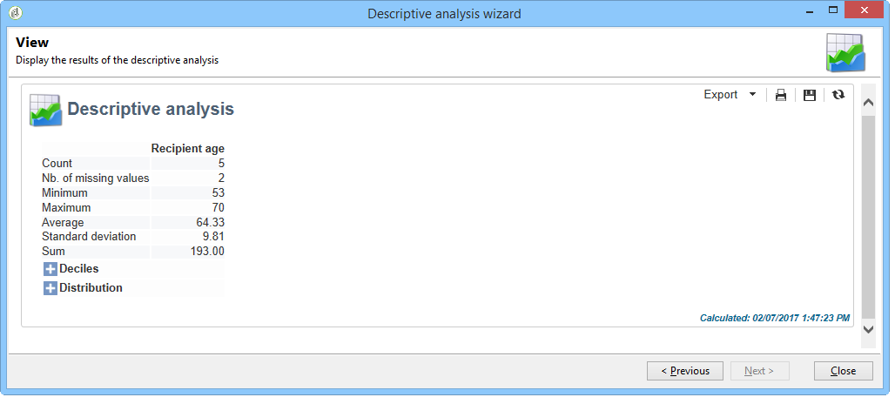
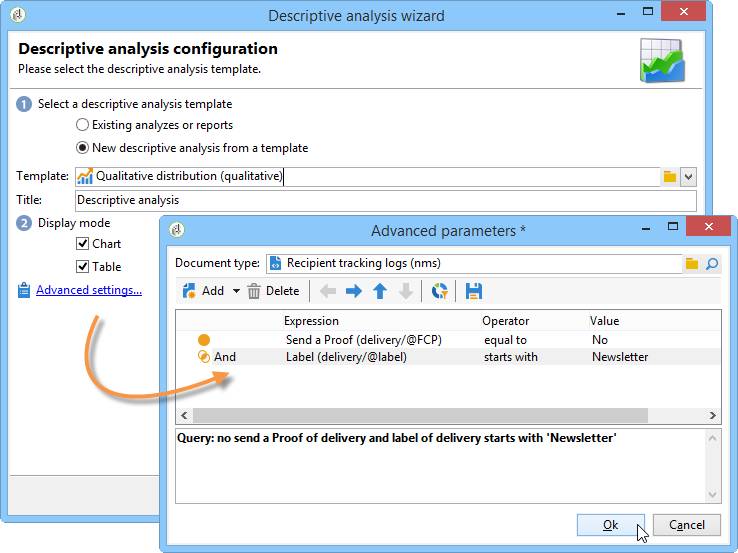

# 用例{#use-cases}

## 分析人口{#analyzing-a-population}

以下示例使用描述性分析向导探索一组新闻稿所针对的群体。

实施步骤详见下文，而本章的其他部分提供选项和说明的详尽列表。

### 确定要分析{#identifying-the-population-to-analyze}的人群

在此示例中，我们要了解&#x200B;**Newsletters**&#x200B;文件夹中包含的目标的投放数。

为此，请选择相关投放，然后右键单击并选择&#x200B;**[!UICONTROL Action > Explore the target...]**。


### 选择分析类型{#selecting-a-type-of-analysis}

在助手的第一步中，您可以选择要使用的描述性分析模板。 默认情况下，Adobe Campaign优惠两个模板：**[!UICONTROL Qualitative distribution]**&#x200B;和&#x200B;**[!UICONTROL Quantitative distribution]**。 有关详细信息，请参阅[配置定性分发模板](../../reporting/using/using-the-descriptive-analysis-wizard.md#configuring-the-qualitative-distribution-template)部分。 [关于描述性分析](../../reporting/using/about-descriptive-analysis.md)部分中显示各种呈现。

对于此示例，选择&#x200B;**[!UICONTROL Qualitative distribution]**&#x200B;模板，并选择带有图表和表（数组）的显示屏。 为报告命名(“描述性分析”)，然后单击&#x200B;**[!UICONTROL Next]**。


### 选择要显示{#selecting-the-variables-to-display}的变量

通过下一步，您可以选择要在表中显示的数据。

单击&#x200B;**[!UICONTROL Add...]**&#x200B;链接以选择包含要显示的数据的变量。 在这里，我们想在一条线上展示投放收件人的城市：


这些列将显示每个公司的购买数。 在此示例中，金额在&#x200B;**Web购买**&#x200B;字段中汇总。

在此，我们要定义结果绑定以阐明其显示。 为此，请选择&#x200B;**[!UICONTROL Manual]**&#x200B;绑定选项，并设置要显示的区段的计算类：


然后，单击&#x200B;**[!UICONTROL Ok]**&#x200B;批准配置。

定义行和列后，您可以使用工具栏更改、移动或删除它们。


### 定义显示格式{#defining-the-display-format}

在向导的下一步中，您可以选择要生成的图表类型。

在这种情况下，请选择直方图。


不同图形的可能配置详见[分析报告图表选项](../../reporting/using/processing-a-report.md#analysis-report-chart-options)部分。

### 配置统计信息以计算{#configuring-the-statistic-to-calculate}

然后指定要应用于收集数据的计算。 默认情况下，描述性分析向导执行简单的值计数。

通过此窗口可以定义要计算的统计列表。


要创建新统计信息，请单击&#x200B;**[!UICONTROL Add]**&#x200B;按钮。 有关详细信息，请参阅[统计计算](../../reporting/using/using-the-descriptive-analysis-wizard.md#statistics-calculation)。

### 查看和使用报告{#viewing-and-using-the-report}

向导的最后一步显示表和图表。

您可以使用表上方的工具栏存储、导出或打印数据。 有关详细信息，请参阅[处理报告](../../reporting/using/processing-a-report.md)。


## 定性数据分析{#qualitative-data-analysis}

### 图表显示示例{#example-of-a-chart-display}

**目标**:生成分析报告，了解潜在客户或客户的位置。

1. 打开描述性分析向导，并仅选择&#x200B;**[!UICONTROL Chart]**。

   

   单击&#x200B;**[!UICONTROL Next]**&#x200B;以批准此步骤。

1. 然后选择&#x200B;**[!UICONTROL 2 variables]**&#x200B;选项并指定&#x200B;**[!UICONTROL First variable (abscissa)]**&#x200B;将引用收件人状态(潜在客户/客户)，而第二个变量将引用国家／地区。
1. 选择&#x200B;**[!UICONTROL Cylinders]**&#x200B;作为类型。

   

1. 单击&#x200B;**[!UICONTROL Next]**&#x200B;并保留默认的&#x200B;**[!UICONTROL Simple count]**&#x200B;统计信息。
1. 单击&#x200B;**[!UICONTROL Next]**&#x200B;以显示报告。

   

   将鼠标悬停在某个栏上，可查看此国家／地区的确切客户或潜在客户数。

1. 根据图例启用或禁用其中一个国家／地区的显示。

   

### 表显示示例{#example-of-a-table-display}

**目标**:分析公司电子邮件域。

1. 打开描述性分析向导，并仅选择&#x200B;**[!UICONTROL Array]**&#x200B;显示模式。

   

   单击&#x200B;**[!UICONTROL Next]**&#x200B;按钮批准此步骤。

1. 选择&#x200B;**[!UICONTROL Company]**&#x200B;变量作为列，选择&#x200B;**[!UICONTROL Email domain]**&#x200B;变量作为行。
1. 保留&#x200B;**[!UICONTROL By rows]**&#x200B;选项以了解统计信息方向：统计计算将显示在&#x200B;**[!UICONTROL Email domain]**&#x200B;变量的右侧。

   

   单击&#x200B;**[!UICONTROL Next]**&#x200B;以批准此步骤。

1. 然后输入要计算的统计信息：保留默认计数并创建新统计。 要执行此操作，请单击&#x200B;**[!UICONTROL Add]**&#x200B;并选择&#x200B;**[!UICONTROL Total percentage distribution]**&#x200B;作为运算符。

   

1. 输入统计信息的标签，以便在显示报告时不显示空白字段。

   

1. 单击&#x200B;**[!UICONTROL Next]**&#x200B;以显示报告。

   

1. 生成分析报告后，您可以调整显示以满足您的需求，而无需更改配置。 例如，您可以切换轴：右键单击域名，然后在快捷菜单上选择&#x200B;**[!UICONTROL Turn]**。

   

   下表按如下方式显示信息：

   

## 定量数据分析{#quantitative-data-analysis}

**目标**:生成关于分析年龄的定量收件人报告

1. 打开描述性分析向导，从下拉列表中选择&#x200B;**[!UICONTROL Quantitative distribution]**。

   

   单击&#x200B;**[!UICONTROL Next]**&#x200B;按钮批准此步骤。

1. 选择&#x200B;**[!UICONTROL Age]**&#x200B;变量并输入其标签。 指定它是否为整数，然后单击&#x200B;**[!UICONTROL Next]**。

   

1. 删除&#x200B;**[!UICONTROL Deciles]**、**[!UICONTROL Distribution]**&#x200B;和&#x200B;**[!UICONTROL Sum]**&#x200B;统计信息：这里不需要它们。

   

1. 单击&#x200B;**[!UICONTROL Next]**&#x200B;以显示报告。

   

## 分析工作流{#analyzing-a-transition-target-in-a-workflow}中的过渡目标

**目标**:生成有关定位工作流的填充情况的报告

1. 打开所需的定位工作流。
1. 右键单击指向过渡表的收件人。
1. 在下拉菜单中选择&#x200B;**[!UICONTROL Analyze target]**&#x200B;以打开描述性分析窗口。

   

1. 此时，您可以选择&#x200B;**[!UICONTROL Existing analyses and reports]**&#x200B;选项并使用之前创建的报表（请参阅[重新使用现有报表和分析](../../reporting/using/processing-a-report.md#re-using-existing-reports-and-analyses)），或创建新的描述性分析。 为此，请保留默认选中的&#x200B;**[!UICONTROL New descriptive analysis from a template]**&#x200B;选项。

   配置的其余部分与所有描述性分析相同。

### 目标分析建议{#target-analyze-recommendations}

在工作流中分析人群时，需要该人群仍在过渡中。 如果启动工作流，则可能会从过渡中清除有关填充的结果。 要运行分析，您可以：

* 将过渡与其目标活动分离，并开始工作流使其处于活动状态。 过渡开始闪现后，以通常的方式启动向导。

   

* 通过选择&#x200B;**[!UICONTROL Keep the result of interim populations between two executions]**&#x200B;选项修改工作流的属性。 这样，您便可以启动所选过渡的分析，即使工作流已完成也是如此。

   

   如果从过渡中清除了填充，则会显示一条错误消息，要求您在启动描述性分析向导之前选择相关选项。

   

>[!CAUTION]
>
>**[!UICONTROL Keep the result of interim populations between two executions]**&#x200B;选项只能用于开发阶段，而不能用于生产环境。\
>达到保留期限后，临时人口将自动清除。 此截止日期在工作流属性&#x200B;**[!UICONTROL Execution]**&#x200B;选项卡中指定。

## 分析收件人跟踪日志{#analyzing-recipient-tracking-logs}

描述性分析向导可以生成有关其他工作表的报告。 这意味着您可以通过创建专用报告来分析投放日志。

在此示例中，我们要分析新闻稿收件人的反应性率。

为此，请应用以下步骤：

1. 通过&#x200B;**[!UICONTROL Tools > Descriptive analysis]**&#x200B;菜单打开描述性分析向导并更改默认工作表。 选择&#x200B;**[!UICONTROL Recipient tracking log]**&#x200B;并添加一个筛选器以排除验证并包含新闻稿。

   

   选择表显示，然后单击&#x200B;**[!UICONTROL Next]**。

1. 在下一个窗口中，指定分析与投放相关。

   

   此处，投放标签将显示在第一列中。

1. 删除默认计数并创建三个统计信息，以配置要在表中显示的统计信息。

   此处，对于每个Newsletter，表格将显示：打开次数、点击次数、反应性率（以百分比表示）。

1. 添加统计信息以计算点击次数：在&#x200B;**[!UICONTROL Filter]**&#x200B;选项卡中定义相关筛选器。

   

1. 然后，单击&#x200B;**[!UICONTROL General]**&#x200B;选项卡以重命名统计信息标签和别名：

   

1. 添加第二个统计信息以计算打开次数：

   

1. 然后，单击&#x200B;**[!UICONTROL General]**&#x200B;选项卡以重命名统计信息标签及其别名：

   

1. 添加第三个统计量，并选择&#x200B;**[!UICONTROL Calculated field]**&#x200B;运算符来测量反应性率。

   

   转到&#x200B;**[!UICONTROL User function]**&#x200B;字段并输入以下公式：

   ```
   @clic / @open * 100
   ```

   调整统计标签，如下所示：

   

   最后，指定是否以百分比形式显示值：要执行此操作，请取消选中&#x200B;**[!UICONTROL Advanced]**&#x200B;选项卡中的&#x200B;**[!UICONTROL Default formatting]**&#x200B;选项，并选择&#x200B;**[!UICONTROL Percentage]**（不带小数点）。

   

1. 单击&#x200B;**[!UICONTROL Next]**&#x200B;以显示报告。

   

## 分析投放排除日志{#analyzing-delivery-exclusion-logs}

如果分析与投放有关，则可以分析被排除的人口。 为此，请选择要分析的投放，并右键单击以访问&#x200B;**[!UICONTROL Action > Explore exclusions]**&#x200B;菜单。


这将带您进入描述性分析向导，分析将关注收件人排除日志。

例如，可显示所有被排除地址的域，并按排除日期对它们进行排序。


这将生成以下类型的报告：


