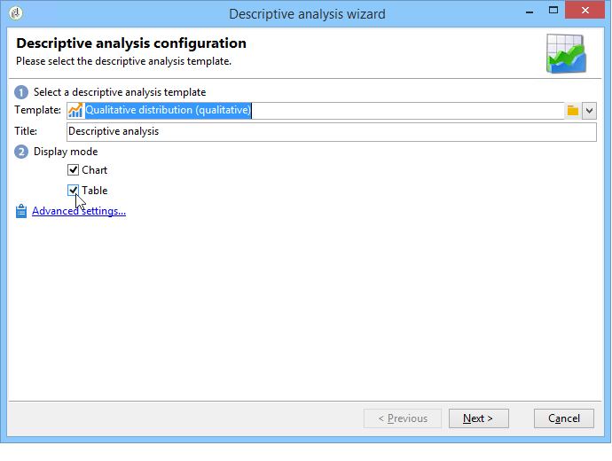
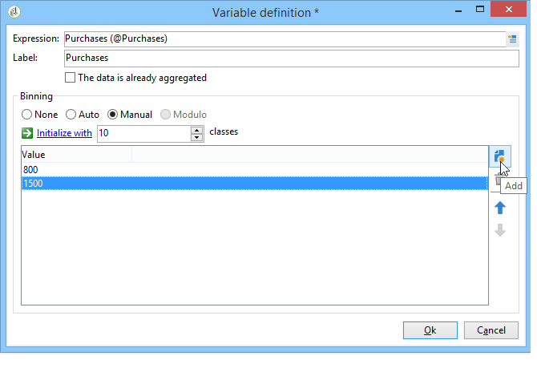
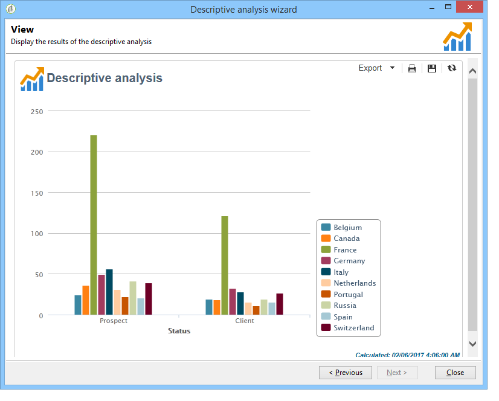
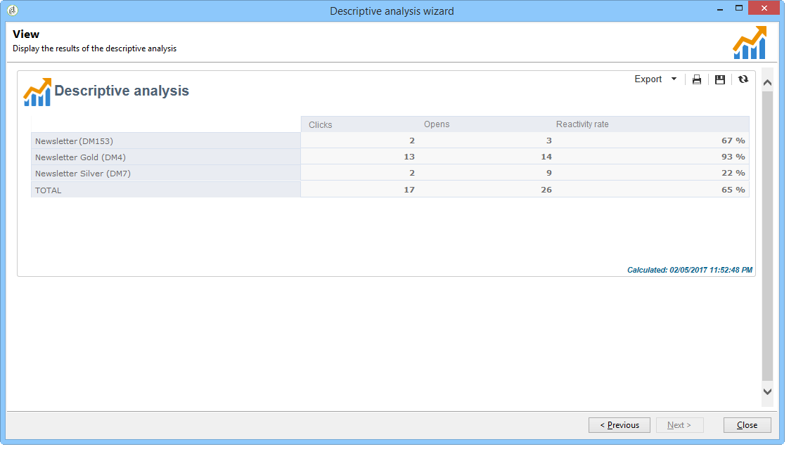

# 用例{#use-cases}


## 分析人群 {#analyzing-a-population}

以下示例允许您使用描述性分析向导浏览一组新闻稿所定向的群体。

下面详细介绍了实施步骤，而本章其他部分提供了有关选项的详尽列表和说明。

### 识别要分析的群体 {#identifying-the-population-to-analyze}

在本例中，我们要探究以下位置中包含的投放的目标群体 **快讯** 文件夹。

要实现此目的，请选择相关投放，然后右键单击并选择 **[!UICONTROL Action > Explore the target...]**.


### 选择分析类型 {#selecting-a-type-of-analysis}

在助理的第一步中，您可以选择要使用的描述性分析模板。 默认情况下，Adobe Campaign提供两个模板： **[!UICONTROL Qualitative distribution]** 和 **[!UICONTROL Quantitative distribution]**. 欲知详情，请参阅 [配置定性分发模板](../../reporting/using/using-the-descriptive-analysis-wizard.md#configuring-the-qualitative-distribution-template) 部分。 中介绍了各种渲染 [关于描述性分析](../../reporting/using/about-descriptive-analysis.md) 部分。

对于此示例，请选择 **[!UICONTROL Qualitative distribution]** 模板并选择带有图表和表格（数组）的显示器。 为报表命名（“描述性分析”），然后单击 **[!UICONTROL Next]**.



### 选择要显示的变量 {#selecting-the-variables-to-display}

下一步允许您选择要在表格中显示的数据。

单击 **[!UICONTROL Add...]** 用于选择包含要显示的数据的变量的链接。 在此，我们希望在一行中显示投放收件人的城市：


列将显示每个公司的购买次数。 在本例中，金额汇总在 **Web购买** 字段。

在这里，我们要定义结果量化，以阐明其显示方式。 要执行此操作，请选择 **[!UICONTROL Manual]** 量化选项并设置要显示的区段的计算类：



然后，单击 **[!UICONTROL Ok]** 以批准配置。

定义行和列后，可以使用工具栏更改、移动或删除它们。


### 定义显示格式 {#defining-the-display-format}

向导的下一步允许您选择要生成的图表类型。

在这种情况下，选择直方图。


有关不同图形的可能配置详情，请参见 [分析报表图表选项](../../reporting/using/processing-a-report.md#analysis-report-chart-options) 部分。

### 配置要计算的统计信息 {#configuring-the-statistic-to-calculate}

然后指定要应用于收集的数据的计算。 默认情况下，描述性分析向导会执行值的简单计数。

利用此窗口，可定义要计算的统计信息的列表。


要创建新统计信息，请单击 **[!UICONTROL Add]** 按钮。 有关更多信息，请参阅 [统计计算](../../reporting/using/using-the-descriptive-analysis-wizard.md#statistics-calculation).

### 查看和使用报告 {#viewing-and-using-the-report}

向导的最后一步将显示表和图表。

您可以使用表格上方的工具栏存储、导出或打印数据。 有关更多信息，请参阅 [处理报表](../../reporting/using/processing-a-report.md).


## 定性数据分析 {#qualitative-data-analysis}

### 图表显示示例 {#example-of-a-chart-display}

**Target**：生成有关潜在客户或客户位置的分析报告。

1. 打开描述性分析向导并选择 **[!UICONTROL Chart]** 仅此而已。

   

   单击 **[!UICONTROL Next]** 以批准此步骤。

1. 然后选择 **[!UICONTROL 2 variables]** 选项，并指定 **[!UICONTROL First variable (abscissa)]** 将引用收件人状态（潜在客户/客户），第二个变量将引用国家/地区。
1. 选择 **[!UICONTROL Cylinders]** 作为类型。

   

1. 单击 **[!UICONTROL Next]** 并保留默认值 **[!UICONTROL Simple count]** 统计数据。
1. 单击 **[!UICONTROL Next]** 以显示报告。

   

   将鼠标悬停在栏上可查看该国家/地区的客户或潜在客户的确切数量。

1. 根据图例启用或禁用显示其中一个国家/地区。

   

### 表格显示示例 {#example-of-a-table-display}

**Target**：分析公司电子邮件域。

1. 打开描述性分析向导并选择 **[!UICONTROL Array]** 仅显示模式。

   

   单击 **[!UICONTROL Next]** 按钮以批准此步骤。

1. 选择 **[!UICONTROL Company]** 变量作为列，并且 **[!UICONTROL Email domain]** 变量作为行。
1. 保留 **[!UICONTROL By rows]** 统计方向的选项：统计计算将显示在 **[!UICONTROL Email domain]** 变量。

   

   单击 **[!UICONTROL Next]** 以批准此步骤。

1. 然后输入要计算的统计信息：保留默认计数并创建新统计信息。 要执行此操作，请单击 **[!UICONTROL Add]** 并选择 **[!UICONTROL Total percentage distribution]** 作为运算符。

   

1. 输入统计数据的标签，以便在显示报告时不会出现空白字段。

   

1. 单击 **[!UICONTROL Next]** 以显示报告。

   

1. 生成分析报告后，您可以调整显示以符合您的需求，而无需更改配置。 例如，可以切换轴：右键单击域名并选择 **[!UICONTROL Turn]** 在快捷菜单上。

   

   该表按以下方式显示信息：

   

## 定量数据分析 {#quantitative-data-analysis}

**Target**：生成收件人年龄的定量分析报告

1. 打开描述性分析向导并选择 **[!UICONTROL Quantitative distribution]** 下拉列表中。

   

   单击 **[!UICONTROL Next]** 按钮以批准此步骤。

1. 选择 **[!UICONTROL Age]** 变量并输入其标签。 指定它是否为整数，然后单击 **[!UICONTROL Next]**.

   

1. 删除 **[!UICONTROL Deciles]**， **[!UICONTROL Distribution]** 和 **[!UICONTROL Sum]** 统计数据：此处不需要。

   

1. 单击 **[!UICONTROL Next]** 以显示报告。

   

## 分析工作流中的过渡目标 {#analyzing-a-transition-target-in-a-workflow}

**Target**：生成定位工作流的群体报告

1. 打开所需的定位工作流。
1. 右键单击指向收件人表的过渡。
1. 选择 **[!UICONTROL Analyze target]** 以打开描述性分析窗口。

   

1. 此时，您可以选择 **[!UICONTROL Existing analyses and reports]** 选项并使用之前创建的报告(请参阅 [重复利用现有报告和分析](../../reporting/using/processing-a-report.md#re-using-existing-reports-and-analyses))，或创建新的描述性分析。 要执行此操作，请将 **[!UICONTROL New descriptive analysis from a template]** 默认情况下选定的选项。

   其余配置与所有描述性分析相同。

### Target分析推荐 {#target-analyze-recommendations}

工作流中的群体分析要求群体仍然存在于过渡中。 如果启动工作流，则可能会从过渡中清除与群体有关的结果。 要运行分析，您可以：

* 将过渡与其目标活动分离，然后启动工作流以使其处于活动状态。 一旦过渡开始闪烁，请按常规方式启动向导。

   

* 通过选择 **[!UICONTROL Keep the result of interim populations between two executions]** 选项。 这样，即使工作流已完成，您仍可启动对所选过渡的分析。

   

   如果从过渡中清除群体，则会显示一条错误消息，要求您在启动描述性分析向导之前选择相关选项。

   

>[!CAUTION]
>
>此 **[!UICONTROL Keep the result of interim populations between two executions]** 选项只能用于开发阶段，而不能用于生产环境。\
>达到保留截止日期后，将自动清除临时群体。 该截止日期在工作流属性中指定 **[!UICONTROL Execution]** 选项卡。

## 分析收件人跟踪日志 {#analyzing-recipient-tracking-logs}

描述性分析向导可以生成有关其他工作表的报表。 这意味着您可以通过创建专用报告来分析投放日志。

在本例中，我们要分析新闻稿收件人的反应率。

要执行此操作，请应用以下步骤：

1. 通过打开描述性分析向导 **[!UICONTROL Tools > Descriptive analysis]** 菜单并更改默认工作表。 选择 **[!UICONTROL Recipient tracking log]** 和添加过滤器以排除验证并包括新闻稿。

   

   选择表格显示并单击 **[!UICONTROL Next]**.

1. 在下一个窗口中，指定分析涉及投放。

   

   此处，投放标签将显示在第一列。

1. 删除默认计数，并创建三个统计信息以配置要在表中显示的统计信息。

   在这里，对于每个新闻稿，该表将显示：打开次数、点击次数、反应率（以百分比表示）。

1. 添加用于计数点击次数的统计数据：在中定义相关过滤器 **[!UICONTROL Filter]** 选项卡。

   

1. 然后单击 **[!UICONTROL General]** 选项卡以重命名统计信息标签和别名：

   

1. 添加第二个统计信息以计数打开次数：

   

1. 然后单击 **[!UICONTROL General]** 选项卡以重命名统计信息标签及其别名：

   

1. 添加第三个统计信息，然后选择 **[!UICONTROL Calculated field]** 运算符来衡量反应率。

   

   转到 **[!UICONTROL User function]** 字段并输入以下公式：

   ```
   @clic / @open * 100
   ```

   调整统计数据标签，如下所示：

   

   最后，指定值是否以百分比显示：要实现此目的，请取消选中 **[!UICONTROL Default formatting]** 中的选项 **[!UICONTROL Advanced]** 选项卡并选择 **[!UICONTROL Percentage]** 没有小数点。

   

1. 单击 **[!UICONTROL Next]** 以显示报告。

   

## 分析投放排除日志 {#analyzing-delivery-exclusion-logs}

如果分析涉及投放，则可以分析排除的群体。 为此，请选择要分析的投放，并右键单击以访问 **[!UICONTROL Action > Explore exclusions]** 菜单。


这会将您带到描述性分析向导，分析将涉及收件人排除日志。

例如，您可以显示所有排除地址的域，并按排除日期对它们进行排序。


这将生成以下类型的报告：


