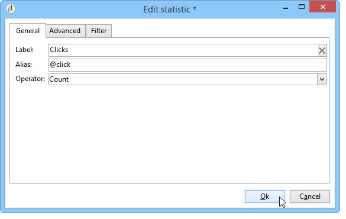

# 用例{#use-cases}

## 分析群体{#analyzing-a-population}

以下示例允许您使用描述性分析向导来探索一组新闻稿所定向的群体。

下面详细介绍了实施步骤，本章的其他部分提供了详尽的选项和说明列表。

### 识别要分析的群体{#identifying-the-population-to-analyze}

在此示例中，我们要探索&#x200B;**Newsletters**&#x200B;文件夹中包含的投放的目标群体。

要执行此操作，请选择相关投放，然后右键单击并选择&#x200B;**[!UICONTROL Action > Explore the target...]**。


### 选择分析类型{#selecting-a-type-of-analysis}

在助手的第一步中，您可以选择要使用的描述性分析模板。 默认情况下，Adobe Campaign提供了两个模板：**[!UICONTROL Qualitative distribution]**&#x200B;和&#x200B;**[!UICONTROL Quantitative distribution]**。 有关更多信息，请参阅[配置定性分发模板](../../reporting/using/using-the-descriptive-analysis-wizard.md#configuring-the-qualitative-distribution-template)一节。 [关于描述性分析](../../reporting/using/about-descriptive-analysis.md)一节中介绍了各种渲染。

在本例中，选择&#x200B;**[!UICONTROL Qualitative distribution]**&#x200B;模板，然后选择具有图表和表格（数组）的显示屏。 为报表指定名称（“描述性分析”），然后单击&#x200B;**[!UICONTROL Next]**。


### 选择要显示{#selecting-the-variables-to-display}的变量

下一步允许您选择要在表格中显示的数据。

单击&#x200B;**[!UICONTROL Add...]**&#x200B;链接以选择包含要显示数据的变量。 在此，我们希望在一行中显示投放收件人所在的城市：


列将显示每家公司的购买次数。 在此示例中，金额在&#x200B;**Web购买**&#x200B;字段中汇总。

在此，我们要定义结果绑定以阐明其显示。 要实现此目的，请选择&#x200B;**[!UICONTROL Manual]**&#x200B;绑定选项，并设置要显示的区段的计算类：


然后，单击&#x200B;**[!UICONTROL Ok]**&#x200B;以批准配置。

定义行和列后，可以使用工具栏更改、移动或删除它们。


### 定义显示格式{#defining-the-display-format}

在向导的下一步中，您可以选择要生成的图表类型。

在这种情况下，选择直方图。


[分析报表图表选项](../../reporting/using/processing-a-report.md#analysis-report-chart-options)部分详细介绍了不同图形的可能配置。

### 配置统计量以计算{#configuring-the-statistic-to-calculate}

然后，指定要应用于收集数据的计算。 默认情况下，描述性分析向导会执行简单的值计数。

利用此窗口可定义要计算的统计信息列表。


要创建新统计信息，请单击&#x200B;**[!UICONTROL Add]**&#x200B;按钮。 有关更多信息，请参阅[统计计算](../../reporting/using/using-the-descriptive-analysis-wizard.md#statistics-calculation)。

### 查看和使用报表{#viewing-and-using-the-report}

向导的最后一步是显示表格和图表。

您可以使用表格上方的工具栏存储、导出或打印数据。 有关更多信息，请参阅[处理报表](../../reporting/using/processing-a-report.md)。


## 定性数据分析{#qualitative-data-analysis}

### 图表显示示例{#example-of-a-chart-display}

**目标**:生成潜在客户或客户位置的分析报告。

1. 打开描述性分析向导并仅选择&#x200B;**[!UICONTROL Chart]**。

   

   单击&#x200B;**[!UICONTROL Next]**&#x200B;以批准此步骤。

1. 然后，选择&#x200B;**[!UICONTROL 2 variables]**&#x200B;选项，并指定&#x200B;**[!UICONTROL First variable (abscissa)]**&#x200B;将引用收件人状态（潜在客户/客户），而第二个变量将引用国家/地区。
1. 选择&#x200B;**[!UICONTROL Cylinders]**&#x200B;作为类型。

   

1. 单击&#x200B;**[!UICONTROL Next]**&#x200B;并保留默认的&#x200B;**[!UICONTROL Simple count]**&#x200B;统计信息。
1. 单击&#x200B;**[!UICONTROL Next]**&#x200B;以显示报表。

   

   将鼠标悬停在条形图上可查看此国家/地区的确切客户或潜在客户数量。

1. 根据图例启用或禁用其中一个国家/地区的显示。

   

### 表显示示例{#example-of-a-table-display}

**目标**:分析公司电子邮件域。

1. 打开描述性分析向导并仅选择&#x200B;**[!UICONTROL Array]**&#x200B;显示模式。

   

   单击&#x200B;**[!UICONTROL Next]**&#x200B;按钮以批准此步骤。

1. 选择&#x200B;**[!UICONTROL Company]**&#x200B;变量作为列，选择&#x200B;**[!UICONTROL Email domain]**&#x200B;变量作为行。
1. 保留&#x200B;**[!UICONTROL By rows]**&#x200B;选项以用于统计方向：统计计算将显示在&#x200B;**[!UICONTROL Email domain]**&#x200B;变量的右侧。

   

   单击&#x200B;**[!UICONTROL Next]**&#x200B;以批准此步骤。

1. 然后，输入要计算的统计信息：保留默认计数并创建新统计资料。 要执行此操作，请单击&#x200B;**[!UICONTROL Add]**&#x200B;并选择&#x200B;**[!UICONTROL Total percentage distribution]**&#x200B;作为运算符。

   

1. 为统计信息输入标签，以便在显示报表时不会显示空白字段。

   

1. 单击&#x200B;**[!UICONTROL Next]**&#x200B;以显示报表。

   

1. 生成分析报告后，您可以根据需要调整显示内容，而无需更改配置。 例如，您可以切换轴：右键单击域名，然后在快捷菜单中选择&#x200B;**[!UICONTROL Turn]**。

   

   表格显示如下信息：

   

## 定量数据分析{#quantitative-data-analysis}

**目标**:生成关于收件人年龄的定量分析报告

1. 打开描述性分析向导，然后从下拉列表中选择&#x200B;**[!UICONTROL Quantitative distribution]**。

   

   单击&#x200B;**[!UICONTROL Next]**&#x200B;按钮以批准此步骤。

1. 选择&#x200B;**[!UICONTROL Age]**&#x200B;变量并输入其标签。 指定它是否为整数，然后单击&#x200B;**[!UICONTROL Next]**。

   

1. 删除&#x200B;**[!UICONTROL Deciles]**、**[!UICONTROL Distribution]**&#x200B;和&#x200B;**[!UICONTROL Sum]**&#x200B;统计信息：这里不需要它们。

   

1. 单击&#x200B;**[!UICONTROL Next]**&#x200B;以显示报表。

   

## 分析工作流{#analyzing-a-transition-target-in-a-workflow}中的过渡目标

**目标**:生成有关定位工作流群体的报告

1. 打开所需的定位工作流。
1. 右键单击指向收件人表的过渡。
1. 在下拉菜单中选择&#x200B;**[!UICONTROL Analyze target]**&#x200B;以打开描述性分析窗口。

   

1. 此时，您可以选择&#x200B;**[!UICONTROL Existing analyses and reports]**&#x200B;选项并使用之前创建的报表（请参阅[重新使用现有报表和分析](../../reporting/using/processing-a-report.md#re-using-existing-reports-and-analyses)），或创建新的描述性分析。 要执行此操作，请保持默认选中&#x200B;**[!UICONTROL New descriptive analysis from a template]**&#x200B;选项。

   配置的其余部分与所有描述性分析的配置相同。

### Target分析推荐{#target-analyze-recommendations}

在工作流中分析群体时，需要该群体仍然存在于过渡中。 如果启动工作流，则可能会从过渡中清除与群体有关的结果。 要运行分析，您可以：

* 将过渡从其目标活动中分离出来，然后启动工作流以使其处于活动状态。 过渡开始闪烁后，按常规方式启动向导。

   

* 通过选择&#x200B;**[!UICONTROL Keep the result of interim populations between two executions]**&#x200B;选项修改工作流的属性。 这样，即使工作流已完成，您也可以对所选过渡进行分析。

   

   如果从过渡中清除了群体，则会显示一条错误消息，要求您在启动描述性分析向导之前选择相关选项。

   

>[!CAUTION]
>
>**[!UICONTROL Keep the result of interim populations between two executions]**&#x200B;选项只能在开发阶段使用，但决不能用于生产中的环境。\
>在达到保留期限后，会自动清除临时群体。 工作流属性&#x200B;**[!UICONTROL Execution]**&#x200B;选项卡中指定了此截止日期。

## 分析收件人跟踪日志{#analyzing-recipient-tracking-logs}

描述性分析向导可以生成其他工作表的报告。 这意味着您可以通过创建专用报告来分析投放日志。

在本例中，我们要分析新闻稿收件人的反应率。

要执行此操作，请应用以下步骤：

1. 通过&#x200B;**[!UICONTROL Tools > Descriptive analysis]**&#x200B;菜单打开描述性分析向导，并更改默认工作表。 选择&#x200B;**[!UICONTROL Recipient tracking log]**&#x200B;并添加一个过滤器以排除校样并包含Newsletter。

   

   选择表显示，然后单击&#x200B;**[!UICONTROL Next]**。

1. 在下一个窗口中，指定分析与投放相关。

   

   在此，投放标签将显示在第一列中。

1. 删除默认计数并创建三个统计信息，以配置要在表中显示的统计信息。

   在此，对于每个新闻稿，表格将显示：打开次数、点击次数、反应性比率（以百分比表示）。

1. 添加统计信息以计数点击次数：在&#x200B;**[!UICONTROL Filter]**&#x200B;选项卡中定义相关过滤器。

   

1. 然后，单击&#x200B;**[!UICONTROL General]**&#x200B;选项卡以重命名统计标签和别名：

   

1. 添加第二个统计信息以计算打开次数：

   

1. 然后，单击&#x200B;**[!UICONTROL General]**&#x200B;选项卡以重命名统计标签及其别名：

   

1. 添加第三个统计量并选择&#x200B;**[!UICONTROL Calculated field]**&#x200B;运算符以测量反应性率。

   

   转到&#x200B;**[!UICONTROL User function]**&#x200B;字段并输入以下公式：

   ```
   @clic / @open * 100
   ```

   调整统计标签，如下所示：

   

   最后，指定是否以百分比形式显示值：要执行此操作，请取消选中&#x200B;**[!UICONTROL Advanced]**&#x200B;选项卡中的&#x200B;**[!UICONTROL Default formatting]**&#x200B;选项，并选择&#x200B;**[!UICONTROL Percentage]**，但不带小数点。

   

1. 单击&#x200B;**[!UICONTROL Next]**&#x200B;以显示报表。

   

## 分析投放排除日志{#analyzing-delivery-exclusion-logs}

如果分析涉及投放，则可以分析排除的群体。 为此，请选择要分析的投放，然后右键单击以访问&#x200B;**[!UICONTROL Action > Explore exclusions]**&#x200B;菜单。


这会将您转到描述性分析向导，分析将涉及收件人排除日志。

例如，您可以显示所有排除的地址的域，并按排除日期对其进行排序。


这将生成以下类型的报表：


