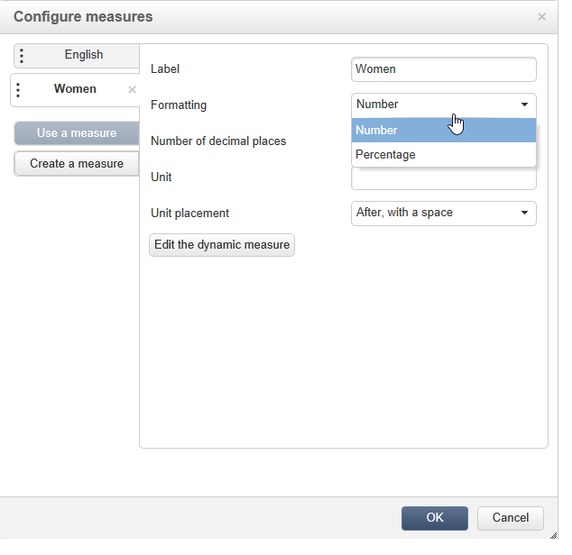

# 使用立方体浏览数据{#using-cubes-to-explore-data}

Marketing Analytics使创建报告以及通过多维数据集识别和选择数据库中的数据更简单。 这使您能够：

* 创建基于立方的报告。 此过程在以下位置详细介绍：浏 [览报表中的数据](#exploring-the-data-in-a-report)。
* 收集数据库中的数据并将其分组到列表中，例如，识别和构建目标和提交。 有关详细信息，请参阅 [构建目标人口](#building-a-target-population)。
* 将透视表插入报表中，引用报表中的现有立方。 有关详细信息，请参 [阅将透视表插入报告](#inserting-a-pivot-table-into-a-report)。

>[!NOTE]
>
>创建或修改多维数据集时，必须使用营销分析。 For more on this, refer to [About cubes](../../reporting/using/about-cubes.md).

## 浏览报告中的数据 {#exploring-the-data-in-a-report}

### 第1步——创建基于立方的报表 {#step-1---creating-a-report-based-on-a-cube}

要创建基于立方的报表，请单击 **[!UICONTROL Create]** 宇宙中的按 **[!UICONTROL Reports]** 钮并选择要使用的立方。

此过程在以下位置详细介绍：创 [建基于立方的报表](../../reporting/using/creating-indicators.md#creating-a-report-based-on-a-cube)。

### 第2步——选择行和列 {#step-2---selecting-lines-and-columns}

默认显示显示立方的前两个维度（在此示例中为年龄和城市）。

每个 **[!UICONTROL Add]** 轴上的按钮都允许您添加尺寸。

1. 选择要在表的行和列中显示的维。 为此，请拖放可用的维，如下所示：
1. 从列表中选择要添加到表的维：

   

1. 然后选择此维的参数。

   

   参数取决于所选维的数据类型。

   例如，对于日期，可以使用多个级别。 For more on this, refer to [Displaying measures](../../reporting/using/concepts-and-methodology.md#displaying-measures).

   在这种情况下提供以下选项：

   

   您可以：

   * 在加载期间展开数据：默认情况下，每次更新报告时，这些值都会显示(默认值：否)。
   * 在行末尾显示总计：在列中显示数据时，还有一个选项允许您在行末尾显示总数：将向表中添加一列(默认值：是)。
   * 应用排序：可以根据值、标签或度量(默认值：按值)。
   * 按升序(a-z, 0-9)或降序(z-a, 9-0)显示值。
   * 更改加载时要显示的列数(默认情况下：200)。

1. 单击 **[!UICONTROL Ok]** 以确认：该维将添加到现有维。

   表上的黄色横幅显示您已做出更改：单击该 **[!UICONTROL Save]** 按钮以保存它们。

   

### 第3步——配置要显示的度量 {#step-3---configuring-the-measures-to-display}

行和列到位后，指示要显示的度量及其显示模式。

默认情况下，只显示一个度量。 要添加或配置度量，请执行以下操作：

1. Click the **[!UICONTROL Measures]** button.

   

1. 通过 **[!UICONTROL Use a measure]** 该按钮，您可以选择一个现有度量。

   

   选择要显示的信息和格式类型。 选项列表取决于已配置的度量类型。

   

   整体测量配置也可通过标题 **[!UICONTROL Edit the configuration of the pivot table]** 中的图标来使用。

   

   然后，您可以选择是否显示度量标签。 有关详细信息，请参阅 [配置显示屏](../../reporting/using/concepts-and-methodology.md#configuring-the-display)。

1. 可以用现有的方法来建立新的措施。 要执行此操作，请单 **[!UICONTROL Create a measure]** 击并配置它。

   

   可使用以下类型的度量：

   * 措施组合：此类度量允许您使用现有度量构建新度量：

      可用的操作符有：和、差、乘和速率。

   * 比例：这种测量使您能够计算给定维度测量的记录数。 您可以根据维或子维计算比例。
   * 变体：此度量允许您计算级别值的变化。
   * 标准差：这种度量允许您计算每组单元格中与这些值的平均值之间的偏差。 例如，您可以比较所有现有区段的购买量。
   创建的度量将添加到报表。

   

   创建度量后，您可以编辑它，并根据需要更改其配置。 为此，请单击按 **[!UICONTROL Measures]** 钮，然后转到要编辑的度量的选项卡。

   然后单击 **[!UICONTROL Edit the dynamic measure]** 以访问设置菜单。

## 建立目标人口 {#building-a-target-population}

使用多维数据集构建报表使您能够从表中收集数据并将其保存在列表中。

为此，请将其添加到购物车并处理其内容。

要将人群分组到列表中，请应用以下步骤：

1. 单击包含要收集的群体的单元格以选择这些单元格，然后单击图 **[!UICONTROL Add to cart]** 标。

   

   收集各种配置文件所需的次数

1. 运行导 **[!UICONTROL Show cart]** 出之前，单击按钮查看其内容。

   

1. 通过 **[!UICONTROL Export]** 该按钮，您可以将购物车中的项目分组到列表中。

   您需要指定列表的名称和要执行的导出类型。

   

   单击 **[!UICONTROL Start]** 以运行导出。

1. 导出完成后，将显示一条消息，确认其执行情况以及已处理的记录数。

   

   您可以保存购物车的内容或将其清空。

   相关列表可通过宇宙访 **[!UICONTROL Profiles and targets]** 问。

   

## 将透视表插入报告 {#inserting-a-pivot-table-into-a-report}

要创建表并浏览立方中的数据，请应用以下步骤：

1. 使用单页创建新报告，并在其中插入透视表。 有关详细信息，请参见[此页面](../../reporting/using/creating-a-table.md#creating-a-breakdown-or-pivot-table)。

   

1. 在页面 **[!UICONTROL Data]** 的选项卡中，选择一个立方以处理它包含的维并显示计算度量。

   

   这样，您就可以生成要显示的报表。 有关详细信息，请参阅 [步骤2 —— 选择行和列](#step-2---selecting-lines-and-columns)。

