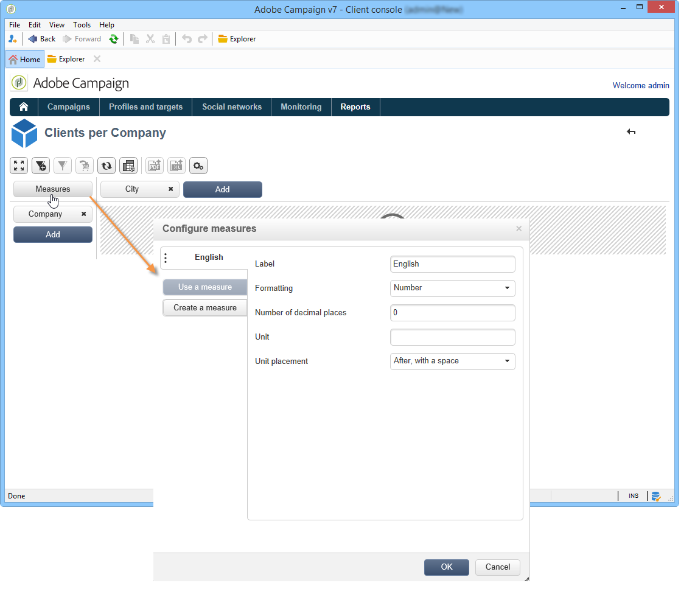
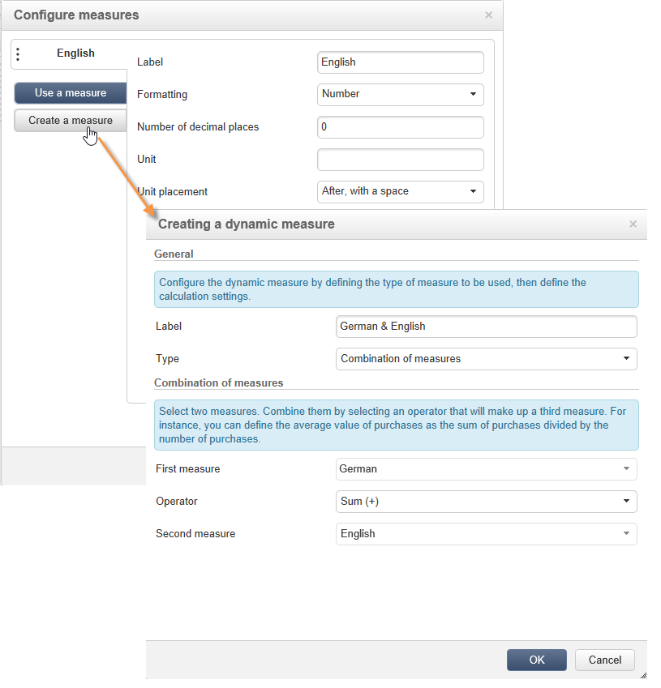

# 使用多维数据集浏览数据{#using-cubes-to-explore-data}

Marketing Analytics可让您更轻松地创建报告，并通过多维数据集识别和选择数据库中的数据。 这使您能够：

* 根据多维数据集创建报告。 该过程在以下位置详细介绍：[浏览报表中的数据](#exploring-the-data-in-a-report)。
* 收集列表库中的数据并将其分组到目标中，例如，识别和构建数据和投放。 有关详细信息，请参阅[构建目标群](#building-a-target-population)。
* 将透视表插入报表中，引用报表中的现有多维数据集。 有关详细信息，请参阅[将透视表插入报表](#inserting-a-pivot-table-into-a-report)。

>[!NOTE]
>
>营销分析是创建或修改多维数据集的必备工具。 有关详细信息，请参阅[关于多维数据集](../../reporting/using/about-cubes.md)。

## 浏览报表{#exploring-the-data-in-a-report}中的数据

### 步骤1 — 创建基于多维数据集{#step-1---creating-a-report-based-on-a-cube}的报表

要创建基于多维数据集的报表，请单击&#x200B;**[!UICONTROL Reports]**&#x200B;选项卡中的&#x200B;**[!UICONTROL Create]**&#x200B;按钮，然后选择要使用的多维数据集。

该过程在以下位置详细介绍：[创建基于多维数据集](../../reporting/using/creating-indicators.md#creating-a-report-based-on-a-cube)的报告。

### 步骤2 — 选择行和列{#step-2---selecting-lines-and-columns}

默认显示显示多维数据集的前两个维度（在本例中为年龄和城市）。

每个轴上的&#x200B;**[!UICONTROL Add]**&#x200B;按钮可让您添加尺寸。

1. 选择要显示在表行和列中的尺寸。 为此，请拖放可用的尺寸，如下所示：
1. 从列表中选择要添加到表格的维：

   

1. 然后选择此维的参数。

   

   这些参数取决于所选维度的数据类型。

   例如，对于日期，可以使用多个级别。 有关详细信息，请参阅[显示度量](../../reporting/using/concepts-and-methodology.md#displaying-measures)。

   在这种情况下提供以下选项：

   

   您可以：

   * 在加载期间展开数据：默认情况下，每次更新报表时，值都将显示(默认值：否)。
   * 在行末尾显示总计：当数据显示在列中时，还有一个选项允许您在行末尾显示总计：将向表中添加列(默认值：是)。
   * 应用排序：可以根据值、标签或度量(默认值：（按值）。
   * 按升序(a-z， 0-9)或降序(z-a， 9-0)显示值。
   * 更改加载时要显示的列数(默认情况下：200)。

1. 单击&#x200B;**[!UICONTROL Ok]**&#x200B;确认：该维将添加到现有维。

   表上方的黄色横幅显示您进行了更改：单击&#x200B;**[!UICONTROL Save]**&#x200B;按钮保存它们。

   

### 步骤3 — 配置要显示{#step-3---configuring-the-measures-to-display}的度量

行和列到位后，指示要显示的度量及其显示模式。

默认情况下，只显示一个度量。 要添加或配置度量，请执行以下操作：

1. 单击 **[!UICONTROL Measures]** 按钮。

   

1. **[!UICONTROL Use a measure]**&#x200B;按钮允许您选择现有度量之一。

   

   选择要显示的信息和格式类型。 选项的列表取决于已配置的度量类型。

   

   还可通过标题中的&#x200B;**[!UICONTROL Edit the configuration of the pivot table]**&#x200B;图标获得整体度量配置。

   

   然后，您可以选择是否显示度量标签。 有关详细信息，请参阅[配置显示屏](../../reporting/using/concepts-and-methodology.md#configuring-the-display)。

1. 有可能用现有措施来建立新的措施。 要执行此操作，请单击&#x200B;**[!UICONTROL Create a measure]**&#x200B;并配置它。

   

   可使用以下类型的度量：

   * 措施组合：此类型的度量使您能够使用现有度量来构建新度量：

      可用的运算符有：和、差、乘和速率。

   * 比例：此类型的度量使您能够计算给定维度所测量的记录数。 您可以根据维或子维计算比例。
   * 变体：此度量允许您计算级别值的变化。
   * 标准差：此类型的度量允许您计算每组单元格中与值平均值相比的偏差。 例如，您可以比较所有现有区段的购买量。

   创建的度量将添加到报表。

   

   创建度量后，即可对其进行编辑，并根据需要更改其配置。 要执行此操作，请单击&#x200B;**[!UICONTROL Measures]**&#x200B;按钮，然后转到要编辑的度量的选项卡。

   然后，单击&#x200B;**[!UICONTROL Edit the dynamic measure]**&#x200B;访问设置菜单。

## 建立目标人口{#building-a-target-population}

使用多维数据集构建报表使您能够从表中收集数据并将其保存在列表中。

为此，请将它们添加到购物车并处理其内容。

要将人口分组到列表中，请应用以下步骤：

1. 单击包含要收集的群体的单元格以选择它们，然后单击&#x200B;**[!UICONTROL Add to cart]**&#x200B;图标。

   

   收集各种用户档案时所需的次数

1. 在运行导出之前，单击&#x200B;**[!UICONTROL Show cart]**&#x200B;按钮以视图其内容。

   

1. 使用&#x200B;**[!UICONTROL Export]**&#x200B;按钮可将购物车中的项目分组到列表中。

   您需要指定列表的名称和要执行的导出类型。

   

   单击&#x200B;**[!UICONTROL Start]**&#x200B;以运行导出。

1. 完成导出后，将显示一条消息，确认其执行以及已处理的记录数。

   

   您可以保存购物车的内容或将其清空。

   通过&#x200B;**[!UICONTROL Profiles and targets]**&#x200B;选项卡访问相关列表。

   

## 将透视表插入报表{#inserting-a-pivot-table-into-a-report}

要创建表并浏览多维数据集中的数据，请应用以下步骤：

1. 创建一个包含单页的新报表，并在其中插入透视表。 有关详细信息，请参见[此页面](../../reporting/using/creating-a-table.md#creating-a-breakdown-or-pivot-table)。

   

1. 在页面的&#x200B;**[!UICONTROL Data]**&#x200B;选项卡中，选择一个多维数据集以处理它包含的维并显示计算度量。

   

   这样，您就可以生成要显示的报表。 有关详细信息，请参阅[步骤2 — 选择行和列](#step-2---selecting-lines-and-columns)。

