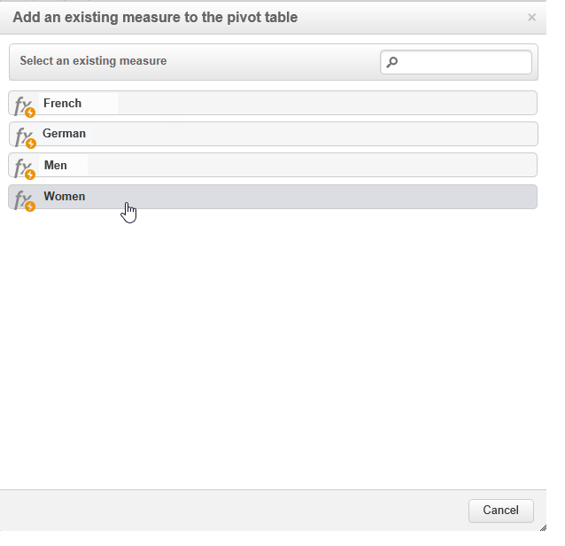

# 使用多维数据集浏览数据{#using-cubes-to-explore-data}

Marketing Analytics可以更轻松地创建报表，以及通过多维数据集识别和选择数据库中的数据。 这样，您就可以：

* 根据多维数据集创建报告。 此处详细介绍了该过程： [浏览报表中的数据](#exploring-the-data-in-a-report).
* 收集数据库中的数据并将其分组到列表中，例如，识别和构建目标和投放。 有关更多信息，请参阅 [构建目标群体](#building-a-target-population).
* 在报表中插入数据透视表，引用报表中的现有多维数据集。 有关更多信息，请参阅 [将数据透视表插入报表](#inserting-a-pivot-table-into-a-report).

>[!NOTE]
>
>创建或修改多维数据集时，需要使用Marketing Analytics。 有关更多信息，请参阅 [关于多维数据集](../../reporting/using/about-cubes.md).

## 浏览报表中的数据 {#exploring-the-data-in-a-report}

### 第1步 — 基于多维数据集创建报告 {#step-1---creating-a-report-based-on-a-cube}

要创建基于多维数据集的报告，请单击 **[!UICONTROL Create]** 按钮 **[!UICONTROL Reports]** 选项卡，然后选择要使用的多维数据集。

此处详细介绍了该过程： [基于多维数据集创建报告](../../reporting/using/creating-indicators.md#creating-a-report-based-on-a-cube).

### 步骤2 — 选择行和列 {#step-2---selecting-lines-and-columns}

默认显示显示立方的前两个维度（在本例中为年龄和城市）。

的 **[!UICONTROL Add]** 通过每个轴上的按钮，可添加尺寸。

1. 选择要在表格的行和列中显示的尺寸。 要实现此目的，请拖放可用维度，如下所示：
1. 从列表中选择要添加到表格的维度：

   

1. 然后，选择此维度的参数。

   

   参数取决于所选维度的数据类型。

   例如，对于日期，可以使用多个级别。 有关更多信息，请参阅 [显示度量](../../reporting/using/concepts-and-methodology.md#displaying-measures).

   在这种情况下，提供了以下选项：

   

   您可以：

   * 在加载期间展开数据：默认情况下，每次更新报表时，都会显示这些值(默认值：否)。
   * 在行末显示总计：当数据显示在列中时，您还可以使用其他选项在行末尾显示总计：列即会添加到表中(默认值：是)。
   * 应用排序：可以根据值、标签或度量(默认值：值)。
   * 以升序(a-z， 0-9)或降序(z-a， 9-0)显示值。
   * 更改加载时要显示的列数(默认情况下：200)。

1. 单击 **[!UICONTROL Ok]** 确认：该维度会添加到现有维度。

   表格上方的黄色横幅显示您已进行更改：单击 **[!UICONTROL Save]** 按钮以保存它们。

   

### 步骤3 — 配置要显示的测量 {#step-3---configuring-the-measures-to-display}

行和列一旦到位，请指明要显示的度量及其显示模式。

默认情况下，只显示一个度量。 要添加或配置度量，请执行以下操作：

1. 单击 **[!UICONTROL Measures]** 按钮。

   

1. 的 **[!UICONTROL Use a measure]** 按钮，可选择现有度量之一。

   

   选择要显示的信息和格式类型。 选项列表取决于已配置的度量类型。

   

   还可通过 **[!UICONTROL Edit the configuration of the pivot table]** 图标。

   

   然后，您可以选择是否显示测量标签。 有关更多信息，请参阅 [配置显示内容](../../reporting/using/concepts-and-methodology.md#configuring-the-display).

1. 有可能利用现有措施来建立新的措施。 为此，请单击 **[!UICONTROL Create a measure]** 并对其进行配置。

   

   可使用以下类型的度量：

   * 措施组合：此类型的度量允许您使用现有度量构建新度量：

      可用的运算符包括：和、差、乘和速率。

   * 比例：此类型的度量允许您计算针对给定维度测量的记录数。 您可以根据维或子维计算比例。
   * 变量：此度量允许您计算级别值的变化。
   * 标准偏差：此类型的度量允许您计算每组单元格中与平均值之间的偏差。 例如，您可以比较所有现有区段的购买量。

   创建的度量将添加到报表中。

   

   创建度量后，可以对其进行编辑，并根据需要更改其配置。 为此，请单击 **[!UICONTROL Measures]** 按钮，然后转到要编辑的测量的选项卡。

   然后，单击 **[!UICONTROL Edit the dynamic measure]** 来访问“设置”菜单。

## 构建目标群体 {#building-a-target-population}

使用多维数据集构建报表允许您从表中收集数据并将其保存在列表中。

为此，请将它们添加到购物车并处理其内容。

要将群体分组到列表中，请应用以下步骤：

1. 单击包含要收集的群体的单元格以选择它们，然后单击 **[!UICONTROL Add to cart]** 图标。

   

   收集各种用户档案时，需要多次执行此操作

1. 单击 **[!UICONTROL Show cart]** 按钮以查看其内容。

   

1. 的 **[!UICONTROL Export]** 按钮可将购物车中的项目分组到列表中。

   您需要指定列表名称和要执行的导出类型。

   

   单击 **[!UICONTROL Start]** 以运行导出。

1. 导出完成后，将显示一条消息，确认其执行情况以及已处理的记录数。

   

   您可以保存购物车的内容或将其清空。

   通过 **[!UICONTROL Profiles and targets]** 选项卡。

   

## 将数据透视表插入报表 {#inserting-a-pivot-table-into-a-report}

要创建表并浏览多维数据集中的数据，请应用以下步骤：

1. 使用单个页面创建新报表，并在其中插入数据透视表。 有关详细信息，请参见[此页面](../../reporting/using/creating-a-table.md#creating-a-breakdown-or-pivot-table)。

   

1. 在 **[!UICONTROL Data]** 选项卡中，选择一个多维数据集以处理它包含的维度并显示计算量度。

   

   这样，您就可以生成要显示的报表。 有关更多信息，请参阅 [步骤2 — 选择行和列](#step-2---selecting-lines-and-columns).
