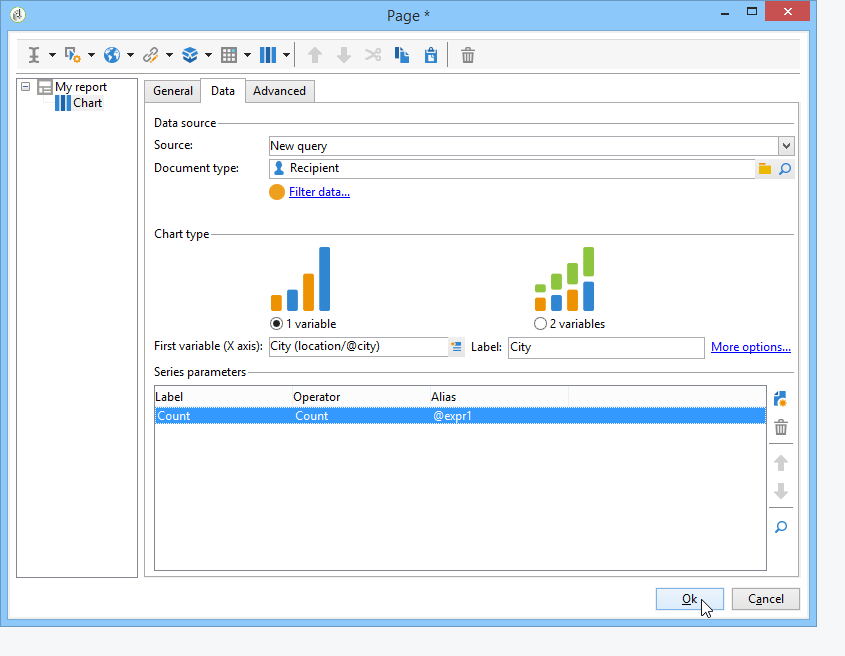

# 使用上下文{#using-the-context}

当您希望以或的形式表示数 **[!UICONTROL tables]** 据 **[!UICONTROL charts]**&#x200B;时，可以从两个来源获取：新查询(请参 [阅定义数据的直接筛选](#defining-a-direct-filter-on-data))或报表上下文(请参 [阅使用上下文数据](#using-context-data))。

## 定义数据的直接过滤器 {#defining-a-direct-filter-on-data}

### 筛选数据 {#filtering-data}

构建 **[!UICONTROL Query]** 报告时，不必使用类型活动。 数据可以直接在构成报告的表和图表中过滤。

这使您能够直接通过报表的活动选择要在报 **[!UICONTROL Page]** 表中显示的数据。

为此，请单击选 **[!UICONTROL Filter data...]** 项卡中的链 **[!UICONTROL Data]** 接：此链接允许您访问表达式编辑器，以定义要分析的查询。

### 示例：在图表中使用过滤器 {#example--use-a-filter-in-a-chart}

在以下示例中，我们希望图表仅显示居住在法国的收件人用户档案以及年内购买的客户。

要定义此过滤器，请将页面放在图表中并进行编辑。 单击链 **[!UICONTROL Filter data]** 接并创建与要显示的数据匹配的筛选器。 有关在Adobe Campaign中构建查询的详细信息，请参 [阅本节](../../platform/using/about-queries-in-campaign.md)。

在此，我们要按选定收件人的城市显示细分。

渲染将如下所示：

### 示例：在透视表中使用过滤器 {#example--use-a-filter-in-a-pivot-table}

在此示例中，过滤器允许您在枢纽表中仅显示非巴黎客户，而无需事先使用其他查询。

应用以下步骤：

1. 将页面放在图表中并进行编辑。
1. 创建透视表。
1. 转到选 **[!UICONTROL Data]** 项卡并选择要使用的多维数据集。
1. 单击链 **[!UICONTROL Filter data...]** 接并定义以下查询，从Adobe列表中删除公司。

   

报告中只显示符合筛选条件的收件人。

## 使用上下文数据 {#using-context-data}

要以某或某种形式表 **[!UICONTROL table]** 示数 **[!UICONTROL chart]**&#x200B;据，数据可以来自报表上下文。

在包含表或图表的页面中，您可 **[!UICONTROL Data]** 以通过选项卡选择数据源。

* 通过 **[!UICONTROL New query]** 此选项，您可以构建查询来收集数据。 有关详细信息，请参 [阅定义数据的直接筛选](#defining-a-direct-filter-on-data)。
* 通过 **[!UICONTROL Context data]** 此选项，您可以使用输入数据：报表的上下文与包含图表或表的页面的入站过渡中包含的信息一致。 例如，此上下文可能包含通过放置在活动之 **[!UICONTROL Query]** 前的活动收 **[!UICONTROL Page]** 集的数据，您需要为其指定报表所关注的表和字段。

例如，在查询框中，为收件人构建以下查询:

然后在报告中指明数据的来源，在这种情况下： **[!UICONTROL Data from the context]**.

数据位置会自动推断。 如有必要，您可以强制使用数据路径。

当您选择统计信息将涉及的数据时，可用字段与查询中指定的数据一致。

