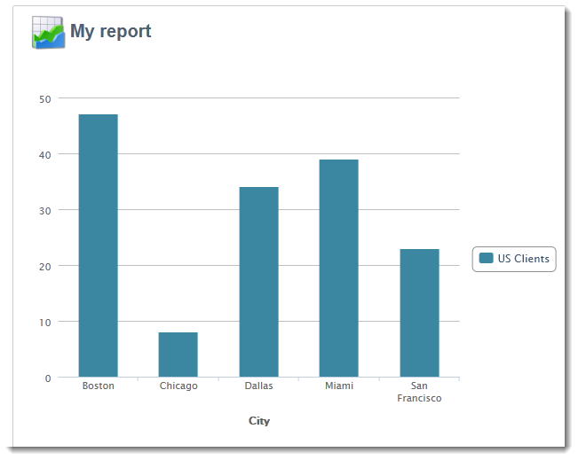

# 在报表中使用上下文{#using-the-context}

当您想要以&#x200B;**[!UICONTROL tables]**&#x200B;或&#x200B;**[!UICONTROL charts]**&#x200B;的形式表示数据时，可以从两个来源获取数据：新查询（请参阅[定义数据的直接筛选器](#defining-a-direct-filter-on-data)）或报表上下文（请参阅[使用上下文数据](#using-context-data)）。

## 定义数据的直接过滤器 {#defining-a-direct-filter-on-data}

### 筛选数据 {#filtering-data}

在构建报告时，不强制使用&#x200B;**[!UICONTROL Query]**&#x200B;类型活动。 可直接在构成报告的表格和图表中过滤数据。

这使您能够通过报表的&#x200B;**[!UICONTROL Page]**&#x200B;活动直接选择要显示在报表中的数据。

为此，请单击&#x200B;**[!UICONTROL Data]**&#x200B;选项卡中的&#x200B;**[!UICONTROL Filter data...]**&#x200B;链接：此链接允许您访问表达式编辑器以定义有关待分析数据的查询。

### 示例：在图表中使用过滤器 {#example--use-a-filter-in-a-chart}

在以下示例中，我们希望图表仅显示生活在法国以及年内购买产品的收件人用户档案。

要定义此筛选器，请将页面放入图表并对其进行编辑。 单击&#x200B;**[!UICONTROL Filter data]**&#x200B;链接并创建与要显示的数据匹配的过滤器。 有关在Adobe Campaign中构建查询的更多信息，请参阅[此章节](../../platform/using/about-queries-in-campaign.md)。

在这里，我们要按城市显示选定收件人的细分。

渲染将如下所示：

### 示例：在透视表中使用筛选器 {#example--use-a-filter-in-a-pivot-table}

在本例中，使用筛选器可在数据透视表中只显示非巴黎客户，而无需预先使用其他查询。

应用以下步骤：

1. 将页面放入图表中并进行编辑。
1. 创建数据透视表。
1. 转到&#x200B;**[!UICONTROL Data]**&#x200B;选项卡并选择要使用的多维数据集。
1. 单击&#x200B;**[!UICONTROL Filter data...]**&#x200B;链接并定义以下查询以从公司列表中删除Adobe。

   

只有符合筛选条件的收件人才会出现在报告中。

## 使用上下文数据 {#using-context-data}

要以&#x200B;**[!UICONTROL table]**&#x200B;或&#x200B;**[!UICONTROL chart]**&#x200B;的形式表示数据，数据可能来自报表上下文。

在包含表或图表的页面中，**[!UICONTROL Data]**&#x200B;选项卡允许您选择数据源。

* **[!UICONTROL New query]**&#x200B;选项允许您生成查询以收集数据。 有关详细信息，请参阅[定义数据的直接筛选器](#defining-a-direct-filter-on-data)。
* 利用&#x200B;**[!UICONTROL Context data]**&#x200B;选项，您可以使用输入数据：报表的上下文与包含图表或表格的页面的集客过渡中包含的信息一致。 例如，此上下文可能包含通过放置在&#x200B;**[!UICONTROL Page]**&#x200B;活动之前的&#x200B;**[!UICONTROL Query]**&#x200B;活动收集的数据，您需要为其指定表和报告涉及的字段。

例如，在查询框中，为收件人生成以下查询：

然后指示报告中的数据源，在此例中为： **[!UICONTROL Data from the context]**。

数据位置会自动推断。 如有必要，您可以强制使用数据路径。

当您选择统计信息将涉及的数据时，可用字段与在查询中指定的数据一致。

