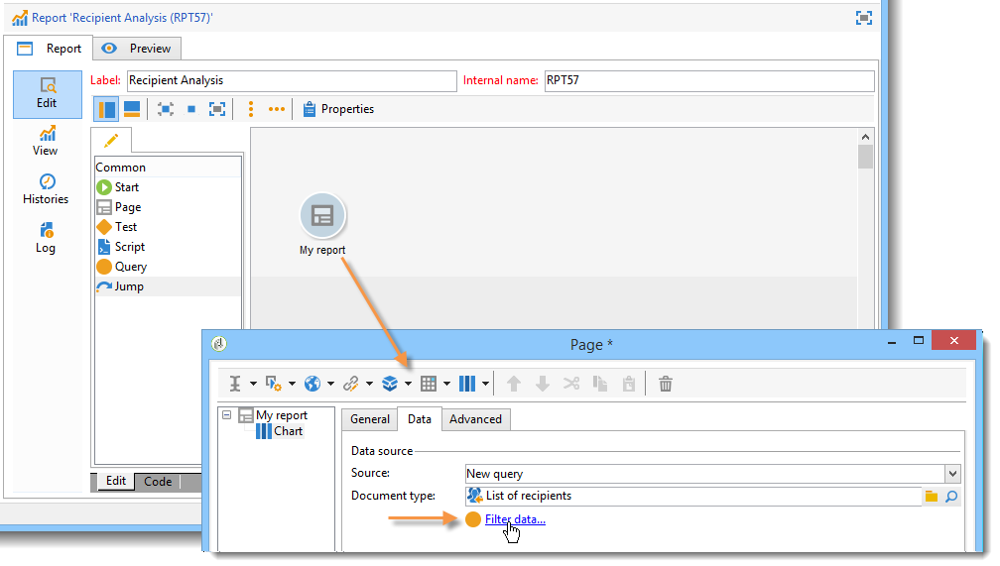

# 使用上下文{#using-the-context}

当您希望以&#x200B;**[!UICONTROL tables]**&#x200B;或&#x200B;**[!UICONTROL charts]**&#x200B;的形式表示数据时，可以从以下两个来源获取该数据：新查询（请参阅[定义数据的直接过滤器](#defining-a-direct-filter-on-data)）或报表上下文（请参阅[使用上下文数据](#using-context-data)）。

## 定义数据的直接过滤器 {#defining-a-direct-filter-on-data}

### 筛选数据 {#filtering-data}

在生成报表时，不必使用&#x200B;**[!UICONTROL Query]**&#x200B;类型活动。 数据可直接在构成报表的表格和图表中过滤。

这样，您就可以通过报表的&#x200B;**[!UICONTROL Page]**&#x200B;活动直接选择要在报表中显示的数据。

为此，请单击&#x200B;**[!UICONTROL Data]**&#x200B;选项卡中的&#x200B;**[!UICONTROL Filter data...]**&#x200B;链接：利用此链接，可访问表达式编辑器以定义有关要分析数据的查询。

### 示例：在图表中使用过滤器 {#example--use-a-filter-in-a-chart}

在以下示例中，我们希望图表仅显示在法国居住的收件人用户档案以及当年购买过的收件人用户档案。

要定义此过滤器，请将页面放入图表中并对其进行编辑。 单击&#x200B;**[!UICONTROL Filter data]**&#x200B;链接并创建与要显示的数据匹配的过滤器。 有关在Adobe Campaign中构建查询的更多信息，请参阅[此部分](../../platform/using/about-queries-in-campaign.md)。

在此，我们要按选定收件人所在城市显示划分结果。

呈现将如下所示：

### 示例：在数据透视表中使用过滤器 {#example--use-a-filter-in-a-pivot-table}

在此示例中，过滤器允许您在数据透视表中仅显示非巴黎客户，而无需事先使用其他查询。

应用以下步骤：

1. 将页面放入图表中并对其进行编辑。
1. 创建数据透视表。
1. 转到&#x200B;**[!UICONTROL Data]**&#x200B;选项卡，然后选择要使用的多维数据集。
1. 单击&#x200B;**[!UICONTROL Filter data...]**&#x200B;链接并定义以下查询，以从公司列表中删除Adobe。

   

只有符合筛选条件的收件人才会显示在报表中。

## 使用上下文数据 {#using-context-data}

要以&#x200B;**[!UICONTROL table]**&#x200B;或&#x200B;**[!UICONTROL chart]**&#x200B;的形式表示数据，数据可以来自报表上下文。

在包含表或图表的页面中，使用&#x200B;**[!UICONTROL Data]**&#x200B;选项卡可以选择数据源。

* 使用&#x200B;**[!UICONTROL New query]**&#x200B;选项可构建查询以收集数据。 有关更多信息，请参阅[定义数据的直接过滤器](#defining-a-direct-filter-on-data)。
* **[!UICONTROL Context data]**&#x200B;选项允许您使用输入数据：报表上下文与包含图表或表的页面集客过渡中包含的信息一致。 例如，此上下文可能包含通过&#x200B;**[!UICONTROL Query]**&#x200B;活动收集的数据，该活动放在&#x200B;**[!UICONTROL Page]**&#x200B;活动之前，您需要为其指定报表所关注的表和字段。

例如，在查询框中，为收件人构建以下查询：

然后，在此示例中指示报表中的数据源：**[!UICONTROL Data from the context]**。

数据位置会自动推断。 如有必要，您可以强制使用数据路径。

当您选择统计信息将涉及的数据时，可用字段与查询中指定的数据一致。

