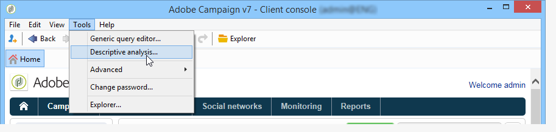

# 使用描述性分析向导{#using-the-descriptive-analysis-wizard}

要创建描述性分析报告，请使用专用向导。 配置取决于要分析的数据和所需的渲染。

## 分析数据库{#analyzing-data-in-the-database}中的数据

描述性分析向导可通过&#x200B;**[!UICONTROL Tools > Descriptive analysis]**&#x200B;菜单启动：在这种情况下，分析默认关注收件人(**nms:收件人**)。 它适用于Adobe Campaign库中的所有数据。

要分析标准收件人之外的表(**nms:收件人**)，请单击向导最后一步中的&#x200B;**[!UICONTROL Advanced settings...]**&#x200B;链接，然后选择与设置匹配的表，在此例中为&#x200B;**cus:individual**:

如果要对部分数据生成统计信息，可以定义过滤器：为此，请单击&#x200B;**[!UICONTROL Advanced settings...]**&#x200B;链接并定义要应用的过滤器，如下所示：

该分析只涉及16岁及以上、住在伦敦的收件人数据库。

## 分析数据集{#analyzing-a-set-of-data}

您可以通过其他上下文使用描述性分析向导：列表、工作流过渡、一个或多个投放、选择收件人等。

它可通过指向Adobe Campaign表的收件人树的多个节点访问。

选择项目并右键单击，打开描述性分析向导。 将仅分析所选数据。

* 对于一组&#x200B;**收件人**，选择要分析的收件人，然后右键单击并选择&#x200B;**[!UICONTROL Actions > Explore...]**，如上所示。 如果对收件人的列表应用过滤器，则只会分析其内容。

   要选择文件夹或当前筛选器中的所有收件人，请使用CTRL+A快捷键。 这意味着，即使未显示的收件人也将被选中。

   有关收件人的描述性分析的示例，请参阅：[定性数据分析](../../reporting/using/use-cases.md#qualitative-data-analysis)。

* 在&#x200B;**工作流**&#x200B;的上下文中，将光标放在指向收件人表的过渡上，右键单击并选择&#x200B;**[!UICONTROL Analyze target]**。 有关详细信息，请参阅[分析工作流](../../reporting/using/use-cases.md#analyzing-a-transition-target-in-a-workflow)中的过渡目标示例。
* 对于&#x200B;**列表**，选择一个或多个列表，并应用与收件人相同的流程。
* 在&#x200B;**投放**&#x200B;的上下文中，选择要分析其目标的投放，右键单击并选择&#x200B;**[!UICONTROL Actions > Explore the target]**，如下所示：

   

   以下是投放的描述性分析示例：[分析人口](../../reporting/using/use-cases.md#analyzing-a-population)，并在此处：[分析收件人跟踪日志](../../reporting/using/use-cases.md#analyzing-recipient-tracking-logs)。

## 配置定性分发模板{#configuring-the-qualitative-distribution-template}

使用&#x200B;**[!UICONTROL Qualitative distribution]**&#x200B;模板可以创建所有类型数据(例如公司名称、电子邮件域)的统计信息。

[显示表](#displaying-data-in-the-table)中的数据中详细介绍了通过&#x200B;**[!UICONTROL Qualitative distribution]**&#x200B;模板创建的报告可用的配置选项。 在[分析人口](../../reporting/using/use-cases.md#analyzing-a-population)中详细介绍了完整示例。

使用描述性分析向导分析数据时，可用选项取决于所选的设置。 详情如下。

### 数据绑定{#data-binning}

选择要显示的变量时，您可以定义数据绑定，即为选定数据配置分组条件。

>[!NOTE]
>
>当使用聚合计算计算涉及的场时，检查&#x200B;**[!UICONTROL The data is already aggregated]**&#x200B;以改进性能。

这些选项会因字段内容而异：

* **[!UICONTROL None]** :通过此选项，可显示变量的所有可用值，而无需进行绑定。

   >[!CAUTION]
   >
   >应谨慎使用此选项：它会对报告和机器性能产生重大影响。

* **[!UICONTROL Auto]** :此选项允许您显示n个最频繁表示的值。这些变量是自动计算的，每个变量与素材箱数相比代表一个百分比。 对于数值，Adobe Campaign会自动生成n个类，将数据排序到其中。
* **[!UICONTROL Manual]** :此选项的操作方 **[!UICONTROL Auto]** 式与选项类似，只是您可以手动设置这些值。为此，请单击值表右侧的&#x200B;**[!UICONTROL Add]**&#x200B;按钮。

   可以在个性化之前通过Adobe Campaign自动初始化值：为此，请输入要生成的素材箱数并单击&#x200B;**[!UICONTROL Initialize with]**&#x200B;链接，如下所示：

   

   然后调整内容以满足您的需求：

   

   根据所需的精度级别，可以按时间、日、月、年等对包含日期的字段进行分组。

   

* **[!UICONTROL Modulo]** :允许您创建数值组。例如，值为10的模允许您创建一个值间隔，该值间隔以十为单位更改。

   

   此示例允许您按年龄组视图收件人细分。

   

### 显示表{#displaying-data-in-the-table}中的数据

使用工具栏可个性化显示表格中的变量：删除列、以行而非列显示数据、将列向左或向右移动、视图或更改值计算。

在窗口的上半部分，您可以选择显示设置。

您可以显示或隐藏统计信息的名称和子合计，并选择统计信息的方向。 有关详细信息，请参阅[分析报告显示设置](../../reporting/using/processing-a-report.md#analysis-report-display-settings)。

### 显示图表{#displaying-data-in-the-chart}中的数据

在描述性分析向导的第一步中，您可以选择仅以图表形式显示数据，而不显示表。 在这种情况下，配置图形时必须完成变量选择。 必须首先选择要显示的变量数，然后从相关数据库中选择字段。

然后选择所需的图表类型。

>[!NOTE]
>
>可以同时在图表和表中显示变量。 为此，请在&#x200B;**[!UICONTROL Table configuration]**&#x200B;窗口中输入变量。 单击&#x200B;**[!UICONTROL Next]**，在图表配置窗口中选择图表类型。 如果子维在表中定义，则不会在图表中显示。

单击&#x200B;**[!UICONTROL Variants]**&#x200B;链接以修改图表属性。

提供的选项取决于所选图表的类型。 有关详细信息，请参见[此页面](../../reporting/using/creating-a-chart.md#chart-types-and-variants)。

### 统计计算{#statistics-calculation}

描述性分析向导允许您计算有关数据的几种类型的统计信息。 默认情况下，只配置一个简单计数。

单击&#x200B;**[!UICONTROL Add]**&#x200B;以创建新统计。

可以执行以下操作：

* **[!UICONTROL Count]** 计算要聚集的字段的所有非空值，包括重复值(聚合字段),
* **[!UICONTROL Average]** 计算数值域中的平均值，
* **[!UICONTROL Minimum]** 计算数值域中值的最小值，
* **[!UICONTROL Maximum]** 计算数值域中值的最大值，
* **[!UICONTROL Sum]** 计算数值域中值的和，
* **[!UICONTROL Standard deviation]** 计算返回值在平均值中的分布情况，
* **[!UICONTROL Row percentage distribution]** 要计算列中值与行中值的比率（仅适用于表）,
* **[!UICONTROL Column percentage distribution]** 要计算行中的值与列中值的比率（仅适用于表）,
* **[!UICONTROL Total percentage distribution]** 计算收件人的分布，

   

* **[!UICONTROL Calculated field]** 以创建个性化的操作员（仅适用于表）。在&#x200B;**[!UICONTROL User function]**&#x200B;字段中可输入要应用于数据的计算。

   示例：根据国家／地区和来源计算每位客户的平均购买额

   

   要在表中显示上述信息，您需要创建一个计算字段来存储每位客户的平均购买量。

   操作步骤：

   1. 计算购买总数。

      

   1. 此统计信息不会显示在表中。 您需要取消选中&#x200B;**[!UICONTROL Advanced]**&#x200B;选项卡的&#x200B;**[!UICONTROL Display in the table]**&#x200B;选项。

      

   1. 新建一个&#x200B;**[!UICONTROL Calculated field]**&#x200B;类型统计信息，并在&#x200B;**[!UICONTROL User function]**&#x200B;字段中输入以下公式：**@purchases/@count**。

      

### 显示报告{#displaying-the-report}

在向导的最后一步中，可以显示已配置的报表，即表或图表。

当报表包含表时，计算结果单元格将着色。 结果越高，颜色越浓。

可以更改结果的布局。 为此，请右键单击相关变量，并从快捷菜单中选取输入。

当报表包含图表时，图例的标签允许您过滤显示的信息：单击标签以在图表中启用／禁用显示。

## 配置定量分发模板{#configuring-the-quantitative-distribution-template}

要自行生成描述性分析，请从模板&#x200B;**中选择**&#x200B;新建描述性分析（如果默认情况下未设置）。

使用&#x200B;**[!UICONTROL Quantitative distribution]**&#x200B;模板，可以生成可衡量或计数的数据的统计信息(例如发票额、收件人年龄)。

通过&#x200B;**[!UICONTROL Quantitative distribution]**&#x200B;模板创建的分析报告的配置模式在实现示例[定量分析](../../reporting/using/use-cases.md#quantitative-data-analysis)中详细说明。

使用描述性分析向导创建定量报告时可用的选项详述如下。

开始，方法是选择计算所关注的变量：

默认情况下，Adobe Campaign优惠一系列要为所选数据计算的统计信息。 您可以根据需要更改此列表、添加到它或删除统计信息。

可以执行以下操作：

* **[!UICONTROL Count]** 计算要聚集的字段的所有非空值，包括重复值(聚合字段),
* **[!UICONTROL Average]** 计算数值域中的平均值，
* **[!UICONTROL Minimum]** 计算数值域中值的最小值，
* **[!UICONTROL Maximum]** 以计算数值字段中的值的最大值。
* **[!UICONTROL Sum]** 计算数值域中值的和，
* **[!UICONTROL Standard deviation]** 以计算返回值在平均值周围的分布方式。
* **[!UICONTROL Number of missing values]** 以计算未定义值的数字字段数。
* **[!UICONTROL Decile distribution]** 分布返回的值，使每个值代表数字字段中值的1/10。
* **[!UICONTROL Custom distribution]** 根据用户定义的阈值分发返回的值。

   通过&#x200B;**[!UICONTROL Detail...]**&#x200B;按钮可编辑统计信息，并根据需要个性化其计算或显示：

   

   向导的最后一步显示定量分析报告。

   

   要更改报告，请参阅[处理报告](../../reporting/using/processing-a-report.md)。

