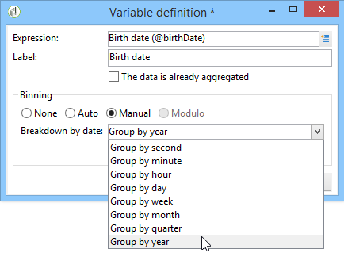
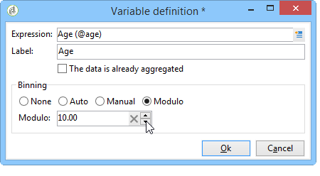
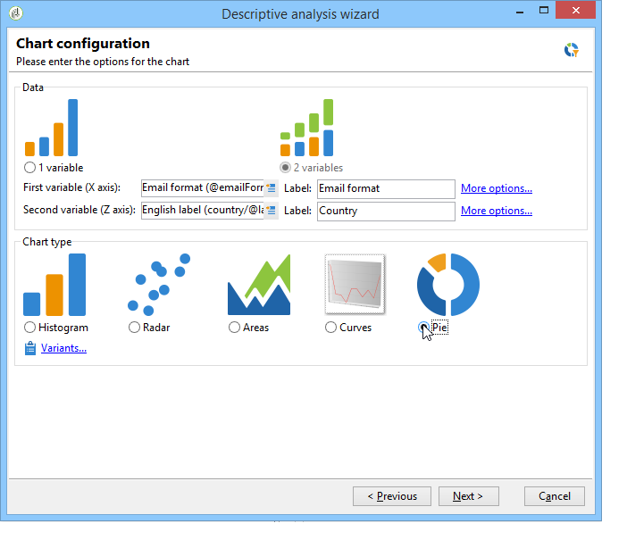

# 使用描述性分析向导{#using-the-descriptive-analysis-wizard}

要创建描述性分析报告，请使用专用向导。 配置取决于要分析的数据和所需的渲染。

## 分析数据库中的数据 {#analyzing-data-in-the-database}

描述性分析向导可通过 **[!UICONTROL Tools > Descriptive analysis]** 菜单：在这种情况下，分析会默认涉及收件人(**nms:recipient**)。 它适用于Adobe Campaign数据库中的所有数据。

要分析标准收件人以外的表，请执行以下操作：**nms:recipient**)，单击 **[!UICONTROL Advanced settings...]** 链接，然后选择与您的设置匹配的表（在本例中为） **cus：单个**:

如果要生成部分数据的统计信息，可以定义过滤器：要执行此操作，请单击 **[!UICONTROL Advanced settings...]** 链接并定义要应用的过滤器，如下所示：

这项分析将仅涉及16岁及以上、居住在伦敦的数据库接收者。

## 分析数据集 {#analyzing-a-set-of-data}

您可以通过其他上下文使用描述性分析向导：列表、工作流过渡、一个或多个投放、一系列收件人等。

它可通过指向收件人表的Adobe Campaign树中的多个节点访问。

选择项目并右键单击以打开描述性分析向导。 将只分析选定的数据。

* 对于 **收件人**，选择要分析的收件人，然后右键单击并选择 **[!UICONTROL Actions > Explore...]**，如上所示。 如果将过滤器应用于收件人列表，则只会分析其内容。

   要选择文件夹或当前筛选器中的所有收件人，请使用CTRL+A快捷键。 这意味着即使收件人未显示，也会被选中。

   有关收件人的描述性分析示例，请参阅： [定性数据分析](../../reporting/using/use-cases.md#qualitative-data-analysis).

* 在 **工作流**，将光标放在指向收件人表的过渡上，右键单击并选择 **[!UICONTROL Analyze target]**. 有关更多信息，请参阅 [在工作流中分析过渡目标](../../reporting/using/use-cases.md#analyzing-a-transition-target-in-a-workflow).
* 对于 **列表**，选择一个或多个列表并应用与收件人相同的流程。
* 在 **投放**，选择要分析其目标的投放，右键单击并选择 **[!UICONTROL Actions > Explore the target]**，如下所示：

   

   此处提供了投放的描述性分析示例： [分析群体](../../reporting/using/use-cases.md#analyzing-a-population) 和此处： [分析收件人跟踪日志](../../reporting/using/use-cases.md#analyzing-recipient-tracking-logs).

## 配置定性分发模板 {#configuring-the-qualitative-distribution-template}

的 **[!UICONTROL Qualitative distribution]** 利用模板，可创建有关所有类型数据（例如，公司名称、电子邮件域）的统计信息。

可用于通过 **[!UICONTROL Qualitative distribution]** 模板详情请参见 [在表中显示数据](#displaying-data-in-the-table). 有关完整示例，请参见 [分析群体](../../reporting/using/use-cases.md#analyzing-a-population).

使用描述性分析向导分析数据时，可用的选项取决于所选的设置。 下文详述了这些内容。

### 数据绑定 {#data-binning}

选择要显示的变量时，您可以定义数据绑定，即为选定数据配置分组条件。

>[!NOTE]
>
>如果计算涉及的字段是使用聚合计算的，请检查 **[!UICONTROL The data is already aggregated]** 以改进性能。

选项将因字段内容而异：

* **[!UICONTROL None]** :利用此选项，可显示变量可用的所有值，而无需进行二进制设置。

   >[!CAUTION]
   >
   >此选项应谨慎使用：它可能对报告和计算机性能产生重大影响。

* **[!UICONTROL Auto]** :利用此选项可显示n个最常表示的值。 它们会自动计算，并且每个值代表变量与箱数的百分比。 对于数值，Adobe Campaign会自动生成n个类以将数据排序到中。
* **[!UICONTROL Manual]** :此选项的操作方式与 **[!UICONTROL Auto]** 选项，但您可以手动设置这些值。 为此，请单击 **[!UICONTROL Add]** 按钮。

   值可在个性化之前由Adobe Campaign自动初始化：要执行此操作，请输入要生成的箱数，然后单击 **[!UICONTROL Initialize with]** 链接，如下所示：

   

   然后，根据您的需求调整内容：

   

   根据所需的精度级别，可以按时间、日、月、年等对包含日期的字段进行分组。

   

* **[!UICONTROL Modulo]** :用于创建数值组。 例如，值为10的取模允许您创建一个值间隔，该值会以10为单位进行更改。

   

   此示例允许您按年龄组查看收件人的划分。

   

### 在表中显示数据 {#displaying-data-in-the-table}

使用工具栏可个性化表格中变量的显示：删除列、以行而非列显示数据、将列向左或向右移动、查看或更改值计算。

利用窗口的上部，可选择显示设置。

您可以显示或隐藏统计信息的名称和子总计，并选择统计信息的方向。 有关更多信息，请参阅 [分析报表显示设置](../../reporting/using/processing-a-report.md#analysis-report-display-settings).

### 在图表中显示数据 {#displaying-data-in-the-chart}

在描述性分析向导的第一步中，您可以选择仅以图表形式显示数据，而不使用表格。 在这种情况下，必须在配置图形时完成变量选择。 必须首先选择要显示的变量数，然后从相关数据库中选择字段。

然后，选择所需的图表类型。

>[!NOTE]
>
>您可以在图表和表格中同时显示变量。 为此，请在 **[!UICONTROL Table configuration]** 窗口。 单击 **[!UICONTROL Next]** 并在图表配置窗口中选择图表类型。 如果子维度在表中定义，则它们不会显示在图表中。

单击 **[!UICONTROL Variants]** 链接以修改图表属性。

提供的选项取决于所选图表的类型。 有关详细信息，请参见[此页面](../../reporting/using/creating-a-chart.md#chart-types-and-variants)。

### 统计计算 {#statistics-calculation}

使用描述性分析向导可以计算有关数据的几种类型的统计信息。 默认情况下，只配置一个简单计数。

单击 **[!UICONTROL Add]** 以创建新统计信息。

可以执行以下操作：

* **[!UICONTROL Count]** 计算要聚合的字段的所有非空值，包括（聚合字段的重复值），
* **[!UICONTROL Average]** 要计算数值字段中值的平均值，
* **[!UICONTROL Minimum]** 要计算数值字段中值的最小值，
* **[!UICONTROL Maximum]** 要计算数值字段中值的最大值，
* **[!UICONTROL Sum]** 要计算数值字段中值的和，
* **[!UICONTROL Standard deviation]** 计算返回值在平均值中的分布情况，
* **[!UICONTROL Row percentage distribution]** 要计算列中值与行中值的比率（仅适用于表），
* **[!UICONTROL Column percentage distribution]** 要计算行中值与列中值的比率（仅适用于表），
* **[!UICONTROL Total percentage distribution]** 计算值所涉收件人的分布，

   

* **[!UICONTROL Calculated field]** 创建个性化运算符（仅适用于表）。 的 **[!UICONTROL User function]** 字段，可输入要应用于数据的计算。

   示例：根据国家/地区和来源计算每位客户的平均购买金额

   

   要在表格中显示上述信息，您需要创建一个计算字段来存储每位客户的平均购买金额。

   操作步骤：

   1. 计算购买总计。

      

   1. 此统计数据不会显示在表格中。 您需要取消选中 **[!UICONTROL Display in the table]** 的 **[!UICONTROL Advanced]** 选项卡。

      

   1. 新建 **[!UICONTROL Calculated field]** 键入统计信息，并在 **[!UICONTROL User function]** 字段： **@purchases/@count**.

      

### 显示报表 {#displaying-the-report}

在向导的最后一步中，您可以显示已配置的报表，即表格或图表。

当报表包含表格时，计算结果单元格会用彩色标记。 结果越高，颜色越浓。

可以更改结果的布局。 要执行此操作，请右键单击相关变量并从快捷菜单中选择输入。

当报表包含图表时，图例的标签允许您过滤显示的信息：单击标签以启用/禁用图表中的显示。

## 配置定量分发模板 {#configuring-the-quantitative-distribution-template}

要自行生成描述性分析，请选择 **从模板新建描述性分析** 选项。

的 **[!UICONTROL Quantitative distribution]** 模板，用于生成可测量或计数的数据的统计信息（例如，发票金额、收件人年龄）。

通过 **[!UICONTROL Quantitative distribution]** 在实施示例中详细介绍了模板 [定量数据分析](../../reporting/using/use-cases.md#quantitative-data-analysis).

使用描述性分析向导创建定量报告时可用的选项如下所述。

首先，选择计算所关注的变量：

默认情况下，Adobe Campaign会提供一系列要为选定数据计算的统计信息。 您可以根据需要更改此列表、将其添加或删除统计信息。

可以执行以下操作：

* **[!UICONTROL Count]** 计算要聚合的字段的所有非空值，包括（聚合字段的重复值），
* **[!UICONTROL Average]** 要计算数值字段中值的平均值，
* **[!UICONTROL Minimum]** 要计算数值字段中值的最小值，
* **[!UICONTROL Maximum]** 来计算数值字段中值的最大值。
* **[!UICONTROL Sum]** 要计算数值字段中值的和，
* **[!UICONTROL Standard deviation]** 来计算返回的值在平均值周围的分布情况。
* **[!UICONTROL Number of missing values]** 来计算没有定义值的数字字段数。
* **[!UICONTROL Decile distribution]** 分布返回的值，使得每个值表示1/10数字字段中的值。
* **[!UICONTROL Custom distribution]** 根据用户定义的阈值分配返回的值。

   的 **[!UICONTROL Detail...]** 按钮，您可以编辑统计信息，并根据需要对其计算或显示进行个性化设置：

   

   向导的最后一步是显示定量分析报表。

   

   要更改报表，请参阅 [处理报表](../../reporting/using/processing-a-report.md).
