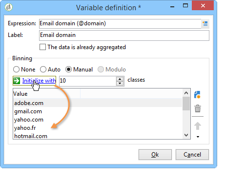

# 使用描述性分析向导{#using-the-descriptive-analysis-wizard}

要创建描述性分析报表，请使用专用向导。 配置取决于要分析的数据以及所需的渲染。

## 分析数据库中的数据 {#analyzing-data-in-the-database}

可以通过启动描述性分析向导 **[!UICONTROL Tools > Descriptive analysis]** 菜单：在这种情况下，分析默认涉及收件人(**nms：recipient**)。 它适用于Adobe Campaign数据库中的所有数据。

要分析标准收件人以外的表(**nms：recipient**)，然后单击 **[!UICONTROL Advanced settings...]** 向导最后阶段的链接，然后选择与您的设置匹配的表，在本例中为 **cus：individual**：

如果要针对部分数据生成统计信息，可以定义过滤器：要执行此操作，请单击 **[!UICONTROL Advanced settings...]** 链接并定义要应用的过滤器，如下所示：

该分析将只涉及16岁及以上且居住在伦敦的数据库收件人。

## 分析一组数据 {#analyzing-a-set-of-data}

您可以通过不同的上下文使用描述性分析向导：列表、工作流过渡、一个或多个投放、收件人选择等。

它可通过Adobe Campaign树中指向收件人表的多个节点访问。

通过选择项目并右键单击以打开描述性分析向导。 将只分析选定的数据。

* 对于集合 **收件人**，选择要分析的收件人，然后右键单击并选择 **[!UICONTROL Actions > Explore...]**，如上所示。 如果将过滤器应用于收件人列表，则只会分析其内容。

  要选择文件夹或当前筛选器中的所有收件人，请使用CTRL+A快捷键。 这意味着即使未显示的收件人，也会被选中。

  有关收件人描述性分析的示例，请参阅： [定性数据分析](../../reporting/using/use-cases.md#qualitative-data-analysis).

* 在上下文中 **工作流**，将光标放在指向收件人表的过渡上，右键单击并选择 **[!UICONTROL Analyze target]**. 有关更多信息，请参阅中的示例。 [分析工作流中的过渡目标](../../reporting/using/use-cases.md#analyzing-a-transition-target-in-a-workflow).
* 对象 **列表**，选择一个或多个列表并应用与收件人相同的流程。
* 在上下文中 **投放**，选择要分析其目标的投放，右键单击并选择 **[!UICONTROL Actions > Explore the target]**，如下所示：

  

  此处提供了投放的描述性分析示例： [分析人群](../../reporting/using/use-cases.md#analyzing-a-population) 此处为： [分析收件人跟踪日志](../../reporting/using/use-cases.md#analyzing-recipient-tracking-logs).

## 配置定性分发模板 {#configuring-the-qualitative-distribution-template}

此 **[!UICONTROL Qualitative distribution]** 通过模板，您可以创建有关所有类型数据（如公司名称、电子邮件域）的统计信息。

对于通过创建的报告可用的配置选项 **[!UICONTROL Qualitative distribution]** 有关模板的详情，请参阅 [在表中显示数据](#displaying-data-in-the-table). 有关完整示例，请参见 [分析人群](../../reporting/using/use-cases.md#analyzing-a-population).

使用描述性分析向导分析数据时，可用的选项取决于所选的设置。 下文将详细介绍这些内容。

### 数据量化 {#data-binning}

在选择要显示的变量时，您可以定义数据绑定，换句话说，您可以为选定数据配置分组标准。

>[!NOTE]
>
>当计算涉及的字段使用聚合进行计算时，请检查 **[!UICONTROL The data is already aggregated]** 以提升性能。

选项将因字段的内容而异：

* **[!UICONTROL None]** ：利用此选项可显示变量可用的所有值，而无需量化。

  >[!CAUTION]
  >
  >使用此选项时请务必谨慎：它可能会对报表和计算机性能产生重大影响。

* **[!UICONTROL Auto]** ：利用此选项可显示n个最常显示的值。 它们会自动计算，并且每个量度代表变量与二进制文件数相比的百分比。 对于数值，Adobe Campaign会自动生成n个类以将数据分类到其中。
* **[!UICONTROL Manual]** ：此选项的操作方式与 **[!UICONTROL Auto]** 选项，但您可以手动设置这些值。 要执行此操作，请单击 **[!UICONTROL Add]** 按钮填充值表的右侧。

  在个性化之前，值可以由Adobe Campaign自动初始化：要实现此目的，请输入要生成的二进制文件数，然后单击 **[!UICONTROL Initialize with]** 链接，如下所示：

  

  然后，根据您的需求调整内容：

  

  根据所需的精度级别，包含日期的字段可以按时间、日、月、年等分组。

  

* **[!UICONTROL Modulo]** ：用于为数值创建值组。 例如，值为10的模允许您创建一个十乘十的值间隔。

  

  通过此示例，您可以查看按年龄组划分的收件人。

  

### 在表中显示数据 {#displaying-data-in-the-table}

使用工具栏个性化表中变量的显示：删除列、以行而非列显示数据、将列向左或向右移动、查看或更改值计算。

窗口的上半部分允许您选择显示设置。

您可以显示或隐藏统计和小计的名称，并选择统计的方向。 有关详细信息，请参见 [分析报表显示设置](../../reporting/using/processing-a-report.md#analysis-report-display-settings).

### 在图表中显示数据 {#displaying-data-in-the-chart}

在描述性分析向导的第一步中，您可以选择仅以图表形式显示数据，而不显示表格。 在这种情况下，配置图形时必须选择变量。 您必须首先选择要显示的变量数量，然后从相关数据库中选择字段。

然后选择所需的图表类型。

>[!NOTE]
>
>您可以同时在图表和表中显示变量。 要执行此操作，请在 **[!UICONTROL Table configuration]** 窗口。 单击 **[!UICONTROL Next]** 并在图表配置窗口中选择图表类型。 如果在表中定义了子维度，则它们不会显示在图表中。

单击 **[!UICONTROL Variants]** 用于修改图表属性的链接。

提供的选项取决于所选的图表类型。 有关详细信息，请参见[此页面](../../reporting/using/creating-a-chart.md#chart-types-and-variants)。

### 统计计算 {#statistics-calculation}

使用描述性分析向导，您可以计算有关数据的多种类型的统计信息。 默认情况下，仅配置一个简单计数。

单击 **[!UICONTROL Add]** 以创建新的统计信息。

可以执行以下操作：

* **[!UICONTROL Count]** 要计算要聚合的字段的所有非空值，包括（聚合字段的）重复值，请执行以下操作：
* **[!UICONTROL Average]** 计算数值域中值的平均值，
* **[!UICONTROL Minimum]** 计算数值域的最小值，
* **[!UICONTROL Maximum]** 计算数值域中值的最大值，
* **[!UICONTROL Sum]** 计算数值域中值的总和，
* **[!UICONTROL Standard deviation]** 计算返回值如何散布在平均值周围，
* **[!UICONTROL Row percentage distribution]** 计算列中值与行中值的比率（仅适用于表），
* **[!UICONTROL Column percentage distribution]** 计算一行中的值与一列中的值的比率（仅适用于表），
* **[!UICONTROL Total percentage distribution]** 要计算值所关注的收件人分布，

  

* **[!UICONTROL Calculated field]** 创建个性化运算符（仅适用于表）。 此 **[!UICONTROL User function]** 字段用于输入要应用于数据的计算。

  示例：根据国家/地区和来源计算每个客户的平均采购额

  

  要在表中显示上述信息，您需要创建一个计算字段，用于存储每位客户的平均购买量。

  操作步骤：

   1. 计算购买总计。

      

   1. 此统计信息不会显示在表中。 您需要取消选中 **[!UICONTROL Display in the table]** 的选项 **[!UICONTROL Advanced]** 选项卡。

      

   1. 新建 **[!UICONTROL Calculated field]** 键入statistics，然后在 **[!UICONTROL User function]** 字段： **@purchases/@count**.

      

### 显示报表 {#displaying-the-report}

向导的最后一步允许您显示报表，即配置的表或图表。

当报表包含表格时，计算结果单元格会着色。 结果越高，颜色就越强烈。

可以更改结果的布局。 要执行此操作，请右键单击相关变量并从快捷菜单中选择输入。

当报表包含图表时，通过图例的标签可以筛选显示的信息：单击标签可以启用/禁用图表中的显示。

## 配置定量分发模板 {#configuring-the-quantitative-distribution-template}

要自行生成描述性分析，请选择 **从模板新建描述性分析** 选项（如果未默认设置）。

此 **[!UICONTROL Quantitative distribution]** 用于生成可测量或计数的数据（如发票金额、收件人的年龄）的统计信息的模板。

通过创建的分析报告的配置模式 **[!UICONTROL Quantitative distribution]** 实施示例中详细介绍了模板 [定量分析](../../reporting/using/use-cases.md#quantitative-data-analysis).

使用描述性分析向导创建定量报告时可用的选项详述如下。

首先，选择计算涉及的变量：

默认情况下，Adobe Campaign提供一系列要针对选定数据计算的统计信息。 您可以根据需要更改此列表、向其添加或删除统计数据。

可以执行以下操作：

* **[!UICONTROL Count]** 要计算要聚合的字段的所有非空值，包括（聚合字段的）重复值，请执行以下操作：
* **[!UICONTROL Average]** 计算数值域中值的平均值，
* **[!UICONTROL Minimum]** 计算数值域的最小值，
* **[!UICONTROL Maximum]** 计算数值字段中值的最大值。
* **[!UICONTROL Sum]** 计算数值域中值的总和，
* **[!UICONTROL Standard deviation]** 以计算返回的值在平均值周围是如何分配的。
* **[!UICONTROL Number of missing values]** 计算未定义值的数字字段数。
* **[!UICONTROL Decile distribution]** 以分布返回的值，使每个值表示数值字段中值的1/10。
* **[!UICONTROL Custom distribution]** 以根据用户定义的阈值分发返回的值。

  此 **[!UICONTROL Detail...]** 按钮允许您编辑统计数据，并根据需要个性化统计数据的计算或显示：

  

  向导的最后一步将显示定量分析报告。

  

  要对报告进行更改，请参阅 [处理报告](../../reporting/using/processing-a-report.md).
