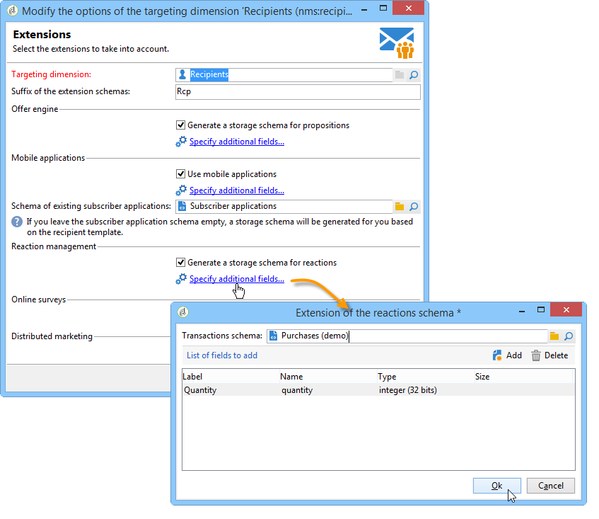

# 配置营销活动响应管理器{#configuration}


本节面向负责配置响应管理的人员。 它假定了有关扩展架构、定义工作流和SQL编程的一定数量的知识。

这样，您就可以了解如何使用个人表来调整标准数据模型，使其适应Adobe Campaign外部事务表的特定性质。 此个人表可以与Adobe Campaign中可用个人表或其他表一致

测量假设由操作流程工作流启动( **[!UICONTROL operationMgt]** )。 每个假设都表示一个单独的进程，以异步方式执行，并且执行状态为（正在编辑、待定、已完成、失败等） 并由调度程序控制，该调度程序管理优先级约束、限制同时进程的数量、低活动页面和以频率自动执行。

## 配置架构 {#configuring-schemas}

>[!CAUTION]
>
>请勿修改应用程序的内置模式，而是使用模式扩展机制。 否则，在应用程序未来升级时，修改的架构将不会更新。 这可能导致使用Adobe Campaign时出现故障。

在使用反应模块之前，需要应用程序集成，以定义要测量的各种表（交易、交易详细信息）及其与投放、优惠和个人的关系。

### 标准架构 {#standard-schemas}

开箱即用 **[!UICONTROL nms:remaMatch]** 模式包含反应日志表，即个体、假设和事务表之间的关系。 此模式应用作反应日志最终目标表的继承模式。

的 **[!UICONTROL nms:remaMatchRcp]** 此模式也是一个标准，它包含为Adobe Campaign收件人( **[!UICONTROL nms:recipient]** )。 要使用，需要将其扩展以映射到事务表（包含购买等）。

### 事务表和事务详细信息 {#transaction-tables-and-transaction-details}

事务表必须包含指向个人的直接链接。

您还可以添加包含事务详细信息的表。 这不会直接与个人关联。

例如，如果我们以收款为例，事务表会链接到联系人（收款表），而收款行表仅链接到收款表（明细表）。 然后，您可以直接在接收行表链接到接收表的层配置假设。

>[!NOTE]
>
>如果要保留用于描述假设中预期行为的接收标识符，则可以扩展nms:remaMatchRcp表模板以向其添加标识符（在此例中，没有将ROI计算链接到这些字段）。

我们强烈建议添加事件日期。

配置完成后，以下架构将显示不同表之间的连接：


### 响应管理和收件人 {#response-management-with-adobe-campaign-recipients}

在此示例中，我们将使用Adobe Campaign内置收件人表在响应管理模块中集成一个购买表 **[!UICONTROL nms:recipient]**.

上的响应日志表 **[!UICONTROL nms:remaMatchRcp]** 收件人已扩展，可添加指向购买表架构的链接。 在以下示例中，将调用购买表 **演示：购买**.

1. 通过Adobe Campaign资源管理器，选择 **[!UICONTROL Administration]** > **[!UICONTROL Campaign management]** > **[!UICONTROL Target mappings]**.
1. 右键单击 **收件人** 然后选择 **[!UICONTROL Actions]** 和 **[!UICONTROL Modify the options of the targeting dimensions]**.

   

1. 您可以将 **[!UICONTROL Extension namespace]** 在下一个窗口中，单击 **[!UICONTROL Next]**.

   

1. 在 **[!UICONTROL Response management]** 类别，请确保 **[!UICONTROL Generate a storage schema for reactions]** 框中。

   然后，单击 **[!UICONTROL Define additional fields...]** 选择相关事务表，并将所需字段添加到nms:remaMatchRcp模式的扩展中。

   

创建的架构如下所示：

```
<srcSchema _cs="Reactions (Recipients) (cus)" entitySchema="xtk:srcSchema" extendedSchema="nms:remaMatchRcp" 
img="nms:remaMatch.png" implements="xtk:persist" label="Reactions (Recipients)" mappingType="sql"
name="remaMatchRcp" namespace="cus">  
 <element label="Reactions (Recipients)" name="remaMatchRcp">    
  <key internal="true" name="match">      
   <keyfield xlink="hypothesis"/>      
   <keyfield xlink="broadLog"/>      
   <keyfield xlink="proposition"/>    
  </key>    
  <attribute label="Quantity" name="quantity" type="long"/>    
  <element name="purchase" target="demo:purchase" type="link"/>    
  <element name="hypothesis" revLabel="Reactions (Recipients)" revLink="remaMatchRcp"/>    
  <element applicableIf="HasPackage('nms:coreInteraction')" label="Proposition" name="proposition" target="nms:propositionRcp" type="link"/>   
  <element desc="Message (Delivery log)" label="Message" name="broadLog" target="nms:broadLogRcp" type="link"/>    
  <element label="Respondent" name="responder" target="nms:recipient" type="link"/>  
 </element>  
 <createdBy _cs="Administrator (admin)"/>  
 <modifiedBy _cs="Administrator (admin)"/>
</srcSchema>
```

### 具有个性化收件人表的响应管理 {#response-management-with-a-personalized-recipient-table}

在此示例中，我们将使用Adobe Campaign中提供的收件人表以外的个人表，在响应管理模块中集成购买表。

* 创建从 **[!UICONTROL nms:remaMatch]** 架构。

   由于个人表与Adobe Campaign收件人表不同，因此必须根据 **[!UICONTROL nms:remaMatch]** 架构。 然后，使用指向投放日志和购买表的链接完成该操作。

   在以下示例中，我们将使用 **demo:broadLogPers** 架构和 **演示：购买** 事务表：

   ```
   <srcSchema desc="Linking of a recipient transaction to a hypothesis"    
   img="nms:remaMatch.png" label="Responses on persons" labelSingular="Responses on a person" name="remaMatchPers" namespace="nms">
     <element name="remaMatchPers" template="nms:remaMatch">
       <key internal="true" name="match">
         <keyfield xlink="hypothesis"/>
        <keyfield xlink="purchase"/>
       </key>
   
       <element name="hypothesis" revLabel="Response logs for persons" revLink="remaMatchPers"/>
       <element applicableIf="HasPackage('nms:interaction')" label="Proposition" name="proposition"
                target="demo:propositionPers" type="link"/>
       <element label="Delivery log" name="broadLog" target="demo:broadLogPers" type="link"/>
     </element>
   </srcSchema>
   ```

* 在 **[!UICONTROL nms:remaHypothesis]** 架构。

   默认情况下，响应日志列表显示在收件人日志中。 因此，您必须修改假设验证表单，才能查看在上一步骤中创建的新响应日志。

   例如：

   ```
    <container type="visibleGroup" visibleIf="[context/@remaMatchStorage]= 'demo:remaMatchPers'">
                 <input hideEditButtons="true" img="nms:remaMatch.png" nolabel="true" refresh="true"
                  toolbarCaption="Responses generated by the hypothesis" type="linklist"
                  xpath="remaMatchPers">
             <input xpath="[.]"/>
             <input xpath="@controlGroup"/>
           </input>
      </container> 
   ```

## 管理指标 {#managing-indicators}

“响应管理器”模块附带一个预定义指示器列表。 但是，您可以添加其他个性化测量指标。

要实现此目的，必须通过为每个新指示器插入两个字段来扩展假设验证表：

* 第一个是目标群体，
* 控制组的第二个。

例如：

```
<srcSchema entitySchema="xtk:srcSchema" extendedSchema="nms:remaHypothesis" label="Measurement hypothesis" 
md5="1D4DED54FF8EC2432AED6736EDE6F547" name="remaHypothesis" namespace="demo" xtkschema="xtk:srcSchema">  
    <element name="remaHypothesis">    
        <element name="indicators">      
            <!-- Quantity -->      
            <attribute label="Total contacted" name="contactReactedTotalQuantity" type="long"/>
            <attribute label="Total number of people in the control group" name="proofReactedTotalquantity" type="long"/> 
        </element> 
    </element>
</srcSchema>
```
