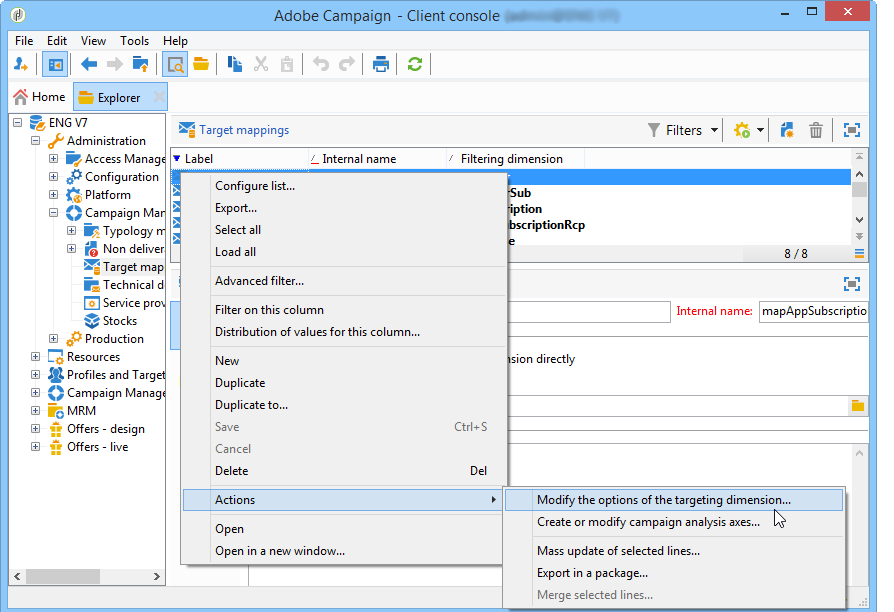

# 配置Campaign响应管理器{#configuration}


本节适用于负责配置响应管理的人员。 它假定您有一定的知识来扩展模式、定义工作流和SQL编程。

这使您了解如何使用个人资料表来调整标准数据模型，以适应Adobe Campaign外部事务表的特定性质。 此个人表可以与Adobe Campaign中的可用个人表或其他表一致

测量假设通过操作流程工作流( **[!UICONTROL operationMgt]** )启动。 每个假设验证表示一个单独的进程，该进程以执行状态（正在编辑、待处理、已完成、失败等）异步执行 并受调度程序控制，该调度程序管理优先级约束、同时进程数量的限制、低活动页面以及频率自动执行。

## 配置架构 {#configuring-schemas}

>[!CAUTION]
>
>请勿修改应用程序的内置架构，而是使用架构扩展机制。 否则，修改后的架构将不会在应用程序未来升级时更新。 这可能会导致使用Adobe Campaign时出现故障。

在使用反应模块之前，需要应用程序集成，以定义要衡量的各种表（交易、交易详细信息）以及它们与投放、优惠和个人的关系。

### 标准架构 {#standard-schemas}

现成的&#x200B;**[!UICONTROL nms:remaMatch]**&#x200B;架构包含反应日志表，即个人、假设验证和事务表之间的关系。 此架构应用作反应日志的最终目标表的继承架构。

**[!UICONTROL nms:remaMatchRcp]**&#x200B;架构也是标准架构，它包含Adobe Campaign收件人( **[!UICONTROL nms:recipient]** )的反应日志存储。 要使用它，需要扩展以映射到包含购买等的事务表。

### 事务表和事务详细信息 {#transaction-tables-and-transaction-details}

事务表必须包含指向个人的直接链接。

您还可以添加包含事务详细信息的表。 这与个人没有直接联系。

以收款为例，事务处理表链接到联系人（收款表），而收款行表仅链接到收款表（明细表）。 然后，您可以在接收行表链接到接收表的层直接配置假设。

>[!NOTE]
>
>如果要保留描述假设中预期行为的接收标识符，则可以扩展nms：remaMatchRcp表模板以向其添加标识符（在这种情况下，不会将ROI计算链接到这些字段）。

我们强烈建议添加事件日期。

完成配置后，以下架构显示不同表之间的联接：


### 响应管理和收件人 {#response-management-with-adobe-campaign-recipients}

在本例中，我们将使用Adobe Campaign内置的收件人表&#x200B;**[!UICONTROL nms:recipient]**&#x200B;在响应管理模块中集成购买表。

**[!UICONTROL nms:remaMatchRcp]**&#x200B;收件人上的响应日志表已扩展，以添加指向购买表架构的链接。 在以下示例中，购买表名为&#x200B;**demo：purchase**。

1. 通过Adobe Campaign资源管理器，选择&#x200B;**[!UICONTROL Administration]** > **[!UICONTROL Campaign management]** > **[!UICONTROL Target mappings]**。
1. 右键单击&#x200B;**收件人**，然后选择&#x200B;**[!UICONTROL Actions]**&#x200B;和&#x200B;**[!UICONTROL Modify the options of the targeting dimensions]**。

   

1. 您可以在下一个窗口中个性化&#x200B;**[!UICONTROL Extension namespace]**，然后单击&#x200B;**[!UICONTROL Next]**。

   

1. 在&#x200B;**[!UICONTROL Response management]**&#x200B;类别中，确保选中&#x200B;**[!UICONTROL Generate a storage schema for reactions]**&#x200B;框。

   然后单击&#x200B;**[!UICONTROL Define additional fields...]**&#x200B;选择相关事务表并将所需字段添加到nms：remaMatchRcp架构的扩展中。

   

创建的架构如下所示：

```
<srcSchema _cs="Reactions (Recipients) (cus)" entitySchema="xtk:srcSchema" extendedSchema="nms:remaMatchRcp" 
img="nms:remaMatch.png" implements="xtk:persist" label="Reactions (Recipients)" mappingType="sql"
name="remaMatchRcp" namespace="cus">  
 <element label="Reactions (Recipients)" name="remaMatchRcp">    
  <key internal="true" name="match">      
   <keyfield xlink="hypothesis"/>      
   <keyfield xlink="broadLog"/>      
   <keyfield xlink="proposition"/>    
  </key>    
  <attribute label="Quantity" name="quantity" type="long"/>    
  <element name="purchase" target="demo:purchase" type="link"/>    
  <element name="hypothesis" revLabel="Reactions (Recipients)" revLink="remaMatchRcp"/>    
  <element applicableIf="HasPackage('nms:coreInteraction')" label="Proposition" name="proposition" target="nms:propositionRcp" type="link"/>   
  <element desc="Message (Delivery log)" label="Message" name="broadLog" target="nms:broadLogRcp" type="link"/>    
  <element label="Respondent" name="responder" target="nms:recipient" type="link"/>  
 </element>  
 <createdBy _cs="Administrator (admin)"/>  
 <modifiedBy _cs="Administrator (admin)"/>
</srcSchema>
```

### 使用个性化收件人表进行响应管理 {#response-management-with-a-personalized-recipient-table}

在本例中，我们将使用Adobe Campaign中提供的收件人表以外的个人表，将购买表集成到响应管理模块中。

* 创建派生自&#x200B;**[!UICONTROL nms:remaMatch]**&#x200B;架构的新响应日志架构。

  由于个人表与Adobe Campaign收件人表不同，因此需要基于&#x200B;**[!UICONTROL nms:remaMatch]**&#x200B;架构创建响应日志的新架构。 然后填写指向投放日志和购买表的链接。

  在以下示例中，我们将使用&#x200B;**demo：broadLogPers**&#x200B;架构和&#x200B;**demo：purchase**&#x200B;事务表：

  ```
  <srcSchema desc="Linking of a recipient transaction to a hypothesis"    
  img="nms:remaMatch.png" label="Responses on persons" labelSingular="Responses on a person" name="remaMatchPers" namespace="nms">
    <element name="remaMatchPers" template="nms:remaMatch">
      <key internal="true" name="match">
        <keyfield xlink="hypothesis"/>
       <keyfield xlink="purchase"/>
      </key>
  
      <element name="hypothesis" revLabel="Response logs for persons" revLink="remaMatchPers"/>
      <element applicableIf="HasPackage('nms:interaction')" label="Proposition" name="proposition"
               target="demo:propositionPers" type="link"/>
      <element label="Delivery log" name="broadLog" target="demo:broadLogPers" type="link"/>
    </element>
  </srcSchema>
  ```

* 修改&#x200B;**[!UICONTROL nms:remaHypothesis]**&#x200B;架构中的假设验证表单。

  默认情况下，响应日志的列表会显示在收件人日志中。 因此，您必须修改假设验证表单，以查看在上一步中创建的新响应日志。

  例如：

  ```
   <container type="visibleGroup" visibleIf="[context/@remaMatchStorage]= 'demo:remaMatchPers'">
                <input hideEditButtons="true" img="nms:remaMatch.png" nolabel="true" refresh="true"
                 toolbarCaption="Responses generated by the hypothesis" type="linklist"
                 xpath="remaMatchPers">
            <input xpath="[.]"/>
            <input xpath="@controlGroup"/>
          </input>
     </container> 
  ```

## 管理指标 {#managing-indicators}

响应管理器模块附带了一个预定义指标列表。 但是，您可以添加其他个性化测量指标。

为此，您必须通过为每个新指示符插入两个字段来扩展假设验证表：

* 第一个目标人群，
* 第二组用于对照组。

例如：

```
<srcSchema entitySchema="xtk:srcSchema" extendedSchema="nms:remaHypothesis" label="Measurement hypothesis" 
md5="1D4DED54FF8EC2432AED6736EDE6F547" name="remaHypothesis" namespace="demo" xtkschema="xtk:srcSchema">  
    <element name="remaHypothesis">    
        <element name="indicators">      
            <!-- Quantity -->      
            <attribute label="Total contacted" name="contactReactedTotalQuantity" type="long"/>
            <attribute label="Total number of people in the control group" name="proofReactedTotalquantity" type="long"/> 
        </element> 
    </element>
</srcSchema>
```
