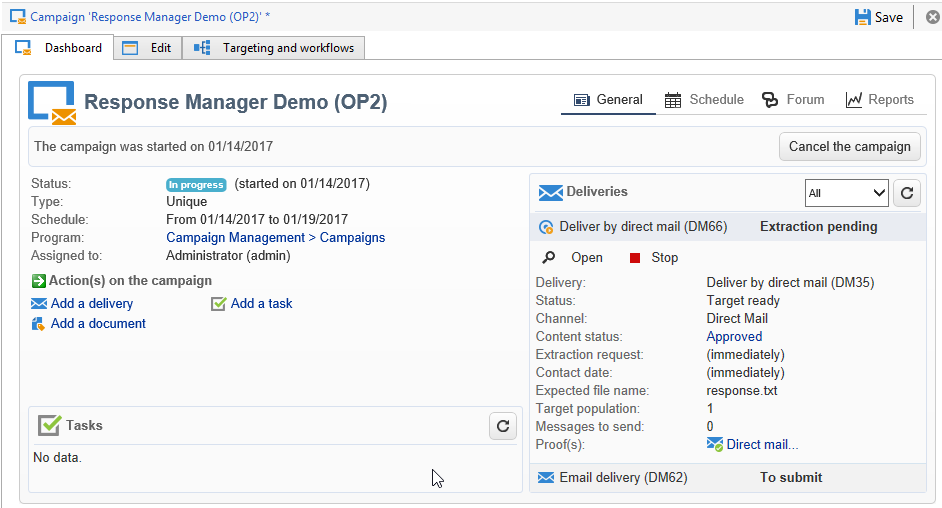

# 创建假设验证{#creating-hypotheses}

创建/将假设关联到Campaign选件或投放的可能性有多种：

* 通过&#x200B;**[!UICONTROL Measurement hypotheses]**&#x200B;文件夹，方法是：基于现有模板创建新假设验证，并将其链接到现有投放。
* 通过营销活动中的&#x200B;**[!UICONTROL Edit]** > **[!UICONTROL Measurement]**&#x200B;选项卡。
* 通过从营销活动创建的投放的&#x200B;**[!UICONTROL Measurement]**&#x200B;选项。

只有在启动营销活动且收件人收到投放后，才能计算假设验证。 如果假设基于优惠建议，则后者至少需要呈现，并且仍然有效。 优惠和投放假设是通过&#x200B;**[!UICONTROL Measurement hypotheses]**&#x200B;文件夹创建的，并且基于假设模板。 但是，可以在活动开始之前直接在投放或活动中引用假设验证。 在这种情况下，一旦启动营销活动，将根据执行设置自动计算假设验证。 [了解详情](hypothesis-templates.md#hypothesis-template-execution-settings)

## 在投放时动态创建假设验证 {#creating-a-hypothesis-on-the-fly-on-a-delivery}

要对现有投放创建假设验证，请应用以下流程：

>[!NOTE]
>
>此操作仅适用于待处理的投放。

1. 在Adobe Campaign树中，转到&#x200B;**[!UICONTROL Campaign management > Measurement hypotheses]**。
1. 单击&#x200B;**[!UICONTROL New]**&#x200B;按钮或右键单击假设列表，然后在下拉列表中选择&#x200B;**[!UICONTROL New]**。

   

1. 在假设验证窗口中，选择之前创建的模板。 [了解详情](hypothesis-templates.md)

   

   在所选模型中定义的假设验证上下文将显示在窗口中。

   >[!NOTE]
   >
   >在模板中定义但在此步骤中不可见的设置也会保留在内存中，并重新分配给正在进行的假设验证。

   

1. 选择要为其创建假设验证的投放。

   

1. 您可以通过编辑&#x200B;**[!UICONTROL General]**、**[!UICONTROL Transactions]**&#x200B;和&#x200B;**[!UICONTROL Scope]**&#x200B;选项卡来个性化您的假设验证。 [了解详情](hypothesis-templates.md#creating-a-hypothesis-model)
1. 通过单击&#x200B;**[!UICONTROL Start]**&#x200B;开始假设验证。

   将自动创建工作流以执行测量。 根据假设验证配置，会自动定义名称。

   >[!CAUTION]
   >
   >如果您已选中&#x200B;**[!UICONTROL Keep execution workflow]**&#x200B;框，则可以访问此项。\
   >如果运行假设验证时出错，则必须仅出于调试目的激活此选项。 自动生成的工作流保存在Adobe Campaign资源管理器的&#x200B;**[!UICONTROL Administration]** > **[!UICONTROL Production]** > **[!UICONTROL Objects created automatically]** > **[!UICONTROL Campaign workflows]**&#x200B;文件夹中。
   > 
   >此外，不得修改自动生成的工作流。 在以后的计算中，最终的任何修改都不会被考虑在内。
   >
   >如果选中了此选项，则在执行工作流后将其删除。

   

   计算完成后，测量指标将自动更新。

   

1. 如有必要，请更改设置并重新启动假设验证。

## 在活动投放中引用假设验证 {#referencing-a-hypothesis-in-a-campaign-delivery}

您可以在营销活动开始之前引用假设验证。 在这种情况下，一旦发送投放，就会根据假设验证模板中定义的执行设置，自动启动假设验证。 要在投放中创建假设验证，请应用以下流程：

1. 根据您的需要，您可以创建一个或多个&#x200B;**[!UICONTROL Delivery]**&#x200B;类型模板，如[此部分](hypothesis-templates.md#creating-a-hypothesis-model)中所述
1. 创建营销活动和定位工作流。
1. 在投放窗口中，单击&#x200B;**[!UICONTROL Delivery measurement]**&#x200B;图标。
1. 选择假设验证模板（模型中配置的查询将显示在假设验证窗口中）。

   一旦营销活动完成，系统会根据模型中配置的日期，自动计算假设验证。 [了解详情](hypothesis-templates.md#hypothesis-template-execution-settings)

   

## 向营销活动的投放添加默认假设验证 {#adding-a-default-hypothesis-to-deliveries-for-a-campaign}

您可以在活动级别直接引用假设验证。 在这种情况下，假设验证将自动链接到营销活动中创建的所有投放。 操作步骤：

1. 转到营销活动的&#x200B;**[!UICONTROL Edit]**&#x200B;选项卡。
1. 在测量部分中，单击&#x200B;**[!UICONTROL Default hypotheses]**&#x200B;选项卡。

   

1. 单击&#x200B;**[!UICONTROL Add]**&#x200B;并选择假设验证模板。

   

   默认情况下，营销活动的每个新投放都将引用基于此模板的假设。

   

可以在假设验证的&#x200B;**[!UICONTROL General]**&#x200B;和&#x200B;**[!UICONTROL Reactions]**&#x200B;选项卡中查看假设验证结果。 [了解详情](hypothesis-tracking.md)

有关详细信息，您还可以参考[此示例](#example--creating-a-hypothesis-linked-to-a-delivery)。

## 对优惠创建假设验证 {#creating-a-hypothesis-on-an-offer}

创建关于优惠建议的假设与创建即时投放假设类似。 只要选件处于活动状态，就可以执行假设验证。 计算期间基于优惠建议日期。 当假设验证允许您将收件人链接到购买时，可能会被接受的优惠建议状态可以自动更改。 [了解详情](hypothesis-templates.md#transactions)

1. 按照[此部分](hypothesis-templates.md#creating-a-hypothesis-model)中的说明创建一个或多个&#x200B;**[!UICONTROL Offer]**&#x200B;类型模型。
1. 转到&#x200B;**[!UICONTROL Campaign management > Measurement hypotheses]**&#x200B;节点。
1. 通过选择之前创建的模型来创建&#x200B;**[!UICONTROL Offers]**&#x200B;类型假设验证。

   

   在模型中创建的查询将出现在窗口中。

   

1. 选择要为其创建假设验证的选件。

   

1. 根据需要优化查询。
1. 单击&#x200B;**[!UICONTROL Start]**&#x200B;运行假设验证。
1. 可以在其&#x200B;**[!UICONTROL General]**&#x200B;和&#x200B;**[!UICONTROL Reactions]**&#x200B;选项卡中查看假设验证结果。 [了解详情](hypothesis-tracking.md)

   对选件所做的假设已在&#x200B;**[!UICONTROL Measurement]**&#x200B;选项卡中引用。

   

   如果在假设验证模板中启用了&#x200B;**[!UICONTROL Update offer proposition status]**&#x200B;选项，则优惠建议的状态会自动更改，从而提供有关促销活动影响的反馈（有关更多信息，请参阅[交易](hypothesis-templates.md#transactions)）。

## 示例：创建与投放关联的假设验证 {#example--creating-a-hypothesis-linked-to-a-delivery}

在本例中，我们要创建一个与投放相关的假设验证。 此假设将基于之前创建的模型。 [了解详情](hypothesis-templates.md#example--creating-a-hypothesis-template-on-a-delivery)

然后，我们将优化从模型继承的查询，以对购买表的特定文章进行假设。

1. 创建活动和投放。 [了解详情](../../campaign/using/setting-up-marketing-campaigns.md#creating-a-campaign)

   在我们的示例中，我们将使用直邮类型投放。

1. 配置种子地址：之前创建的假设验证模板配置为在反应结果中考虑控制组。

   

   >[!NOTE]
   >
   >有关更多信息，请参见[此章节](../../campaign/using/marketing-campaign-deliveries.md#defining-a-control-group)。

1. 打开&#x200B;**[!UICONTROL Direct mail delivery]**&#x200B;并单击&#x200B;**[!UICONTROL Delivery measurement]**&#x200B;图标，然后单击&#x200B;**[!UICONTROL Add]**。

   

1. 从下拉列表中选择之前创建的假设验证模板。

   

   将显示在模型中创建的查询。

   

1. 单击&#x200B;**[!UICONTROL Edit query...]**&#x200B;并通过输入假设验证将涉及的产品来优化查询。

   

   您可以在营销活动的&#x200B;**[!UICONTROL Edit]** > **[!UICONTROL Measurement]**&#x200B;选项卡中检查假设验证是否与投放相关联。

   

1. 启动定位工作流并运行必要的检查，直到营销活动完成。 [了解详情](../../campaign/using/marketing-campaign-deliveries.md#starting-a-delivery)

   

1. 在Adobe Campaign树中，转到&#x200B;**[!UICONTROL Campaign management > Measurement hypotheses]**&#x200B;节点以检查由假设验证计算的指标。

   
