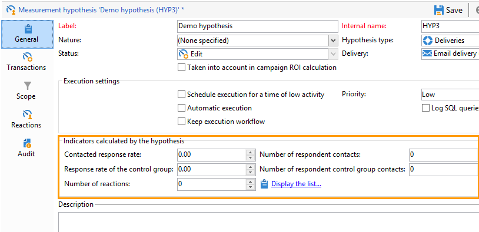

# 创建假设验证{#creating-hypotheses}

创建假设/将假设链接到营销活动选件或投放有多种可能性：

* 通过 **[!UICONTROL Measurement hypotheses]** 文件夹，方法是根据现有模板创建新假设，并将其链接到现有投放。
* 通过 **[!UICONTROL Edit]** > **[!UICONTROL Measurement]** 选项卡。
* 通过 **[!UICONTROL Measurement]** 从营销策划创建的投放的选项。

仅当营销活动启动且收件人收到投放后，才能计算假设验证。 如果假设是基于一个优惠建议的，那么后者至少需要被提出，并且仍然是主动的。 通过 **[!UICONTROL Measurement hypotheses]** 文件夹和基于假设验证模板。 但是，在营销活动开始之前，可以直接在投放或营销活动中引用假设验证。 在这种情况下，一旦启动营销活动，将根据执行设置自动计算假设。 [了解详情](hypothesis-templates.md#hypothesis-template-execution-settings)

## 在投放中即时创建假设 {#creating-a-hypothesis-on-the-fly-on-a-delivery}

要对现有投放创建假设验证，请应用以下流程：

>[!NOTE]
>
>此操作仅适用于待处理投放。

1. 在Adobe Campaign树中，转到 **[!UICONTROL Campaign management > Measurement hypotheses]**.
1. 单击 **[!UICONTROL New]** 按钮或右键单击假设列表并选择 **[!UICONTROL New]** 中。

   

1. 在假设验证窗口中，选择之前创建的模板。 [了解详情](hypothesis-templates.md)

   

   在所选模型中定义的假设上下文将显示在窗口中。

   >[!NOTE]
   >
   >在模板中定义且在此步骤中不可见的设置也会保留在内存中，并重新分配到正在进行的假设。

   

1. 选择要为其创建假设验证的投放。

   

1. 您可以通过编辑 **[!UICONTROL General]**, **[!UICONTROL Transactions]** 和 **[!UICONTROL Scope]** 选项卡。 [了解详情](hypothesis-templates.md#creating-a-hypothesis-model)
1. 通过点击 **[!UICONTROL Start]**.

   将自动创建工作流以执行测量。 名称会根据假设验证配置自动定义。

   >[!CAUTION]
   >
   >如果已选中 **[!UICONTROL Keep execution workflow]** 框中。\
   >出于调试目的，如果运行假设时出错，必须仅激活此选项。 自动生成的工作流将保存在 **[!UICONTROL Administration]** > **[!UICONTROL Production]** > **[!UICONTROL Objects created automatically]** > **[!UICONTROL Campaign workflows]** 文件夹。
   > 
   >此外，不得修改自动生成的工作流。 在其他地方，任何最终修改都不会被考虑，以备日后计算。
   >
   >如果已选中此选项，请在执行该工作流后将其删除。

   

   计算完成后，测量指标会自动更新。

   

1. 如有必要，请更改设置并重新启动假设验证。

## 在促销活动投放中引用假设验证 {#referencing-a-hypothesis-in-a-campaign-delivery}

您可以在营销活动启动前引用该假设。 在这种情况下，假设验证将根据假设验证模板中定义的执行设置，在发送投放后自动启动。 要在投放中创建假设，请应用以下流程：

1. 根据您的需要，您可以创建一个或多个 **[!UICONTROL Delivery]** 类型模板，如 [此部分](hypothesis-templates.md#creating-a-hypothesis-model)
1. 创建营销活动和定位工作流。
1. 在投放窗口中，单击 **[!UICONTROL Delivery measurement]** 图标。
1. 选择假设验证模板（在模型中配置的查询显示在假设验证窗口中）。

   营销活动完成后，将根据模型中配置的日期自动计算假设。 [了解详情](hypothesis-templates.md#hypothesis-template-execution-settings)

   

## 为营销活动的投放添加默认假设验证 {#adding-a-default-hypothesis-to-deliveries-for-a-campaign}

您可以直接引用营销活动级别的假设验证。 在这种情况下，假设将自动链接到营销活动中创建的所有投放。 操作步骤：

1. 转到 **[!UICONTROL Edit]** 选项卡。
1. 在测量部分中，单击 **[!UICONTROL Default hypotheses]** 选项卡。

   

1. 单击 **[!UICONTROL Add]** 并选择一个假设验证模板。

   

   现在，基于此模板的假设验证将在营销活动的每个新投放中默认引用。

   

假设结果可在 **[!UICONTROL General]** 和 **[!UICONTROL Reactions]** 假设的标签。 [了解详情](hypothesis-tracking.md)

有关更多信息，您还可以参阅 [此示例](#example--creating-a-hypothesis-linked-to-a-delivery).

## 对优惠创建假设验证 {#creating-a-hypothesis-on-an-offer}

就优惠建议创建假设与即时投放假说类似。 只要选件处于活动状态，就可以执行该假设。 计算期间基于优惠建议日期。 当假设允许您将收件人关联到购买时，可能会被接受的选件建议的状态将自动更改。 [了解详情](hypothesis-templates.md#transactions)

1. 创建一个或多个 **[!UICONTROL Offer]** 类型模型，如 [此部分](hypothesis-templates.md#creating-a-hypothesis-model).
1. 转到 **[!UICONTROL Campaign management > Measurement hypotheses]** 节点。
1. 创建 **[!UICONTROL Offers]** 通过选择之前创建的模型来键入假设验证。

   

   在模型中创建的查询将出现在窗口中。

   

1. 选择要为其创建假设的选件。

   

1. 根据需要优化查询。
1. 单击 **[!UICONTROL Start]** 来验证假设。
1. 假设结果可从其中看出 **[!UICONTROL General]** 和 **[!UICONTROL Reactions]** 选项卡。 [了解详情](hypothesis-tracking.md)

   在 **[!UICONTROL Measurement]** 选项卡。

   

   如果 **[!UICONTROL Update offer proposition status]** 假设验证模板中启用了选项，则会自动更改选件主张的状态，从而对促销活动的影响提供反馈(有关更多信息，请参阅 [交易](hypothesis-templates.md#transactions))。

## 示例：创建与投放链接的假设 {#example--creating-a-hypothesis-linked-to-a-delivery}

在本例中，我们要创建链接到投放的假设验证。 此假设将基于之前创建的模型。 [了解详情](hypothesis-templates.md#example--creating-a-hypothesis-template-on-a-delivery)

然后，我们将优化从模型继承的查询，以对购买表的特定文章进行假设验证。

1. 创建营销活动和投放。 [了解详情](../../campaign/using/setting-up-marketing-campaigns.md#creating-a-campaign)

   在本例中，我们将使用直邮类型投放。

1. 配置种子地址：之前创建的假设验证模板配置为在反应结果中考虑控制组。

   

   >[!NOTE]
   >
   >有关更多信息，请参见[此章节](../../campaign/using/marketing-campaign-deliveries.md#defining-a-control-group)。

1. 打开 **[!UICONTROL Direct mail delivery]** ，然后单击 **[!UICONTROL Delivery measurement]** 图标，然后单击 **[!UICONTROL Add]**.

   

1. 从下拉列表中选择之前创建的假设验证模板。

   

   随即会显示在模型中创建的查询。

   

1. 单击 **[!UICONTROL Edit query...]** 并通过输入假设将涉及的产品来优化查询。

   

   您可以检查假设是否已链接到 **[!UICONTROL Edit]** > **[!UICONTROL Measurement]** 选项卡。

   

1. 启动定位工作流并运行必要的检查，直到营销活动完成。 [了解详情](../../campaign/using/marketing-campaign-deliveries.md#starting-a-delivery)

   

1. 在Adobe Campaign树中，转到 **[!UICONTROL Campaign management > Measurement hypotheses]** 节点来检查由假设计算的指标。

   
