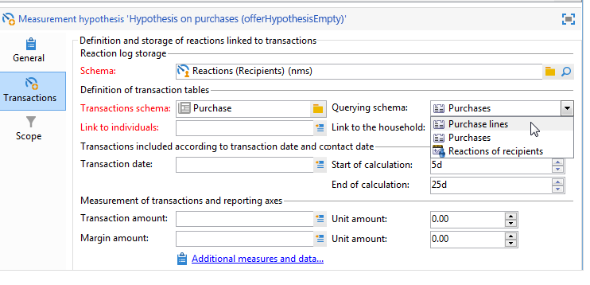

# 假设验证模板{#hypothesis-templates}

## 创建假设验证模型 {#creating-a-hypothesis-model}

通过配置假设验证模板，您可以定义用于测量反应的上下文，无论是投放还是选件。 这里引用了各种测量表，包括用于定义个人、假设和事务表之间关系的测量表。

要创建假设验证模板，请应用以下步骤：

1. 在Adobe Campaign资源管理器中，单击&#x200B;**[!UICONTROL Resources>Templates>Hypothesis templates]**。

   

1. 单击&#x200B;**[!UICONTROL New]**&#x200B;或右键单击模板列表，然后在下拉列表中选择&#x200B;**[!UICONTROL New]**。
1. 输入假设验证标签。
1. 指定模板是用于通过&#x200B;**[!UICONTROL Hypothesis type]**&#x200B;进行选件或投放的假设验证。
1. 对于&#x200B;**[!UICONTROL Delivery]**&#x200B;类型模板，指定是否应使用控制组执行测量。 [了解详情](#properties-of-a-hypothesis-template)
1. 对于&#x200B;**[!UICONTROL Delivery]**&#x200B;类型模板，您可以选择特定渠道，或决定使用&#x200B;**[!UICONTROL Channel]**&#x200B;下拉列表将该模板应用于Adobe Campaign中的所有可用渠道。 [了解详情](#properties-of-a-hypothesis-template)
1. 选择要在其中创建并自动执行将从此模板创建的假设验证的&#x200B;**[!UICONTROL Execution folder]**。
1. 选择执行设置。 [了解详情](#hypothesis-template-execution-settings)
1. 指定假设计算周期。 [了解详情](#hypothesis-template-execution-settings)

   >[!CAUTION]
   >
   >此期限由联系日期确定。

1. 在&#x200B;**[!UICONTROL Transactions]**&#x200B;选项卡中，指定假设验证计算所需的表和字段。 [了解详情](#transactions)
1. 如果为&#x200B;**[!UICONTROL Offer]**&#x200B;类型假设配置了模板，则可以启用&#x200B;**[!UICONTROL Update offer proposition status]**&#x200B;选项：在这种情况下，选择要更改的选件建议的状态。
1. 指定假设验证应用的范围。 [了解详情](#hypothesis-perimeter)
1. 如有必要，请使用脚本完成筛选。 [了解详情](#hypothesis-perimeter)

### 假设验证模板的性质 {#properties-of-a-hypothesis-template}

模板的&#x200B;**[!UICONTROL General]**&#x200B;选项卡允许您指定常规模板选项。 可用字段包括：

* **[!UICONTROL Hypothesis type]**:允许您确定模板是否应用于有关投放或选件的假设验证。

   您还可以选择创建将应用于投放和选件的假设验证。

   >[!NOTE]
   >
   >如果模板适用于选件，则&#x200B;**[!UICONTROL Update offer proposition status]**&#x200B;选项在&#x200B;**[!UICONTROL Transactions]**&#x200B;选项卡中可用。

* **[!UICONTROL Measurement with control group]**:用于声明是否已为投放或营销活动定义控制组，并将其包含在测量指标中。控制组（不接收投放）允许您通过将投放后的营销活动与已接收投放的目标群体进行比较，来衡量投放后营销活动的影响。

   >[!NOTE]
   >
   >如果将模板配置为考虑控制组，但在假设验证涉及的投放中未定义任何组，则结果将仅基于目标收件人。

   有关定义和配置控制组的更多信息，请参阅[此部分](../../campaign/using/marketing-campaign-deliveries.md#defining-a-control-group)。

* **[!UICONTROL Channel]**:您可以选择特定的渠道，或通过在下拉列表中进行选择，使假设验证模板可用于Adobe Campaign **[!UICONTROL All channels]** 控制台中的所有渠道。如果为特定渠道配置模板，则在创建假设验证时，可以自动按渠道过滤投放。 [了解详情](creating-hypotheses.md)

   

* **[!UICONTROL Execution folder]**:用于指定假设验证的执行文件夹。
* **[!UICONTROL Taken into account in campaign ROI calculation]**:在相关促销活动的ROI计算中考虑假设结果。

### 假设验证模板执行设置 {#hypothesis-template-execution-settings}

模板的&#x200B;**[!UICONTROL General]**&#x200B;选项卡还允许您指定假设验证执行参数。 可用选项如下：

* **[!UICONTROL Schedule execution for a time of low activity]**:允许您计划假设验证启动以优化Adobe Campaign性能。选中此选项后，营销活动的处理工作流会在停机期间执行假设计算。

   

* **[!UICONTROL Priority]**:级别，用于在同时执行假设的情况下排除假设计算顺序。

   

* **[!UICONTROL Automatic execution]**:如有必要，您可以安排假设验证重新计算（例如，如果要定期更新指标，直到投放结束）。

   

   要指定计划，请应用以下流程：

   1. 单击&#x200B;**[!UICONTROL Frequency of execution...]**&#x200B;链接，然后单击&#x200B;**[!UICONTROL Change...]**&#x200B;按钮。

      

   1. 配置频率、相关事件和有效期。

      

   1. 单击&#x200B;**[!UICONTROL Finish]**&#x200B;以保存计划。

      

* **[!UICONTROL Log SQL queries in journal]**:此函数专家用户专用。它允许您向测量假设验证审核中添加一个选项卡，以显示SQL查询。 这样，当模拟结束有错误时，就可以检测可能的故障。
* **[!UICONTROL Keep execution workflow]**:允许您保留在假设验证计算开始时自动生成的工作流。在从选中此选项的模板创建的假设验证中，生成的工作流可用于遵循该过程。

   >[!CAUTION]
   >
   >出于调试目的，如果运行假设时出错，必须仅激活此选项。\
   >此外，不得修改自动生成的工作流。 在其他地方，任何最终修改都不会被考虑，以备日后计算。\
   >如果已选中此选项，请在执行该工作流后将其删除。

### 交易 {#transactions}

此选项卡包含各种字段和表，用于保存收件人反应在交易记录方面的历史记录。 有关专门用于响应管理的表的详细信息，请参阅此[部分](../../configuration/using/about-schema-reference.md)。

* **[!UICONTROL Schema (reaction log storage)]**:选择收件人反应表。Adobe Campaign中的现成表是&#x200B;**NmsRemaMatchRcp**。
* **[!UICONTROL Transaction schema]**:选择假设将涉及的表，即交易或购买表。
* **[!UICONTROL Querying schema]**:选择过滤假设的标准。
* **[!UICONTROL Link to individuals]**:选择个人和用作交易架构的表之间的链接。
* **[!UICONTROL Link to the household]**:如果希望将家庭的所有成员都包含在假设中，请在交易模式中选择指向家庭的链接。此字段为可选字段。
* **[!UICONTROL Transaction date]**:此字段为可选字段，但是建议使用此字段，因为它允许您定义假设验证计算的范围。
* **[!UICONTROL Measurement period]**:允许您配置开始和结束日期，在此期间执行假设并恢复采购行。

   将假设关联到投放时，将在直邮投放的联系日期后数天，或电子邮件或短信投放的投放日期后自动触发测量。

   

   如果假设是在飞机上启动的，那么如果想立即触发它，就可能被迫启动。 否则，该假设将基于所配置的计算日期结束（基于假设创建日期）自动触发。 [了解详情](creating-hypotheses.md#creating-a-hypothesis-on-the-fly-on-a-delivery)).

* **[!UICONTROL Transaction/Margin amount]**:这些字段是可选字段，可让您自动计算周转指标。[了解详情](hypothesis-tracking.md#indicators)
* **[!UICONTROL Unit amount]**:允许您设置计算收入的金额。[了解详情](hypothesis-tracking.md#indicators)

   

* **[!UICONTROL Additional measures and data]**:允许您指定其他报表度量或不同表中字段的轴。
* **[!UICONTROL Update offer proposition status]**:允许您在假设验证了选件收件人时更改选件建议的状态。

   

### 假设周界 {#hypothesis-perimeter}

定义事务表和假设验证将涉及的字段后，您可以使用过滤器指定目标事务和投放以优化假设验证的范围。 您还可以使用JavaScript脚本明确指向事务表中引用的产品。

* **过滤交易**:在选项卡 **[!UICONTROL Scope]** 中，您可以针对假设验证配置过滤器。操作步骤：

   1. 单击 **[!UICONTROL Edit query]** 链接。

      

   1. 指定筛选条件。

      

   1. 选择假设将涉及的交易。

      

* **筛选收件人**:在选项 **[!UICONTROL Scope]** 卡中，您可以将假设限制为链接到消息的任何信息（投放、收件人、电子邮件地址、服务等）：

   1. 单击&#x200B;**[!UICONTROL Add a filter]**&#x200B;链接，然后单击&#x200B;**[!UICONTROL Edit query]**。

      

   1. 指定筛选条件。

      

   1. 单击&#x200B;**[!UICONTROL Finish]**&#x200B;以保存查询。

      

* **脚本**:您可以使用JavaScript脚本在假设验证设置执行期间动态过载。

   为此，请单击&#x200B;**[!UICONTROL Advanced settings]**&#x200B;链接，然后输入所需的脚本。

   >[!NOTE]
   >
   >此选项适用于专家用户。

   

## 示例：在投放上创建假设验证模板 {#example--creating-a-hypothesis-template-on-a-delivery}

在本例中，我们将针对直邮类型投放创建假设验证模板。 假设将基于的事务表（我们示例中的&#x200B;**Purchases**）包含链接到文章或产品的购买行。 我们希望配置我们的模型，以在购买表中创建关于文章或产品的假设验证。

1. 在Adobe Campaign资源管理器中，转到&#x200B;**[!UICONTROL Resources > Templates > Hypothesis templates]**&#x200B;节点。
1. 单击&#x200B;**[!UICONTROL New]**&#x200B;以创建模板。

   

1. 更改模板标签。

   

1. 选择&#x200B;**[!UICONTROL Deliveries]**&#x200B;作为假设验证类型。
1. 通过勾选相关框，指定投放可以包含控制组。
1. 选择&#x200B;**[!UICONTROL Direct mail]**&#x200B;通道。

   >[!NOTE]
   >
   >由于模板专用于直邮投放，因此使用此模型创建的假设可能不会链接到任何其他投放类型。

1. 在&#x200B;**[!UICONTROL Transactions]**&#x200B;选项卡中，选择收件人反应表。

   

1. 在&#x200B;**[!UICONTROL Transactions schema]**&#x200B;字段中，选择购买表。

   

1. 在&#x200B;**[!UICONTROL Querying schema]**&#x200B;字段中选择采购行。

   

1. 选择链接到购买表的收件人。

   

1. 选择链接到购买日期的字段。

   这允许您为假设定义一个时间范围。 此阶段不是强制性的，但建议使用此阶段。

   

1. 配置5到25天的计算期。

   

1. 在&#x200B;**[!UICONTROL Scope]**&#x200B;选项卡中，单击&#x200B;**[!UICONTROL Edit query]**&#x200B;以创建假设验证过滤器。

   

   这样创建的模板允许您对购买表中的产品或文章运行假设验证。

1. 单击&#x200B;**[!UICONTROL Save]**&#x200B;以记录模板。
