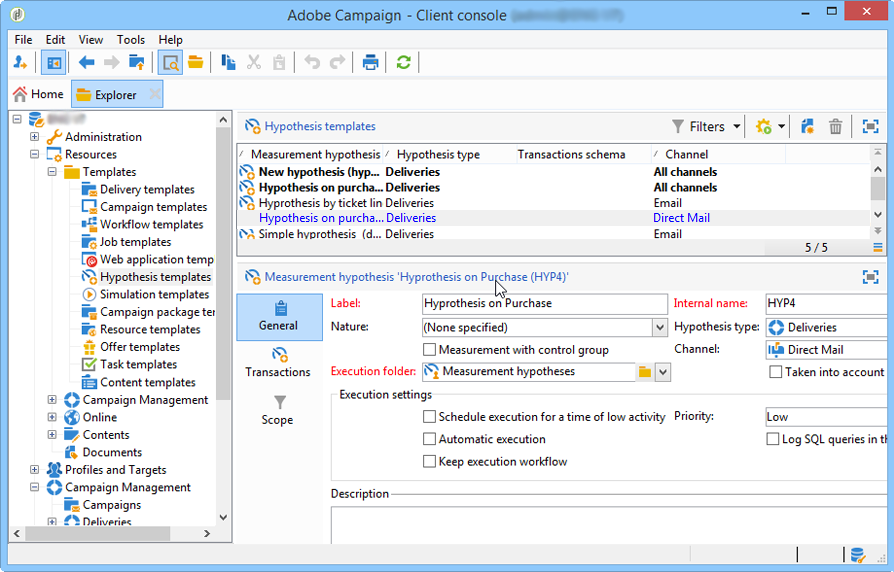

# 假设验证模板{#hypothesis-templates}

## 创建假设验证模型 {#creating-a-hypothesis-model}

通过配置假设验证模板，您可以定义用于衡量反应的上下文，无论是用于投放还是选件。 这是引用各种测量表的地方，包括用于定义个人、假设和事务表之间关系的测量表。

要创建假设验证模板，请应用以下步骤：

1. 在Adobe Campaign资源管理器中，单击 **[!UICONTROL Resources>Templates>Hypothesis templates]**.

   

1. 单击 **[!UICONTROL New]** 或右键单击模板列表，然后选择 **[!UICONTROL New]** （在下拉列表中）。
1. 输入假设验证标签。
1. 指定模板是发往优惠上的假设还是发货，方法是 **[!UICONTROL Hypothesis type]**.
1. 对象 **[!UICONTROL Delivery]** 类型模板，指定是否应在控制组中进行测量。 [了解详情](#properties-of-a-hypothesis-template)
1. 对象 **[!UICONTROL Delivery]** 键入模板，您可以选择特定渠道，或决定使用将此模板应用于Adobe Campaign中的所有可用渠道 **[!UICONTROL Channel]** 下拉列表。 [了解详情](#properties-of-a-hypothesis-template)
1. 选择 **[!UICONTROL Execution folder]** 其中，您要创建并自动执行将从此模板创建的假设验证。
1. 选择执行设置。 [了解详情](#hypothesis-template-execution-settings)
1. 指定假设验证计算时段。 [了解详情](#hypothesis-template-execution-settings)

   >[!CAUTION]
   >
   >此期限从联系日期确定。

1. 在 **[!UICONTROL Transactions]** 选项卡，指定假设验证计算所需的表和字段。 [了解详情](#transactions)
1. 如果模板配置为 **[!UICONTROL Offer]** 键入假设，您可以启用 **[!UICONTROL Update offer proposition status]** 选项：在这种情况下，选择要更改的优惠建议的状态。
1. 指定假设验证应用程序的范围。 [了解详情](#hypothesis-perimeter)
1. 如有必要，请使用脚本完成筛选。 [了解详情](#hypothesis-perimeter)

### 假设验证模板的属性 {#properties-of-a-hypothesis-template}

模板的 **[!UICONTROL General]** 选项卡用于指定常规模板选项。 可用字段包括：

* **[!UICONTROL Hypothesis type]**：用于确定模板是否应该用于投放或选件的假设。

  您还可以选择创建一个假设验证，该假设验证将同时应用于投放和优惠。

  >[!NOTE]
  >
  >如果模板适用于选件，则 **[!UICONTROL Update offer proposition status]** 选项位于 **[!UICONTROL Transactions]** 选项卡。

* **[!UICONTROL Measurement with control group]**：用于声明是否为投放或营销活动定义了控制组，并将其包含在衡量指标中。 控制组不接收投放，让您可以通过将活动与接收投放的目标群体进行比较来衡量投放后活动的影响。

  >[!NOTE]
  >
  >如果模板配置为考虑对照组，但在假设涉及的投放中未定义组，则结果将仅基于目标收件人。

  有关定义和配置控制组的详细信息，请参阅 [本节](../../campaign/using/marketing-campaign-deliveries.md#defining-a-control-group).

* **[!UICONTROL Channel]**：您可以通过选择特定渠道，或在Adobe Campaign控制台中使假设验证模板对所有渠道可用 **[!UICONTROL All channels]** （在下拉列表中）。 如果您为特定渠道配置模板，则可以在创建假设验证时，自动筛选每个渠道的投放。 [了解详情](creating-hypotheses.md)

  

* **[!UICONTROL Execution folder]**：用于为假设验证指定执行文件夹。
* **[!UICONTROL Taken into account in campaign ROI calculation]**：在计算相关营销活动的ROI时，将假设验证结果考虑在内。

### 假设验证模板执行设置 {#hypothesis-template-execution-settings}

模板的 **[!UICONTROL General]** 选项卡还允许您指定假设验证执行参数。 可用的选项如下：

* **[!UICONTROL Schedule execution for a time of low activity]**：允许您计划假设验证启动以优化Adobe Campaign性能。 选中此选项后，营销活动的处理工作流会在停机期间执行假设计算。

  

* **[!UICONTROL Priority]**：应用于假设验证的级别，用于区分假设验证计算顺序（如果同时执行）。

  

* **[!UICONTROL Automatic execution]**：如有必要，允许您计划重新计算假设验证（例如，如果您希望定期更新指标直到投放结束）。

  

  要指定调度，请应用以下进程：

   1. 单击 **[!UICONTROL Frequency of execution...]** 链接，然后 **[!UICONTROL Change...]** 按钮。

      

   1. 配置频率、相关事件和有效期。

      

   1. 单击 **[!UICONTROL Finish]** 以保存计划。

      

* **[!UICONTROL Log SQL queries in journal]**：此函数为专家用户保留。 它允许您向衡量假设验证审核添加选项卡以显示SQL查询。 如果模拟完成时存在错误，这将能够检测可能发生的故障。
* **[!UICONTROL Keep execution workflow]**：用于保留假设验证计算开始时自动生成的工作流。 在从选中此选项的模板创建的假设中，生成的工作流可用于跟踪该过程。

  >[!CAUTION]
  >
  >如果运行假设验证时出错，则必须仅出于调试目的激活此选项。\
  >此外，不得修改自动生成的工作流。 在以后的计算中，最终的任何修改都不会被考虑在内。\
  >如果选中了此选项，则在执行工作流后将其删除。

### 交易 {#transactions}

此选项卡包含各种字段和表，可让您保存收件人反应的交易历史记录。 请参阅此 [部分](../../configuration/using/about-schema-reference.md) 有关响应管理专用表格的详细信息。

* **[!UICONTROL Schema (reaction log storage)]**：选择收件人反应表。 Adobe Campaign中的现成表格是 **NmsRemaMatchRcp**.
* **[!UICONTROL Transaction schema]**：选择假设要关注的表，即交易表或购买表。
* **[!UICONTROL Querying schema]**：选择用于筛选假设验证的标准。
* **[!UICONTROL Link to individuals]**：选择个人与用作交易模式的表之间的链接。
* **[!UICONTROL Link to the household]**：如果您希望在假设验证中包含某个家庭的所有成员，请选择交易模式中指向该家庭的链接。 此字段为可选字段。
* **[!UICONTROL Transaction date]**：此字段是可选的，但也是推荐使用的，因为它允许您定义假设验证计算的范围。
* **[!UICONTROL Measurement period]**：用于配置执行假设和恢复购买行的开始和结束日期。

  当假设与投放相关联时，会在直邮投放联系日期后几天自动触发测量，或者在电子邮件或短信投放联系日期后自动触发测量。

  

  如果这个假设是动态启动的，那么如果想立即触发它，它将被迫引发。 否则，它会根据配置的计算结束日期（基于假设创建日期）自动触发。 [了解详情](creating-hypotheses.md#creating-a-hypothesis-on-the-fly-on-a-delivery))。

* **[!UICONTROL Transaction/Margin amount]**：这些字段是可选字段，用于自动计算人员调整指标。 [了解详情](hypothesis-tracking.md#indicators)
* **[!UICONTROL Unit amount]**：用于设置计算收入的金额。 [了解详情](hypothesis-tracking.md#indicators)

  

* **[!UICONTROL Additional measures and data]**：用于从不同表中的字段指定其他报表度量或轴。
* **[!UICONTROL Update offer proposition status]**：如果优惠收件人由假设验证识别，则允许您更改优惠建议的状态。

  

### 假设验证周边 {#hypothesis-perimeter}

定义交易表和假设验证的涉及字段后，可通过使用过滤器指定目标交易和投放来优化假设的范围。 您还可以使用JavaScript脚本明确指向事务表中引用的产品。

* **筛选事务**：在 **[!UICONTROL Scope]** 选项卡，您可以根据假设验证配置过滤器。 操作步骤：

   1. 单击 **[!UICONTROL Edit query]** 链接。

      

   1. 指定筛选条件。

      

   1. 选择假设将涉及的交易记录。

      

* **对收件人进行筛选**：在 **[!UICONTROL Scope]** 选项卡，您可以将假设验证限于与消息关联的任何信息（投放、收件人、电子邮件地址、服务等）：

   1. 单击 **[!UICONTROL Add a filter]** 链接，然后 **[!UICONTROL Edit query]**.

      

   1. 指定筛选条件。

      

   1. 单击 **[!UICONTROL Finish]** 以保存查询。

      

* **脚本**：您可以使用JavaScript脚本在执行期间动态重载假设验证设置。

  要执行此操作，请单击 **[!UICONTROL Advanced settings]** 链接，然后输入所需的脚本。

  >[!NOTE]
  >
  >此选项适用于专家用户。

  

## 示例：为投放创建假设验证模板 {#example--creating-a-hypothesis-template-on-a-delivery}

在本例中，我们将为直邮类型投放创建一个假设验证模板。 事务表(**购买** 在我们的示例中)，这些假设将基于包含链接到文章或产品的购买行。 我们希望配置模型，以便在购买表中创建关于文章或产品的假设验证。

1. 在Adobe Campaign Explorer中，转到 **[!UICONTROL Resources > Templates > Hypothesis templates]** 节点。
1. 单击 **[!UICONTROL New]** 以创建模板。

   

1. 更改模板标签。

   

1. 选择 **[!UICONTROL Deliveries]** 作为假设验证类型。
1. 通过选中相关框，指定投放可以包含控制组。
1. 选择 **[!UICONTROL Direct mail]** 渠道。

   >[!NOTE]
   >
   >由于模板特定于直邮投放，因此使用此模型创建的假设可能未链接到任何其他投放类型。

1. 在 **[!UICONTROL Transactions]** 选项卡，选择收件人反应表。

   

1. 在 **[!UICONTROL Transactions schema]** 字段中，选择您的采购表。

   

1. 选择中的采购行 **[!UICONTROL Querying schema]** 字段。

   

1. 选择链接到采购表的收件人。

   

1. 选择链接到购买日期的字段。

   这允许您为假设定义时间范围。 此阶段不是强制性的，但建议这样做。

   

1. 配置计算周期5至25天。

   

1. 在 **[!UICONTROL Scope]** 选项卡，单击 **[!UICONTROL Edit query]** 创建假设筛选条件。

   

   这样，创建的模板允许您对购买表中的产品或文章运行假设。

1. 单击 **[!UICONTROL Save]** 录制模板。
