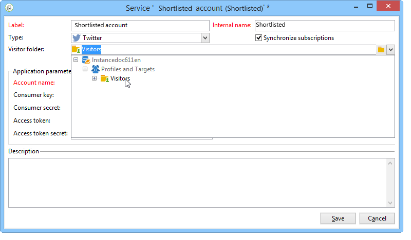

# 在Twitter上发布的配置步骤{#configuring-publishing-on-twitter}

为了Adobe Campaign能够将推文发送到您的Twitter帐户，您需要为这些帐户委派对Adobe Campaign的写入权限。 为此，请应用以下配置步骤：

* 创建Twitter帐户。
* 创建用于发送校样的测试Twitter帐户。
* 每个Twitter帐户创建一个Twitter应用程序。
* 对于每个Twitter应用程序，请新建 **[!UICONTROL Twitter]** 类型服务。

## 先决条件 {#prerequisites}

首先，创建一个或多个Twitter帐户以将您的推文发送到。

要创建Twitter帐户，请转到 [https://twitter.com](https://twitter.com){target=&quot;_blank&quot;}。

## 在Twitter上创建测试帐户 {#creating-a-test-account-on-twitter}

创建可用于发送的专用Twitter帐户 [推文校样](../../social/using/publishing-on-twitter.md#sending-the-proof). 要创建专用Twitter帐户，请执行以下步骤：

1. 创建新的Twitter帐户。
1. 访问帐户  **[!UICONTROL Settings]**.
1. 浏览到 **[!UICONTROL Privacy & Safety]** 和 **[!UICONTROL Audience and Tagging]** 并检查 **[!UICONTROL Protect your Tweets]** 选项。 您的推文和其他帐户信息仅对关注您的人员可见。

## 在Twitter上创建应用程序 {#creating-an-application-on-twitter}

为了Adobe Campaign能够将推文发送到您的Twitter帐户，您需要为每个Twitter帐户创建一个Twitter应用程序。 要执行此操作，请应用以下步骤：

1. 登录到您的Twitter帐户。
1. 在您的Internet浏览器中输入以下地址： [https://developer.twitter.com/en/apps](https://developer.twitter.com/en/apps).
1. 然后，单击 **[!UICONTROL Create an App]** 按钮。

   

1. 让向导引导您完成该过程。

   要使此应用程序允许Adobe Campaign将推文发送到您的帐户，请转到 **[!UICONTROL Permissions]** ，然后选择 **[!UICONTROL Read and Write]** 对于 **[!UICONTROL Access]** 中。 在 **[!UICONTROL Settings]** 选项卡，您还需要离开 **[!UICONTROL Callback URL]** 字段为空。

   

## 委派对Adobe Campaign的写入权限 {#delegating-write-access-to-adobe-campaign}

对于每个Twitter应用程序，您需要创建一个 **[!UICONTROL Twitter]** 键入服务，其中将包含应用程序设置。

此步骤要求同时访问Adobe Campaign控制台和登录到Twitter帐户的Internet浏览器：

* in **Twitter**:从 [本页](https://developer.twitter.com/en/portal/projects-and-apps)，选择之前创建的应用程序并编辑 **应用程序权限**.

   

   编辑 **密钥和令牌** 选项卡来访问应用程序详细信息。

* in **Adobe Campaign**:转到 **[!UICONTROL Profiles and targets]** ，单击 **[!UICONTROL Services and Subscriptions]** 链接，然后单击 **[!UICONTROL Create]** 按钮。

   

1. 选择 **[!UICONTROL Twitter]** 类型。

   

   >[!NOTE]
   >
   >的 **[!UICONTROL Synchronize subscriptions]** 选项。 选中该框后，将启动Twitter帐户同步工作流(请参阅 [同步Twitter帐户](#synchronizing-twitter-accounts))取回了Twitter关注者列表，以便您可以向他们发送私信(请参阅 [向订阅者发送私信](../../social/using/publishing-on-twitter.md#sending-direct-messages-to-subscribers))。 如果不想恢复关注者列表，请取消选中此框。

1. 输入服务的标签和内部名称。

   

   >[!IMPORTANT]
   >
   >的 **[!UICONTROL Internal name]** 的名称必须与Twitter帐户的名称相同。 要确保没有登入错误，请应用以下步骤。

   * 单击 **[!UICONTROL Save]** 按钮。
   * 在服务概述中，单击之前创建的Twitter服务。

   <!-- * Select the **[!UICONTROL Twitter page]** tab. The Twitter account should be displayed. 
    
      -->

1. 在 **[!UICONTROL Visitor folder]** 字段中，选择将在其中创建关注者的文件夹。 如需详细信息，请参阅[此部分](../../social/using/publishing-on-twitter.md#operating-principle)。默认情况下，关注者会保存在 **[!UICONTROL Visitors]** 文件夹。

   

1. 在Twitter上，复制 **[!UICONTROL Consumer Key (API Key)]** 和 **[!UICONTROL Consumer Secret (API Secret)]** 字段并粘贴到 **[!UICONTROL Consumer key]** 和 **[!UICONTROL Consumer secret]** Campaign客户端控制台的字段。

   

1. 在Twitter上，复制 **[!UICONTROL Access Token]** 和 **[!UICONTROL Access Token Secret]** 字段并粘贴到 **[!UICONTROL Access token]** 和 **[!UICONTROL Access token secret]** Campaign客户端控制台的字段。

   

1. 在Campaign客户端控制台中，单击 **[!UICONTROL Save]**. 您现在已委派对Adobe Campaign的写入权限。

   

>[!NOTE]
>
>您必须创建一个 **[!UICONTROL Twitter]** 服务。

的 **[!UICONTROL Twitter account Synchronization]** 工作流在Adobe Campaign中同步Twitter帐户。 有关详细信息，请参见[此页面](../../social/using/publishing-on-facebook-walls.md#synchronizing-facebook-pages)。

## 同步Twitter帐户 {#synchronizing-twitter-accounts}

>[!IMPORTANT]
>
>为了工作流恢复Twitter订阅者列表， **[!UICONTROL Twitter account synchronization]** 框。 如需详细信息，请参阅[此部分](#delegating-write-access-to-adobe-campaign)。

的 **[!UICONTROL Twitter account synchronization]** 工作流，通过 **[!UICONTROL Administration > Production > Technical workflows > Managing social networks]** 节点中，用于将以前配置的Twitter帐户与Adobe Campaign同步。 默认情况下，此工作流于每星期四早上7:30触发。

>[!NOTE]
>
>您可以随时通过运行预期的任务处理来启动工作流。 您还可以编辑调度程序以更改工作流触发频率。 有关调度程序的详细信息，请参阅 [此部分](../../workflow/using/scheduler.md).

您现在可以将推文发送到Twitter帐户，并向关注者发送私信。 有关详细信息，请参见[此页面](../../social/using/publishing-on-twitter.md)。
