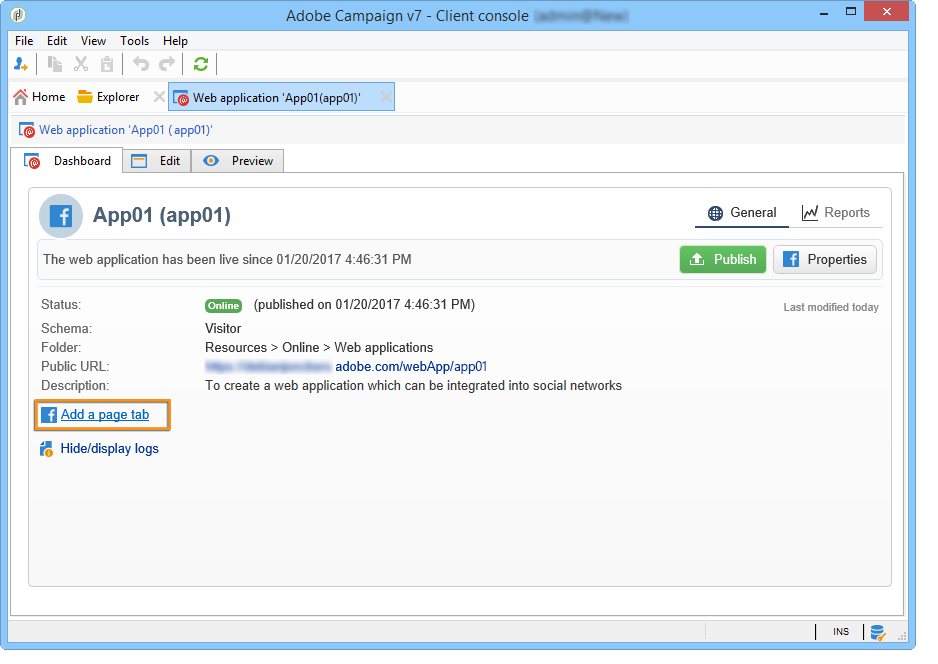
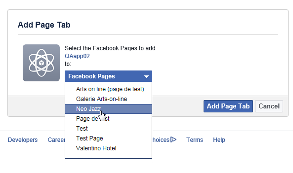

# 创建 Facebook 应用程序{#creating-a-facebook-application}

借助Web应用程序， Social Marketing可让您在Facebook应用程序中显示个性化内容，从而更轻松地通过此社交网络获取潜在客户。 有关Facebook类型Web应用程序的更多示例，请参阅[Facebook应用程序示例](../../social/using/examples-of-facebook-apps.md)。

>[!NOTE]
>
>也可以将Adobe Campaign与合作伙伴开发的Facebook应用程序相集成。 在这种情况下，无需使用Adobe Campaign Web应用程序获取Facebook配置文件。 有关更多信息，请参阅[配置外部帐户](#configuring-external-accounts)。

应用以下配置步骤：

1. 创建一个或多个Facebook应用程序。 有关更多信息，请参阅：[创建Facebook应用程序](../../social/using/publishing-on-facebook-walls.md#creating-a-facebook-application)。
1. 输入要在Facebook权限请求屏幕上显示的&#x200B;**[!UICONTROL terms of service]**&#x200B;和&#x200B;**[!UICONTROL Privacy policy]**&#x200B;链接。 有关更多信息，请参阅：[输入服务条款和隐私策略链接](#entering-the-terms-of-service-and-privacy-policy-links)。
1. 对于每个Facebook应用程序，创建一个&#x200B;**[!UICONTROL Facebook Connect]**&#x200B;类型的外部帐户。 有关更多信息，请参阅：[配置外部帐户](#configuring-external-accounts)。
1. 对于每个Facebook应用程序，在Adobe Campaign中创建一个Facebook类型的Web应用程序。 有关更多信息，请参阅：[创建Facebook类型的web应用程序](#creating-a-facebook-type-web-application)。
1. 配置Facebook应用程序，以便它们在Facebook页面上以选项卡的形式显示。 有关更多信息，请参阅：[配置Facebook选项卡](#configuring-facebook-tabs)。

## 配置外部帐户 {#configuring-external-accounts}

对于每个Facebook应用程序，您需要创建一个&#x200B;**[!UICONTROL Facebook Connect]**&#x200B;类型的外部帐户。

此步骤要求您同时访问Adobe Campaign控制台和登录到用于页面管理的Facebook帐户的Internet浏览器：

* **Facebook**:选择之前创建的应用程序( [https://developers.facebook.com/apps](https://developers.facebook.com/apps))，然后选择>选 **[!UICONTROL Settings]** 项 **[!UICONTROL Basic]** 卡。

   

   >[!NOTE]
   >
   >如果未显示&#x200B;**[!UICONTROL Facebook Web Games]**&#x200B;部分，请单击页面底部的&#x200B;**[!UICONTROL Add Platform]**&#x200B;按钮，然后选择&#x200B;**[!UICONTROL Facebook Web Games]**。

* **Adobe Campaign**:转到树 **[!UICONTROL Administration > Platform > External accounts]** 的节点并单击 **[!UICONTROL New]**。

   

1. 输入标签和内部名称并选择&#x200B;**[!UICONTROL Facebook Connect]**&#x200B;类型。

   

1. 为应用程序选择托管模式：**[!UICONTROL hosted by a partner]**&#x200B;或&#x200B;**[!UICONTROL hosted by this instance]**。

   

   **由合作伙伴托管的应用程序**

   可以将Adobe Campaign与合作伙伴开发的Facebook应用程序相集成。 在这种情况下，无需使用Adobe Campaign Web应用程序获取Facebook配置文件。 facebook用户安装应用程序时，将生成一个密钥（访问令牌）。 合作伙伴通过调用Web服务将此访问令牌转发到Adobe Campaign。 然后，Adobe Campaign使用此令牌登录到Facebook数据库并收集用户通过应用程序共享的数据。

   >[!NOTE]
   >
   >此处提供的WSDL文件中详细介绍了Web服务的参数：**`https://<Instance name>/nl/jsp/schemawsdl.jsp?schema=nms:visitor`**

   要将第三方应用程序集成到Adobe Campaign中，您需要复制&#x200B;**[!UICONTROL App ID]**&#x200B;和&#x200B;**[!UICONTROL App Secret]** Facebook字段的内容，并将其粘贴到控制台的&#x200B;**[!UICONTROL Application ID]**&#x200B;和&#x200B;**[!UICONTROL Application secret]**&#x200B;字段中。

   

   **由此实例托管的应用程序**

   如果要在此实例上托管应用程序（如果您没有第三方应用程序），则需要使用Adobe Campaign Web应用程序获取Facebook配置文件。 有关更多信息，请参阅[Facebook应用程序示例](../../social/using/examples-of-facebook-apps.md)。

   在Adobe Campaign控制台中，复制&#x200B;**[!UICONTROL Secure Canvas URL]**&#x200B;字段中包含的地址，并将其粘贴到Facebook上的&#x200B;**[!UICONTROL Facebook Web games (https)]**&#x200B;字段（位于&#x200B;**[!UICONTROL Facebook Web Games]**&#x200B;部分）中。

   

   >[!IMPORTANT]
   >
   >在任何情况下都不得使用不安全的URL。

   在Facebook上，复制&#x200B;**[!UICONTROL App ID]**&#x200B;和&#x200B;**[!UICONTROL App Secret]**&#x200B;字段的内容，并将其粘贴到控制台的&#x200B;**[!UICONTROL Application ID]**&#x200B;和&#x200B;**[!UICONTROL Application secret]**&#x200B;字段中。

   

1. 在Facebook上，单击页面底部的&#x200B;**[!UICONTROL Save Changes]**&#x200B;按钮。
1. 在Adobe Campaign控制台中，单击&#x200B;**[!UICONTROL Subscribe]**&#x200B;按钮，使Adobe Campaign能够在每次风扇通过此应用程序签入时实时恢复数据。 有关更多信息，请参阅：[Facebook应用程序示例](../../social/using/examples-of-facebook-apps.md)。

   

## 输入服务条款和隐私策略链接{#entering-the-terms-of-service-and-privacy-policy-links}

我们强烈建议添加&#x200B;**[!UICONTROL Terms of service]**&#x200B;和&#x200B;**[!UICONTROL Privacy policy]**&#x200B;链接，以在Facebook权限请求屏幕中显示。

配置阶段如下：

1. 输入以下地址：[https://developers.facebook.com/apps](https://developers.facebook.com/apps)，然后选择Facebook应用程序。
1. 选择&#x200B;**[!UICONTROL Settings > Basic]**&#x200B;选项卡，然后输入&#x200B;**[!UICONTROL Privacy Policy URL]**&#x200B;和&#x200B;**[!UICONTROL Terms of Service URL]**&#x200B;字段。

   

## 创建Facebook类型的Web应用程序{#creating-a-facebook-type-web-application}

利用Adobe Campaign Facebook应用程序，可在Facebook应用程序中显示个性化内容。 对于每个Facebook应用程序，您需要在Adobe Campaign中创建一个Web应用程序。 要创建Facebook Web应用程序，请按如下步骤操作：

1. 转到&#x200B;**[!UICONTROL Social networks]**&#x200B;选项卡，单击&#x200B;**[!UICONTROL Applications]**&#x200B;链接，然后单击&#x200B;**[!UICONTROL Create]**&#x200B;按钮。

   

1. 从列表中选择Facebook Web应用程序模板并输入标签。

   

   >[!NOTE]
   >
   >默认提供四个Facebook Web应用程序模板：
   >
   >* **[!UICONTROL New Facebook application]**:如果要从空白应用程序启动，请选择此模板。
   >* **[!UICONTROL Pre-entered form]**:Facebook应用程序中带有表单和“Facebook登录”按钮，通过该按钮，用户可以使用其配置文件中的数据自动填写表单的字段。这样，用户就可以更快地完成表单，让品牌获得更优质的信息。
   >* **[!UICONTROL "Canvas page" competition]**:Facebook应用程序，该应用程序会显示在屏幕上，为用户提供更好的可视化体验。
   >* **[!UICONTROL "Page Tab" competition]**:Facebook应用程序完全集成到品牌页面选项卡中。

1. 在&#x200B;**[!UICONTROL Application]**&#x200B;字段中，输入链接到Facebook应用程序的外部帐户。 有关更多信息，请参阅：[配置外部帐户](#configuring-external-accounts)。

   

1. 选择&#x200B;**[!UICONTROL Edit]**&#x200B;选项卡，然后编辑Web应用程序。 有关更多信息，请参阅：[Facebook应用程序示例](../../social/using/examples-of-facebook-apps.md)。

   

1. 完成Web应用程序后，选择&#x200B;**[!UICONTROL Dashboard]**&#x200B;选项卡，然后单击&#x200B;**[!UICONTROL Publish]**&#x200B;联机发布。

   

## 配置Facebook选项卡{#configuring-facebook-tabs}

您可以将Facebook应用程序配置为在Facebook页面上显示为选项卡。 要执行此操作，请应用以下步骤：

1. 选择Facebook应用程序([https://developers.facebook.com/apps](https://developers.facebook.com/apps))，然后选择&#x200B;**[!UICONTROL Settings > Basic]**&#x200B;选项卡。

   

1. 在页面底部，单击&#x200B;**[!UICONTROL Add Platform]**&#x200B;按钮，然后选择&#x200B;**[!UICONTROL Page Tab]**。

   

1. 在&#x200B;**[!UICONTROL Page Tab]**&#x200B;部分的&#x200B;**[!UICONTROL Page Tab Name]**&#x200B;字段中，输入您希望在Facebook页面上显示的标签。

   

1. 在&#x200B;**[!UICONTROL Secure Page Tab URL]**&#x200B;字段中，输入Web应用程序的公共URL，该URL可通过Web应用程序的&#x200B;**[!UICONTROL Dashboard]**&#x200B;选项卡访问。 有关创建Facebook类型Web应用程序的更多信息，请参阅[创建Facebook类型Web应用程序](#creating-a-facebook-type-web-application)。

   

1. 在Web应用程序的&#x200B;**[!UICONTROL Dashboard]**&#x200B;上，单击&#x200B;**[!UICONTROL Add a page tab]**&#x200B;链接。

   

1. 选择要将选项卡添加到的Facebook页面，然后单击&#x200B;**[!UICONTROL Add Page Tab]**。

   
