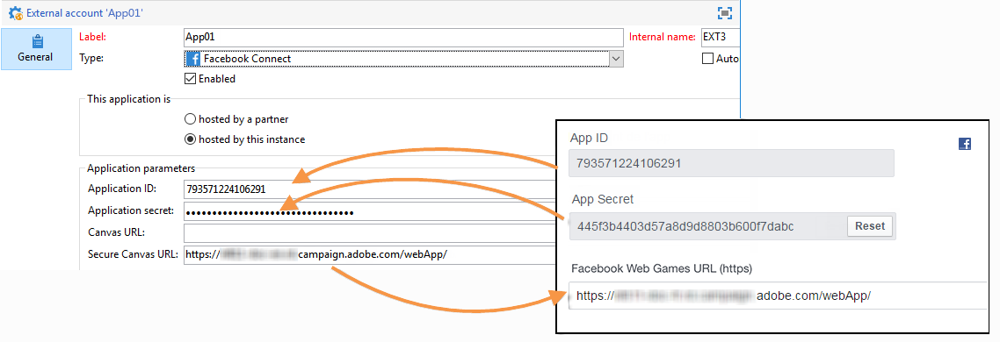
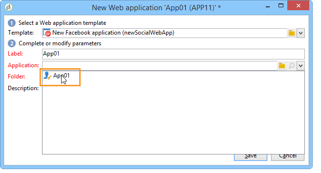
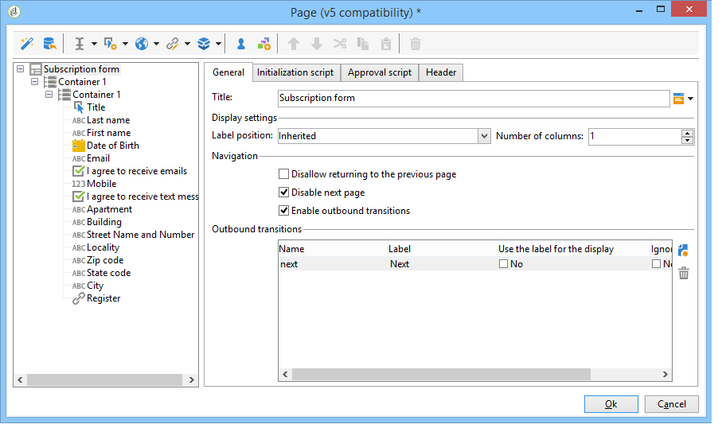
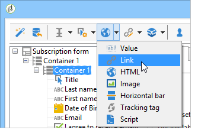

# Facebook 应用程序示例{#examples-of-facebook-apps}

当用户单击Facebook应用程序的选项卡时，该选项卡将以810像素宽的空间显示。 Adobe Campaign使用Facebook类型的web应用程序来定义和个性化Facebook应用程序中显示的内容，从而更轻松地获取用户档案。

>[!NOTE]
>
>也可以将Adobe Campaign与合作伙伴开发的Facebook应用程序相集成。 在这种情况下，无需使用Adobe Campaign Web应用程序获取Facebook配置文件。 有关更多信息，请参阅[配置外部帐户](../../social/using/creating-a-facebook-application.md#configuring-external-accounts)。

>[!IMPORTANT]
>
>请遵循[创建Facebook应用程序](../../social/using/creating-a-facebook-application.md)中描述的配置步骤。

>[!NOTE]
>
>本节详细介绍链接到Facebook类型Web应用程序的元素。 与标准Web应用程序共享的所有元素详见[此部分](../../web/using/about-web-applications.md)。

以下详述的Facebook类型Web应用程序示例包括：

* 如何通过7个步骤创建Facebook应用程序。 请参阅[快速入门：按7个步骤](#quick-start--creating-a-facebook-application-in-7-steps)创建Facebook应用程序。
* 如何将设置转发到Facebook应用程序。 请参阅[如何将设置转发到Facebook应用程序？](#how-to-forward-settings-to-a-facebook-application-)。
* 如何获取粉丝数据。 请参阅[如何获取风扇数据？](#how-to-acquire-fan-data-)。

>[!IMPORTANT]
>
>以这些简单用例为例，说明了Facebook类型Web应用程序的功能。

## 推荐 {#recommendations}

以下限制直接关联到Facebook:

* 您必须使用HTTPS构建所有Web应用程序。
* 通过选项卡显示的Facebook应用程序的宽度为810像素。

## 快速入门：通过7步创建Facebook应用程序 {#quick-start--creating-a-facebook-application-in-7-steps}

此示例提供了如何在Facebook中显示Adobe Campaign构建的应用程序的分步流程。 在这种情况下，我们希望创建一个应用程序，该应用程序允许您在用户单击应用程序选项卡(**App01**)时显示&#x200B;**Welcome**&#x200B;消息。

要创建此应用程序，请应用以下步骤：

1. 在Facebook上创建应用程序([https://developers.facebook.com/apps](https://developers.facebook.com/apps))。 有关更多信息，请参阅：[创建Facebook应用程序](../../social/using/publishing-on-facebook-walls.md#creating-a-facebook-application)。

   

1. 创建&#x200B;**[!UICONTROL Facebook Connect]**&#x200B;类型的外部帐户并输入Facebook应用程序的参数。 有关更多信息，请参阅：[配置外部帐户](../../social/using/creating-a-facebook-application.md#configuring-external-accounts)。

   

1. 输入要在Facebook权限请求屏幕上显示的&#x200B;**[!UICONTROL Terms of service]**&#x200B;和&#x200B;**[!UICONTROL Privacy policy]**&#x200B;链接。 有关更多信息，请参阅：[输入服务条款和隐私策略链接](../../social/using/creating-a-facebook-application.md#entering-the-terms-of-service-and-privacy-policy-links)。

   

1. 在Adobe Campaign中创建Facebook类型的Web应用程序。 有关更多信息，请参阅：[创建Facebook类型的web应用程序](../../social/using/creating-a-facebook-application.md#creating-a-facebook-type-web-application)。

   

1. 编辑Web应用程序。 在此示例中，我们添加了&#x200B;**[!UICONTROL Page]**&#x200B;活动并为其定义了标题。

   

1. 部署您的应用程序。

   

1. 配置Facebook应用程序，使其显示为Facebook页面上的选项卡。 有关更多信息，请参阅：[配置Facebook选项卡](../../social/using/creating-a-facebook-application.md#configuring-facebook-tabs)。

   

检查&#x200B;**App01**&#x200B;应用程序的选项卡是否显示在您的Facebook页面上。 单击它应会调用&#x200B;**欢迎**&#x200B;消息。

## 如何将设置转发到Facebook应用程序？ {#how-to-forward-settings-to-a-facebook-application-}

>[!IMPORTANT]
>
>遵循[创建Facebook应用程序](../../social/using/creating-a-facebook-application.md)中详细描述的配置步骤。

在示例1中，我们根据&#x200B;**[!UICONTROL Fan of the page]**&#x200B;字段中的值对Facebook页面的显示进行了个性化。 也可以处理&#x200B;**[!UICONTROL Application settings]**&#x200B;字段。 利用此字段，可通过Facebook恢复由Adobe Campaign生成的链接中包含的数据。

让我们以决定发送电子邮件促销活动的公司为例。 在投放中，有指向Facebook应用程序的链接。 由于在URL末尾添加了&#x200B;**[!UICONTROL app_data]**&#x200B;参数，此链接是个性化的。 此参数的值可以是反映客户重要性的指标。 在本例中，**[!UICONTROL app_data]**&#x200B;参数的值为&#x200B;**[!UICONTROL big]**（重要客户）和&#x200B;**[!UICONTROL small]**（不太重要客户）。

个性化后，URL将如下所示：

* `http://<path of the Facebook application>&app_data=big` （对于重要客户）
* `http://<path of the Facebook application>&app_data=small` （对于不太重要的客户）

在Facebook转发到Adobe Campaign的匿名数据中，收集&#x200B;**[!UICONTROL Application parameters]**&#x200B;字段的值，从而使Adobe Campaign能够根据此参数个性化应用程序显示。

如果用户是重要客户（**[!UICONTROL app_data]**&#x200B;参数的值为&#x200B;**[!UICONTROL big]**），则会显示以下图像：

如果用户不太重要（**[!UICONTROL app_data]**&#x200B;参数的值为&#x200B;**[!UICONTROL small]**），则会显示以下图像：

为了重新创建此用例，我们创建了由以下元素组成的Web应用程序：

* 基于&#x200B;**[!UICONTROL Application parameter]**&#x200B;字段的&#x200B;**[!UICONTROL Test]**&#x200B;活动。
* 包含要根据&#x200B;**[!UICONTROL Application parameter]**&#x200B;字段值显示的图像的两页。

## 如何获取粉丝数据？ {#how-to-acquire-fan-data-}

>[!IMPORTANT]
>
>遵循[创建Facebook应用程序](../../social/using/creating-a-facebook-application.md)中详细描述的配置步骤。

此示例向您展示了如何与Facebook用户联系，以及如何为他们提供用于共享其用户档案信息的选件。 让我们举一个公司的例子，它想要收购潜在客户，并在其Facebook页面上组织竞争以吸引他们。

每当用户单击&#x200B;**[!UICONTROL App03]**&#x200B;选项卡时，我们都会询问他们是否希望参加竞争。

如果他们决定参加竞争，我们会向他们提供他们的个人资料信息。

如果用户同意共享其信息，将显示以下屏幕。

为构建此用例，我们创建了一个Web应用程序，其中包含以下元素：

* **[!UICONTROL Test]** 活动
* 三页
* **[!UICONTROL Access control]**&#x200B;活动
* **[!UICONTROL Pre-loading]** 活动
* **[!UICONTROL Save]** 活动
* **[!UICONTROL End]**&#x200B;活动

### 测试活动 {#test-activity}

**[!UICONTROL Test]**&#x200B;活动基于&#x200B;**[!UICONTROL ID]**&#x200B;和&#x200B;**[!UICONTROL Application parameters]**&#x200B;字段。

它由三个分支组成：

* **[!UICONTROL identifier (UID) is empty]** :只有当用户已同意共享其信息时，Facebook才会转发该标识符。**[!UICONTROL Test]**&#x200B;活动的第一个分支允许您仅向从未输入过（即ID为空的用户）的用户提供竞争对手。
* **[!UICONTROL application parameter equals 'thanks']** :要避免链接到Facebook的显示错误，Web应用程序结束页面会指向使用值添加到的 **[!UICONTROL app_data]** Facebook应用程序的URL( **[!UICONTROL thanks]** 有关更多信息，请参阅： [结束活动](#end-activity))。第二个分支可让您了解用户是否来自第一个分支的&#x200B;**[!UICONTROL End]**&#x200B;活动（并且刚刚进入竞争对手），以显示感谢信。 有关使用其他URL参数的更多信息，请参阅：[如何将设置转发到Facebook应用程序？](#how-to-forward-settings-to-a-facebook-application-)。
* **[!UICONTROL Default branch]** :如果用户在上一日期(应用程序参数与 **[!UICONTROL thanks]**&#x200B;不同)已输入竞争对手（ID已输入），我们将显示一个页面，表示他们已经输入。

### 竞争页面 {#competition-page}

要避免链接到Facebook的显示错误，您还需要在竞争页面的&#x200B;**[!UICONTROL Window]**&#x200B;字段中选择&#x200B;**[!UICONTROL Parent window]**&#x200B;或&#x200B;**[!UICONTROL In the top window]**。

### 访问控制活动 {#access-control-activity}

通过&#x200B;**[!UICONTROL Access control]**&#x200B;活动，可在用户进入竞争对手时显示Facebook权限请求页面。 如果用户同意共享其信息，则在预加载期间会恢复该信息。 有关更多信息，请参阅：[预加载活动](#pre-loading-activity)。

如果您之前在创建Web应用程序时输入了外部帐户(请参阅[创建Facebook类型的Web应用程序](../../social/using/creating-a-facebook-application.md#creating-a-facebook-type-web-application))，则无需编辑活动。 如果没有，请转到&#x200B;**[!UICONTROL Application]**&#x200B;字段，然后选择链接到Facebook应用程序的外部帐户。

### 预加载活动 {#pre-loading-activity}

选择要用于预加载的数据源：

* **[!UICONTROL Marketing database]** :此选项允许您通过Adobe Campaign数据库预载数据。
* **[!UICONTROL Facebook]** :此选项允许您使用Facebook预加载数据。

**营销数据库**

利用此选项，可恢复访客表中存在的配置文件的数据。 验证基于用户单击Facebook应用程序选项卡时恢复的外部Facebook ID。 如果在&#x200B;**[!UICONTROL Pre-loading]**&#x200B;活动后添加表单，则会预加载包含数据库中信息的字段。

>[!NOTE]
>
>有关通过Adobe Campaign数据库预加载数据的更多信息，请参阅[此部分](../../web/using/publishing-a-web-form.md#pre-loading-the-form-data)。

**Facebook**

利用此选项，可定义要收集的Facebook配置文件信息（用户已同意共享该信息），以便进行保存。

**[!UICONTROL Database information]**&#x200B;选项允许您收集以下数据：

* **[!UICONTROL External ID]**:用户ID
* **[!UICONTROL Gender]**:用户性别
* **[!UICONTROL Verified]** :此字段指定用户是否具有验证的Facebook帐户。
* **[!UICONTROL Full name]**:用户的全名
* **[!UICONTROL First name]**:用户的名字
* **[!UICONTROL Last name]**:用户姓氏
* **[!UICONTROL Language]**:用户语言

您还可以通过选中相应的复选框来决定收集个人资料照片、好友列表、电子邮件地址、出生日期、兴趣和位置。

在单击&#x200B;**[!UICONTROL Ok]**&#x200B;之前，请勾选&#x200B;**[!UICONTROL I agree to comply with Facebook conditions of use]**&#x200B;框。

>[!NOTE]
>
>如果选中&#x200B;**[!UICONTROL Private information]**&#x200B;部分中的一个或多个框，则Facebook权限请求屏幕将自动显示此数据的访问请求。
>
>要收集所选信息，用户必须同意共享该信息。
>
>如果要同时使用这两种预加载方式(通过Adobe Campaign和通过Facebook)，请依次添加两个预加载框。

### 保存活动 {#save-activity}

**[!UICONTROL Save]**&#x200B;活动允许您将在访客表中存储在先前阶段收集的信息。

如果访客表中已存在配置文件，则会使用收集的新数据更新其数据。

如果数据库中不存在配置文件，并且收集了Facebook用户的电子邮件地址，则会在访客表中创建访客。

1. 在&#x200B;**[!UICONTROL Visitor creation folder]**&#x200B;字段中，选择要在其中创建用户档案的文件夹。 对于Facebook类型的Web应用程序，默认创建文件夹为&#x200B;**[!UICONTROL Visitors]**。
1. 在&#x200B;**[!UICONTROL Reconciliation mode]**&#x200B;字段中，选择要使用的协调模式：

   * **[!UICONTROL Automatic]** :根据电子邮件、姓氏、名字和出生日期进行协调。
   * **[!UICONTROL Manual]** :请选择一个或多个协调键值。
   * **[!UICONTROL None]** :不会进行和解。

1. 在&#x200B;**[!UICONTROL Mapping]**&#x200B;字段中，选择要执行协调的架构。

   >[!IMPORTANT]
   >
   >确保在投放映射中正确输入&#x200B;**[!UICONTROL Social networks]**&#x200B;选项卡的字段。 通过&#x200B;**[!UICONTROL Administration > Campaign management > Target mappings]**&#x200B;节点访问投放映射。

1. 您可以选择要协调的搜索文件夹和新配置文件的创建文件夹。 如果字段为空，则会在映射架构的默认文件夹中搜索并创建用户档案。

### 结束活动 {#end-activity}

要避免链接到Facebook的显示错误，您需要选中&#x200B;**[!UICONTROL Use an external URL]**&#x200B;框并输入Facebook应用程序的URL，然后输入&#x200B;**[!UICONTROL app_data]**&#x200B;参数和值。 此值将用在&#x200B;**[!UICONTROL Test]**&#x200B;活动中，以检测用户是否刚刚进入竞争对手，并显示感谢信（如果适用）。 有关更多信息，请参阅：[测试活动](#test-activity)。

在本例中，使用的值为&#x200B;**thanws**。

### 访客的详细信息屏幕 {#details-screen-of-a-visitor}

与Twitter关注者类似(请参阅：[工作原理](../../social/using/publishing-on-twitter.md#operating-principle))，恢复的Facebook配置文件会存储在访客表中。 要显示访客列表，请转到&#x200B;**[!UICONTROL Profiles and Targets > Visitors]**&#x200B;节点。

同意共享其用户档案信息的每个Facebook潜在客户都会添加到访客列表中。 如果在&#x200B;**[!UICONTROL Pre-load]**&#x200B;活动中选中&#x200B;**[!UICONTROL Friends]**&#x200B;框(请参阅：[预加载活动](#pre-loading-activity))，还会添加好友。

在访客详细信息窗口的&#x200B;**[!UICONTROL Summary]**&#x200B;部分中，**[!UICONTROL New Contact]**&#x200B;指示器有两种可能的状态：

如果显示绿色复选标记，则表示访客未与任何收件人协调。 在这种情况下，将在收件人列表中创建新用户档案。

红叉表示访客与收件人协调一致。 单击&#x200B;**[!UICONTROL Recipient]**&#x200B;字段右侧的放大镜可显示匹配的收件人。

转到收件人的详细信息窗口以显示匹配的访客（如果适用）。 选择&#x200B;**[!UICONTROL Others]**&#x200B;选项卡，然后在&#x200B;**[!UICONTROL Web identities]**&#x200B;部分双击访客的名称。

访客详细信息页面的&#x200B;**[!UICONTROL Activities]**&#x200B;屏幕包含以下信息：

* “Open Graph”类型粉丝活动：播放的音乐、观看的视频、阅读的文章和解释安装的应用程序（Deezer、Spotify、Dailymotion、Yahoo News等）

   

* 粉丝在Adobe Campaign发送投放后添加的“称赞”和评论
* 粉丝喜欢的页面
* 风扇的签到

   

   >[!NOTE]
   >
   >为了让Adobe Campaign收集风扇的签入，您需要单击服务配置屏幕上的&#x200B;**[!UICONTROL Subscribe]**&#x200B;按钮。 有关更多信息，请参阅[配置外部帐户](../../social/using/creating-a-facebook-application.md#configuring-external-accounts)。

## 如何使用Facebook用户档案数据预载表单 {#how-to-pre-load-the-fields-of-a-form-using-facebook-profile-data}

**[!UICONTROL Social Marketing]**&#x200B;应用程序还允许您向表单添加按钮，以使用Facebook用户档案信息预加载字段。 [此部分](../../web/using/static-elements-in-a-web-form.md#inserting-html-content)中详细描述了此选项，该选项可在所有Web应用程序模板（**[!UICONTROL Page]**&#x200B;类型活动）中使用。

>[!NOTE]
>
>在开始使用此函数之前，您需要创建一个Facebook应用程序并键入&#x200B;**[!UICONTROL Facebook Connect]**&#x200B;外部帐户。 有关更多信息，请参阅[配置外部帐户](../../social/using/creating-a-facebook-application.md#configuring-external-accounts)。

**预载表单的字段，其中包含从Facebook配置文件获取的数据**

可创建Web窗体，并在窗体页面中包含用户没有交互的元素；这些是静态元素，如图像、HTML内容、水平条或超文本链接。 详细了解[本页](../../web/using/static-elements-in-a-web-form.md)中Web窗体中的静态元素。

在插入静态元素时，**[!UICONTROL Preload with Facebook]**&#x200B;选项允许您在表单中插入按钮，以使用Facebook配置文件信息预载字段。

当用户单击&#x200B;**[!UICONTROL Fill in automatically]**&#x200B;按钮时，将打开Facebook的权限请求窗口。

>[!NOTE]
>
>您可以在配置外部帐户时更改扩展权限列表。 如果未配置扩展权限，则默认情况下，Facebook会转发基本配置文件信息。\
>要查看扩展权限列表及其语法，请[参阅Facebook文档](https://developers.facebook.com/docs/reference/api/permissions)。

如果用户同意共享其信息，则会预加载表单的字段。

对于此用例，我们创建了由以下元素组成的Web应用程序：

* 包含表单的页面
* **[!UICONTROL Record]** 活动
* **[!UICONTROL End]**&#x200B;活动

要添加预加载按钮，请应用以下步骤：

1. 创建表单。

   

1. 转到表单中字段的相同级别并添加链接。

   

1. 输入标签并选择&#x200B;**[!UICONTROL Button]**&#x200B;类型。

   

1. 转到&#x200B;**[!UICONTROL Action]**&#x200B;字段并选择&#x200B;**[!UICONTROL Preload with Facebook]**。

   

1. 转到&#x200B;**[!UICONTROL Application]**&#x200B;字段，然后选择&#x200B;**[!UICONTROL Facebook Connect]**&#x200B;类型之前创建的外部帐户。 有关详细信息，请参见[此页面](../../social/using/creating-a-facebook-application.md#configuring-external-accounts)。

   

