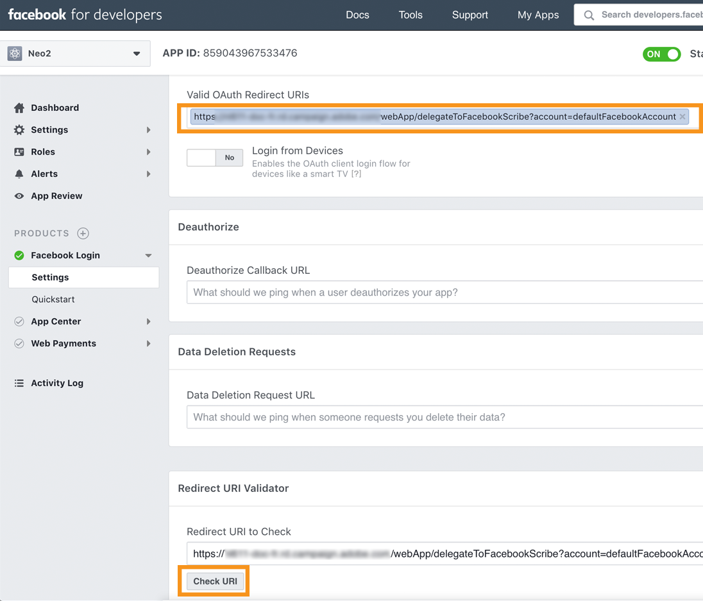

# 在 Facebook 好友墙上发布{#publishing-on-facebook-walls}

为了使Adobe Campaign能够将出版物发送到Facebook墙，您需要将这些页面的写入权限委派给Adobe Campaign。 这涉及以下配置步骤：

1. 创建具有一个或多个页面的Facebook帐户。
1. 创建用于发送校样的测试Facebook页面。
1. 创建 Facebook 应用程序.
1. 在&#x200B;**[!UICONTROL Facebook routing]**&#x200B;外部帐户的Adobe Campaign中输入Facebook应用程序设置。

## 先决条件 {#prerequisites}

首先，创建Facebook帐户和多个页面：这些将用于发送发布内容。

* 要创建Facebook帐户，请使用[https://www.facebook.com](https://www.facebook.com)链接。
* 要创建Facebook页面，请使用[https://www.facebook.com/pages/create](https://www.facebook.com/pages/create)链接。

   我们建议使用相同的Facebook帐户管理您的所有页面。 这样，您只需一个Facebook应用程序和一个外部帐户即可在该帐户的所有页面上写入内容。

   

## 创建测试Facebook页面{#creating-a-test-facebook-page}

我们建议创建用于传送发布校样的专用Facebook页面(有关更多信息，请参阅[发送校样](../../social/using/publishing-on-facebook.md#sending-the-proof)。

1. 登录到用于管理页面的Facebook帐户。
1. 创建新的Facebook页面。
1. 单击右上角的&#x200B;**[!UICONTROL Settings]**&#x200B;按钮。
1. 在&#x200B;**[!UICONTROL General]**&#x200B;选项卡中，修改页面的可见性参数：选中&#x200B;**[!UICONTROL Page unpublished]**&#x200B;框。
1. 单击 **[!UICONTROL Save Changes]** 按钮。

## 创建 Facebook 应用程序 {#creating-a-facebook-application}

为了让Adobe Campaign能够在页面的壁上发布，您需要创建一个Facebook应用程序。 要执行此操作，请应用以下步骤：

1. 登录到用于管理页面的Facebook帐户。
1. 在浏览器中输入以下地址：[https://developers.facebook.com/apps](https://developers.facebook.com/apps)。

   >[!IMPORTANT]
   >
   >根据您拥有的帐户类型，可能需要一个或多个授权。
   >
   >要创建Facebook应用程序，您需要一个&#x200B;**已验证的** Facebook帐户。

1. 单击页面右上角的&#x200B;**[!UICONTROL Add a New App]**&#x200B;按钮。 输入应用程序名称和联系人电子邮件，然后传递安全检查。

   

1. 在&#x200B;**[!UICONTROL Settings > Basic]**&#x200B;下，单击&#x200B;**[!UICONTROL Add a platform]**&#x200B;并选择&#x200B;**[!UICONTROL Facebook Web Games]**&#x200B;类型。

   

1. 在左侧菜单的&#x200B;**[!UICONTROL Products]**&#x200B;部分中，检查您是否看到&#x200B;**[!UICONTROL Facebook Login]**&#x200B;产品。 如果没有，请添加新产品并选择&#x200B;**[!UICONTROL Facebook Login]**。

   

1. 创建应用程序后，选择&#x200B;**[!UICONTROL App Review]**&#x200B;选项卡并发布该应用程序。

   

## 委派对Adobe Campaign的写入权限{#delegating-write-access-to-adobe-campaign}

要委派对Adobe Campaign的写入权限以在页面的涂鸦墙上发布，您需要输入之前创建的Facebook应用程序的参数。

此步骤要求您同时访问Adobe Campaign控制台和登录到用于页面管理的Facebook帐户的Internet浏览器：

>[!IMPORTANT]
>
>Adobe Campaign运算符必须具有管理权限才能执行此配置。

* **Facebook**:选择之前创建的应用程序( [https://developers.facebook.com/apps](https://developers.facebook.com/apps))，然后选择选 **[!UICONTROL Settings > Basic]** 项卡。

   

   >[!NOTE]
   >
   >如果未显示&#x200B;**[!UICONTROL Facebook Web Games]**&#x200B;部分，请单击页面底部的&#x200B;**[!UICONTROL Add Platform]**&#x200B;按钮，然后选择&#x200B;**[!UICONTROL Facebook Web Games]**。

* **Adobe Campaign**:转到树 **[!UICONTROL Administration > Platform > External Accounts]** 的节点，选择外部 **[!UICONTROL Facebook routing]** 帐户并单击选 **[!UICONTROL Connector]** 项卡。

   

1. 在Adobe Campaign控制台中，复制&#x200B;**[!UICONTROL Secure Canvas URL]**&#x200B;字段中包含的地址，并将其粘贴到Facebook上的&#x200B;**[!UICONTROL Secure Web Games URL (https)]**&#x200B;字段（位于&#x200B;**[!UICONTROL Facebook Web Games]**&#x200B;部分）中。

   

   >[!IMPORTANT]
   >
   >在任何情况下都不得使用不安全的URL。

   复制并粘贴此URL的位置也位于&#x200B;**[!UICONTROL Products]** > **[!UICONTROL Facebook Login]** > **[!UICONTROL Settings]** > **[!UICONTROL Valid OAuth Redirect URIs]**&#x200B;下。 要检查URL的有效性，请保存应用程序，复制并粘贴&#x200B;**[!UICONTROL Redirect URI to Check]**&#x200B;字段中的URL，然后单击&#x200B;**[!UICONTROL Check URI]**。

   

1. 在Facebook上，复制&#x200B;**[!UICONTROL App ID]**&#x200B;和&#x200B;**[!UICONTROL App Secret]**&#x200B;字段的内容，并将其粘贴到控制台的匹配字段中。

   

1. 在Facebook上，单击页面底部的&#x200B;**[!UICONTROL Save Changes]**&#x200B;按钮。
1. 转到Adobe Campaign控制台，保存外部帐户。

   >[!NOTE]
   >
   >**[!UICONTROL Marketing URL]**&#x200B;字段是可选的。

1. 在Adobe Campaign控制台中，单击&#x200B;**[!UICONTROL Connector]**&#x200B;选项卡底部的&#x200B;**[!UICONTROL Request the authorization from the application]**&#x200B;链接。 **[!UICONTROL Synchronize Facebook pages]**&#x200B;工作流会自动触发并收集管理员管理的所有Facebook页面。 有关更多信息，请参阅[同步Facebook页面](#synchronizing-facebook-pages)。

   

   >[!NOTE]
   >
   >默认情况下，页面会添加到&#x200B;**[!UICONTROL Facebook]**&#x200B;服务文件夹中，该文件夹可通过&#x200B;**[!UICONTROL Profiles and Targets > Services and Subscriptions]**&#x200B;节点获取。 通过&#x200B;**[!UICONTROL Connector]**&#x200B;选项卡的&#x200B;**[!UICONTROL Folder]**&#x200B;字段，可以更改同步后在其中创建Facebook页面的服务文件夹。 您还可以通过&#x200B;**[!UICONTROL Filter]**&#x200B;字段选择要在Adobe Campaign中同步的Facebook页面。 如果将此字段留空，则将同步管理员管理的所有Facebook页面。

1. 将显示一个具有各种Facebook权限设置的对话框。 这些功能可让Adobe Campaign将出版物发送到Facebook帐户页面。

   接受各种权限请求。

   

1. Adobe Campaign有权在Facebook帐户页面的涂鸦墙上发布内容。

   

>[!NOTE]
>
>如果Facebook帐户管理多个页面，则只需配置一个外部帐户以在Facebook帐户的任何页面上写入即可。 对于每个新的Facebook帐户，您需要创建一个新的&#x200B;**[!UICONTROL Routing]**&#x200B;类型的外部帐户。

**[!UICONTROL Synchronization of Facebook pages]**&#x200B;工作流可同步由Facebook帐户管理的所有页面，以便您直接通过Adobe Campaign在其涂鸦墙上发布内容。 有关更多信息，请参阅[同步Facebook页面](#synchronizing-facebook-pages)。

## 同步Facebook页面{#synchronizing-facebook-pages}

通过&#x200B;**[!UICONTROL Administration > Production > Technical workflows > Managing social networks]**&#x200B;节点访问的&#x200B;**[!UICONTROL Synchronization of Facebook pages]**&#x200B;工作流允许您(在Adobe Campaign中)同步之前配置的Facebook帐户页面。 默认情况下，此工作流配置为每天或当管理员单击服务配置屏幕中的&#x200B;**[!UICONTROL Request an authorization from the application]**&#x200B;链接时运行一次(请参阅[将写权限委派给Adobe Campaign](#delegating-write-access-to-adobe-campaign))。

同步完成后，收集的页面将显示在外部帐户中输入的服务文件夹中(请参阅[委派对Adobe Campaign](#delegating-write-access-to-adobe-campaign)的写入访问)。 默认情况下，页面会添加到&#x200B;**[!UICONTROL Facebook]**&#x200B;服务文件夹的根目录中，该根目录可通过&#x200B;**[!UICONTROL Profiles and Targets > Services and subscriptions]**&#x200B;菜单访问。

现在，您可以直接通过Adobe Campaign在Facebook页面的墙上发布内容。 有关更多信息，请参阅[在Facebook上发布](#publishing-on-facebook-walls)。
