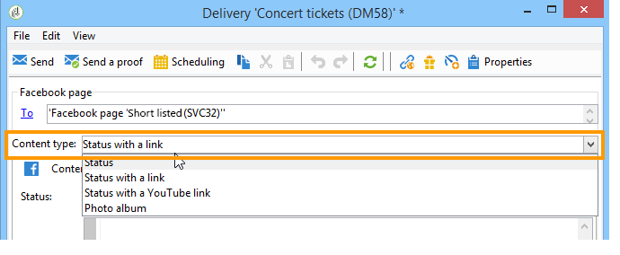
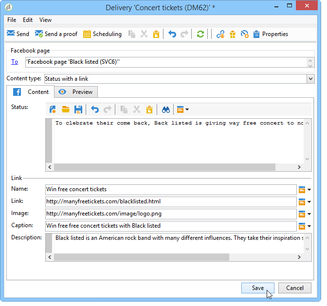

# 在 Facebook 上发布{#publishing-on-facebook}

配置完成后， Social Marketing允许您在Facebook页面的涂鸦墙上发布发布内容。

## 限制 {#limitations}

facebook固有以下限制。

* 消息长度不能超过1,000个字符。
* HTML不受支持。

## 创建投放 {#creating-the-delivery}

使用 **[!UICONTROL Publish to a brand page]** 投放模板。

## 选择主目标 {#selecting-the-main-target}

您需要选择要将发布发布发布到的页面。

1. 单击 **[!UICONTROL To]** 链接。

   

1. 单击 **[!UICONTROL Add]** 按钮。

   

1. 选择 **[!UICONTROL A Facebook page]**。

   

1. 在 **[!UICONTROL Folder]** 字段中，选择包含Facebook页面的服务文件夹。 默认情况下，页面会存储在 **[!UICONTROL Facebook]** 服务文件夹。 然后，选择要发布到的Facebook页面。

   

## 选择校样目标 {#selecting-the-proof-target}

的 **[!UICONTROL Target of the proofs]** 选项卡，可定义在发送投放之前要用于测试投放的Facebook页面。 为此，我们建议创建专用的Facebook专用页面。 有关创建专用Facebook页面的更多信息，请参阅 [创建测试Facebook页面](../../social/using/publishing-on-facebook-walls.md#creating-a-test-facebook-page). 要选择校样目标，请应用与主目标相同的步骤： [选择主目标](#selecting-the-main-target).

>[!NOTE]
>
>如果您对所有投放使用相同的Facebook测试页面，则可以在 **[!UICONTROL Publish to a brand page]** 投放模板，通过 **[!UICONTROL Resources > Templates > Delivery templates]** 节点。 默认情况下，将为每个新投放输入校样目标。

## 定义受众 {#defining-the-audience}

如果要使用本地区段来优化有权查看发布的公共类型，我们建议您为每个区段创建一个Facebook页面(例如：Adobe Campaign巴黎、Adobe Campaign伦敦等)。

但是，也可以使用Facebook使用的受众筛选器。 的 **[!UICONTROL Audience]** 选项卡 **[!UICONTROL Select target window]** 提供了四个过滤器：

* **[!UICONTROL Country]**
* **[!UICONTROL Regions]**
* **[!UICONTROL Cities]**
* **[!UICONTROL Languages]**

>[!IMPORTANT]
>
>请小心使用此函数。 在投放报表中， **[!UICONTROL Number of fans]** 指示器不会考虑这些Facebook过滤器。
>
>Facebook可能会更改受众筛选器的列表及其值。

## 定义消息内容 {#defining-message-content}

使用 **[!UICONTROL Content type]** 下拉菜单。

提供了以下类型的投放：

* a **[!UICONTROL Status]**
* a **[!UICONTROL Status with a link]**
* a **[!UICONTROL Status with a YouTube link]**
* a **[!UICONTROL Photo album]**

### 发布状态 {#publishing-a-status}

状态类型投放只能包含文本，如以下示例所示：

在输入区域中输入发布状态。

### 使用链接发布状态 {#publishing-a-status-with-a-link}

带有链接的状态类型投放可以包含文本、图像和链接。 以下部分详细介绍投放编辑屏幕的字段与Facebook上的最终发布之间的对称性：

输入各种字段：

>[!IMPORTANT]
>
>所有URL都必须以开头 **&quot;http://&quot;** 或 **&quot;https://&quot;**.

1. 在 **[!UICONTROL Status]** 字段，输入将在页面名称下显示的文本。
1. 在 **[!UICONTROL Name]** 字段，输入发布标题。
1. 在 **[!UICONTROL Link]** 字段，输入发布指向的URL。

   >[!NOTE]
   >
   >如果要添加 **[!UICONTROL Link]** 字段中的“URL ”，以推广该应用程序，我们建议您根据智能手机显示标准对其进行调整：
   >
   >1. 选择Facebook应用程序 [https://developers.facebook.com/apps](https://developers.facebook.com/apps)，然后选择 **[!UICONTROL Settings > Basic]** 选项卡。
   >1. 输入 **[!UICONTROL Namespace]** 字段。
   >1. 输入 **[!UICONTROL Mobile Site URL]** 字段：当用户单击智能手机上的发布链接时，Facebook会自动将他们重定向到此字段中定义的URL。
   >1. 创建Web应用程序，以便将Facebook显示视为所用设备（智能手机或PC）的功能进行个性化。
   >1. 转到 **[!UICONTROL Link]** 字段中，输入的URL **[!UICONTROL Canvas page]** 字段。

1. 在 **[!UICONTROL Image]** 字段中，输入将在发布左侧显示的图像URL。

   >[!IMPORTANT]
   >
   >图像必须托管在公共互联网网站上，Facebook才能上传。

1. 在 **[!UICONTROL Caption]** 字段，输入将在发布结束时显示的文本。
1. 转到 **[!UICONTROL Description]** 字段，然后输入要在标题下显示的文本。

### 使用YouTube链接发布状态 {#publishing-a-status-with-a-youtube-link}

此类内容允许您发布指向YouTube视频的链接。 与具有常规链接的状态一样，您可以定义状态、名称、标题、描述和其他链接。 图像由Facebook自动添加。 投放编辑屏幕的字段与Facebook上最终出版物之间的对称性详述如下：

输入各种字段：

>[!IMPORTANT]
>
>所有URL都必须以开头 **&quot;http://&quot;** 或 **&quot;https://&quot;**.

1. 在 **[!UICONTROL Status]** 字段，输入将在页面名称下显示的文本。
1. 在 **[!UICONTROL Name]** 字段，输入发布标题。
1. 在 **[!UICONTROL Video code]** 字段，输入YouTube视频的代码。 例如，对于“https://www.youtube.com/watch?v=abc123456&#39;”链接，视频代码将为“abc123456”。
1. 在 **[!UICONTROL Caption]** 字段，输入将在发布结束时显示的文本。
1. 转到 **[!UICONTROL Description]** 字段，然后输入要在标题下显示的文本。

### 发布相册 {#publishing-a-photo-album}

此类内容允许您发布相册。 您可以为相册添加名称和描述以及每个照片的标题。 投放编辑屏幕的字段与Facebook上最终出版物之间的对称性详述如下：

输入各种字段：

1. 首先，输入 **[!UICONTROL Album name]**.
1. 然后，输入 **[!UICONTROL Description]** 显示在照片上方。
1. 要添加照片，请单击 **[!UICONTROL Add]** 按钮，选择照片并单击 **[!UICONTROL Open]**.
1. 可以向每张照片添加题注。

## 预览 {#previewing}

的 **[!UICONTROL Preview]** 选项卡，可查看发布的渲染。

1. 单击 **[!UICONTROL Preview]** 选项卡。
1. 单击 **[!UICONTROL Test personalization]** 下拉菜单，然后选择 **[!UICONTROL Service]**.
1. 在 **[!UICONTROL Folder]** 字段中，选择包含Facebook页面的服务文件夹。 默认情况下，页面会存储在 **[!UICONTROL Facebook]** 服务文件夹。
1. 选择要在其中测试预览的Facebook页面。

>[!NOTE]
>
>预览内容可能与最终的Facebook发布内容略有不同。 我们强烈建议在最终交付之前发送校样，以精确呈现发布。 请参阅 [发送校样](#sending-the-proof).

## 配置跟踪 {#configuring-tracking}

可以在投放报表和 **[!UICONTROL Edit > Tracking]** 选项卡。

投放中包含的URL点击量由Adobe Campaign测量。 对 **[!UICONTROL Like]** 按钮、评论数和粉丝数由Facebook测量。

跟踪配置与电子邮件投放的相同。 如需详细信息，请参阅[此部分](../../delivery/using/about-delivery-monitoring.md)。

>[!NOTE]
>
>在 **[!UICONTROL Publish to a brand page]** 投放模板时，默认情况下会启用跟踪。

## 发送校样 {#sending-the-proof}

我们强烈建议在最终交付之前发送发布校样，以在专用Facebook测试页面上查看发布的确切呈现。 有关创建专用Facebook测试页面的更多信息，请参阅 [创建测试Facebook页面](../../social/using/publishing-on-facebook-walls.md#creating-a-test-facebook-page). 有关选择目标校样的详细步骤，请参见 [选择校样目标](#selecting-the-proof-target).

校样投放与电子邮件投放相同。 请参阅[此小节](../../delivery/using/steps-validating-the-delivery.md#sending-a-proof)。

## 发送消息 {#sending-the-message}

1. 内容获得批准后，单击 **[!UICONTROL Send]** 按钮。
1. 选择 **[!UICONTROL Deliver as soon as possible]** ，然后单击 **[!UICONTROL Analyze]** 按钮。

   >[!NOTE]
   >
   >的 **[!UICONTROL Postpone the delivery]** 选项，可将投放推迟到以后的日期。

   

1. 分析完成后，检查结果。
1. 单击 **[!UICONTROL Confirm delivery]**，然后单击 **[!UICONTROL Yes]**.

   
