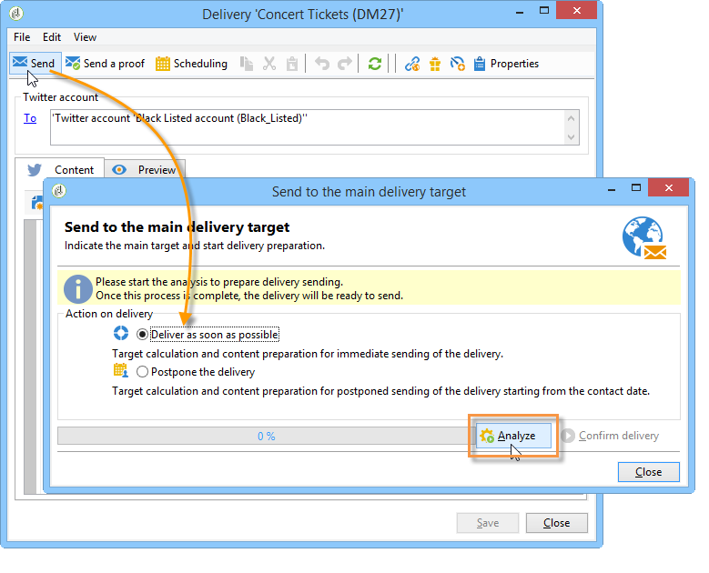

# 在 Twitter 上发布{#publishing-on-twitter}

## 在Twitter帐户上发布 {#publishing-on-your-twitter-accounts}

配置完成后， Social Marketing允许您将推文发送到Twitter帐户。

### 限制 {#limitations}

以下限制是Twitter固有的限制。

* 消息长度不能超过140个字符。
* HTML格式不受支持。

### 创建投放 {#creating-the-delivery}

根据 **[!UICONTROL Tweet (twitter)]** 投放模板。

### 选择主目标 {#selecting-the-main-target}

选择要将推文发送到的帐户。

1. 单击 **[!UICONTROL To]** 链接。

   

1. 单击 **[!UICONTROL Add]** 按钮。

   

1. 选择 **[!UICONTROL A Twitter account]**。

   

1. 在 **[!UICONTROL Folder]** 字段中，选择包含Twitter帐户的服务文件夹。 然后，选择要将推文发送到的Twitter帐户。

   

### 选择校样的目标 {#selecting-the-target-of-the-proof}

的 **[!UICONTROL Target of the proofs]** 选项卡，可让您定义在最终投放之前用于测试投放的Twitter帐户。 因此，我们建议您创建一个专用于发送校样的Twitter帐户。 有关如何创建专用Twitter帐户的更多信息，请参阅 [在Twitter上创建测试帐户](../../social/using/configuring-publishing-on-twitter.md#creating-a-test-account-on-twitter). 选择校样目标的步骤与选择主目标的步骤相同。 请参阅 [在Twitter上创建测试帐户](../../social/using/configuring-publishing-on-twitter.md#creating-a-test-account-on-twitter).

>[!NOTE]
>
>如果您对所有投放使用相同的Twitter测试帐户，则可以在 **[!UICONTROL Tweet]** 投放模板，通过 **[!UICONTROL Resources > Templates > Delivery templates]** 节点。 然后，将默认为每个新投放输入校样目标。

### 定义消息内容 {#defining-the-message-content}

在 **[!UICONTROL Content]** 选项卡。

### 查看预览 {#viewing-the-preview}

的 **[!UICONTROL Preview]** 选项卡，可查看推文的呈现。

1. 单击 **[!UICONTROL Preview]** 选项卡。
1. 单击 **[!UICONTROL Test personalization]** 下拉菜单，然后选择 **[!UICONTROL Service]**.
1. 在 **[!UICONTROL Folder]** 字段中，选择包含您的Twitter帐户的服务文件夹。
1. 选择要用于测试预览的Twitter帐户。

>[!NOTE]
>
>预览可能与最终推文略有不同。 我们强烈建议在最终投放之前发送校样，以查看推文的确切呈现。 请参阅 [发送校样](#sending-the-proof).

### 配置跟踪 {#configuring-tracking}

可以在投放报表和 **[!UICONTROL Edit > Tracking]** 选项卡。

跟踪配置与电子邮件投放的相同。 如需详细信息，请参阅[此部分](../../delivery/using/about-delivery-monitoring.md)。

>[!NOTE]
>
>在 **[!UICONTROL Tweet]** 投放模板时，默认情况下会启用跟踪。

>[!IMPORTANT]
>
>我们无法区分分析推文的机器人和实际点击的用户。

### 发送校样 {#sending-the-proof}

我们强烈建议在最终交付之前发送发布校样，以在专用Twitter测试页面上获取发布的确切呈现。 有关创建专用Twitter帐户的更多信息，请参阅 [在Twitter上创建测试帐户](../../social/using/configuring-publishing-on-twitter.md#creating-a-test-account-on-twitter). 有关选择校样目标的详细步骤，请参见 [选择校样的目标](#selecting-the-target-of-the-proof).

校样投放与电子邮件投放相同。 请参阅[此小节](../../delivery/using/steps-validating-the-delivery.md#sending-a-proof)。

### 发送消息 {#sending-the-message}

1. 内容获得批准后，单击 **[!UICONTROL Send]** 按钮。
1. 选择 **[!UICONTROL Deliver as soon as possible]** ，然后单击 **[!UICONTROL Analyze]** 按钮。

   >[!NOTE]
   >
   >的 **[!UICONTROL Postpone the delivery]** 选项，可将投放推迟到以后的日期。

   

1. 分析完成后，检查结果。
1. 单击 **[!UICONTROL Confirm delivery]**，然后单击 **[!UICONTROL Yes]**.

## 向订阅者发送私信 {#sending-direct-messages-to-subscribers}

### 操作原则 {#operating-principle}

的 **[!UICONTROL Synchronize Twitter accounts]** 工作流(请参阅 [同步Twitter帐户](../../social/using/configuring-publishing-on-twitter.md#synchronizing-twitter-accounts))取回了Twitter订阅者列表，以便您能够向他们发送私信。 恢复的关注者存储在特定表中：访客表。 要显示Twitter关注者列表，请转到 **[!UICONTROL Profiles and Targets > Visitors]** 节点。

>[!IMPORTANT]
>
>为了工作流恢复Twitter关注者列表， **[!UICONTROL Synchronize Twitter accounts]** 框。 有关更多信息，请参阅： [委派对Adobe Campaign的写入权限](../../social/using/configuring-publishing-on-twitter.md#delegating-write-access-to-adobe-campaign).

对于每个关注者，Adobe Campaign会恢复以下信息：

* **[!UICONTROL Origin]**:社交网络的名称(**Twitter** 在这种情况下)
* **[!UICONTROL External ID]**:用户标识符
* **[!UICONTROL User name]**:用户的帐户名称
* **[!UICONTROL Full name]**:用户名称
* **[!UICONTROL Language]**:用户语言
* **[!UICONTROL Number of friends]**:关注者数量
* **[!UICONTROL Time zone]**:用户时区
* **[!UICONTROL Verified]**:此字段指示用户是否具有已验证的Twitter帐户

### 限制 {#limitations-1}

以下限制是Twitter固有的限制。

* 消息长度不能超过140个字符。
* HTML不受支持。
* 您每天不能发送超过250条私信。 为避免超过此阈值，您可以分几批投放内容。 分批投放的配置方式与电子邮件投放类似。 如需详细信息，请参阅[此部分](../../delivery/using/steps-sending-the-delivery.md#sending-using-multiple-waves)。

### 创建投放 {#creating-the-delivery-}

根据 **[!UICONTROL Tweet (Direct Message)]** 投放模板。

### 选择主目标 {#selecting-the-main-target-1}

选择要将私信发送给的关注者。

1. 单击 **[!UICONTROL To]** 链接。

   

1. 单击 **[!UICONTROL Add]** 按钮。

   

1. 选择定位类型。

   

   * 选择 **[!UICONTROL Twitter subscribers]** 向所有帐户关注者发送私信。

      >[!IMPORTANT]
      >
      >每天不能发送超过250条消息。 如果您的Twitter帐户有250多个关注者，我们强烈建议分批投放。 这涉及与电子邮件投放相同的流程。 请参阅[此小节](../../delivery/using/steps-sending-the-delivery.md#sending-using-multiple-waves)。

   * 选择 **[!UICONTROL Filter conditions]** 定义查询并查看其结果。 此选项与电子邮件投放的选项相同。 请参阅 [此部分](../../platform/using/defining-filter-conditions.md) 以了解更多信息。

      

### 选择校样的目标 {#selecting-the-target-of-the-proof-1}

的 **[!UICONTROL Target of the proofs]** 选项卡，选择将收到您私信校样的关注者。 选择过程与主目标的选择过程相同。 请参阅 [选择主目标](#selecting-the-main-target).

>[!NOTE]
>
>如果要将所有直接消息校样发送到同一Twitter关注者，可以在 **[!UICONTROL Tweet (Direct Message)]** 投放模板，通过 **[!UICONTROL Resources > Templates > Delivery templates]** 节点。 然后，将默认为每个新投放输入校样目标。

### 定义消息内容 {#defining-message-content-}

在 **[!UICONTROL Content]** 选项卡。

个性化字段的使用方式与电子邮件投放相同，例如，在消息正文中添加关注者的名称。 有关内容个性化的详细信息，请参阅 [此部分](../../delivery/using/about-personalization.md).

以下步骤与向Twitter帐户发送推文的步骤相同。 请参阅 [在Twitter帐户上发布](#publishing-on-your-twitter-accounts).
